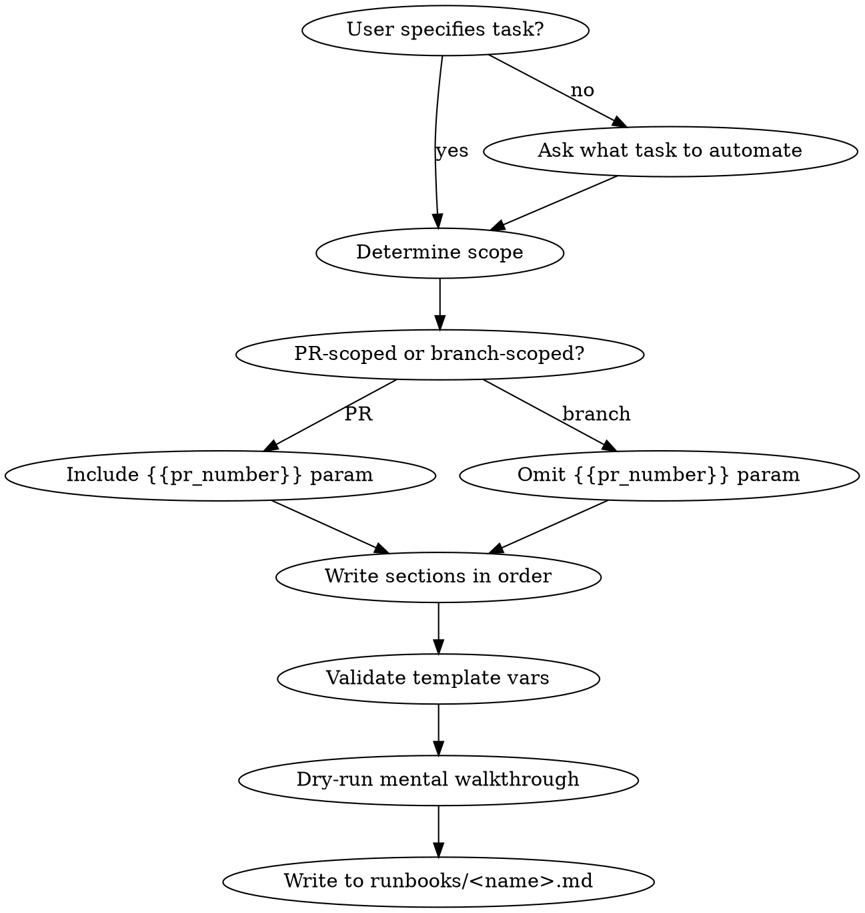

# Create Runbook

Create runbooks that autonomous agents can execute via `run-runbook.sh` and Jetty.

## Core Principle

A runbook is a self-correcting instruction document for an autonomous agent.
It differs from a skill (one-shot reference) by encoding **evaluation criteria
and bounded iteration** — the agent judges its own output, improves the weakest
dimension, and re-judges, within guardrails you define.

Write for a competent new hire who must run your pipeline while you are on
vacation. Enough detail for failure recovery, enough latitude for adaptation.

## Workflow

If the user does not specify what the runbook automates, ask before
proceeding — you cannot write the Objective or domain steps without
knowing the task.



## Template Variable Compatibility

`run-runbook.sh` injects exactly these variables — use no others:

| Variable | Syntax in runbook | Injected from |
|----------|-------------------|---------------|
| Repository | `{{repository}}` | `runbook-params.json` `.repository` |
| PR number | `{{pr_number}}` | `runbook-params.json` `.pr_number` |
| Base branch | `{{base_branch}}` | `runbook-params.json` `.base_branch` |
| GitHub token | `${GITHUB_TOKEN}` | `runbook-params.json` `.GITHUB_TOKEN` |
| Review branch | `{{review_branch}}` | `runbook-params.json` `.review_branch` |
| Cargo home | `${CARGO_HOME:-~/.cargo}` | `runbook-params.json` `.CARGO_HOME` |

If you need additional parameters, add them to both files:
1. `runbook-params.json` — add a new key (e.g., `"target_crate": "gossip-stdx"`)
2. `run-runbook.sh` — add a `jq -r` extraction line and a `${runbook//\{\{new_var\}\}/$var}` substitution

Do not invent ad-hoc template syntax without updating the runner.

### PR-Scoped vs Branch-Scoped

| Type | When | Uses `{{pr_number}}`? | Examples |
|------|------|-----------------------|----------|
| PR-scoped | Reviews, responds to comments, audits a PR | Yes | `pr-comment-response`, `security-reviewer` |
| Branch-scoped | Audits, refactors, or generates artifacts from a branch | No | `dedup-audit`, `doc-rigor` |

## Required Sections (in order)

Write every section in this exact order, separated by `---` horizontal rules.

### 1. Title

```markdown
# <Name> — Agent Runbook
```

### 2. Objective

Second person. Numbered high-level steps. Optional bold **Core principle**.

```markdown
You are given a Rust workspace repository. Your job is to:

1. Clone the repo and check out the target
2. <domain-specific analysis>
3. <domain-specific changes>
4. Verify all compiler checks pass
5. Open a PR / post results

**Core principle**: <one-sentence guiding philosophy>
```

### 3. REQUIRED OUTPUT FILES (MANDATORY)

Table of files under `/app/results/`. Always include `verification.json`.
Always include the incremental-write callout:

```markdown
**CRITICAL: Write output files INCREMENTALLY, not at the end.**
- Create `/app/results/` and write initial skeleton files in Step 1
- Update after EACH major step
- This ensures partial results are captured even if the run times out
```

### 4. REQUIRED OUTCOMES (MANDATORY)

Table with columns `Outcome` and `Verification`. Every outcome must be
mechanically verifiable (exit code, file existence, count match).
Always include the four cargo gates:

| Outcome | Verification |
|---------|-------------|
| `cargo fmt` passes | Exit code 0 |
| `cargo clippy` passes | Exit code 0 |
| `cargo nextest run` passes | Exit code 0 |
| `cargo doc` passes | Exit code 0 |

### 5. Parameters

List template variables with descriptions. Add `### Required Secrets`
subsection with scope table.

### 6. Step 1: Environment Setup

Use the standard setup block — it is identical across all runbooks:

```bash
gh auth login --with-token <<< "${GITHUB_TOKEN}"
gh auth status
gh repo clone {{repository}} /workspace/gossip-rs
cd /workspace/gossip-rs
git checkout {{base_branch}}
git pull origin {{base_branch}}
git log --oneline -5
sudo apt-get update
sudo apt-get install -y libboost-dev protobuf-compiler
rustup toolchain install 1.93 --profile minimal --component rustfmt,clippy
rustup default 1.93
curl -LsSf https://get.nexte.st/latest/linux | tar zxf - -C ${CARGO_HOME:-~/.cargo}/bin
mkdir -p /app/results
# Write skeleton output files here
cargo check --all-features
```

For PR-scoped runbooks, replace checkout with:
```bash
gh pr checkout {{pr_number}}
```

Add any domain-specific tool installs (npm packages, cargo tools) after
the standard block.

### 7. Steps 2–N: Domain Work

Structure domain steps with:
- Numbered steps (`## Step N: Title`)
- Lettered sub-steps (`### Na: Sub-step Title`)
- Bash code blocks with inline comments
- Decision tables for classification logic
- Verification gate after each major change:

```bash
cargo fmt --all
cargo check --all-features
cargo clippy --all-targets --all-features -- -D warnings
cargo nextest run --workspace --features test-support,perf-stats \
  --exclude gossip-findings-postgres \
  --exclude gossip-done-ledger-postgres \
  --exclude gossip-coordination-etcd
```

Retry policy: "fix and re-run, iterate up to 3 times."

### 8. Commit and Create PR

Branch naming: `<task-name>/$(date +%Y-%m-%d)`

PR body: use `cat <<EOF` (not `<<'EOF'`) so shell variables expand.
Include before/after metrics table.

### 9. CI Wait Loop

Standard polling pattern — 30s intervals, 40 iterations, break on FAILURE
or all-SUCCESS. On failure: `gh run view <id> --log-failed`, fix, push, re-poll.

### 10. Write Output Files

Output file writes should happen incrementally throughout the runbook
(skeleton in Step 1, updates after each step). The final write step
consolidates and fills any remaining gaps.

**Never use placeholder templates with "replace later" notes.** Agents
forget. Write actual data inline using shell variables captured during
earlier steps.

### 11. Final Verification Checklist (MANDATORY)

Two parts:
1. **Verification script** — bash that prints PASS/FAIL for each outcome
2. **Checklist** — `- [ ]` markdown items matching every required outcome

Footer (verbatim):
```markdown
**If ANY item fails, go back and fix it. Do NOT finish until all items pass.**
```

### 12. Tips

Bulleted list. Each tip: **bold imperative sentence.** Explanation with
concrete examples. Tips accumulate over time as agent failures reveal
lessons — add to them after observing runs.

## Quality Gate (before saving)

Run this mental checklist before writing the runbook file:

| Check | How to verify |
|-------|---------------|
| All template vars are in the supported set | grep for `{{` and `${` — only the 6 listed above |
| Objective gives full scope in <30 seconds | Read it cold — would a new agent know what to do? |
| Every output file has a skeleton write in Step 1 | Timeout at minute 5 still produces partial results |
| No "replace placeholder" instructions | Shell vars expand inline; no deferred substitution |
| Verification script covers every required outcome | 1:1 match between REQUIRED OUTCOMES table and script |
| Checklist covers every required outcome | 1:1 match between REQUIRED OUTCOMES table and checklist |
| Comment policy compliance | No tracking IDs, PR refs, or temporal narration |
| Domain tools installed in Step 1 | `npm install`, `cargo install` before domain steps |

## Common Mistakes

| Mistake | Fix |
|---------|-----|
| Inventing template variables beyond the 5 supported | Add to `run-runbook.sh` first, or use env vars |
| Using `<<'EOF'` for PR body (suppresses variable expansion) | Use `<<EOF` so `${BEFORE}` etc. expand |
| Writing output files only at the end | Skeleton in Step 1, update after each step |
| Placeholder JSON with "fill in later" | Capture data in shell vars, write inline with `cat <<EOF` |
| Missing `npm install` for tools like jscpd | Install all external tools in Step 1 |
| No retry bound on verification failures | Always cap: "iterate up to 3 times" |
| Forgetting the CI wait loop | Every PR-creating runbook needs the polling block |
| No `--exclude` on `cargo nextest run` | Always exclude postgres/etcd crates (need external services) |
