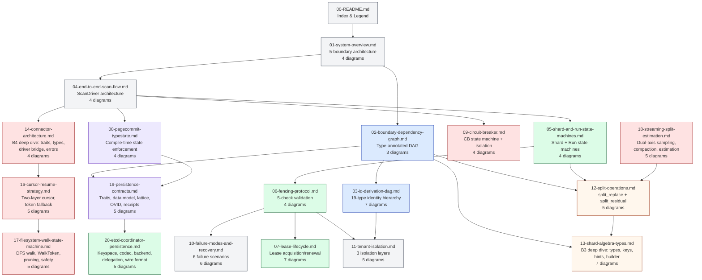

# Gossip-rs Visual Architecture Guide

This directory contains a consolidated suite of Mermaid diagrams that visualize the architecture, protocols, and data flows of the Gossip-rs distributed secret scanner. It serves as a standalone visual reference companion to the [gossip-rs-learning-guide](https://github.com/ahrav/gossip-rs-learning-guide).

The diagrams cover the five architectural boundaries (Identity, Coordination, Shard Algebra, Connector, Persistence), their interactions, state machines, failure modes, and security properties. Each file is self-contained with explanatory prose, but they are designed to be read in order for progressive understanding.

## Color Coding Legend

Every diagram in this suite uses a consistent color scheme to identify which architectural boundary owns each component:

| Boundary                   | Role                            | Fill      | Light Fill | Stroke    | Mnemonic                                      |
| -------------------------- | ------------------------------- | --------- | ---------- | --------- | --------------------------------------------- |
| **B1: Identity**           | Content-addressed IDs, hashing  | `#3B82F6` | `#DBEAFE`  | `#1E40AF` | Blue — the foundation everything builds on    |
| **B2: Coordination**       | Leases, fencing, state machines | `#22C55E` | `#DCFCE7`  | `#166534` | Green — the "go" signal for work distribution |
| **B3: Shard Algebra**      | Key ranges, splits, coverage    | `#F97316` | `#FFF7ED`  | `#9A3412` | Orange — partitioning and boundaries          |
| **B4: Connector**          | External APIs, circuit breakers | `#EF4444` | `#FEE2E2`  | `#991B1B` | Red — external I/O, highest risk              |
| **B5: Persistence**        | Done-ledger, findings, commits  | `#8B5CF6` | `#EDE9FE`  | `#5B21B6` | Purple — durable storage                      |
| **Worker / Cross-cutting** | Orchestration, error handling   | `#6B7280` | `#F3F4F6`  | `#374151` | Grey — glue between boundaries                |

### Visual Conventions

- **Solid lines**: Normal/success paths
- **Dashed lines**: Error paths, invalid transitions, or blocked attack vectors
- **`%% Diagram: <name>`**: Comment in every Mermaid block identifying the diagram
- **Subgraphs**: Group related components by boundary or logical phase
- **Notes**: Annotate invariants (INV-S01, etc.) and key design decisions

## Reading Order

The files are numbered for progressive understanding, from high-level overview to detailed protocols:

### Suggested Reading Paths

**Quick overview** (start here):
1. `01-system-overview.md` — The five boundaries and how they connect
2. `04-end-to-end-scan-flow.md` — How a scan works from start to finish

**Deep dive into coordination** (continue from overview):
3. `05-shard-and-run-state-machines.md` — State machines that drive work distribution
4. `06-fencing-protocol.md` — How zombie workers are prevented
5. `07-lease-lifecycle.md` — Worker sessions and cursor monotonicity

**Deep dive into identity** (alternative to coordination after overview):
3. `02-boundary-dependency-graph.md` — How boundaries depend on each other
4. `03-id-derivation-dag.md` — The 19-type identity hierarchy

**Deep dive into persistence and connectors** (after coordination or identity):
6. `08-pagecommit-typestate.md` — Compile-time safety for atomic commits
7. `19-persistence-contracts.md` — Traits, data model, lattice, OVID, receipts
8. `09-circuit-breaker.md` — Failure isolation for external APIs
9. `14-connector-architecture.md` — Trait hierarchy, types, driver bridge, error classification
10. `16-cursor-resume-strategy.md` — Two-layer cursor, token-assisted resume, fallback
11. `17-filesystem-walk-state-machine.md` — DFS walk, WalkToken, subtree pruning, safety
12. `18-streaming-split-estimation.md` — Dual-axis sampling, compaction, split key estimation

**Deep dive into etcd coordination persistence** (after persistence):
13. `20-etcd-coordinator-persistence.md` — Keyspace, codec, backend, delegation model

**Cross-cutting concerns** (after any deep dive):
14. `10-failure-modes-and-recovery.md` — What breaks and how it recovers
15. `11-tenant-isolation.md` — Cryptographic multi-tenancy
16. `12-split-operations.md` — Dynamic work distribution via shard splitting

**Deep dive into shard algebra** (after split operations):
17. `12-split-operations.md` — Split operations and coverage validation
18. `13-shard-algebra-types.md` — Key encoding, hint framing, builder, connector enumeration

## File Index

| #   | File                                 | Diagrams | Primary Boundary | Key Concepts                                                              |
| --- | ------------------------------------ | -------- | ---------------- | ------------------------------------------------------------------------- |
| 00  | `00-README.md`                       | 1        | All              | Index, color legend, reading order                                        |
| 01  | `01-system-overview.md`              | 4        | All              | 5-boundary model, crate mapping, scan flow, build DAG                     |
| 02  | `02-boundary-dependency-graph.md`    | 3        | B1, All          | Type-annotated DAG, tiered compilation, anti-patterns                     |
| 03  | `03-id-derivation-dag.md`            | 7        | B1               | 19-type hierarchy, item/secret/finding/occurrence/observation chains     |
| 04  | `04-end-to-end-scan-flow.md`         | 4        | All              | ScanDriver architecture, dual entry points, findings identity flow        |
| 05  | `05-shard-and-run-state-machines.md` | 4        | B2               | Shard SM, run SM, splits lifecycle, illegal transitions                   |
| 06  | `06-fencing-protocol.md`             | 4        | B2               | 5-check validation, zombie resolution, decision tree                      |
| 07  | `07-lease-lifecycle.md`              | 7        | B2               | Acquisition, renewal timeline, cursor monotonicity, capacity piggybacking |
| 08  | `08-pagecommit-typestate.md`         | 4        | B5               | Typestate SM, partial write failures, compile-time safety                 |
| 09  | `09-circuit-breaker.md`              | 4        | B4               | CB state machine, cascade prevention, per-connector isolation             |
| 10  | `10-failure-modes-and-recovery.md`   | 6        | All              | Worker crash, coordinator crash, partitions, split-brain                  |
| 11  | `11-tenant-isolation.md`             | 5        | B1, B2           | 3 isolation layers, correlation attack, TenantSecretKey                   |
| 12  | `12-split-operations.md`             | 5        | B2, B3           | split_replace, split_residual, coverage validation                        |
| 13  | `13-shard-algebra-types.md`          | 7        | B3               | KeyEncoding, ShardHint, builder, key arithmetic, connector enumeration    |
| 14  | `14-connector-architecture.md`       | 4        | B4               | Trait hierarchy, core types, scan-driver bridge, error classification     |
| 16  | `16-cursor-resume-strategy.md`       | 5        | B4               | Two-layer cursor, token encoding, resilience model, resume decision       |
| 17  | `17-filesystem-walk-state-machine.md`| 5        | B4               | DFS walk, WalkFrame stack, subtree pruning, WalkToken, safety mechanisms  |
| 18  | `18-streaming-split-estimation.md`   | 5        | B4, B3           | Dual-axis sampling, stride compaction, split key estimation, integration  |
| 19  | `19-persistence-contracts.md`        | 5        | B5               | Trait hierarchy, findings data model, done-ledger lattice, OVID, receipts |
| 20  | `20-etcd-coordinator-persistence.md` | 5        | B2               | Keyspace design, codec wire format, backend delegation, sync-async bridge |
|     | **Total**                            | **93**   |                  |                                                                           |

## Implementation Status Legend

Diagrams in this suite mix implemented components and pending designs. The following
markers indicate implementation status:

| Marker                            | Meaning                                                                                             |
| --------------------------------- | --------------------------------------------------------------------------------------------------- |
| **(implemented)**                 | Type/method exists in source, tested, exercised by in-memory backend                                |
| **(contract spec)**               | Trait/typestate defined in contracts crate; in-memory backend exercises it; durable backend pending |
| **(domain tag — struct pending)** | Domain constant exists in `identity/domain.rs`; corresponding struct not yet defined                |

## Administrative Operations

The coordination protocol defines one out-of-band admin operation:

- **`unpark_shard`** (`RunManagement` trait, not `CoordinationBackend`) — transitions a
  `Parked` shard back to `Active`, incrementing `fence_epoch` and clearing `park_reason`.
  This is the sole admin override in the system.

The three terminal states have different finality:
- **Done** and **Split** are irrevocable — no operation can reverse them.
- **Parked** is protocol-terminal with an admin override — `unpark_shard` provides a
  recovery path for shards halted by transient errors (e.g., `TooManyErrors` after
  circuit breaker trips).

## Source Material

These diagrams are derived from the [gossip-rs-learning-guide](https://github.com/ahrav/gossip-rs-learning-guide):

| Diagram File                         | Learning Guide Source                                                                                                                                                                       |
| ------------------------------------ | ------------------------------------------------------------------------------------------------------------------------------------------------------------------------------------------- |
| `01-system-overview.md`              | `00-prologue/03-architecture-at-a-glance.md`                                                                                                                                                |
| `02-boundary-dependency-graph.md`    | `08-cross-cutting/01-boundary-dependency-graph.md`                                                                                                                                          |
| `03-id-derivation-dag.md`            | `02-boundary-1-identity-spine/04-id-type-hierarchy.md`, `06-secret-and-finding-identity.md`                                                                                                 |
| `04-end-to-end-scan-flow.md`         | `08-cross-cutting/02-data-flow-end-to-end.md`                                                                                                                                               |
| `05-shard-and-run-state-machines.md` | `04-boundary-2-coordination/02-shard-state-machine.md`                                                                                                                                      |
| `06-fencing-protocol.md`             | `04-boundary-2-coordination/03-fencing-protocol-deep-dive.md`                                                                                                                               |
| `07-lease-lifecycle.md`              | `04-boundary-2-coordination/09-worker-session.md`, `04-cursor-monotonicity.md`                                                                                                              |
| `08-pagecommit-typestate.md`         | `07-boundary-5-persistence/04-commit-protocol-typestate.md`                                                                                                                                 |
| `09-circuit-breaker.md`              | `06-boundary-4-connector/04-circuit-breaker.md`                                                                                                                                             |
| `10-failure-modes-and-recovery.md`   | `08-cross-cutting/03-failure-modes-and-recovery.md`                                                                                                                                         |
| `11-tenant-isolation.md`             | `08-cross-cutting/04-tenant-isolation.md`                                                                                                                                                   |
| `12-split-operations.md`             | `04-boundary-2-coordination/06-split-operations.md`                                                                                                                                         |
| `13-shard-algebra-types.md`          | `crates/gossip-frontier/src/key_encoding.rs`, `hint.rs`, `builder.rs`; `crates/gossip-contracts/src/coordination/shard_spec.rs`, `split.rs`; `crates/gossip-contracts/src/connector/api.rs` |
| `14-connector-architecture.md`       | `crates/gossip-contracts/src/connector/api.rs`, `types.rs`; `crates/gossip-connectors/src/common.rs`, `filesystem.rs`, `git.rs`, `in_memory.rs`, `scan_driver.rs`; `crates/gossip-scan-driver/src/lib.rs` |
| `16-cursor-resume-strategy.md`       | `crates/gossip-contracts/src/connector/types.rs`; `crates/gossip-connectors/src/common.rs`, `filesystem.rs`, `git.rs`                                                                                        |
| `17-filesystem-walk-state-machine.md`| `crates/gossip-connectors/src/filesystem.rs` (WalkState, WalkFrame, WalkToken, should_skip_subtree)                                                                                                                             |
| `18-streaming-split-estimation.md`   | `crates/gossip-connectors/src/split_estimator.rs`, `common.rs`; `crates/gossip-contracts/src/connector/api.rs` (choose_split_point)                                                                                             |
| `19-persistence-contracts.md`        | `crates/gossip-contracts/src/persistence/commit.rs`, `findings.rs`, `done_ledger.rs`, `ovid.rs`, `page_commit.rs`, `error.rs`, `conformance.rs`; `crates/gossip-persistence-inmemory/src/`                                      |
| `20-etcd-coordinator-persistence.md` | `crates/gossip-coordination-etcd/src/backend.rs`, `keyspace.rs`, `codec.rs`, `config.rs`, `error.rs`; `crates/gossip-coordination/src/traits.rs`, `in_memory.rs`                                                                |

## Source Code References

The diagrams reference source code in the main [gossip-rs](https://github.com/ahrav/gossip-rs) repository:

| Crate                 | Path                                        | Boundaries                                                                                                            |
| --------------------- | ------------------------------------------- | --------------------------------------------------------------------------------------------------------------------- |
| `gossip-contracts`    | `crates/gossip-contracts/src/identity/`     | B1: Identity                                                                                                          |
| `gossip-frontier`     | `crates/gossip-frontier/src/`               | B3: Shard Algebra                                                                                                     |
| `gossip-contracts`    | `crates/gossip-contracts/src/coordination/` | B2: Coordination (data types: shard_spec, cursor, pooled, manifest, limits)                                           |
| `gossip-coordination` | `crates/gossip-coordination/src/`           | B2: Coordination (protocol: traits, record, lease, error, run, split, validation, session, facade, events, in_memory) |
| `gossip-contracts`    | `crates/gossip-contracts/src/connector/`    | B4: Connector                                                                                                         |
| `gossip-connectors`   | `crates/gossip-connectors/`                 | B4: Connector (crate)                                                                                                 |
| `gossip-contracts`    | `crates/gossip-contracts/src/persistence/`  | B5: Persistence                                                                                                       |
| `gossip-coordination-etcd` | `crates/gossip-coordination-etcd/`     | B2: Coordination (etcd backend)                                                                                       |
| `gossip-persistence-inmemory` | `crates/gossip-persistence-inmemory/` | B5: Persistence (in-memory backend)                                                                                  |

## Rendering

These diagrams use [Mermaid](https://mermaid.js.org/) syntax. To render them:

- **GitHub**: Mermaid blocks render natively in GitHub markdown
- **VS Code**: Install the [Markdown Preview Mermaid Support](https://marketplace.visualstudio.com/items?itemName=bierner.markdown-mermaid) extension
- **CLI**: Use `mmdc` from [@mermaid-js/mermaid-cli](https://github.com/mermaid-js/mermaid-cli)
- **Live editor**: Paste blocks into [mermaid.live](https://mermaid.live/)
