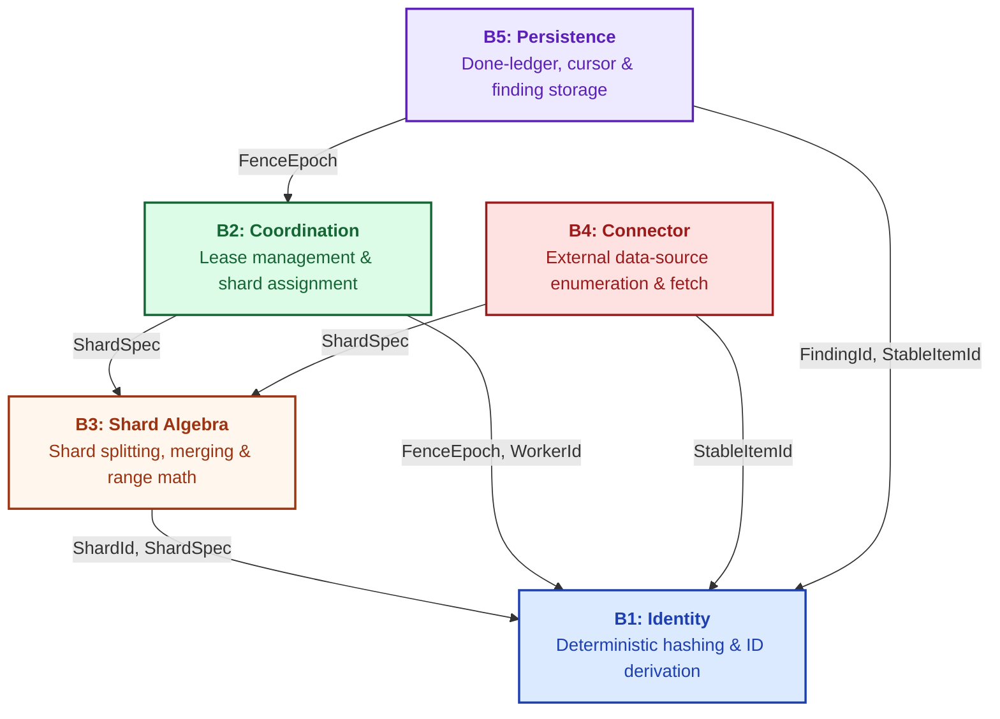
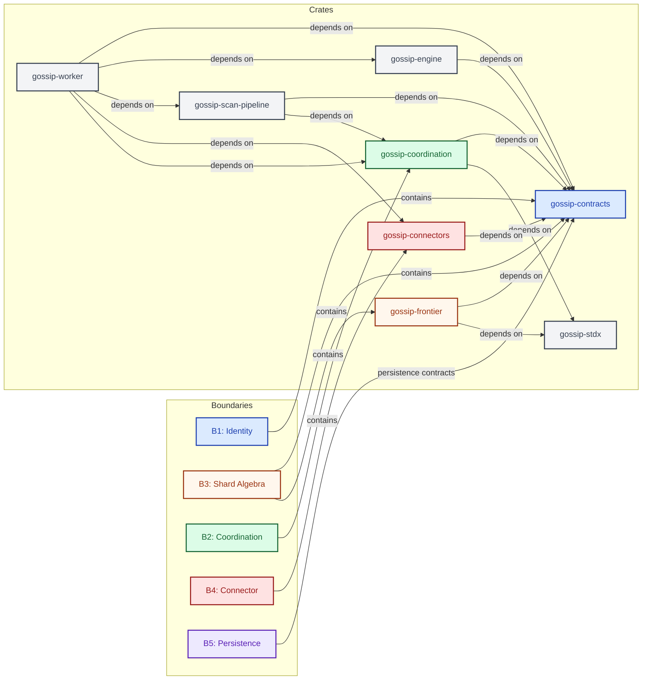
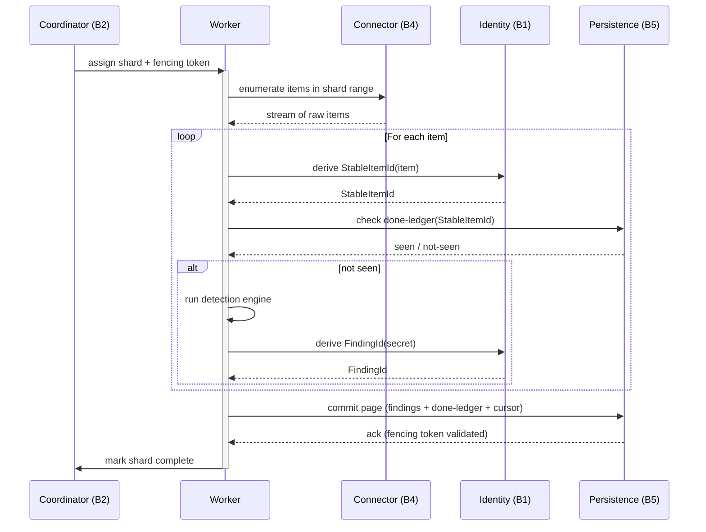
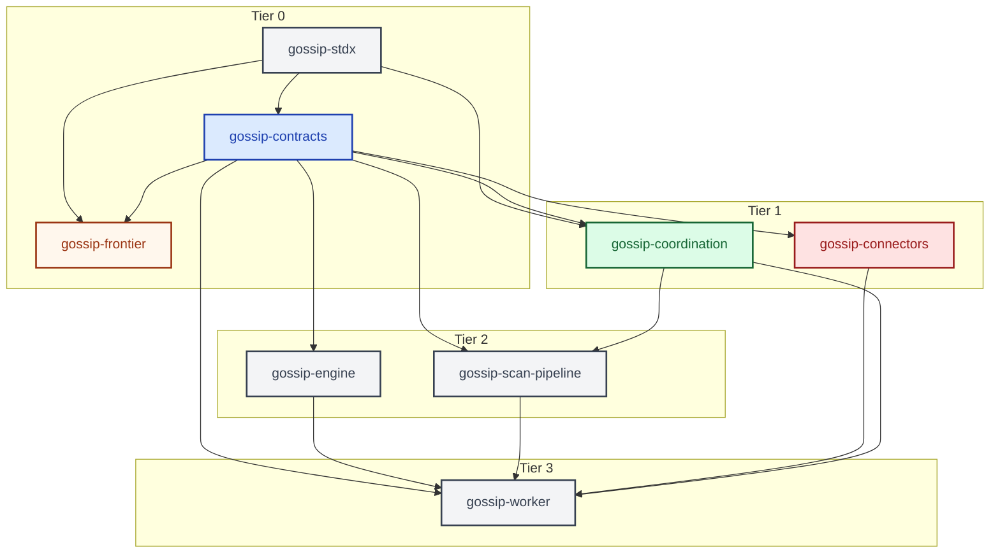

# System Overview

This document describes the high-level architecture of Gossip-rs, a distributed
secret scanner designed around five clearly delineated boundaries. The
five-boundary model is the load-bearing architectural decision of the entire
system: every module, every crate, and every runtime interaction can be traced
back to one of these boundaries. Understanding them is the single fastest way to
build a mental model of the codebase.

The boundaries enforce an acyclic dependency rule. B1 (Identity) sits at the
foundation and depends on nothing. Every other boundary depends on B1, and the
remaining edges form a strict DAG. This means you can reason about any boundary
in isolation by knowing only the boundaries beneath it, and you can compile lower
layers without touching higher ones.

---

## Five-Boundary Architecture

The diagram below shows the five boundaries, their core responsibilities, and
how they depend on one another. The arrows are labeled with the key types that
flow across each dependency edge. Notice that B1 is the root of the DAG: it
provides the deterministic identity types that every other boundary consumes.

B3 (Shard Algebra) also lives at a low level -- it depends only on B1 -- because
shard definitions are pure data that must be shared between coordination,
connectors, and persistence without creating cycles. B2 (Coordination) sits
above both B1 and B3: it uses identity types to fence ownership and shard
definitions to assign work. B4 (Connector) is the I/O surface that talks to
external data sources; it depends on B1 for stable item identity and B3 for
shard ranges. B5 (Persistence) depends on B1 for content-addressed keys and on
B2 for fencing tokens that guard writes.

This layering means that the pure-logic core (B1 + B3) can be tested with zero
I/O, coordination logic (B2) can be tested with in-memory shard maps, and the
I/O boundaries (B4, B5) can be swapped or mocked independently.

---

## Crate Mapping

The crate structure mirrors the boundary structure deliberately. Each crate owns
exactly the code for one or two boundaries, and the Cargo dependency graph
reproduces the boundary DAG above. This gives us compilation isolation: a change
to connector logic does not force a rebuild of coordination, and a change to
identity hashing does not force a rebuild of persistence until the contracts
crate version is bumped.

`gossip-contracts` is the foundation crate. It contains both B1 (Identity) and
B3 (Shard Algebra) because these two boundaries are pure contracts -- no I/O, no
async runtime, no platform dependencies. Keeping them together in one crate
avoids a circular dependency that would arise if shard algebra needed identity
types and vice versa. Every other crate depends on `gossip-contracts`.

`gossip-coordination` owns B2, `gossip-connectors` owns B4, and persistence
contracts live within `gossip-contracts/src/persistence/`. `gossip-engine`
houses the core scan engine, and `gossip-scan-pipeline` provides the pipeline
orchestration. Finally, `gossip-worker` is the top-level binary crate that
wires everything together at startup.

---

## Simplified Scan Flow

The sequence diagram below traces a single shard through one complete scan
cycle. This is the core workflow that every deployment executes thousands of
times per minute, and it shows how the five boundaries compose at runtime to
deliver exactly-once scanning semantics.

The flow begins with B2 (Coordination) assigning a shard to a worker along with
a fencing token. The fencing token is critical: it is a monotonically increasing
value that the persistence layer checks on every write. If a worker loses its
lease and a new worker takes over the same shard, the old worker's fencing token
becomes stale and its writes are rejected. This is how the system prevents
duplicate processing without distributed locks.

The acquire response also carries a `CapacityHint` -- an advisory count of
remaining available shards and the earliest lease deadline -- so workers can
make backoff/retry decisions without additional RPCs (see
[07-lease-lifecycle.md](07-lease-lifecycle.md) Diagram 5).

Once the worker has a shard assignment, it uses B4 (Connector) to enumerate
items from the external data source -- a Git repository, an S3 bucket, a
Confluence space, or any other supported source. For each item, the worker
derives a `StableItemId` through B1 (Identity), which produces a deterministic
content-addressed identifier. The worker then checks the done-ledger in B5
(Persistence) to skip items that have already been scanned. For new items, the
worker runs the detection engine, derives a `FindingId` for each discovered
secret, and commits the entire page -- findings, done-ledger updates, and cursor
position -- atomically through B5. Finally, the worker reports shard completion
back to B2.

The atomicity of the page commit is what guarantees exactly-once semantics: if
the worker crashes mid-page, nothing is committed, and the next worker replays
from the last saved cursor.

---

## Build DAG

The crate graph compiles in four tiers. Tier 0 (`gossip-stdx`, `gossip-contracts`,
and `gossip-frontier`) has no dependencies on higher-level crates and compiles
first. `gossip-stdx` is a foundational utility crate depended on by contracts,
frontier, and coordination. Tier 1 (`gossip-coordination`, `gossip-connectors`,
and `gossip-engine`) compiles in parallel once Tier 0 finishes -- these crates
depend only on `gossip-contracts` (and `gossip-stdx` for coordination). Tier 2
(`gossip-scan-pipeline`) depends on `gossip-contracts` and `gossip-coordination`.
Tier 3 (`gossip-worker`) is the final binary, depending on all five workspace crates.

For the full type-annotated dependency DAG and tiered compilation analysis, see [Boundary Dependency Graph](02-boundary-dependency-graph.md).

---

## Cross-References

| Topic | Diagram File |
|-------|-------------|
| Identity boundary deep-dive | [03-id-derivation-dag.md](03-id-derivation-dag.md) |
| Shard algebra deep-dive | [13-shard-algebra-types.md](13-shard-algebra-types.md) |
| Shard algebra operations | [12-split-operations.md](12-split-operations.md) |
| Coordination protocol | [05-shard-and-run-state-machines.md](05-shard-and-run-state-machines.md) |
| Connector lifecycle | [09-circuit-breaker.md](09-circuit-breaker.md) |
| Persistence guarantees | [08-pagecommit-typestate.md](08-pagecommit-typestate.md) |

## Source Code References

| Boundary | Primary Source |
|----------|---------------|
| B1: Identity | `crates/gossip-contracts/src/identity/` |
| B3: Shard Algebra | `crates/gossip-contracts/src/coordination/shard_spec.rs` (data model) + `crates/gossip-frontier/src/` (key encoding, hints, builder) |
| Shared utilities | `crates/gossip-stdx/` |
| B2: Coordination | `crates/gossip-contracts/src/coordination/` (data types) + `crates/gossip-coordination/src/` (protocol) |
| B4: Connector | `crates/gossip-contracts/src/connector/` + `crates/gossip-connectors/` |
| B5: Persistence | `crates/gossip-contracts/src/persistence/` |
| Worker binary | `crates/gossip-worker/` |
| Architecture prose | `00-prologue/03-architecture-at-a-glance.md` |
