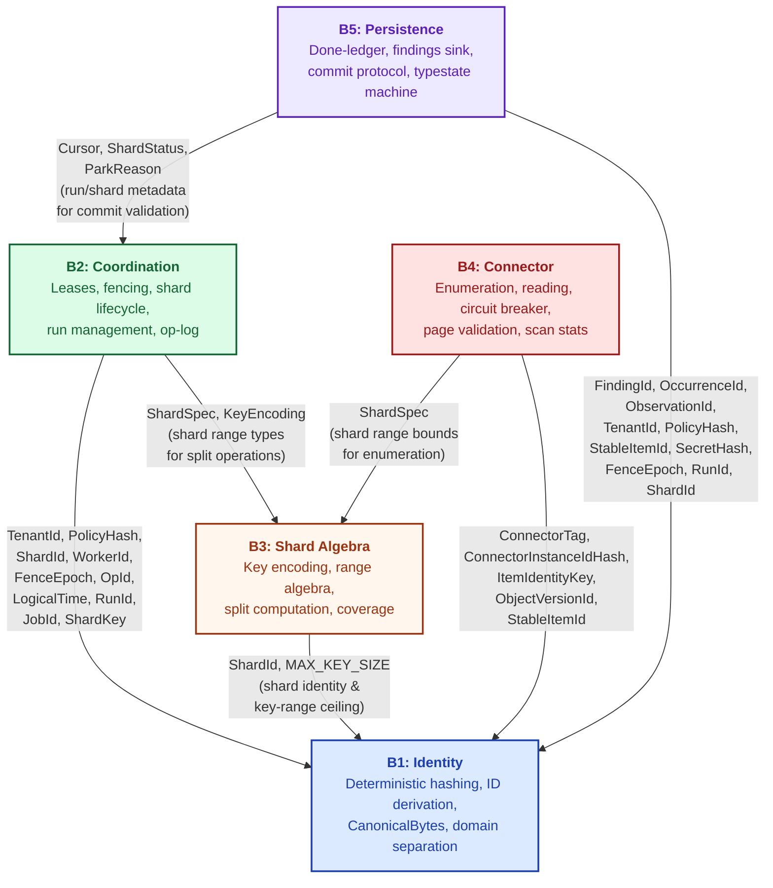
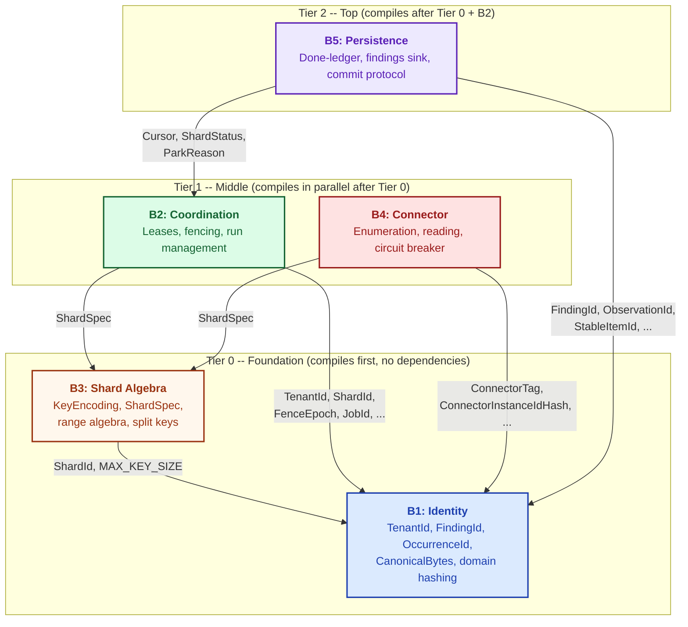
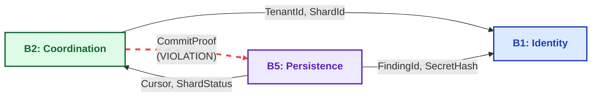

# Boundary Dependency Graph

This document provides a detailed view of the inter-boundary dependency
structure in Gossip-rs. While the system overview introduced the five boundaries
and their high-level relationships, this document drills into the exact types
that flow across each dependency edge, shows how the DAG determines compilation
order, and illustrates why the acyclic constraint is non-negotiable.

The dependency graph is the load-bearing skeleton of the entire architecture.
Every `use` statement that crosses a boundary line is a deliberate, typed edge
in this graph. No boundary may depend on a boundary above it. No cycles are
permitted. These rules are not conventions -- they are enforced structurally
through Cargo's crate graph and checked in code review by inspecting import
paths. Violating the acyclic rule would entangle independently testable units,
introduce compilation cycles, and create deadlock risk in the runtime.

The three diagrams below present the same dependency information at increasing
levels of abstraction: first the complete type-annotated DAG with every edge
labeled, then the tiered compilation view showing parallel build opportunities,
and finally a cautionary anti-pattern that shows what happens when the acyclic
rule is violated.

---

## Complete Type-Annotated DAG

The graph below is the most detailed representation of the boundary dependency
structure. Every directed edge is annotated with the exact types that the
consuming boundary imports from the providing boundary. These are not abstract
concepts -- they are concrete Rust types that appear in `use` statements across
module boundaries.

Several observations stand out. B1 (Identity) has no outgoing dependency edges;
it is the universal leaf. B3 (Shard Algebra) depends only on B1, using
`ShardId` for shard identity and `MAX_KEY_SIZE` as the key-range ceiling. B2 (Coordination) and B4
(Connector) both sit in the middle tier, each depending on B1 and B3 but not on
each other. B5 (Persistence) is the highest boundary, depending on B1 for
content-addressed identity and on B2 for run/shard metadata used in commit
validation. Notably, B5 does not depend on B4 directly in the contracts layer --
the runtime composes B4 output into B5 input, but the contract types are
decoupled.

The type annotations on each edge make impact analysis tractable. If `TenantId`
changes shape, you can trace exactly which boundaries are affected by following
the edges out of B1. If `ShardSpec` changes, only B2 and B4 need updating.
This is the practical payoff of the explicit dependency graph: changes propagate
along known, documented paths.

**Reading the edges.** Each arrow points from consumer to provider. The label
lists the types that cross the boundary. For example, `B2 --> B1` means
Coordination imports `TenantId`, `PolicyHash`, `ShardId`, `WorkerId`,
`FenceEpoch`, `OpId`, `LogicalTime`, `RunId`, `JobId`, and `ShardKey` from
Identity. The B5 --> B1
edge is the widest, reflecting the fact that persistence must reference nearly
every content-addressed identity type for done-ledger keys, finding records, and
occurrence records.

Note: `DoneLedgerKey` and `OvidHash` are defined within the B5 persistence
module (`persistence/done_ledger.rs` and `persistence/ovid.rs` respectively).
They consume B1 identity types (`TenantId`, `PolicyHash`, `StableItemId`) but
are not re-exported from `identity/`. The domain-separation constants for their
derivation (`DONE_LEDGER_KEY_V1`, `OVID_V1`) are registered in
`identity/domain.rs` so the identity boundary remains the single authoritative
source for derivation roots — preventing duplicate or divergent domain IDs
across boundaries. `TRIAGE_GROUP_KEY_V1` is similarly registered there for
future `TriageGroupKey` derivation from `(tenant, item)` pairs.

---

## Tiered Compilation View

The dependency graph is a DAG, and every DAG has a topological ordering. This
ordering directly determines the build schedule: boundaries at the same tier
have no mutual dependencies and can compile in parallel.

The tiered view below shows three compilation tiers. Tier 0 is the foundation:
B1 (Identity) and B3 (Shard Algebra) have no dependencies on higher boundaries.
B1 lives in `gossip-contracts` and B3 lives in its own crate `gossip-frontier`.
Both are pure, stateless contract boundaries with no I/O, no async runtime, and
no platform dependencies, so they compile at the bottom of the DAG with no
prerequisites. Tier 1 contains B2 (Coordination) and B4 (Connector), which
depend on the foundation but not on each other -- they compile in parallel once
Tier 0 finishes. Tier 2 contains B5 (Persistence), which depends on both Tier 0
and B2 from Tier 1.

B3's key encoding uses `CanonicalBytes` and `StableItemId` from B1, so
`gossip-frontier` depends on `gossip-contracts`. The dependency is
one-directional (B3 depends on B1, never the reverse), and both crates remain
in Tier 0 because neither depends on anything above the foundation.

**Parallel compilation.** Within Tier 1, `gossip-coordination` (B2) and
`gossip-connectors` (B4) compile simultaneously. Neither imports types from the
other. This parallelism is preserved in CI pipelines and in local development:
`cargo build` spawns both compilations as soon as the Tier 0 crates
(`gossip-contracts` and `gossip-frontier`) finish.

**Tier membership rules.** A boundary's tier is determined by its deepest
dependency. B5 depends on B2 (Tier 1), so B5 cannot be earlier than Tier 2.
B4 depends only on B1 and B3 (both Tier 0), so B4 belongs to Tier 1.
Adding a new dependency edge always pushes the consumer to a tier at least one
higher than the provider.

---

## Anti-Pattern: Cyclic Dependency Violation

The acyclic dependency rule is not a suggestion. It is a structural invariant
enforced by the crate graph. The diagram below shows what would happen if
Coordination (B2) introduced a dependency on Persistence (B5) -- for example,
if B2 imported `CommitProof` to validate shard completion inside the
coordination backend.

This creates a cycle: B5 depends on B2 (for `Cursor`, `ShardStatus`, and
`ParkReason`), and B2 would depend on B5 (for `CommitProof`). The consequences
are immediate and severe.

First, the Rust compiler rejects crate-level cycles outright. `gossip-coordination`
cannot depend on a crate that already depends on `gossip-coordination`. The code
does not compile.

Second, even if the cycle existed within a single crate (avoiding the Cargo
restriction), it would destroy independent testability. You could no longer test
coordination logic without also compiling and configuring persistence, and vice
versa. Unit tests would require the entire system to be wired up, defeating the
purpose of the boundary decomposition.

Third, runtime deadlock becomes possible. If the coordination layer calls into
persistence to validate a proof, and persistence calls back into coordination to
check a fencing token, the call graph contains a cycle that can deadlock under
contention or async executor starvation.

**The red dashed edge is the violation.** If B2 imports `CommitProof` from B5,
the dependency graph contains the cycle `B5 --> B2 --> B5`. This breaks three
guarantees simultaneously:

1. **Compilation independence.** Cargo rejects circular crate dependencies.
   The project does not build.
2. **Independent testing.** Coordination tests would need persistence mocks,
   and persistence tests would need coordination mocks. The test setup becomes
   combinatorially complex.
3. **Deadlock freedom.** Mutual runtime calls between B2 and B5 can deadlock
   under async executor starvation or lock contention.

**How violations are caught.** The primary defense is the crate boundary itself:
Cargo's dependency resolver rejects cycles at build time. Within a
single crate (such as `gossip-contracts`, which hosts B1 alongside B2's data
types), the defense is code review. Every pull request that adds a `use crate::` statement crossing
a boundary module is checked against the DAG. If `coordination/` imports from
`persistence/` (or vice versa beyond the documented edges), the review is
rejected with a request to restructure the types so that shared abstractions
live in a lower boundary.

---

## Design Rationale

**The acyclic dependency rule is fundamental.** Dependencies flow strictly
downward through the tier structure. This is not merely a code organization
preference -- it is the mechanism that enables independent compilation,
independent testing, and deadlock-free runtime composition. Every architectural
decision in Gossip-rs preserves this invariant.

**Each edge represents specific type usage, not general coupling.** The edges
in the dependency graph are not vague "A uses B" relationships. They enumerate
the exact types that cross the boundary. This precision makes impact analysis
tractable: when a type changes, you know exactly which boundaries need updating
by following its outgoing edges in the DAG.

**Compilation follows topological order.** The build system processes boundaries
in tier order. Tier 0 (B1, B3) compiles first with no dependencies. Tier 1
(B2, B4) compiles in parallel once Tier 0 is complete. Tier 2 (B5) compiles
after its dependencies in Tier 0 and Tier 1 are ready. This parallelism is
automatic -- Cargo's build planner derives it from the crate graph.

**Violations are caught through import path inspection.** In code review, any
new `use` statement that crosses a boundary module triggers a check against the
documented DAG. The crate graph provides a hard structural barrier (Cargo
rejects cycles), and within-crate boundaries are enforced by convention and
review.

**Why B1 and B3 are separate crates.** B1 (Identity) lives in
`gossip-contracts` and B3 (Shard Algebra) lives in `gossip-frontier`. Both are
pure, stateless contract boundaries with no I/O dependencies. B3 uses
`StableItemId` and `CanonicalBytes` from B1 for key encoding, so
`gossip-frontier` depends on `gossip-contracts`. The dependency is
one-directional (B3 depends on B1, never the reverse). Both crates remain in
Tier 0 and compile before anything else. The separate crate boundary gives B3
its own namespace and allows downstream crates to depend on frontier types
without pulling in all of `gossip-contracts`.

---

## Cross-References

| Topic                                          | Diagram File                                                             |
| ---------------------------------------------- | ------------------------------------------------------------------------ |
| System overview and five-boundary architecture | [01-system-overview.md](01-system-overview.md)                           |
| Identity boundary deep-dive                    | [03-id-derivation-dag.md](03-id-derivation-dag.md)                       |
| Shard algebra operations                       | [12-split-operations.md](12-split-operations.md)                         |
| Coordination protocol                          | [05-shard-and-run-state-machines.md](05-shard-and-run-state-machines.md) |
| Connector lifecycle                            | [09-circuit-breaker.md](09-circuit-breaker.md)                           |
| Persistence guarantees                         | [08-pagecommit-typestate.md](08-pagecommit-typestate.md)                 |

## Source Code References

| Reference                    | Location                                                                                                                     |
| ---------------------------- | ---------------------------------------------------------------------------------------------------------------------------- |
| B1 Identity contracts        | `crates/gossip-contracts/src/identity/`                                                                                      |
| B3 Shard Algebra             | `crates/gossip-frontier/src/`                                                                                                |
| B2 Coordination data types   | `crates/gossip-contracts/src/coordination/` (shard_spec, cursor, pooled, manifest, limits)                                   |
| B2 Coordination protocol     | `crates/gossip-coordination/src/` (traits, record, lease, error, run, split, validation, session, facade, events, in_memory) |
| B4 Connector contracts       | `crates/gossip-contracts/src/connector/`                                                                                     |
| B5 Persistence contracts     | `crates/gossip-contracts/src/persistence/`                                                                                   |
| Cargo workspace manifest     | `Cargo.toml` (root)                                                                                                          |
| gossip-contracts manifest    | `crates/gossip-contracts/Cargo.toml`                                                                                         |
| gossip-coordination manifest | `crates/gossip-coordination/Cargo.toml`                                                                                      |
