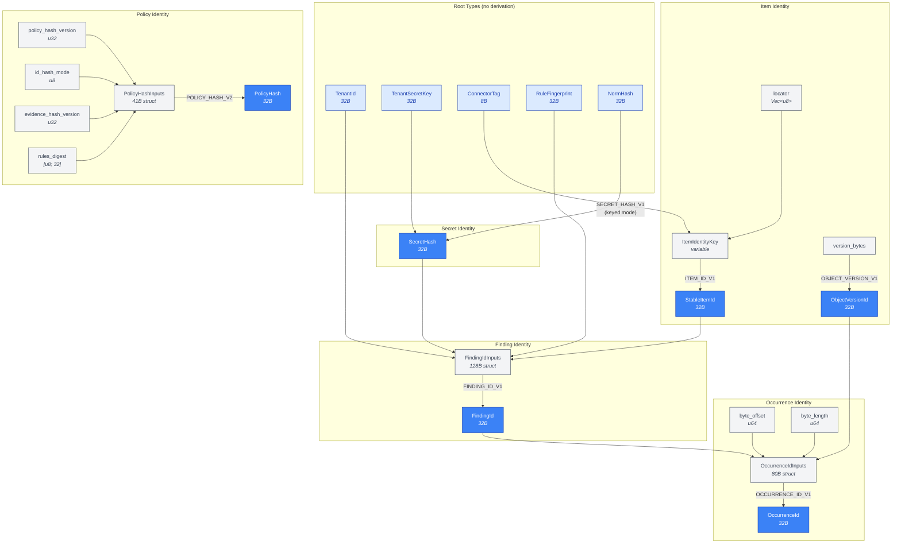
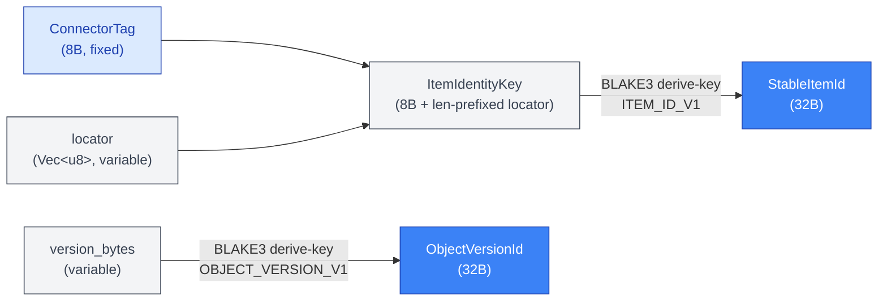
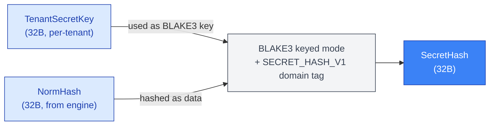
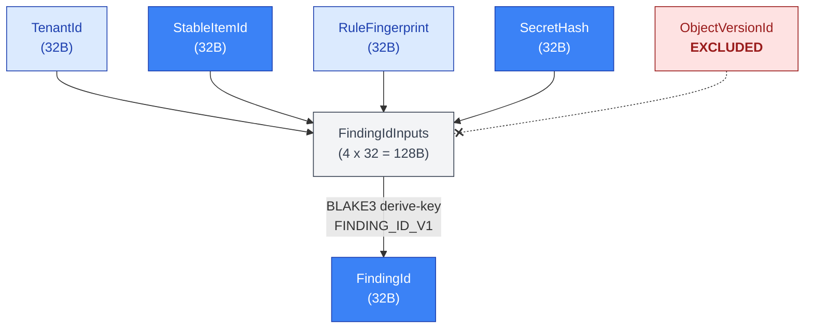
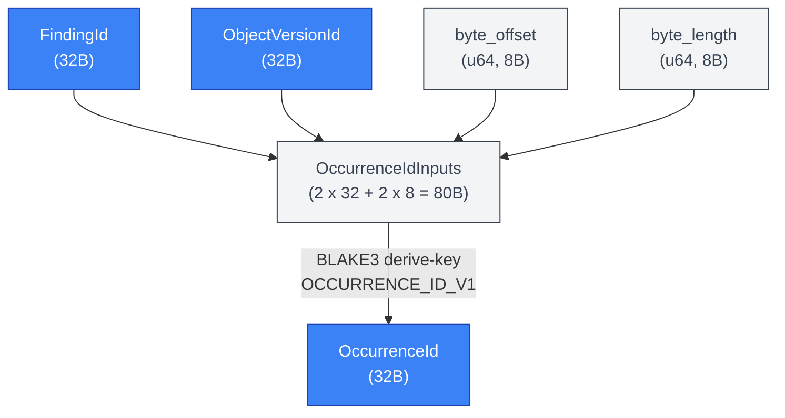
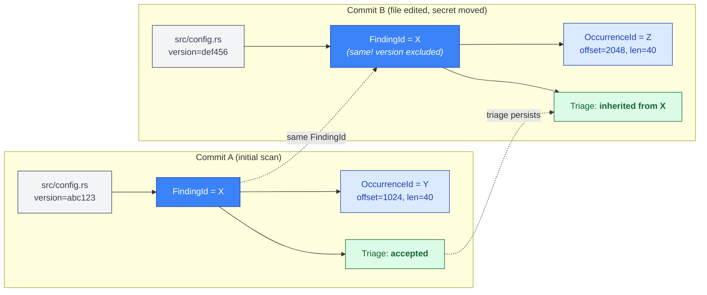

# ID Derivation DAG

The identity system in Gossip defines 15 types organized into a directed acyclic graph (DAG) of derivations. Unlike a tree, many derived types have multiple inputs -- for example, `FindingId` depends on four separate upstream types simultaneously. Every derivation uses BLAKE3 with an explicit domain-separation constant so that the same raw bytes fed to different derivation functions produce cryptographically independent outputs.

Three invariants govern the entire DAG:

- **INV-S01 (Determinism):** Every derivation is a pure function of its inputs. Same inputs always produce the same output.
- **INV-S02 (Collision resistance):** All 32-byte outputs provide 128-bit collision resistance (birthday bound ≈ 2^128 operations to find a collision), inherited from BLAKE3's 256-bit output.
- **INV-S03 (Tenant isolation):** Tenant-keyed `SecretHash` derivation prevents cross-tenant correlation of secret values.

---

## 1. Full 15-Type DAG

The complete identity hierarchy shows how five root types (requiring no derivation) flow through intermediate structures into six derived 32-byte identifiers and one policy hash. The graph is a DAG because several derived types consume outputs from multiple independent roots.

Key observations about the full DAG:

- **Five root types** require no derivation: `TenantId`, `TenantSecretKey`, `ConnectorTag`, `RuleFingerprint`, and `NormHash`.
- **Six derived 32-byte types** are produced via BLAKE3: `StableItemId`, `ObjectVersionId`, `SecretHash`, `FindingId`, `OccurrenceId`, and `PolicyHash`.
- **Three input structs** (`FindingIdInputs`, `OccurrenceIdInputs`, `PolicyHashInputs`) aggregate multiple fields before hashing, and `ItemIdentityKey` serves the same aggregation role for item identity.
- Every edge labeled with a domain constant (e.g., `FINDING_ID_V1`) represents a BLAKE3 derive-key invocation, except `SECRET_HASH_V1` which uses BLAKE3 keyed mode.

---

## 2. Item Identity Chain

The item identity chain answers "what was scanned?" independently of who scanned it or what was found. `StableItemId` is tenant-independent -- the same file has the same `StableItemId` regardless of which tenant scans it. Tenant scoping is applied later at `FindingId` derivation.

`ObjectVersionId` is derived independently from version token bytes. It answers "which version of the content?" and enters `OccurrenceId` derivation but deliberately never enters `FindingId`.

The `ConnectorTag` (8 bytes, null-padded ASCII) prevents cross-source collisions: a GitHub file at `org/repo/path.txt` and a GitLab file at the same locator hash to different `StableItemId` values. The `ItemIdentityKey` canonical encoding writes the fixed-width tag followed by a length-prefixed locator, ensuring unambiguous serialization (INV-S01). The domain constant `"gossip/item-id/v1"` isolates this derivation from all others (INV-S02).

`StableItemId` and `ObjectVersionId` are independent derivations with distinct BLAKE3 domain separators. Both are consumed downstream -- `StableItemId` in `FindingId` and `ObjectVersionId` in `OccurrenceId` -- but neither depends on the other.

---

## 3. Secret Identity Chain

The secret identity chain answers "what secret was found?" in a way that is mathematically isolated per tenant. This is the only derivation in the system that uses BLAKE3 keyed mode rather than derive-key mode.

The `key_secret_hash()` function creates a BLAKE3 keyed-mode hasher initialized with `TenantSecretKey`, then feeds the domain tag `"gossip/secret-hash/v1"` as a context prefix followed by the `NormHash` bytes. Because the hasher is in keyed mode, a different tenant key produces a mathematically independent hash -- the same normalized secret yields completely different `SecretHash` values for different tenants (INV-S03).

This prevents cross-tenant correlation: an attacker who compromises tenant A's `SecretHash` values learns nothing about whether tenant B has the same secret. The `NormHash` itself (the engine's raw output) never leaves the derivation boundary.

Both `NormHash` and `SecretHash` use `define_id_32_restricted!`, which makes the constructor `pub(crate)` and provides a redacted `Debug` impl (`SecretHash([redacted])`) to prevent accidental logging of security-sensitive material.

---

## 4. Finding Identity Chain

The finding identity chain answers "what finding was detected?" in a version-stable way. The critical design choice here is what is *excluded*: `ObjectVersionId` is deliberately not an input.

`FindingIdInputs` is a fixed-width struct (4 x 32 = 128 bytes) whose `CanonicalBytes` impl feeds fields to BLAKE3 in struct declaration order: `tenant`, `item`, `rule`, `secret`. The `derive_finding_id()` function uses a cached BLAKE3 derive-key hasher with domain constant `"gossip/finding/v1"` (INV-S01, INV-S02).

The exclusion of `ObjectVersionId` is the key design decision: it makes `FindingId` version-stable. "Rule R found secret S in item I for tenant T" is the same finding regardless of which commit or object version it was first detected in. This enables stable triage state -- an operator can mark a finding as "accepted" or "false positive" and that decision persists across all future scans of the same item, even as the file changes.

Each of the four input fields independently affects the output (verified by per-field sensitivity tests in the codebase), and the field-order swap test confirms that reordering fields in `write_canonical` would change the hash.

---

## 5. Occurrence Identity Chain

The occurrence identity chain answers "where exactly in which version was this finding observed?" It ties a version-stable `FindingId` to a specific version and byte range.

`OccurrenceIdInputs` is a mixed-width struct (2 x 32 + 2 x 8 = 80 bytes). All fields are fixed-width, so the canonical encoding writes them sequentially with no length prefixes. The `derive_occurrence_id()` function uses a cached BLAKE3 derive-key hasher with domain constant `"gossip/occurrence/v1"` (INV-S01, INV-S02).

Because `ObjectVersionId` *is* included here (unlike in `FindingId`), `OccurrenceId` is version-specific. Moving the file, editing its content, or even shifting the byte offset of the secret within the same version all produce a new `OccurrenceId`. This provides precise deduplication: the system knows whether it has already reported *this exact occurrence* at *this exact location* in *this exact version*.

---

## 6. Version Stability Illustration

The split between version-stable `FindingId` and version-specific `OccurrenceId` is the central insight of the identity model. This diagram illustrates how triage state persists across code versions.

In Commit A, a scan detects an API key at byte offset 1024 in `src/config.rs`. The system derives `FindingId=X` from `(TenantId, StableItemId, RuleFingerprint, SecretHash)` and `OccurrenceId=Y` from `(FindingId=X, ObjectVersionId=abc123, offset=1024, length=40)`. An operator triages the finding as "accepted."

In Commit B, the file is edited and the secret moves to byte offset 2048. Because `ObjectVersionId` is excluded from `FindingId` derivation, the system derives the *same* `FindingId=X` -- it is still the same secret, in the same item, detected by the same rule, for the same tenant. The triage decision ("accepted") is inherited automatically. However, a *new* `OccurrenceId=Z` is derived because the version and byte offset have changed, providing precise tracking of where the secret currently lives.

This two-level design means operators never need to re-triage findings just because the file was updated. Triage state groups by `FindingId`; precise location tracking uses `OccurrenceId`.

---

## Cross-References

| Concept                                                                         | Related Section                                                           |
| ------------------------------------------------------------------------------- | ------------------------------------------------------------------------- |
| Domain separation constants                                                     | `domain.rs` -- authoritative registry of all `"gossip/..."` tags          |
| `CanonicalBytes` trait                                                          | Ensures deterministic serialization before hashing (INV-S01)              |
| `define_id_32!` / `define_id_32_restricted!`                                    | Macros that generate 32-byte wrapper types with standard traits           |
| Shard algebra split ID                                                          | Uses `SPLIT_ID_V1` from the same domain registry (B2: Coordination)       |
| Policy-driven rescan                                                            | `PolicyHash` change forces new `RunId` and full rescan                    |
| Triage group key                                                                | `TRIAGE_GROUP_KEY_V1` groups findings by `(tenant, item)` for persistence |
| Boundary dependency graph (which boundaries consume which ID types)             | [02-boundary-dependency-graph.md](02-boundary-dependency-graph.md)        |
| End-to-end scan flow (StableItemId in step 4, FindingId in step 7)              | [04-end-to-end-scan-flow.md](04-end-to-end-scan-flow.md)                  |
| Tenant isolation (SecretHash keyed-mode derivation, cross-tenant unlinkability) | [11-tenant-isolation.md](11-tenant-isolation.md)                          |
| Split operations (SPLIT_ID_V1 domain separator for child shard IDs)             | [12-split-operations.md](12-split-operations.md)                          |

## Source Code References

| File                                              | Purpose                                                                                                                                   |
| ------------------------------------------------- | ----------------------------------------------------------------------------------------------------------------------------------------- |
| `crates/gossip-contracts/src/identity/finding.rs` | `SecretHash`, `FindingId`, `OccurrenceId` types and derivation functions (`key_secret_hash`, `derive_finding_id`, `derive_occurrence_id`) |
| `crates/gossip-contracts/src/identity/item.rs`    | `ConnectorTag`, `ItemIdentityKey`, `StableItemId`, `ObjectVersionId` types and derivation                                                 |
| `crates/gossip-contracts/src/identity/policy.rs`  | `PolicyHashInputs`, `IdHashMode`, `compute_policy_hash` derivation                                                                        |
| `crates/gossip-contracts/src/identity/types.rs`   | Root types: `TenantId`, `TenantSecretKey`, `PolicyHash`                                                                                   |
| `crates/gossip-contracts/src/identity/domain.rs`  | All domain-separation constants (`ITEM_ID_V1`, `FINDING_ID_V1`, etc.)                                                                     |
