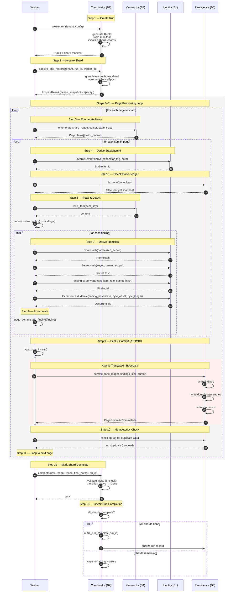
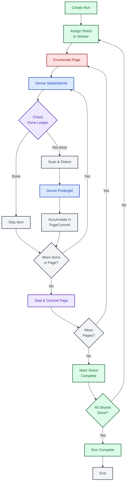
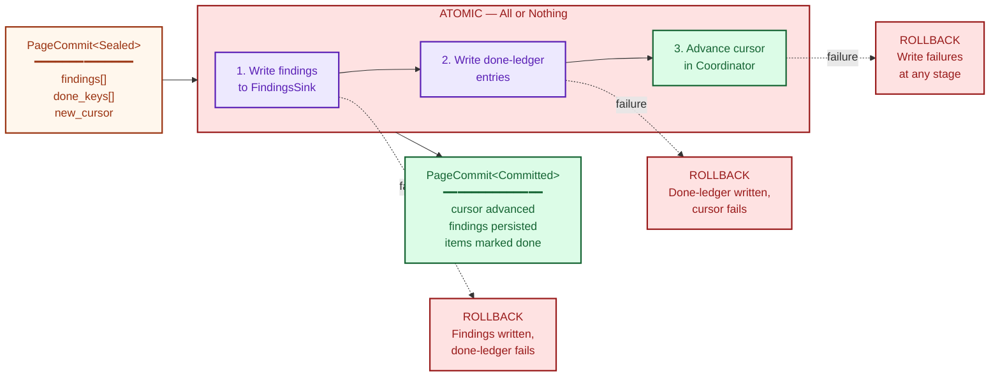

# End-to-End Scan Flow

This document traces a complete scan from run creation through final completion,
showing how all five architectural boundaries compose into a single coherent
pipeline. The scan flow is the central narrative of the system: every identity
derivation, every coordination handshake, every persistence guarantee exists to
serve this pipeline. Understanding these 13 steps—and the invariants that bind
them—is the key to understanding why the system is correct.

---

## 1. Full 13-Step Sequence

The following sequence diagram is the most detailed in the entire documentation
suite. It shows every participant, every message, and every nested loop involved
in processing a single shard of a scan run. The five boundaries appear as
distinct participants, and numbered notes mark each of the 13 steps.

The outer structure is straightforward: create a run, assign shards to workers,
process pages, mark complete. The complexity lives in the inner loops—steps 3
through 11—where enumeration, identity derivation, detection, and atomic commit
interleave repeatedly for every page of every shard.

Pay particular attention to how Identity (B1) is invoked at three distinct
levels: once per item (StableItemId), once per secret (NormHash, SecretHash),
and once per finding (FindingId, OccurrenceId). This layered identity derivation
is what makes deduplication, idempotency, and incremental scanning possible.

**Reading the diagram.** The outermost flow is linear: create run, acquire
shard, process pages, mark complete. Within the page processing loop (the gray
rectangle), three nested loops execute: one per page, one per item within each
page, and one per finding within each item. The red-tinted rectangle marks the
atomic commit boundary—the single most critical correctness invariant in the
system.

Note that Step 10 (idempotency check via op-log) guards against the scenario
where a worker crashes after committing but before receiving the acknowledgment.
On retry, the op-log detects the duplicate OpId and skips the re-commit,
preventing double-counting of findings.

---

## 2. Simplified Overview Flowchart

The 13-step sequence above is precise but dense. The following flowchart
presents the same flow as a high-level decision graph, making it easier to see
the overall shape: which steps loop, which steps branch, and where each
architectural boundary is responsible.

Each node is colored according to its owning boundary. Green nodes belong to
Coordination (B2), red to the Connector (B4), blue to Identity (B1), purple to
Persistence (B5), and gray to the Worker itself. This coloring reveals a key
property: Identity is touched at every level of the pipeline, while Persistence
concentrates at the commit boundary.

**Interpreting the colors.** The flow begins and ends in green (Coordination),
passes through red (Connector) for enumeration, blue (Identity) for derivation,
and purple (Persistence) for the done-ledger check and the atomic commit. Gray
nodes represent Worker-local computation. The visual pattern makes clear that
every page cycle touches all five boundaries—this is not a layered architecture
with clean horizontal separation, but a pipeline where boundaries interleave at
every step.

---

## 3. Atomic Commit Boundary

Step 9—seal and commit—is the correctness linchpin of the entire scan pipeline.
This diagram zooms into the transaction boundary to show exactly what must
succeed atomically and what happens when any sub-operation fails.

The atomic commit writes three things: findings to the findings sink, entries to
the done-ledger, and the advanced cursor to the coordinator. If any one of these
fails, the entire transaction must roll back. Partial writes are the worst
failure mode for a secret scanner: if findings are written but the done-ledger
is not updated, the item will be re-scanned on retry, producing duplicate
findings. If the done-ledger is updated but findings are lost, the secret is
silently missed—a false negative, which is categorically unacceptable.

**Why atomicity matters.** Consider the three failure scenarios shown as dashed
paths:

1. **Findings written, done-ledger fails.** On retry, the worker re-scans the
   item because the done-ledger says it has not been processed. The findings
   sink now contains duplicates. Depending on deduplication guarantees
   downstream, this may produce inflated counts or duplicate alerts.

2. **Done-ledger written, cursor fails.** The item is marked as scanned, but
   the findings were not persisted. The secret is silently lost—a **false
   negative**. For a security scanner, this is the worst possible outcome.

3. **All sub-operations fail.** This is actually the safest failure mode. The
   cursor has not advanced, the done-ledger has not been updated, and no
   findings have been written. On retry, the worker re-processes the page from
   the same cursor position, producing identical results.

The transaction boundary ensures that only scenario 3 (clean rollback) or full
success can occur. Partial states are impossible by construction.

**Cursor monotonicity.** The cursor only advances inside the atomic commit. This
guarantees forward-only progress through the shard. A worker can never "skip
ahead" past unprocessed items, and it can never "fall back" to re-process items
that have already been committed. Combined with the done-ledger, this creates a
two-layer idempotency guarantee: the cursor prevents re-enumeration, and the
done-ledger prevents re-scanning of individual items that might appear in
overlapping pages.

---

## How the Boundaries Compose

The 13-step flow reveals how the five architectural boundaries are not isolated
subsystems but tightly choreographed participants in a single pipeline:

- **Coordination (B2)** bookends the flow. It creates the run (step 1), assigns
  shards (step 2), and determines completion (steps 12-13). It also owns the
  cursor that tracks progress within each shard. Acquire and renew responses
  carry a `CapacityHint` (available shard count and earliest lease deadline) so
  workers can make backoff/retry decisions without additional RPCs.

- **Connector (B4)** provides the raw material. Enumeration (step 3) and content
  retrieval (step 6) are the only points where the system touches external data
  sources. The connector abstraction means the scan pipeline is identical
  regardless of whether the source is GitHub, S3, or a local filesystem.

- **Identity (B1)** is called at every level of granularity. StableItemId
  (step 4) identifies items for the done-ledger. NormHash and SecretHash
  (step 7) identify secrets for deduplication. FindingId and OccurrenceId
  (step 7) identify findings for persistence and correlation. This layered
  identity scheme is what makes incremental scanning, cross-run deduplication,
  and multi-tenant isolation possible.

- **Persistence (B5)** owns the durability guarantees. The done-ledger check
  (step 5), the atomic commit (step 9), and the op-log idempotency check
  (step 10) all live in the persistence boundary. Every correctness invariant
  ultimately depends on persistence behaving correctly.

- **The Worker** (cross-cutting) orchestrates the entire flow. It is the only
  participant that touches all five boundaries, driving the pipeline forward and
  making local decisions (skip vs. scan, accumulate vs. commit).

**Recovery semantics.** On failure at any point in the pipeline, recovery is
straightforward: the worker resumes from the last committed cursor position.
Items before the cursor have been atomically committed (findings persisted,
done-ledger updated). Items at or after the cursor will be re-processed from
scratch. The done-ledger provides an additional safety net: even if an item
appears in a re-enumerated page, the done-ledger check (step 5) will skip it if
it was committed in a previous page's transaction.

---

## Cross-References

| Diagram | Related Document |
|---------|-----------------|
| Full 13-step sequence | [ID Derivation DAG](./03-id-derivation-dag.md) — details steps 4 and 7 |
| Full 13-step sequence | [Shard and Run State Machines](./05-shard-and-run-state-machines.md) — details steps 2, 12, and 13 |
| Simplified overview | [PageCommit Typestate](./08-pagecommit-typestate.md) — details steps 8, 9 |
| Atomic commit boundary | [PageCommit Typestate](./08-pagecommit-typestate.md) — the Sealed-to-Committed transition |

## Source Code References

| Component | Path |
|-----------|------|
| Identity derivation (StableItemId, FindingId, NormHash) | `crates/gossip-contracts/src/identity/` |
| Coordination data types (shard_spec, cursor, pooled, manifest, limits) | `crates/gossip-contracts/src/coordination/` |
| Coordination protocol (run creation, shard assignment, completion) | `crates/gossip-coordination/src/` |
| Persistence (done-ledger, findings sink, op-log) | `crates/gossip-contracts/src/persistence/` |
| Design specification | `08-cross-cutting/02-data-flow-end-to-end.md` |
