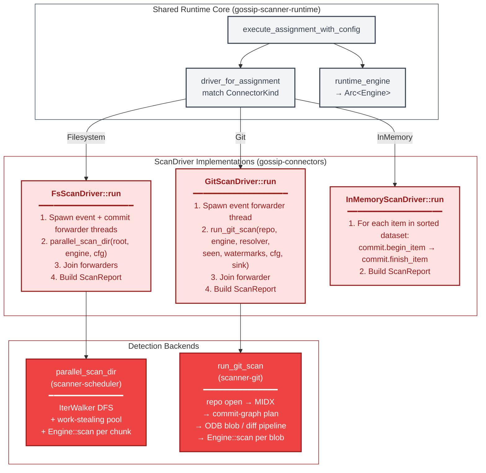
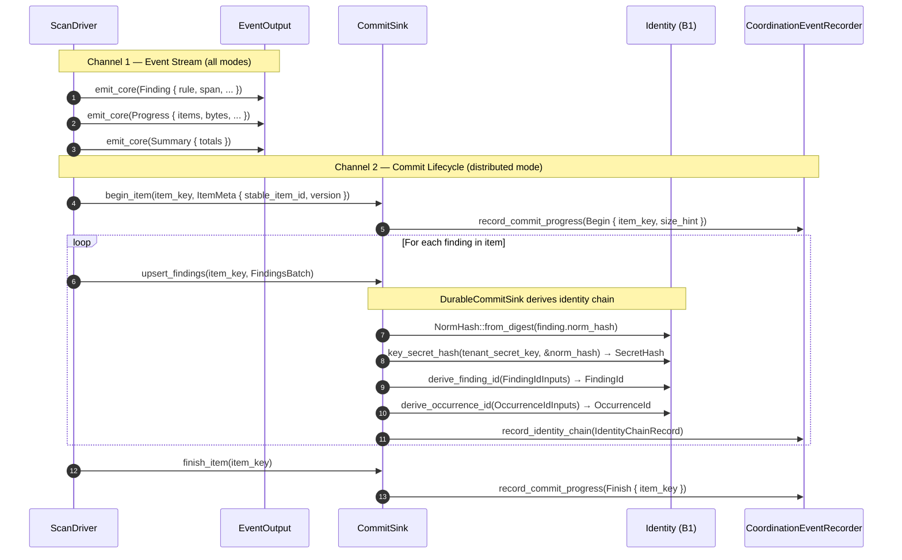
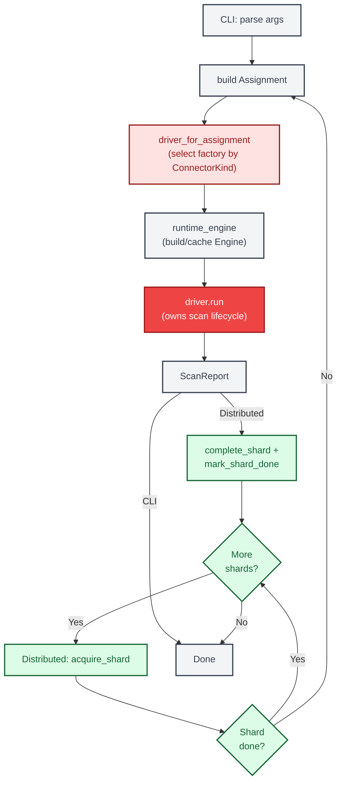

# End-to-End Scan Flow

This document traces the production scan execution path from entry point
through to completion. Two entry points — CLI and distributed worker — converge
on a shared `execute_assignment_with_config` function that delegates to
source-specific `ScanDriver` implementations. Each driver owns its entire
scan lifecycle internally: enumeration, detection, and result collection are
not orchestrated by an external loop.

---

## 1. Dual Entry Points — CLI and Distributed

Both execution paths build an `Assignment` and feed it to the same shared
core. The distributed path adds shard-level coordination: lease acquisition,
done-ledger gating, and shard completion bookkeeping.

```mermaid
%% Diagram: dual-entry-point-sequence
sequenceDiagram
    autonumber

    participant CLI as CLI Binary
    participant DW as Distributed Worker
    participant DC as DistributedCoordinator
    participant RT as Runtime Core
    participant SF as ScanSourceFactory
    participant DR as ScanDriver

    note over CLI: CLI Path (scanner-rs-cli)
    CLI->>RT: scan_fs_with_runtime / scan_git_with_runtime
    RT->>RT: build_assignment(source, shard_spec, cursor)

    note over DW,DC: Distributed Path (run_worker loop)
    loop For each shard
        DW->>DC: acquire_shard()
        DC-->>DW: Option&lt;ShardLease&gt;
        DW->>DC: is_shard_done(&shard_id)
        DC-->>DW: bool
        alt Already done
            DW->>DC: release_shard(&lease)
        else Not done
            note over RT: Both paths converge here

            DW->>RT: execute_assignment_with_config(lease.assignment, ...)
        end
    end

    note over RT,DR: Shared Core
    RT->>SF: driver_for_assignment(&assignment)
    SF-->>RT: Box&lt;dyn ScanDriver&gt;
    RT->>RT: runtime_engine(engine_config) → Arc&lt;Engine&gt;
    RT->>DR: driver.run(engine, cfg, out, git_out, commit, cancel)
    activate DR
    DR-->>RT: ScanReport
    deactivate DR
    RT-->>DW: AssignmentOutcome { report, checkpoint_hint, debug_output }

    note over DW,DC: Distributed completion
    DW->>DC: complete_shard(&lease, checkpoint_hint, report)
    DW->>DC: mark_shard_done(&shard_id)
```

**Convergence at `execute_assignment_with_config`.** The CLI path synthesises a
single-shard `Assignment` with `Cursor::initial()` and a placeholder job ID.
The distributed path receives a real `ShardLease` from the coordinator, whose
`assignment` field carries the shard's key range and any prior cursor. Both
paths pass the assignment to the same function, which selects a factory by
`ConnectorKind`, builds a driver, and calls `driver.run()`.

**Done-ledger gating.** The distributed worker checks `is_shard_done` before
scanning. If a prior worker already completed this shard, the lease is
released and the loop advances. This prevents redundant work after crash
recovery.

**Ordered completion.** `complete_shard` runs before `mark_shard_done`. If the
process crashes between these two calls, the shard may be retried, but the
system never observes a done-ledger entry without the corresponding report.

---

## 2. Driver Architecture — Each Driver Owns Its Lifecycle

The `ScanDriver` trait has a single `run()` method. Each implementation owns
enumeration, detection, and result collection internally. There is no external
page-processing loop.



**Why drivers own the loop.** Different sources have fundamentally different
traversal strategies. Filesystem scanning uses a work-stealing parallel
directory walker. Git scanning traverses the commit graph and pack index.
Forcing these into a common page-oriented loop would add latency and
eliminate source-specific parallelism opportunities. Each driver calls the
shared `Engine::scan` for detection but controls its own I/O scheduling.

**Thread scoping.** Both `FsScanDriver` and `GitScanDriver` use
`std::thread::scope` to spawn forwarder threads that bridge channel-based
internal sinks to the caller-provided `EventOutput` and `CommitSink` trait
objects. This avoids `Send + 'static` bounds on the caller's sinks while
keeping detection work off the calling thread.

---

## 3. Findings and Identity Flow

Findings travel through two parallel channels: the `EventOutput` stream
(human-readable output) and the `CommitSink` (identity derivation for
persistence). In CLI mode the commit sink is a no-op. In distributed mode
the `DurableCommitSink` derives the full identity chain per finding.



**Split responsibility.** The `EventOutput` stream carries rich finding
context (matched text, transform path, rule metadata) for human consumption
and SARIF/JSONL output. The `CommitSink` carries only the minimal fields
needed for identity derivation — `norm_hash`, `rule_id`, byte offsets — and
derives the chain. This split keeps the detection engine decoupled from
identity concerns.

**Identity derivation chain.** For each finding the `DurableCommitSink`
derives four identity types:

1. `NormHash` — BLAKE3 digest of normalised secret bytes (from engine).
2. `SecretHash` — tenant-scoped keyed hash: `key_secret_hash(tenant_secret_key, &norm_hash)`.
3. `FindingId` — deterministic from `(tenant, stable_item_id, rule_fingerprint, secret_hash)`.
4. `OccurrenceId` — deterministic from `(finding_id, object_version, byte_offset, byte_length)`.

The `StableItemId` and `VersionId` are connector-provided via `ItemMeta` and
trusted by the sink — the runtime does not re-derive them.

---

## 4. Simplified Overview Flowchart

The following flowchart shows the overall shape of both execution paths
as a decision graph.



**Interpreting the colors.** Green nodes belong to the distributed
coordination layer (`DistributedCoordinator`). Red nodes are scan-driver /
connector operations. Gray nodes are runtime plumbing. The CLI path skips the
green nodes entirely — it builds a single assignment and runs it directly.

---

## Cross-References

| Diagram                          | Related Document                                                                                   |
| -------------------------------- | -------------------------------------------------------------------------------------------------- |
| Dual entry points                | [Shard and Run State Machines](./05-shard-and-run-state-machines.md) — shard lifecycle              |
| Driver architecture              | [Connector Architecture](./14-connector-architecture.md) — connector type hierarchy                |
| Findings identity flow           | [ID Derivation DAG](./03-id-derivation-dag.md) — finding identity derivation chain                 |
| Simplified overview              | [Lease Lifecycle](./07-lease-lifecycle.md) — distributed lease acquisition and renewal              |

## Source Code References

| Component                                                          | Path                                                |
| ------------------------------------------------------------------ | --------------------------------------------------- |
| CLI entry point and dispatch                                       | `crates/scanner-rs-cli/src/main.rs`                 |
| Runtime core (`execute_assignment_with_config`, `driver_for_assignment`) | `crates/gossip-scanner-runtime/src/lib.rs`  |
| Distributed worker loop (`run_worker`)                             | `crates/gossip-scanner-runtime/src/distributed.rs` |
| `DistributedCoordinator` trait                                     | `crates/gossip-scanner-runtime/src/distributed.rs` |
| `ScanDriver` trait and `Assignment`                                | `crates/gossip-scan-driver/src/lib.rs`      |
| `CommitSink` trait and `NoOpCommitSink`                            | `crates/gossip-scan-driver/src/lib.rs`      |
| `DurableCommitSink` (identity derivation)                          | `crates/gossip-scanner-runtime/src/commit_sink.rs` |
| `FsScanDriver` / `GitScanDriver` / `InMemoryScanDriver`           | `crates/gossip-connectors/src/scan_driver.rs`       |
| `parallel_scan_dir` (filesystem detection backend)                 | `crates/scanner-scheduler/src/scheduler/parallel_scan.rs` |
| `run_git_scan` (git detection backend)                             | `crates/scanner-git/src/runner.rs`             |
| `CoordinationEventRecorder` trait                                  | `crates/gossip-scanner-runtime/src/coordination_sink.rs` |
| `EventOutput` trait                                                | `crates/scanner-scheduler/src/events.rs`      |
