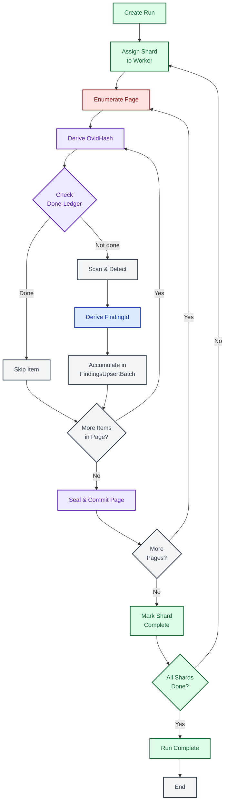
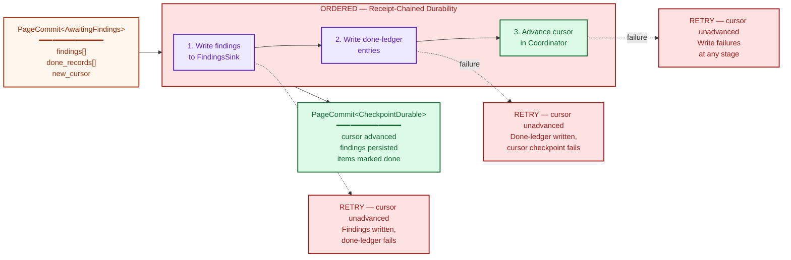

# End-to-End Scan Flow

This document traces a complete scan from run creation through final completion,
showing how all five architectural boundaries compose into a single coherent
pipeline. The scan flow is the central narrative of the system: every identity
derivation, every coordination handshake, every persistence guarantee exists to
serve this pipeline. Understanding these 12 steps—and the invariants that bind
them—is the key to understanding why the system is correct.

---

## 1. Full 12-Step Sequence

The following sequence diagram is the most detailed in the entire documentation
suite. It shows every participant, every message, and every nested loop involved
in processing a single shard of a scan run. The five boundaries appear as
distinct participants, and numbered notes mark each of the 12 steps.

The outer structure is straightforward: create a run, assign shards to workers,
process pages, mark complete. The complexity lives in the inner loops—steps 3
through 10—where enumeration, identity derivation, detection, and the
receipt-chained commit interleave repeatedly for every page of every shard.

Pay particular attention to how Identity (B1) is invoked at the finding level:
once per secret (NormHash, SecretHash), and once per finding (FindingId,
OccurrenceId, ObservationId). The connector derives StableItemId and VersionId
during enumeration (Step 3), and the worker derives OvidHash from these (Step 4)
for the done-ledger check. This layered identity derivation is what makes
deduplication, idempotency, and incremental scanning possible.

```mermaid
%% Diagram: full-12-step-scan-sequence
sequenceDiagram
    autonumber

    participant W as Worker
    participant C as Coordinator (B2)
    participant CN as Connector (B4)
    participant ID as Identity (B1)
    participant P as Persistence (B5)

    note over C: Step 1 — Create Run

    W->>C: create_run(now, tenant, run_id, config)
    activate C
    C->>C: validate config<br/>store manifest<br/>register initial shards
    C-->>W: RunRecord + shard manifest
    deactivate C

    note over W,C: Step 2 — Acquire Shard

    W->>C: acquire_and_restore_into(now, tenant, key, worker, scratch)
    activate C
    C->>C: grant lease on Active shard<br/>increment FenceEpoch
    C-->>W: AcquireResultView { lease, snapshot, capacity }
    deactivate C

    rect rgb(245, 245, 245)
        note over W,P: Steps 3–10 — Page Processing Loop

        loop For each page in shard

            note over W,CN: Step 3 — Enumerate Items

            W->>CN: enumerate_page(shard, cursor, budgets)
            activate CN
            CN-->>W: EnumerationPage(items: Vec&lt;ScanItem&gt;, next_cursor)
            deactivate CN
            Note over W: Each ScanItem carries StableItemId,<br/>VersionId, ItemKey, ItemRef from connector

            loop For each item in page

                note over W,P: Step 4 — Derive OvidHash

                W->>P: derive_ovid_hash(&OvidHashInputs { stable_item_id, version })
                activate P
                P-->>W: OvidHash
                deactivate P

                note over W,P: Step 5 — Check Done-Ledger

                W->>P: batch_get(tenant, policy, &amp;[ovid_hash])
                activate P
                P-->>W: None (not yet scanned)
                deactivate P

                note over W,CN: Step 6 — Read & Detect

                W->>CN: open(item_ref, budgets)
                activate CN
                CN-->>W: Box&lt;dyn Read + Send&gt;
                deactivate CN
                W->>W: scan(content, policy) → findings[]

                loop For each finding

                    note over W,ID: Step 7 — Derive Identities

                    W->>ID: NormHash(normalized_secret)
                    ID-->>W: NormHash
                    W->>ID: SecretHash(keyed, tenant_scope)
                    ID-->>W: SecretHash
                    W->>ID: derive_finding_id(FindingIdInputs)
                    ID-->>W: FindingId
                    W->>ID: derive_occurrence_id(OccurrenceIdInputs)
                    ID-->>W: OccurrenceId
                    W->>ID: derive_observation_id(ObservationIdInputs)
                    ID-->>W: ObservationId

                    note over W: Step 8 — Accumulate

                    W->>W: batch.add(finding, done_record)

                end
            end

            note over W,P: Step 9 — Receipt-Chained Commit

            activate W

            rect rgb(255, 240, 240)
                note over W,P: Typestate-enforced durability ordering<br/>(PageCommit: AwaitingFindings → FindingsDurable → ItemDurable → CheckpointDurable)
                W->>P: upsert_batch(findings) → wait FindingsCommitReceipt
                P-->>W: FindingsCommitReceipt
                W->>P: batch_upsert(done_ledger) → wait DoneLedgerCommitReceipt
                P-->>W: DoneLedgerCommitReceipt
                W->>C: checkpoint(now, cursor, op_id) → wait CheckpointCommitReceipt
                Note over C: Op-log idempotency check + lease<br/>validation run inside checkpoint
                C-->>W: CheckpointCommitReceipt
                Note over W: Assemble PageCommitReceipt<br/>from the three stage receipts
            end

            deactivate W

            note over W: Step 10 — Loop to next page
        end
    end

    note over W,C: Step 11 — Mark Shard Complete

    W->>C: session.complete(now, final_cursor, op_id)
    activate C
    C->>C: op-log idempotency + lease validation<br/>transition Active → Done
    C-->>W: IdempotentOutcome&lt;()&gt;
    deactivate C

    note over C: Step 12 — Check Run Completion

    C->>C: all_shards_complete?
    alt All shards done
        C->>C: mark_run_complete(run_id)
        C->>P: finalize run record
    else Shards remaining
        C->>C: await remaining workers
    end
```

**Reading the diagram.** The outermost flow is linear: create run, acquire
shard, process pages, mark complete. Within the page processing loop (the gray
rectangle), three nested loops execute: one per page, one per item within each
page, and one per finding within each item. The red-tinted rectangle marks the
receipt-chained durability boundary—the single most critical correctness
invariant in the system. The PageCommit typestate enforces the ordering:
findings must be durable before the done-ledger, and the done-ledger must be
durable before the cursor checkpoint.

Note that idempotency checking via the op-log is internal to the checkpoint and
complete calls. Each coordination mutation first checks `check_op_idempotency`
for a duplicate `OpId` before validating the lease. On retry after a crash, the
op-log detects the duplicate OpId and returns `Replayed`, preventing
double-counting of findings.

---

## 2. Simplified Overview Flowchart

The 12-step sequence above is precise but dense. The following flowchart
presents the same flow as a high-level decision graph, making it easier to see
the overall shape: which steps loop, which steps branch, and where each
architectural boundary is responsible.

Each node is colored according to its owning boundary. Green nodes belong to
Coordination (B2), red to the Connector (B4), blue to Identity (B1), purple to
Persistence (B5), and gray to the Worker itself. This coloring reveals a key
property: Persistence is touched at multiple levels of the pipeline (OvidHash
derivation and the commit boundary), while Identity concentrates at finding
derivation.



**Interpreting the colors.** The flow begins and ends in green (Coordination),
passes through red (Connector) for enumeration, purple (Persistence) for
OvidHash derivation and the done-ledger check, blue (Identity) for finding
identity derivation, and purple again for the receipt-chained commit. Gray
nodes represent Worker-local computation. The visual pattern makes clear that
every page cycle touches all five boundaries—this is not a layered architecture
with clean horizontal separation, but a pipeline where boundaries interleave at
every step.

---

## 3. Receipt-Chained Commit Boundary

Step 9—seal and commit—is the correctness linchpin of the entire scan pipeline.
This diagram zooms into the commit boundary to show exactly what must
succeed in order and what happens when any sub-operation fails.

The receipt-chained commit writes three things in strict typestate-enforced
order: findings to the findings sink, entries to the done-ledger, and the
advanced cursor to the coordinator. Each stage must produce a durability receipt
before the next stage can proceed. The `PageCommit<S>` typestate machine
(AwaitingFindings → FindingsDurable → ItemDurable → CheckpointDurable) enforces
this ordering at compile time. If any stage fails, the cursor is not advanced,
so the page will be re-processed on retry.



**Why ordering matters.** Consider the three failure scenarios shown as dashed
paths:

1. **Findings written, done-ledger fails.** On retry, the worker re-scans the
   item because the done-ledger says it has not been processed. The findings
   sink now contains duplicates. Depending on deduplication guarantees
   downstream, this may produce inflated counts or duplicate alerts. The
   typestate prevents the checkpoint from advancing in this case.

2. **Done-ledger written, cursor fails.** Findings **are** already durable
   (the `FindingsDurable` receipt was obtained before `ItemDurable` was
   issued). On retry the done-ledger check correctly skips the
   already-processed item, so the only cost is redundant enumeration — not a
   false negative. The typestate eliminates the silent-loss failure mode
   entirely: `FindingsDurable` must precede `ItemDurable`, making
   "done-ledger written but findings lost" structurally impossible.

3. **All sub-operations fail.** This is actually the safest failure mode. The
   cursor has not advanced, the done-ledger has not been updated, and no
   findings have been written. On retry, the worker re-processes the page from
   the same cursor position, producing identical results.

The typestate-enforced ordering eliminates the dangerous failure mode: a
done-ledger write that is not preceded by durable findings. Partial failures
at any stage (scenarios 1 and 2) leave the cursor unadvanced, so the page is
re-processed on retry — the worst outcome is duplicate findings, never a false
negative. The receipt chain proves durability at each stage before the next
stage proceeds, making out-of-order writes impossible by construction.

**Cursor monotonicity.** The cursor only advances inside the receipt-chained
commit (the checkpoint is the final stage). This guarantees forward-only
progress through the shard. A worker can never "skip ahead" past unprocessed
items, and it can never "fall back" to re-process items that have already been
committed. Combined with the done-ledger, this creates a two-layer idempotency
guarantee: the cursor prevents re-enumeration, and the done-ledger prevents
re-scanning of individual items that might appear in overlapping pages.

---

## How the Boundaries Compose

The 12-step flow reveals how the five architectural boundaries are not isolated
subsystems but tightly choreographed participants in a single pipeline:

- **Coordination (B2)** bookends the flow. It creates the run (step 1), assigns
  shards (step 2), and determines completion (steps 11-12). It also owns the
  cursor that tracks progress within each shard. Acquire and renew responses
  carry a `CapacityHint` (available shard count and earliest lease deadline) so
  workers can make backoff/retry decisions without additional RPCs.

- **Connector (B4)** provides the raw material. Enumeration (step 3) and content
  retrieval (step 6) are the only points where the system touches external data
  sources. The connector abstraction means the scan pipeline is identical
  regardless of whether the source is GitHub, S3, or a local filesystem.
  Connectors also derive `StableItemId` and `VersionId` for each `ScanItem`
  during enumeration, so the worker receives fully-identified items.

- **Identity (B1)** is called at the finding level. NormHash and SecretHash
  (step 7) identify secrets for deduplication. FindingId, OccurrenceId, and
  ObservationId (step 7) identify findings for persistence and correlation.

- **Persistence (B5)** owns the durability guarantees. The `OvidHash`
  derivation (step 4) collapses `(StableItemId, VersionId)` into the
  done-ledger join key, the done-ledger check (step 5) determines whether an
  item needs re-scanning, and the receipt-chained commit (step 9) enforces
  typestate-ordered writes. Every correctness invariant ultimately depends on
  persistence behaving correctly.

- **The Worker** (cross-cutting) orchestrates the entire flow. It is the only
  participant that touches all five boundaries, driving the pipeline forward and
  making local decisions (skip vs. scan, accumulate vs. commit).

**Recovery semantics.** On failure at any point in the pipeline, recovery is
straightforward: the worker resumes from the last committed cursor position.
Items before the cursor have been durably committed through the receipt chain
(findings persisted, done-ledger updated, cursor advanced). Items at or after
the cursor will be re-processed from scratch. The done-ledger provides an
additional safety net: even if an item appears in a re-enumerated page, the
done-ledger check (step 5) will skip it if it was committed in a previous
page's transaction.

---

## Cross-References

| Diagram                | Related Document                                                                                   |
| ---------------------- | -------------------------------------------------------------------------------------------------- |
| Full 12-step sequence  | [ID Derivation DAG](./03-id-derivation-dag.md) — details step 7 finding identity derivation        |
| Full 12-step sequence  | [Shard and Run State Machines](./05-shard-and-run-state-machines.md) — details steps 2, 11, and 12 |
| Simplified overview    | [PageCommit Typestate](./08-pagecommit-typestate.md) — details steps 8, 9                          |
| Receipt-chained commit boundary | [PageCommit Typestate](./08-pagecommit-typestate.md) — the AwaitingFindings-to-CheckpointDurable typestate chain |

## Source Code References

| Component                                                              | Path                                          |
| ---------------------------------------------------------------------- | --------------------------------------------- |
| Identity derivation (StableItemId, FindingId, NormHash)                | `crates/gossip-contracts/src/identity/`       |
| OvidHash derivation (done-ledger join key)                             | `crates/gossip-contracts/src/persistence/ovid.rs` |
| Coordination data types (shard_spec, cursor, pooled, manifest, limits) | `crates/gossip-contracts/src/coordination/`   |
| Coordination protocol (run creation, shard assignment, completion)     | `crates/gossip-coordination/src/`             |
| Persistence (done-ledger, findings sink, op-log)                       | `crates/gossip-contracts/src/persistence/`    |
| Persistence (in-memory backends)                                       | `crates/gossip-persistence-inmemory/`         |
| Coordination (etcd backend)                                            | `crates/gossip-coordination-etcd/`            |
| Design specification                                                   | `08-cross-cutting/02-data-flow-end-to-end.md` |
