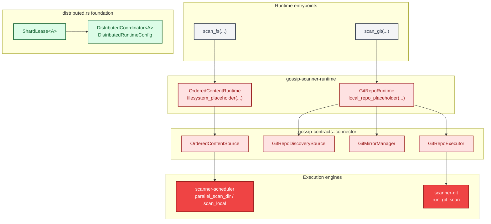
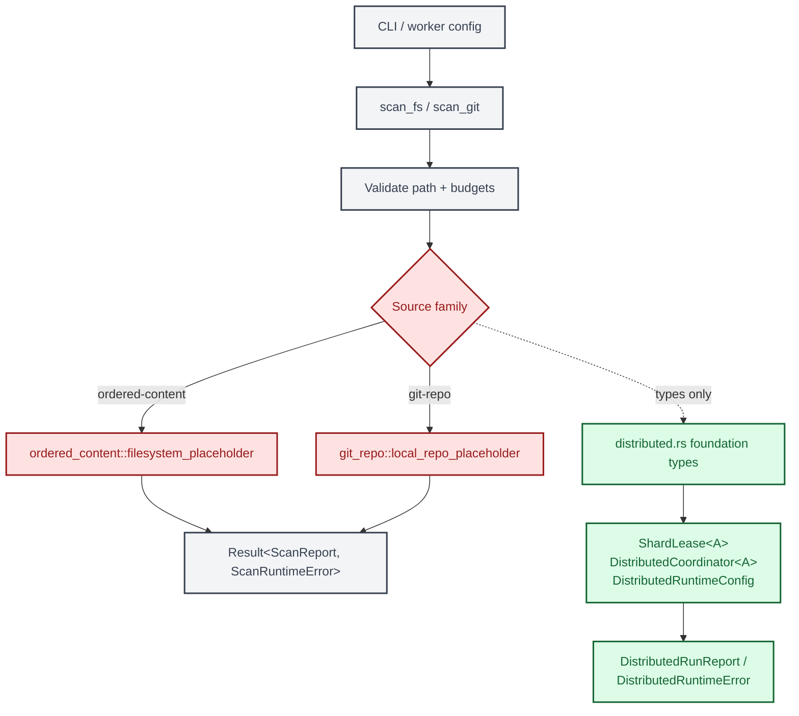

# End-to-End Scan Flow

This document traces the runtime surface that fronts filesystem, Git, and
distributed scan entrypoints. The CLI and worker binaries converge on
`gossip-scanner-runtime`; the runtime validates requests, selects a source
family module, and routes findings through the local event and commit-sink
surfaces.

---

## 1. Dual Entry Points -- CLI, Worker, and Distributed Runtime

The CLI and worker binaries call the same filesystem and Git entrypoints.
The distributed module currently exposes worker-loop foundation types instead
of a callable placeholder entrypoint.

```mermaid
%% Diagram: dual-entry-point-sequence
sequenceDiagram
    autonumber

    participant CLI as scanner-rs-cli
    participant WRK as gossip-worker
    participant RT as gossip-scanner-runtime
    participant OC as ordered_content
    participant GR as git_repo
    participant DRT as distributed

    note over CLI: CLI path
    CLI->>RT: scan_fs(config) / scan_git(config)
    RT->>RT: validate path + budgets
    alt Filesystem request
        RT->>OC: filesystem_placeholder(config, canonical_path)
        OC-->>RT: ScanRuntimeError::Driver(...)
    else Git request
        RT->>GR: local_repo_placeholder(config, canonical_repo)
        GR-->>RT: ScanRuntimeError::Driver(...)
    end
    RT-->>CLI: Result<ScanReport, ScanRuntimeError>

    note over WRK: Worker path
    WRK->>RT: scan_fs(config) / scan_git(config)
    RT->>RT: validate path + budgets
    alt Filesystem request
        RT->>OC: filesystem_placeholder(config, canonical_path)
        OC-->>RT: ScanRuntimeError::Driver(...)
    else Git request
        RT->>GR: local_repo_placeholder(config, canonical_repo)
        GR-->>RT: ScanRuntimeError::Driver(...)
    end
    RT-->>WRK: Result<ScanReport, ScanRuntimeError>

    note over DRT: distributed.rs foundation types
    note over DRT: ShardLease&lt;A&gt;, DistributedCoordinator&lt;A&gt;, DistributedRuntimeConfig
```

**One public boundary.** `ExecutionMode` remains caller-visible, but both
`Direct` and `Connector` modes converge on the same family modules inside the
runtime crate.

**Typed placeholders.** The filesystem and Git family modules report
unimplemented execution through `ScanRuntimeError::Driver(...)` rather than
panicking or relying on `todo!()`. The distributed type layer already carries a
dedicated `DistributedRuntimeError` enum for the upcoming worker loop.

---

## 2. Family Runtime Surface

`gossip-scanner-runtime` expresses scan execution in terms of source families.
The ordered-content family uses `OrderedContentRuntime`; the Git family uses
`GitRepoRuntime`; the distributed module now provides shared worker-loop types
such as `ShardLease<A>` and `DistributedCoordinator<A>`. The filesystem and Git
backend crates remain the engine targets that these family modules are shaped
around.



**Generic hooks.** `OrderedContentRuntime::execute_source`,
`GitRepoRuntime::execute_discovery`, and `GitRepoRuntime::execute_repo` are the
family-shaped generic hooks exported by the runtime crate.

**Concrete implementations stay on the family contracts.**
`FilesystemConnector`, `GitConnector`, and `InMemoryDeterministicConnector`
live in `gossip-connectors` and implement the connector family contracts
defined in `gossip-contracts`.

---

## 3. Findings and Identity Flow

Once a family loop starts producing scan results, findings move through two
parallel channels: `EventOutput` for human-facing output and `CommitSink` for
identity derivation and persistence-oriented bookkeeping.

```mermaid
%% Diagram: findings-identity-flow
sequenceDiagram
    autonumber

    participant LOOP as Family loop
    participant EO as EventOutput
    participant CS as CommitSink
    participant ID as Identity (B1)
    participant REC as CoordinationEventRecorder

    note over LOOP,EO: Channel 1 -- Event stream
    LOOP->>EO: emit_core(Finding { rule, span, ... })
    LOOP->>EO: emit_core(Progress { items, bytes, ... })
    LOOP->>EO: emit_core(Summary { totals })

    note over LOOP,REC: Channel 2 -- Commit lifecycle
    LOOP->>CS: begin_item(item_key, ItemMeta { stable_item_id, version })
    CS->>REC: record_commit_progress(Begin { item_key, size_hint })

    loop For each finding batch in item
        LOOP->>CS: upsert_findings(item_key, FindingsBatch)
        CS->>CS: accumulate FsFindingRecord values
    end

    LOOP->>CS: finish_item(item_key)
    CS->>CS: translate_in_flight(item_key, InFlightItem)
    CS->>CS: translate_item_result(findings, rule_fingerprint_resolver)
    note right of CS: Batch identity derivation (NormHash, FindingId, OccurrenceId)
    CS->>CS: submit QueuedCommit to commit pipeline
    CS->>REC: record_commit_progress(Finish { item_key })
```

**Event output stays source-neutral.** The family loop decides how work is
enumerated and executed, while `EventOutput` receives a stable stream of
runtime events.

**Identity derivation stays local to the runtime.** `ReceiptCommitSink`
rebuilds the translation inputs for `translate_item_result`, which computes
the finding and occurrence identity chain without leaking identity logic into
the family contracts. A rule-fingerprint resolver callback translates
positional `rule_id` values into stable, name-derived `RuleFingerprint`
values, ensuring finding identity is position-independent.

---

## 4. Simplified Overview Flowchart

The following flowchart shows the shape of the current runtime surface.



**Current execution surface.** Filesystem and Git entrypoints validate inputs
first, then hand off to a family module that owns execution semantics. The
distributed module currently contributes the types that the worker loop will
assemble around coordination and durability backends.

---

## Cross-References

| Diagram | Related Document |
| ------- | ---------------- |
| Dual entry points | [Shard and Run State Machines](./05-shard-and-run-state-machines.md) -- shard lifecycle and completion outcomes |
| Family runtime surface | [Connector Architecture](./14-connector-architecture.md) -- family contracts and connector capabilities |
| Findings and identity flow | [ID Derivation DAG](./03-id-derivation-dag.md) -- finding identity derivation chain |
| Simplified overview | [Lease Lifecycle](./07-lease-lifecycle.md) -- distributed lease acquisition and renewal |

## Source Code References

| Component | Path |
| --------- | ---- |
| CLI binary entrypoint | `crates/scanner-rs-cli/src/main.rs` |
| Worker binary entrypoint | `crates/gossip-worker/src/main.rs` |
| Runtime entrypoints and validation | `crates/gossip-scanner-runtime/src/lib.rs` |
| Ordered-content runtime module | `crates/gossip-scanner-runtime/src/ordered_content.rs` |
| Git runtime module | `crates/gossip-scanner-runtime/src/git_repo.rs` |
| Distributed runtime module | `crates/gossip-scanner-runtime/src/distributed.rs` |
| Commit sink trait and bridge record types | `crates/gossip-scanner-runtime/src/commit_sink.rs` |
| Deterministic identity derivation | `crates/gossip-scanner-runtime/src/result_translation.rs` |
| Coordination event recorder types | `crates/gossip-scanner-runtime/src/coordination_sink.rs` |
| Filesystem execution engine | `crates/scanner-scheduler/src/scheduler/parallel_scan.rs`, `crates/scanner-scheduler/src/scheduler/local_fs_owner.rs` |
| Git execution engine | `crates/scanner-git/src/runner.rs` |
| Event sink trait | `crates/scanner-scheduler/src/events.rs` |
