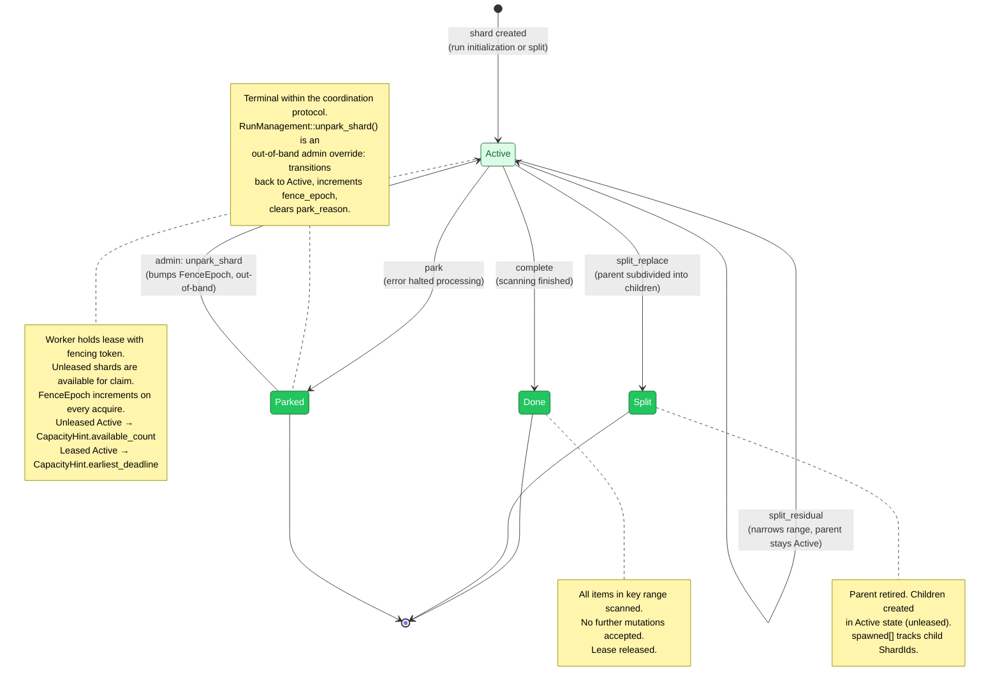
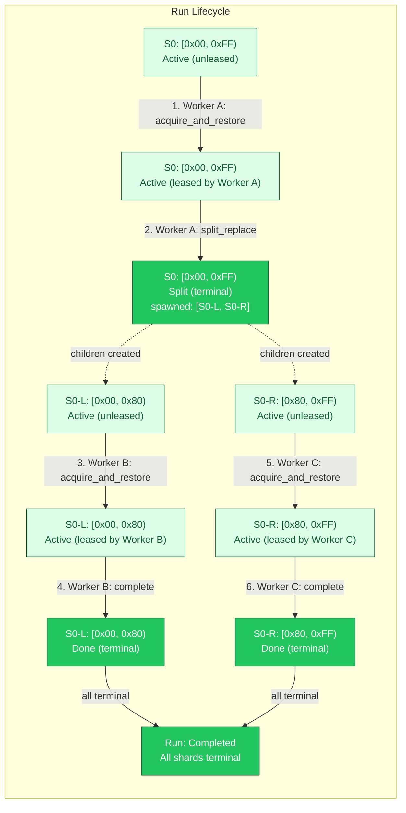
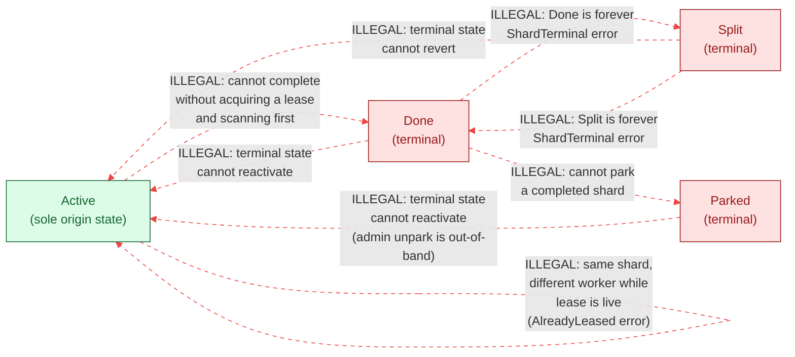

# Shard and Run State Machines

The shard and run state machines form the backbone of the **B2 Coordination** boundary.
Every shard progresses through a well-defined set of states, and every run
aggregates the state of its constituent shards into a top-level lifecycle. These
state machines enforce two critical safety properties: **terminal irreversibility**
(once done, always done) and the **single-writer invariant** (only one worker per
shard at a time). The TLA+ specification formally verifies these properties hold
under all interleavings.

> **Notation.** Solid lines represent valid transitions. Dashed lines represent
> illegal or error transitions. All diagrams use the B2 Coordination color
> palette (green theme: fill `#22C55E`, light fill `#DCFCE7`, stroke `#166534`).

---

## 1. Shard State Machine

A shard has exactly four lifecycle states. New shards begin in the `Active` state
(unleased, available for claim). From `Active`, a shard may reach one of three
terminal states: `Done`, `Split`, or `Parked`. Terminal states are irreversible
within the coordination protocol -- no operation can bring a shard back from any
terminal state. This is enforced by `ShardRecord::assert_transition_legal()`,
which panics if any code attempts to leave a terminal state.

The distinction between "unleased Active" and "leased Active" is not a state
machine transition -- it is an ownership change within the `Active` state,
managed by the fencing token protocol (lease + `FenceEpoch`).

Key observations from the source code:

- **`ShardStatus` is a `#[repr(u8)]` enum** with discriminants `Active=0`, `Done=1`, `Split=2`, `Parked=3`. These values are persisted and must never change.
- **`is_terminal()`** returns `true` for `Done`, `Split`, and `Parked`. Terminal shards also release their lease (`lease = None`) as enforced by INV-S30 (`is_terminal()` implies `lease.is_none()`).
- **`assert_transition_legal()`** panics on any attempt to leave a terminal state. This is the crash-to-prevent-corruption strategy from Tiger Style.
- **`split_residual`** is a non-terminal split that keeps the parent `Active`. It narrows the parent's key range (an `Active -> Active` self-transition) rather than retiring the parent to `Split`. This contrasts with `split_replace`, which terminates the parent.

**`ParkReason` variants** (from `record.rs`):

| Variant            | Discriminant | Meaning                                                             |
| ------------------ | ------------ | ------------------------------------------------------------------- |
| `PermissionDenied` | 0            | Source denied access -- credential rotation or access grant needed  |
| `NotFound`         | 1            | Source no longer exists (deleted repo, removed file)                |
| `Poisoned`         | 2            | Shard data internally inconsistent -- manual investigation required |
| `TooManyErrors`    | 3            | Circuit breaker tripped -- may resolve on its own                   |
| `Other`            | 4            | Catch-all for uncategorized reasons                                 |

---

## 2. Run State Machine

A run aggregates multiple shards into a single scan job. Its lifecycle is derived
from the collective state of its shards. The run progresses from `Initializing`
(manifest validated, initial shards materialized) through `Active` (workers
processing shards) to either `Done` (all shards settled with zero parked
shards), `Failed` (timeout, unrecoverable error, or a settled run that still
contains parked shards), or `Cancelled` (explicitly cancelled before
completion). Run completion requires recursive terminal checks: if a shard was
split, all its descendant shards must also be terminal.

```mermaid
%% Diagram: run-state-machine
stateDiagram-v2
    direction TB

    [*] --> Initializing : create_run<br/>(validate manifest, materialize shards)

    Initializing --> Active : register_shards<br/>(shard registration activates run)
    Initializing --> Cancelled : cancelled before any work starts
    Active --> Active : shard operations<br/>(checkpoint, split, complete, park)
    Active --> Done : all shards settled<br/>(Done or Split; no Parked shards)
    Active --> Failed : timeout, unrecoverable error,<br/>or settled run with Parked shards
    Active --> Cancelled : explicitly cancelled

    Done --> [*]
    Failed --> [*]
    Cancelled --> [*]

    note right of Initializing
        Manifest validated.
        Initial shards materialized in
        Active state (unleased).
        No workers assigned yet.
    end note

    note right of Active
        Workers acquiring and processing shards.
        Shards advance through checkpoints,
        splits, completions, and parks.
    end note

    note right of Done
        All shards settled with zero parked shards.
        Run succeeded. Results available
        for downstream consumers.
    end note

    note left of Failed
        Run aborted or settled with failures.
        Workers must stop processing.
        Parked shards force failure unless
        they are explicitly unparked first.
    end note

    note left of Cancelled
        Run cancelled by external request.
        In-flight work abandoned.
    end note

    classDef initState fill:#DCFCE7,stroke:#166534,color:#166534
    classDef activeState fill:#DCFCE7,stroke:#166534,color:#166534
    classDef terminalState fill:#22C55E,stroke:#166534,color:#FFFFFF

    class Initializing initState
    class Active activeState
    class Done,Failed,Cancelled terminalState
```

The run state machine is intentionally coarser than the shard state machine.
Individual shard transitions do not appear as run transitions -- the run merely
observes whether "all shards are terminal" to decide completion. The
`Cancelled` state allows external cancellation from either `Initializing`
(before any work begins) or `Active` (abandoning in-flight work). This
decoupling means the coordinator can add new shard operations (like
`split_residual`) without modifying the run lifecycle logic.

---

## 3. Shard Lifecycle with Splits

To understand how the state machine works in practice, consider a concrete
example. A run starts with a single shard `S0` covering the full key range
`[0x00, 0xFF)`. Worker A claims it, scans partway, then decides the range is
too large and performs a `split_replace`. This retires `S0` (terminal `Split`
state) and creates two children. Other workers claim and complete the children,
and the run finishes.

Important details from the implementation:

- **Child shard IDs are deterministic.** `derive_split_shard_id()` hashes `(run, parent, op_id, kind, index)` with domain-separated BLAKE3 and sets bit 63 to mark derived IDs. This means retried `split_replace` operations produce the same child IDs.
- **Children inherit cursor semantics** from the parent but start with their own initial cursor (possibly pre-positioned based on the parent's last checkpoint within that sub-range).
- **Run completion is recursive.** For `S0` to count as "terminal" for run-completion purposes, `S0` itself must be `Split` AND both `S0-L` and `S0-R` must be terminal (`Done`, `Split`, or `Parked`). If `S0-R` were further split, its children would need to be terminal too.

---

## 4. Shard Transition Matrix

The following table enumerates every possible from/to pair in the shard state
machine and indicates whether the transition is valid. Only transitions FROM
`Active` are permitted. Terminal states reject all outgoing transitions via
`assert_transition_legal()`.

| From \ To  | Active           | Done       | Split           | Parked  |
| :--------- | :--------------- | :--------- | :-------------- | :------ |
| **Active** | ownership change | `complete` | `split_replace` | `park`  |
| **Done**   | ILLEGAL          | --         | ILLEGAL         | ILLEGAL |
| **Split**  | ILLEGAL          | ILLEGAL    | --              | ILLEGAL |
| **Parked** | admin unpark*    | ILLEGAL    | ILLEGAL         | --      |

\* Unparking (`Parked` -> `Active`) is an **out-of-band admin operation** that
bumps the fence epoch. It is not part of the coordination protocol's
`CoordinationBackend` trait and is deliberately excluded from the state machine's
formal transitions. The `OpKind::Unpark` variant exists in the op-log to track
this admin action.

The "ownership change" within `Active` (acquire/release/lease expiry) does not
change `ShardStatus` -- it only changes the lease holder and increments
`FenceEpoch`. This is why `Active -> Active` is listed as a dash rather than a
transition: the status does not change.

`count_available_for_run()` computes `CapacityHint` by scanning only `Active`
shards in the run. Terminal shards (`Done`, `Split`, `Parked`) are skipped
entirely -- they cannot be acquired and do not hold leases, so they contribute
nothing to capacity or deadline calculations.

---

## 5. Illegal Transitions

The following diagram highlights specifically the transitions that the
coordination backend MUST reject. Each illegal path is annotated with the reason
it is forbidden. The backend enforces these as precondition checks that return
typed errors, not panics -- except for `assert_transition_legal()` which panics
as a last line of defense against internal bugs.

Each illegal transition maps to a specific error type in the codebase:

| Illegal Transition                                | Error Returned                                | Why Forbidden                                                                  |
| :------------------------------------------------ | :-------------------------------------------- | :----------------------------------------------------------------------------- |
| `Done -> Active`                                  | `AcquireError::ShardTerminal`                 | Terminal states are irreversible. `is_terminal()` returns `true`.              |
| `Split -> Active`                                 | `AcquireError::ShardTerminal`                 | Same as above. Split shards have spawned children.                             |
| `Parked -> Active`                                | `AcquireError::ShardTerminal`                 | Same. Admin unpark is separate from the protocol.                              |
| `Done -> Split`                                   | `SplitReplaceError::ShardTerminal`            | Cannot split a completed shard. No status to transition from.                  |
| `Split -> Done`                                   | `CompleteError::ShardTerminal`                | Cannot complete an already-split shard.                                        |
| `Done -> Parked`                                  | `ParkError::ShardTerminal`                    | Cannot park a completed shard. It is already terminal.                         |
| `Active -> Active` (different worker, live lease) | `AcquireError::AlreadyLeased`                 | Single-writer invariant. Only one lease per shard at a time.                   |
| `Active -> Done` (without lease)                  | `CompleteError::StaleFence` or `LeaseExpired` | Must hold a valid lease to mutate. The fencing token protocol rejects zombies. |

The backend's enforcement strategy is layered:

1. **Typed errors** (`ShardTerminal`, `AlreadyLeased`, `StaleFence`) are returned for expected protocol violations -- clients handle these gracefully.
2. **`assert_transition_legal()`** panics for internal bugs -- if the coordinator's own code attempts an illegal transition, the process crashes before persisting corrupt state.
3. **INV-S30 (`is_terminal() implies lease.is_none()`)** is checked by `assert_invariants()` after every state transition, catching lease leaks on terminal shards.

---

## Cross-References

- [ID Derivation DAG](./03-id-derivation-dag.md) -- `FenceEpoch`, `ShardId`, `OpId` used in state transitions
- [Lease Lifecycle](./07-lease-lifecycle.md) -- lease acquisition, renewal, and idempotency mechanics
- [Split Operations](./12-split-operations.md) -- `split_replace` and `split_residual` plan validation
- [Fencing Protocol](./06-fencing-protocol.md) -- the 5-check validation preamble that enforces these state machines

## Source Code References

| File                                       | Purpose                                                                                      |
| :----------------------------------------- | :------------------------------------------------------------------------------------------- |
| `crates/gossip-coordination/src/record.rs` | `ShardStatus` enum, `ShardRecord` struct, `assert_transition_legal()`, `assert_invariants()` |
| `crates/gossip-coordination/src/traits.rs` | `CoordinationBackend` trait defining all shard operations                                    |
| `crates/gossip-coordination/src/error.rs`  | `CoordError`, `AcquireError`, `CompleteError`, `SplitError`, `ParkError`                     |
| `crates/gossip-coordination/src/lease.rs`  | `Lease`, `LeaseHolder`, `OpLogEntry`, `OpKind`                                               |
| `crates/gossip-contracts/src/coordination/split.rs`  | `SplitReplacePlan`, `SplitResidualPlan`                                              |
| `crates/gossip-coordination/src/split_execution.rs`  | `derive_split_shard_id()` and split execution logic                                  |
