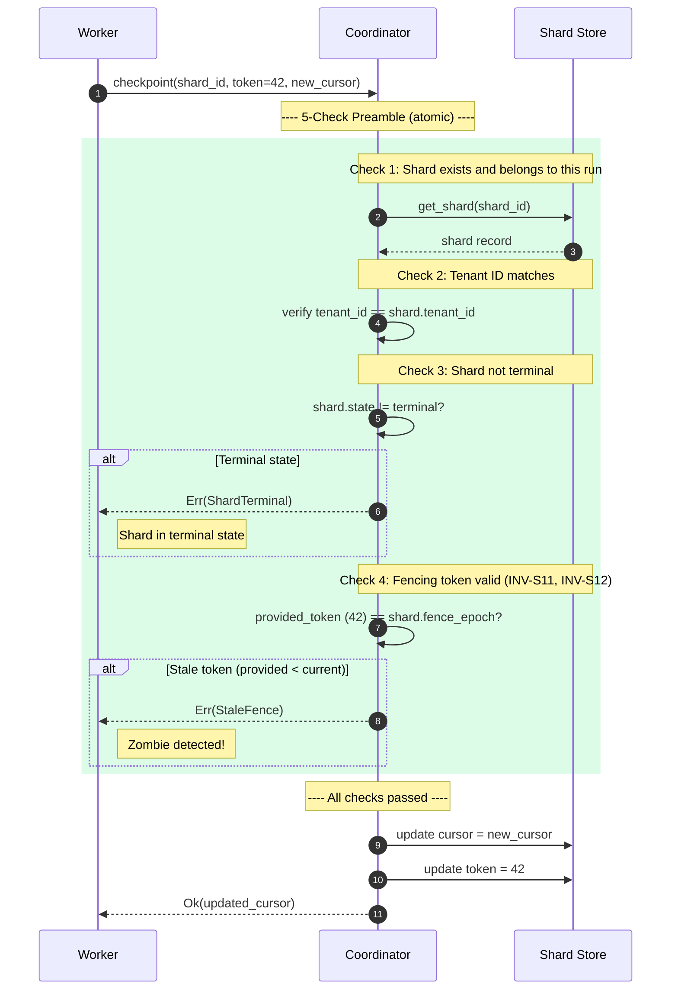
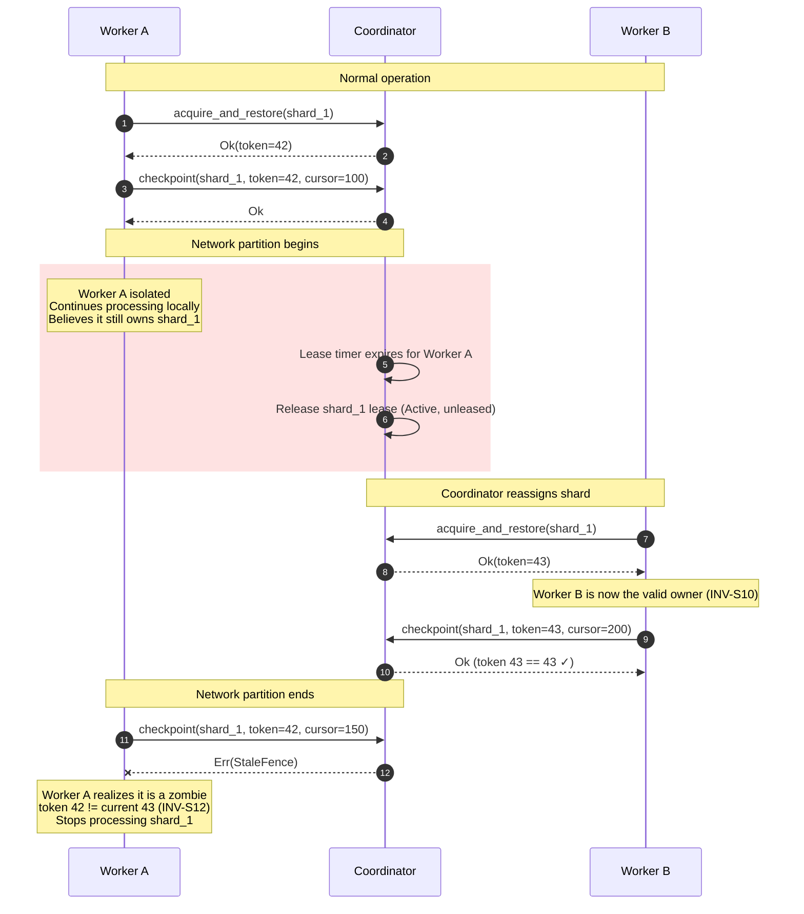
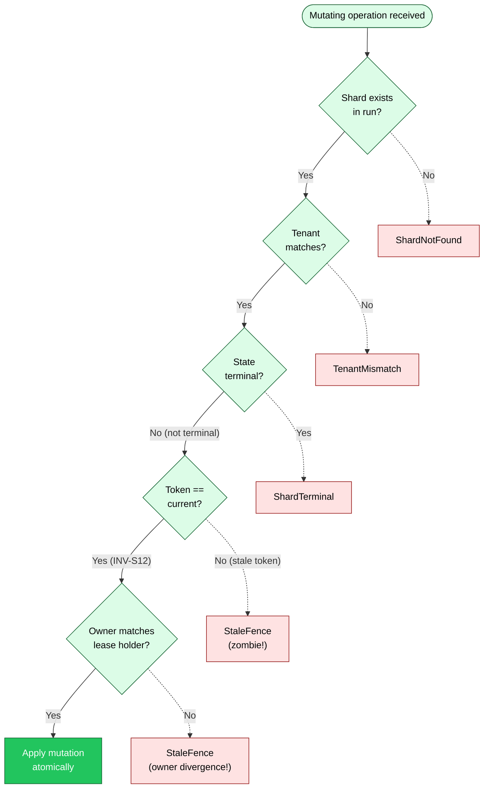

# Fencing Protocol

The fencing protocol is the heart of distributed coordination in Gossip-rs. In any
system where multiple workers compete for ownership of shards, the fundamental danger
is the **zombie worker**: a process that believes it still owns a shard after its lease
has expired and ownership has transferred to someone else. Without protection, a zombie
can silently corrupt state by advancing cursors, completing work, or modifying data that
now belongs to another worker.

Gossip-rs eliminates this class of bug through a **5-check validation preamble** that
gates every mutating operation on a shard. The protocol enforces five properties
atomically:

1. **Tenant isolation** -- the caller's tenant matches the shard's tenant (TenantMismatch).
2. **Terminal status** -- the shard is not in a terminal state (ShardTerminal).
3. **Fence epoch** -- the caller's fencing token matches the current epoch (StaleFence).
4. **Lease expiry** -- the lease has not expired at `now` (LeaseExpired).
5. **Owner divergence** -- the lease's owner matches the record's current lease holder (StaleFence).

Together, these checks guarantee that **at most one valid lease exists per shard at any
point in time** (INV-S10). A zombie worker's token will always be less than the current
token, so its mutations are rejected before they can cause harm.

> **Notation.** Solid lines represent valid/success paths. Dashed lines represent
> error paths or rejected operations. All diagrams use the B2 Coordination color
> palette (green theme: fill `#22C55E`, light fill `#DCFCE7`, stroke `#166534`).

---

## Diagram 1: 5-Check Validation Flow

Every mutating operation -- `checkpoint`, `complete`, `split_replace`, and
others -- passes through the same five checks before the coordinator will apply the
mutation. The checks execute atomically: either all five pass and the mutation is
applied, or the first failing check returns an error and nothing changes.

The sequence below traces a concrete `checkpoint` call. Worker submits the call
with its fencing token (42). The coordinator looks up the shard, verifies tenant
ownership, checks that the shard is not in a terminal state, compares the token
against the current value, and finally applies the update.

The two `alt` blocks represent the error exits. In practice, if Check 1 fails (shard
not found), the coordinator returns `ShardNotFound` before reaching Check 2. The
diagram collapses Checks 1 and 2 into the success path for clarity, and omits lease
expiry and owner divergence checks for brevity (these are shown in Diagram 4 and the
[Validation Check Ordering](#validation-check-ordering) table). All checks are
evaluated in strict order. Failure at any step short-circuits the remaining checks.

---

## Diagram 2: Zombie Worker Resolution

This is the canonical scenario that motivates fencing tokens. Worker A holds a shard,
experiences a network partition, and continues processing locally -- unaware that its
lease has expired. Meanwhile, the coordinator reassigns the shard to Worker B with a
higher fencing token. When Worker A eventually reconnects and attempts to write, the
stale token is rejected instantly.

The key insight is that **Worker A does not need to know it is a zombie**. The fencing
protocol tells it. There is no distributed consensus, no heartbeat protocol, no gossip
protocol needed for this specific guarantee -- just a monotonically increasing integer
(INV-S11) and a simple comparison (INV-S12).

The critical moment is step 8: Worker A's `checkpoint` with token 42 is rejected
because the current token is now 43. The fencing check `42 == 43` evaluates to false,
producing `StaleFence`. Worker A now knows it is stale and must stop all work on
that shard. No data corruption occurs. No conflicting writes reach the shard store.

Worker B's write in step 7 succeeds because `43 == 43` is true -- the token matches
the shard's current fence epoch exactly. The protocol requires strict equality: only
the holder of the exact current token can mutate the shard.

---

## Diagram 3: Token Timeline

Fencing tokens are monotonically increasing per shard (INV-S11). They increment on
**new lease acquisition only**, not on lease renewal. This is an important distinction:
a worker that renews its lease retains the same token, because no ownership transfer
occurred. The token only advances when a different worker (or the same worker after
a gap) acquires a fresh lease.

The timeline below traces a single shard through its lifecycle, showing when the token
changes and when it stays constant.

```mermaid
%% Diagram: token-timeline
graph LR
    T0["T=0<br/>Shard created<br/><b>token=1</b>"]
    T1["T=1<br/>Worker A claims<br/><b>token=2</b>"]
    T5["T=5<br/>Worker A renews<br/><b>token=2</b><br/>(no change)"]
    T10["T=10<br/>Lease expires<br/>Shard lease released<br/><b>token=2</b>"]
    T11["T=11<br/>Worker B claims<br/><b>token=3</b>"]
    T15["T=15<br/>Worker B advances cursor<br/><b>token=3</b><br/>(no change)"]
    T20["T=20<br/>Worker B completes<br/><b>token=3</b><br/>(final)"]

    T0 -->|"token stays 1"| T1
    T1 -->|"+1 on claim"| T5
    T5 -->|"renewal: no increment"| T10
    T10 -->|"idle gap"| T11
    T11 -->|"+1 on claim"| T15
    T15 -->|"cursor op: no increment"| T20

    style T0 fill:#DCFCE7,stroke:#166534,color:#000
    style T1 fill:#22C55E,stroke:#166534,color:#FFF
    style T5 fill:#22C55E,stroke:#166534,color:#FFF
    style T10 fill:#F3F4F6,stroke:#374151,color:#000
    style T11 fill:#22C55E,stroke:#166534,color:#FFF
    style T15 fill:#22C55E,stroke:#166534,color:#FFF
    style T20 fill:#22C55E,stroke:#166534,color:#FFF
```

Observations:

- **T=0 to T=1**: The shard is created with `FenceEpoch::INITIAL` (token=1). Worker A
  claims the shard, advancing the token to 2. This is the first ownership transfer.
- **T=1 to T=5**: Worker A renews its lease at T=5. The token remains 2 because the
  same worker is continuing its lease -- no ownership changed hands.
- **T=5 to T=10**: The lease expires. The shard's lease is released (it remains
  Active but unleased), and the token remains 2. Tokens are never reset or decremented.
- **T=10 to T=11**: Worker B claims the now-unleased shard. The token advances to 3. Any
  subsequent attempt by Worker A with token=2 will fail the fencing check.
- **T=11 to T=20**: Worker B operates on the shard, advancing the cursor and eventually
  completing it. The token remains 3 throughout because no ownership transfer occurs.

The monotonic property (INV-S11) is critical: because tokens never decrease, a stale
token is stale forever. There is no window of ambiguity where an old token could become
valid again.

---

## Diagram 4: Decision Tree

The decision tree below shows the complete branching logic for any mutating operation.
Every path terminates in either a specific error variant or successful application of
the mutation. The green path traces the happy case; the dashed red paths show error
exits with their corresponding error types.

The five checks correspond to five distinct categories of safety:

| Check | Category | Error Variant | What It Prevents |
|-------|----------|---------------|------------------|
| 1 | Identity | `ShardNotFound` | Operating on a shard that does not exist or belongs to a different run |
| 2 | Tenant isolation | `TenantMismatch` | Cross-tenant data access in multi-tenant deployments |
| 3 | State validity | `ShardTerminal` | Mutations on shards in a terminal state (e.g., advancing cursor on a completed shard) |
| 4 | Temporal ordering | `StaleFence` | Zombie workers writing to shards they no longer own (INV-S11, INV-S12) |
| 5 | Owner identity | `StaleFence` | Identity mismatches when fence epochs agree (catches logic errors in lease-handoff) |

The ordering is deliberate. Identity is checked first because there is no point
validating a token for a shard that does not exist. Tenant isolation comes next because
a tenant mismatch is a security boundary violation that should be caught before any
business logic. Terminal status is third for fast rejection of dead shards before
more expensive checks. The fencing token check is fourth because it is the most common
failure mode in practice (zombie workers). Owner identity is last because it catches
edge cases where fence epochs agree but lease holders diverge.

---

## Validation Check Ordering

The `validate_lease` function in `validation.rs` checks in strict priority order.
This ordering is a security invariant: tenant check first prevents cross-tenant
enumeration via error messages.

| Check | Order | Error Variant | Rationale |
|-------|-------|---------------|-----------|
| (0) ShardNotFound | Before validate_lease | `ShardNotFound` | Shard lookup precedes all validation |
| (1) Tenant isolation | 1st in validate_lease | `TenantMismatch` | Security-first; never leak cross-tenant info |
| (2) Terminal status | 2nd | `ShardTerminal` | Fast rejection of dead shards |
| (3) Fence epoch | 3rd | `StaleFence` | Zombie fencing |
| (4) Lease expiry | 4th | `LeaseExpired` | Time-based rejection |
| (5) Owner divergence | 5th | `StaleFence` | Catches identity mismatches when fence epochs agree |

Additionally, `check_op_idempotency` runs BEFORE `validate_lease` on idempotent
operations (checkpoint, complete, park, split_replace, split_residual). This ensures
successful replays are never blocked by an expired lease or terminal status.

---

## Invariant Summary

The fencing protocol enforces three invariants that together guarantee safe distributed
shard coordination:

- **INV-S10**: At most one valid lease per shard at any time. When a new lease is
  granted, any previous lease is implicitly revoked by the token increment.
- **INV-S11**: Fencing tokens are monotonically increasing. They never decrease or
  reset. This ensures that any comparison between an old token and the current token
  will always correctly identify the old token as stale.
- **INV-S12**: Stale tokens are rejected immediately. There is no grace period, no
  retry window, no eventual consistency. A stale token means the caller is not the
  owner, full stop.

---

## Cross-References

- [Shard and Run State Machines](05-shard-and-run-state-machines.md) -- the state
  transitions that Check 3 (terminal status) validates against
- [Lease Lifecycle](07-lease-lifecycle.md) -- how leases are granted, renewed, and
  expired, feeding into the fencing token lifecycle
- [Boundary Dependency Graph](02-boundary-dependency-graph.md) -- the broader
  coordination boundary (B2) that houses the fencing protocol
- [Split Operations](12-split-operations.md) -- split operations that also pass
  through the 5-check preamble

## Source Code References

- **Deep dive document**: `04-boundary-2-coordination/03-fencing-protocol-deep-dive.md`
- **Coordination data types**: `crates/gossip-contracts/src/coordination/` (shard_spec, cursor, pooled, manifest, limits)
- **Coordination protocol**: `crates/gossip-coordination/src/`
- **Fencing validation logic**: `crates/gossip-coordination/src/validation.rs`
- **Shard operations**: `crates/gossip-coordination/src/in_memory.rs` and `crates/gossip-coordination/src/traits.rs`
