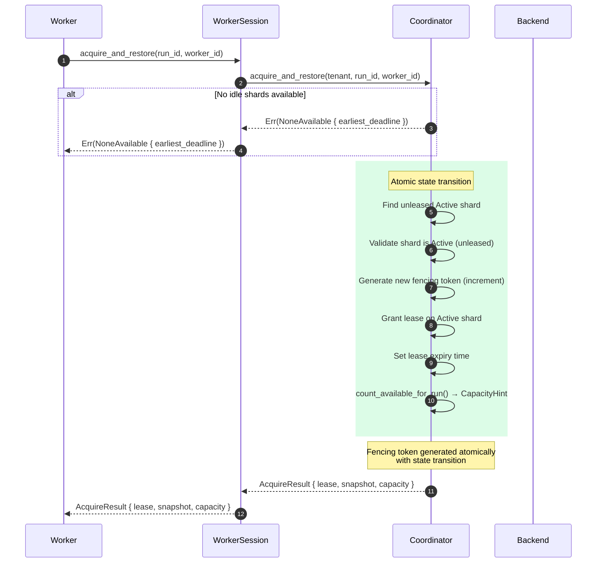
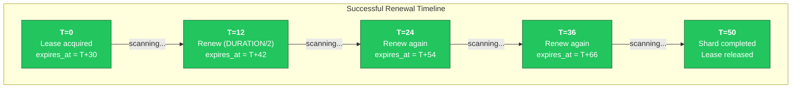
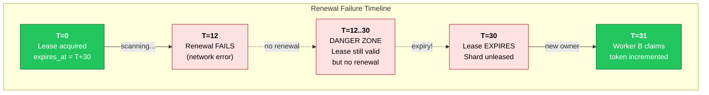
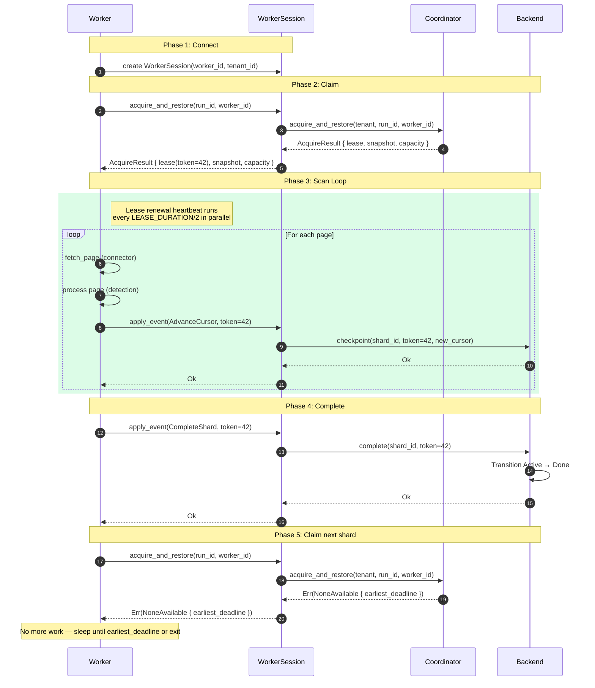
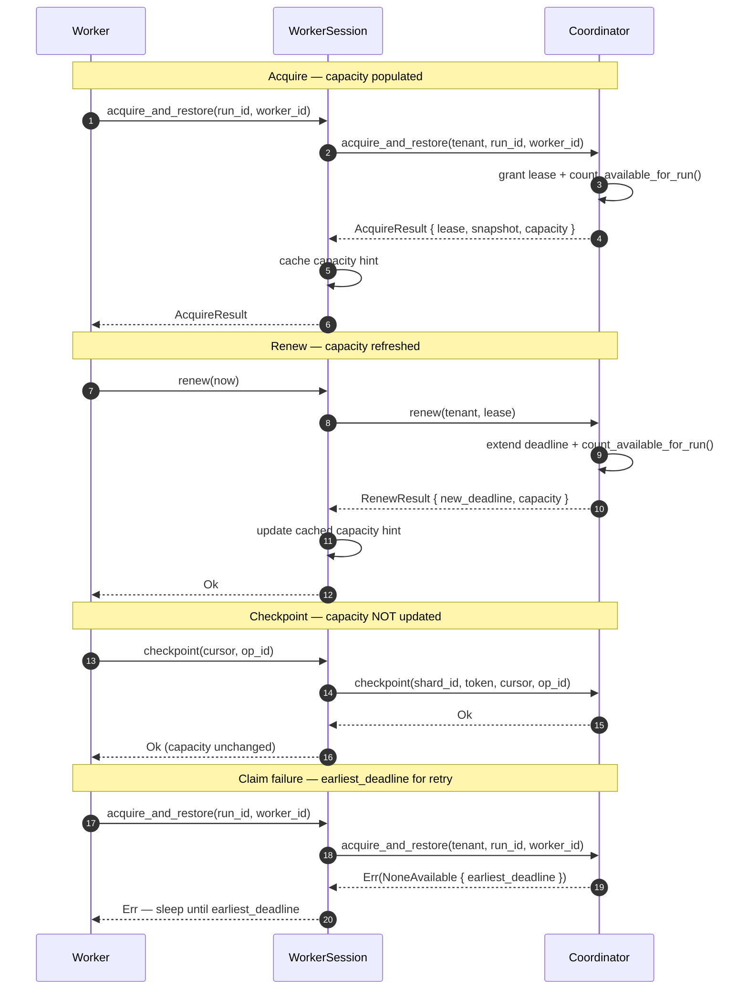
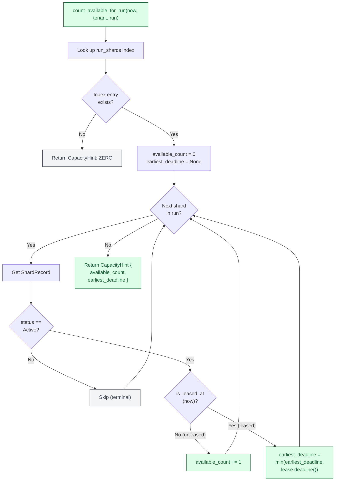

# Lease Lifecycle

Leases are time-bounded exclusive access tokens that grant a single worker the
right to process a shard. They are the mechanism by which the coordination
boundary (B2) enforces the single-writer invariant: at most one worker may hold
an active lease on a given shard at any point in time. Without leases, multiple
workers could claim the same shard simultaneously, leading to duplicate
processing, cursor conflicts, and corrupted state.

The lease protocol is deliberately simple. A worker acquires a lease (receiving
a fencing token and an expiry time), renews it periodically before expiry, and
either completes the shard or loses the lease to expiry. There are no complex
negotiation rounds, no distributed consensus, and no lease transfer mechanism.
If a worker fails to renew, the shard silently returns to the idle pool and
another worker picks it up. The fencing token (covered in detail in
[06-fencing-protocol.md](06-fencing-protocol.md)) prevents the stale worker
from corrupting state after the handoff.

This document traces the lease through its full lifecycle: acquisition, renewal,
expiry, and the cursor monotonicity guarantee that prevents backward progress
within a leased shard.

---

## Diagram 1: Lease Acquisition Sequence

The acquisition sequence shows the full handshake between a worker, its session
object, the coordinator, and the coordination backend. The worker does not
interact with the backend directly -- it goes through `WorkerSession`, which
encapsulates the worker's identity (worker ID, tenant ID) and translates
high-level scan operations into coordination protocol calls.

The critical moment is steps 5 through 8 at the backend. The shard state
transition from unleased `Active` to leased `Active`, the fencing token generation, and the lease
expiry assignment all happen atomically. If any of these steps were to occur
independently, a race condition could allow two workers to both believe they own
the same shard.

The `AcquireResult` returned to the worker contains everything it needs to begin
scanning: the shard's key range (what to scan), the cursor position (where to
resume if this is a re-acquisition after expiry), the fencing token (to
authenticate all subsequent mutations), the expiry time (when to renew by), and
a `CapacityHint` reflecting how many shards remain available in the run after
this acquisition (see [Diagram 5](#diagram-5-credit-based-capacity-piggybacking)
for the piggybacking design).

Note that the fencing token is not a random value -- it is a monotonically
increasing counter incremented on each new lease acquisition (INV-S11). This
means a worker that held a previous lease on the same shard will always have a
strictly lower token than the current holder, making zombie detection trivial.

**WorkerSession ownership model.** `WorkerSession` wraps the coordination backend
with move and borrow semantics that enforce the shard lifecycle at compile time:

- **Terminal ops** (`complete`, `park`, `split_replace`) consume `self` — the session
  cannot be used after a terminal transition (compile-time enforcement).
- **Non-terminal ops** (`checkpoint`, `renew`, `split_residual`) take `&mut self` —
  the session remains usable after these operations. `renew` additionally updates
  the cached `CapacityHint` from the `RenewResult`.
- **Accessors** (`lease`, `cursor`, `spec`, `capacity`) take `&self` — read-only
  access to cached state. `capacity()` returns the `CapacityHint` from the last
  acquire or renew. `checkpoint` and `split_residual` do not refresh the
  cached hint; terminal operations (`complete`, `park`, `split_replace`)
  consume the session, so there is no cache to update.
- **No Drop implementation** — if a session is dropped without a terminal op, the
  lease simply expires at its deadline, and the shard becomes available for re-acquisition.

---

## Diagram 2: Lease Renewal Timeline

Workers must renew their leases proactively. The renewal strategy is simple:
renew at `LEASE_DURATION / 2`, giving a full half-duration of safety margin
before the lease actually expires. This is a heartbeat pattern -- the worker
does not wait until the last moment to renew, because network latency or a
brief GC pause could push the renewal past the expiry deadline.

The first timeline below shows the happy path: a worker acquires a lease,
renews it three times as it processes pages, and completes the shard before
the lease matters. The second timeline shows what happens when a renewal fails
-- the lease expires, the shard returns to the idle pool, and another worker
claims it with a higher fencing token.

The danger zone between T=12 and T=30 is where the system is most vulnerable.
The original worker's lease is still technically valid, but it has no guarantee
of renewal. If the worker is aware that renewal failed, it should stop
processing immediately -- continuing to scan would be wasted work at best, and
could lead to fencing errors when it tries to commit results after the lease
has expired and been reassigned. If the session is dropped without a terminal
op, the shard's lease simply expires at its deadline, making it available for
re-acquisition.

Key timing properties:

| Parameter | Value | Purpose |
|:----------|:------|:--------|
| `LEASE_DURATION` | Configurable (e.g., 30s) | Total time before lease expires |
| Renewal interval | `LEASE_DURATION / 2` | Proactive heartbeat frequency |
| Safety margin | `LEASE_DURATION / 2` | Time buffer if one renewal fails |
| Expiry action | Shard lease released (Active, unleased) | Enables reallocation to another worker |

> **Note:** Lease renewal is explicit and synchronous via `WorkerSession::renew(&mut self, now)`.
> There is no automatic background heartbeat — the worker must actively call `renew` before
> the deadline. The "every LEASE_DURATION/2" strategy shown above is an application-level
> pattern, not a built-in protocol feature. Timing values (lease duration, renewal interval)
> are configurable via `RunConfig` — the values shown are test defaults.

---

## Diagram 3: Full Worker Session Lifecycle

The complete worker session lifecycle shows how a single worker progresses from
connection through shard processing to exit. This is the end-to-end view that
ties together lease acquisition, the scan loop, lease renewal, cursor
advancement, and shard completion.

The scan loop is the inner core: for each page of results, the worker fetches
data from the connector, processes it through the detection engine, and commits
the results by calling `apply_event(AdvanceCursor)` with its fencing token. The
backend validates the token on every call -- this is the 5-check preamble from
[06-fencing-protocol.md](06-fencing-protocol.md) executing on every single
cursor advancement.

Lease renewal runs in parallel with the scan loop. It is not part of the
sequential scan logic -- it is a background heartbeat that fires every
`LEASE_DURATION / 2` regardless of where the scan loop is in its processing.
This separation ensures that a slow page fetch or a large detection pass does
not delay the renewal heartbeat.

The lifecycle has a clean five-phase structure:

1. **Connect.** The worker creates a `WorkerSession` binding its identity
   (worker ID and tenant ID) for all subsequent operations. No coordination
   state is allocated yet.
2. **Claim.** The session calls `acquire_and_restore` to find and claim an idle shard.
   If successful, the worker receives an `AcquireResult` containing the lease (with fencing
   token, key range, cursor position, and expiry time), a snapshot, and a `CapacityHint`.
3. **Scan.** The worker iterates through pages, advancing the cursor after each
   one. Every cursor advancement is fenced -- a stale token halts the worker
   immediately. The lease renewal heartbeat runs concurrently.
4. **Complete.** After scanning all pages, the worker marks the shard as
   completed. This is a terminal transition (the shard can never return to
   `Active`). The lease is released.
5. **Next or exit.** The worker attempts to claim another shard. If none are
   available, the claim returns `NoneAvailable { earliest_deadline }`. The worker
   can sleep until `earliest_deadline` (the soonest lease expiry in the run) to
   avoid busy-spinning, or exit gracefully if no active leases remain.

The `WorkerSession` pattern ensures that if any phase fails unexpectedly (panic,
network error, process crash), the shard's lease expires at its deadline and
becomes available for re-acquisition by another worker. There is no `Drop`
impl — lease expiry is the recovery mechanism.

---

## Diagram 4: Cursor Monotonicity

Within a leased shard, the cursor tracks forward progress through the key range.
The cursor has a non-strict monotonicity invariant: it can only move forward or
stay in place (for idempotent retries), never backward. This prevents duplicate
processing (rescanning already-processed keys) while allowing safe retries when
acknowledgements are lost.

```mermaid
%% Diagram: cursor-monotonicity
graph LR
    START["<b>Shard Start</b><br/>cursor = None<br/>(range start: 0x00)"]
    C1["<b>Page 1</b><br/>cursor = Some(0x10)"]
    C2["<b>Page 2</b><br/>cursor = Some(0x20)"]
    C3["<b>Page 3</b><br/>cursor = Some(0x30)"]
    C4["<b>Page 4</b><br/>cursor = Some(0x40)"]
    END["<b>Shard End</b><br/>cursor = END<br/>Shard completed"]

    START -->|"None → Some(0x10)"| C1
    C1 -->|"0x10 → 0x20"| C2
    C2 -->|"0x20 → 0x30"| C3
    C3 -->|"0x30 → 0x40"| C4
    C4 -->|"0x40 → END"| END

    C2 -.->|"0x20 → 0x10 REJECTED<br/>(backward)"| C1
    C1 -.->|"Some → None REJECTED<br/>(regression)"| START

    style START fill:#DCFCE7,stroke:#166534,color:#000
    style C1 fill:#22C55E,stroke:#166534,color:#FFF
    style C2 fill:#22C55E,stroke:#166534,color:#FFF
    style C3 fill:#22C55E,stroke:#166534,color:#FFF
    style C4 fill:#22C55E,stroke:#166534,color:#FFF
    style END fill:#22C55E,stroke:#166534,color:#FFF

    linkStyle 0 stroke:#166534,stroke-width:2px
    linkStyle 1 stroke:#166534,stroke-width:2px
    linkStyle 2 stroke:#166534,stroke-width:2px
    linkStyle 3 stroke:#166534,stroke-width:2px
    linkStyle 4 stroke:#166534,stroke-width:2px
    linkStyle 5 stroke:#EF4444,stroke-dasharray:5
    linkStyle 6 stroke:#EF4444,stroke-dasharray:5
```

The monotonicity rules are exhaustive:

| Transition | Valid? | Reason |
|:-----------|:-------|:-------|
| `None` -> `Some(x)` | Yes | Initial cursor advancement from shard start |
| `Some(x)` -> `Some(y)` where `y > x` | Yes | Normal forward progress |
| `Some(x)` -> `Some(y)` where `y < x` | **No** | Backward movement -- would rescan processed keys |
| `Some(x)` -> `Some(x)` | Yes | Idempotent retry -- same cursor is accepted (>=) |
| `Some(x)` -> `None` | **No** | Regression to initial state -- would replay entire shard |

Non-strict monotonicity: `new_cursor >= old_cursor` always. Resubmitting the
same cursor value is accepted (the comparison uses `>=`, not `>`), which allows
idempotent retries at the cursor level. The system also handles retries through
the `OpId`-based idempotency protocol, which deduplicates operations at the
op-log level.

The two mechanisms are complementary: if a worker's `checkpoint` call
succeeds but the acknowledgement is lost, the worker can safely retry with
either the same `OpId` (op-log dedup) or the same cursor value (accepted by
the `>=` check). This dual-layer approach ensures the worker is never stuck.

**split_residual snapshot rebuild.** After `split_residual`, the `WorkerSession` rebuilds
its cached snapshot with the narrowed key range (on `Executed`, not on `Replayed`). This
ensures subsequent `checkpoint` calls validate cursor bounds against the narrowed range.
The backend always validates against the authoritative `ShardRecord`, but keeping the
session's snapshot consistent avoids confusing the worker's own bounds logic.

The `None` -> `Some` transition deserves special attention. When a shard is
first claimed (or reclaimed after expiry), the cursor starts at `None`,
meaning no progress has been made within this shard's key range. The first
`checkpoint` call transitions to `Some(first_key)`, establishing the
initial position. This is the only transition from `None` that the system
accepts -- `Some` -> `None` is always rejected because it would erase all
progress.

---

## Diagram 5: Credit-Based Capacity Piggybacking

Workers need to know when to back off from claiming shards (all shards busy) and
when to retry (a lease is about to expire). A naive approach would add a separate
RPC -- "how many shards are available?" -- but this doubles coordination traffic
during high-contention periods, exactly when the system can least afford it.

The solution is **credit-based capacity piggybacking**, inspired by Breakwater
(Cho et al., OSDI 2020). Every `acquire_and_restore` and `renew` response
already returns to the worker; the coordinator attaches a `CapacityHint` to
these responses at zero additional RPC cost. The hint is computed atomically
with the operation (inside the same critical section), so it reflects the
post-operation state of the run.

Key design properties:

- **Fail-open advisory.** The hint is a point-in-time snapshot that may be stale
  by the time the worker reads it. Workers MUST NOT rely on it for safety-critical
  decisions -- it informs backoff/retry heuristics only.
- **Zero extra RPCs.** Capacity information piggybacks on existing responses.
  No new protocol messages, no polling loop.
- **Compact.** `CapacityHint` is ≤ 24 bytes (compile-time enforced) to avoid
  inflating the hot-path `Result` enums.
- **Updated only on acquire and renew.** `checkpoint` and `split_residual` do
  not refresh the cached hint in `WorkerSession`; terminal operations
  (`complete`, `park`, `split_replace`) consume the session. This avoids
  unnecessary computation on the highest-frequency operation (checkpoint).

### `CapacityHint` fields

| Field | Type | Meaning |
|:------|:-----|:--------|
| `available_count` | `u32` | Number of Active, unleased shards in the run at operation time |
| `earliest_deadline` | `Option<LogicalTime>` | Soonest lease expiry among Active leased shards; `None` if no active shards are leased |

Helper methods: `CapacityHint::ZERO` (sentinel when capacity is unknown),
`is_saturated()` (returns `true` when `available_count == 0`).

### Capacity flow through the worker lifecycle

The sequence above shows the **facade-level view**: `WorkerSession` delegates to
`claim_next_available` (in `facade.rs`), which internally retries
`acquire_and_restore` across candidate shards. The coordinator's
`acquire_and_restore` returns `AcquireError::AlreadyLeased` for individual
shards; the facade absorbs these and surfaces `ClaimError::NoneAvailable` when
all candidates are exhausted.

### `count_available_for_run()` algorithm

The coordinator computes `CapacityHint` by scanning all shards in the run.
Terminal shards (Done, Split, Parked) are skipped entirely. Active shards are
classified as either unleased (increment `available_count`) or leased (track
the minimum `deadline` for `earliest_deadline`).

### Claim retry logic

When `claim_next_available` (the facade function in `facade.rs`) exhausts all
candidates, it returns `ClaimError::NoneAvailable { earliest_deadline }`. The
`earliest_deadline` value comes from one of two paths:

1. **Primary path — candidates exist but all are leased.** The facade iterates
   candidate shards and calls `acquire_and_restore` on each. Every
   `AcquireError::AlreadyLeased` rejection carries the shard's current lease
   deadline. The facade tracks the minimum across all rejections and surfaces it
   as `earliest_deadline`.
2. **Secondary fast path — no unleased candidates at all.** When the initial
   candidate query returns zero shards, the facade falls back to
   `list_shards(ShardFilter::active())` and computes the minimum
   `lease_deadline()` across all active shards in the run. This avoids returning
   `None` (which signals "no active leases, stop retrying") when shards do exist
   but are all leased.

Workers use `earliest_deadline` to schedule their next claim attempt: sleeping
until roughly that time avoids busy-spinning on a fully-leased run while still
reacting promptly when a shard becomes available.

When `earliest_deadline` is `None`, no active leased shards were encountered --
all shards are terminal or the run has no shards, so retrying is unlikely to help
and the worker should exit.

Note: the `earliest_deadline` in `ClaimError::NoneAvailable` is computed by the
facade's claiming scan (tracking `AlreadyLeased` rejections), not by
`count_available_for_run()`. Both represent the soonest lease expiry in the run,
but they are computed independently at different abstraction levels.

---

## Cross-References

- [Fencing Protocol](06-fencing-protocol.md) -- the 5-check validation
  preamble that executes on every fenced mutation, including cursor advancement
- [Shard and Run State Machines](05-shard-and-run-state-machines.md) -- the
  state machine transitions that leases enable (unleased Active -> leased Active)
  and that shard completion triggers (Active -> Done); only Active shards
  contribute to `CapacityHint` counts
- [System Overview](01-system-overview.md) -- the five-boundary architecture
  that places lease management within B2 Coordination
- [ID Derivation DAG](03-id-derivation-dag.md) -- `ShardId` and `FenceEpoch`
  types used in lease records

## Source Code References

| File | Purpose |
|:-----|:--------|
| `04-boundary-2-coordination/09-worker-session.md` | Worker session design document covering claim, scan, and completion phases |
| `04-boundary-2-coordination/04-cursor-monotonicity.md` | Cursor monotonicity invariant specification and proof sketch |
| `crates/gossip-contracts/src/coordination/` and `crates/gossip-coordination/` | Coordination module containing lease, fencing, and session implementations |
| `crates/gossip-contracts/src/coordination/lease.rs` | `Lease`, `ShardLease`, and `LeaseHolder` types |
| `crates/gossip-contracts/src/coordination/record.rs` | `ShardRecord` with lease state and cursor position |
| `crates/gossip-contracts/src/coordination/traits.rs` | `CoordinationBackend` trait defining `acquire_and_restore`, `checkpoint`, `complete` |
| `crates/gossip-contracts/src/coordination/error.rs` | `CapacityHint`, `AcquireResult`, `RenewResult` types |
| `crates/gossip-contracts/src/coordination/facade.rs` | `ClaimError::NoneAvailable { earliest_deadline }`, `default_claim_next_available` retry loop |
| `crates/gossip-contracts/src/coordination/session.rs` | `WorkerSession` with `capacity` field and `capacity()` accessor |
