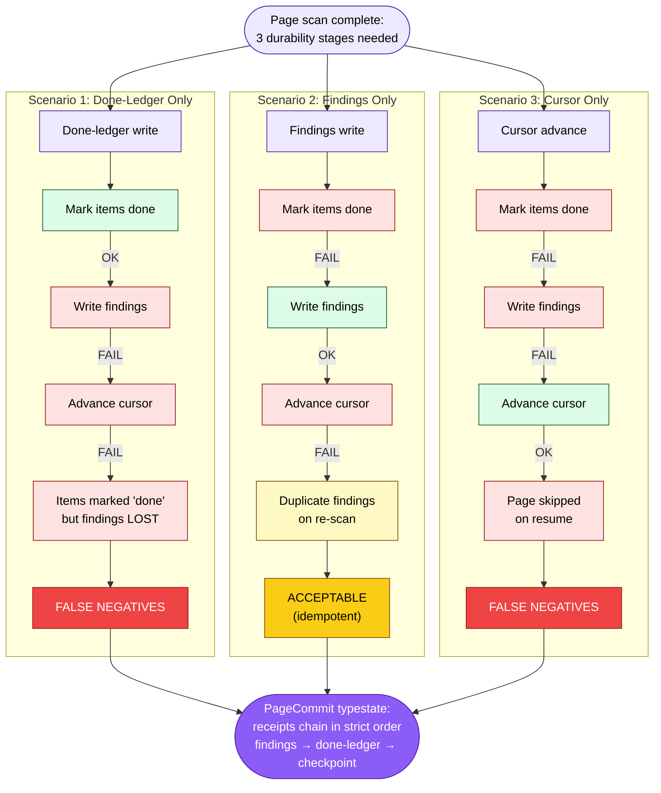
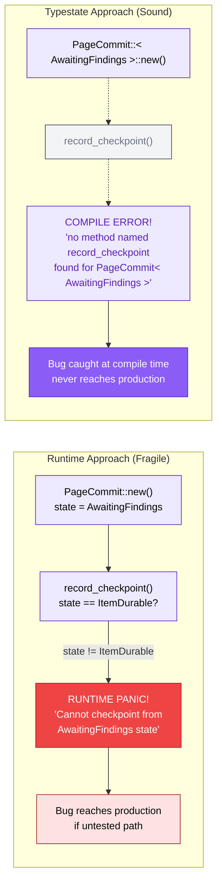
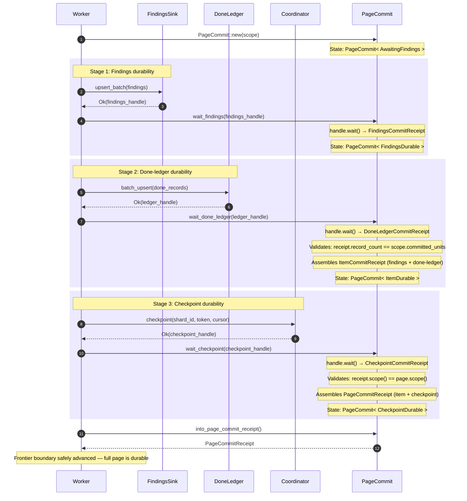

# PageCommit Typestate Machine

The `PageCommit<S>` type encodes a critical safety invariant directly into the
Rust type system: **a page's persistence writes must become durable in a strict
order — findings, then done-ledger, then checkpoint — and the type system
prevents callers from skipping or reordering stages.** This is the typestate
pattern: the durability stage is tracked as a generic type parameter, and
invalid transitions become compile-time errors rather than runtime panics. The
result is zero-cost (the state markers carry only receipt data, not runtime
dispatch overhead) and total (there is no way to circumvent the protocol without
`unsafe`).

PageCommit lives in the **B5 Persistence** boundary. It is the final step in
the worker's hot path: after scanning a page of items, the worker must
durably persist three things in order — findings, done-ledger entries, and the
checkpoint boundary. If any one of these three writes succeeds without the
preceding ones already being durable, the system enters an inconsistent state
that produces **false negatives** — the worst possible failure mode for a
secret scanner, because secrets silently slip through undetected.

> **Notation.** Solid lines represent valid transitions. Dashed lines represent
> compile-error paths (transitions that the type system prevents). All diagrams
> use the B5 Persistence color palette (purple theme: fill `#8B5CF6`, light fill
> `#EDE9FE`, stroke `#5B21B6`).

---

## 1. Typestate State Machine

The PageCommit lifecycle has exactly four states. Each state is a struct that
parameterizes the `PageCommit<S>` type. The methods available on `PageCommit`
change depending on the state parameter: you can call `record_findings()` on
`PageCommit<AwaitingFindings>` but not on any other state, and you can call
`record_checkpoint()` on `PageCommit<ItemDurable>` but not on earlier states.
These constraints are enforced at compile time — there is no runtime state enum,
no match statement, no panic path.

Each stage offers two ways to advance:
- `record_*` — caller already holds the receipt (e.g. from a manual wait).
- `wait_*` — caller passes a `CommitHandle`; the method waits and then validates.

`wait_*` methods consume the state machine. If the backend wait fails, the
`PageCommit` is gone and the caller must reconstruct a new one from scratch.
This is intentional: after a wait failure, the page's I/O state is unknown, so
the only safe action is to retry the full page-commit protocol from
`AwaitingFindings`.

```mermaid
%% Diagram: typestate-state-machine
stateDiagram-v2
    direction LR

    [*] --> AwaitingFindings : PageCommit::new(scope)

    AwaitingFindings --> FindingsDurable : record_findings(receipt)<br/>or wait_findings(handle)
    FindingsDurable --> ItemDurable : record_done_ledger(receipt)<br/>or wait_done_ledger(handle)
    ItemDurable --> CheckpointDurable : record_checkpoint(receipt)<br/>or wait_checkpoint(handle)

    CheckpointDurable --> [*] : into_page_commit_receipt()

    note right of AwaitingFindings
        Type: PageCommit< AwaitingFindings >
        Methods: record_findings(), wait_findings()
        Semantics: No durable acknowledgement yet
    end note

    note right of FindingsDurable
        Type: PageCommit< FindingsDurable >
        Methods: record_done_ledger(), wait_done_ledger()
        Carries: FindingsCommitReceipt
        Semantics: Findings are durable; done-ledger next
    end note

    note right of ItemDurable
        Type: PageCommit< ItemDurable >
        Methods: record_checkpoint(), wait_checkpoint(),
                 item_commit_receipt(), into_item_commit_receipt()
        Carries: ItemCommitReceipt (findings + done-ledger)
        Semantics: Findings and done-ledger durable; checkpoint next
    end note

    note right of CheckpointDurable
        Type: PageCommit< CheckpointDurable >
        Methods: page_commit_receipt(), into_page_commit_receipt()
        Carries: PageCommitReceipt
        Semantics: Terminal — all three stages durable
    end note

    classDef awaitingState fill:#EDE9FE,stroke:#5B21B6,color:#5B21B6
    classDef findingsState fill:#C4B5FD,stroke:#5B21B6,color:#5B21B6
    classDef itemState fill:#A78BFA,stroke:#5B21B6,color:#FFFFFF
    classDef checkpointState fill:#8B5CF6,stroke:#5B21B6,color:#FFFFFF

    class AwaitingFindings awaitingState
    class FindingsDurable findingsState
    class ItemDurable itemState
    class CheckpointDurable checkpointState
```

The four states correspond to four phases of a page commit:

| State                  | Type Parameter                   | Available Methods                                                        | Semantics                                                     |
| :--------------------- | :------------------------------- | :----------------------------------------------------------------------- | :------------------------------------------------------------ |
| **AwaitingFindings**   | `PageCommit<AwaitingFindings>`   | `record_findings()`, `wait_findings()`                                   | Entry point — no durable receipts yet                         |
| **FindingsDurable**    | `PageCommit<FindingsDurable>`    | `record_done_ledger()`, `wait_done_ledger()`, `findings_receipt()`       | Findings are durable; done-ledger is the next required step   |
| **ItemDurable**        | `PageCommit<ItemDurable>`        | `record_checkpoint()`, `wait_checkpoint()`, `item_commit_receipt()`      | Findings + done-ledger durable; checkpoint is the next step   |
| **CheckpointDurable**  | `PageCommit<CheckpointDurable>`  | `page_commit_receipt()`, `into_page_commit_receipt()`                    | Terminal — all three stages durable, receipt extractable       |

### `CommitScope`

Every `PageCommit` is scoped to an immutable `CommitScope` that identifies
the durable commit boundary:

| Field               | Type         | Purpose                                                 |
| :------------------ | :----------- | :------------------------------------------------------ |
| `tenant_id`         | `TenantId`   | Tenant isolation boundary                               |
| `run_id`            | `RunId`      | Run that produced the page                              |
| `shard_id`          | `ShardId`    | Shard that emitted the page                             |
| `fence_epoch`       | `FenceEpoch` | Fence epoch under which the page was processed          |
| `committed_units`   | `u64`        | Number of durable units represented by the page         |
| `checkpoint_boundary` | `CheckpointBoundary` | Tagged frontier boundary the checkpoint must durably acknowledge |

Receipt validation at the done-ledger and checkpoint stages compares against
these scope values, catching receipt mix-ups between concurrent pages at the
earliest point.

### Receipt hierarchy

Receipts form a compositional chain that mirrors the typestate transitions:

```text
FindingsCommitReceipt ──┐
                        ├── ItemCommitReceipt ──┐
DoneLedgerCommitReceipt ┘                       ├── PageCommitReceipt
                           CheckpointCommitReceipt ─┘
```

| Receipt                    | Contents                                       | Produced by                     |
| :------------------------- | :--------------------------------------------- | :------------------------------ |
| `FindingsCommitReceipt`    | finding/occurrence/observation counts           | `FindingsSink::upsert_batch`    |
| `DoneLedgerCommitReceipt`  | record_count, scanned_count, findings_count     | `DoneLedger::batch_upsert`      |
| `ItemCommitReceipt`        | scope + findings receipt + done-ledger receipt  | `record_done_ledger` validation |
| `CheckpointCommitReceipt`  | full `CommitScope` + checkpointed_at time       | Coordinator checkpoint          |
| `PageCommitReceipt`        | item-commit receipt + checkpoint receipt        | `record_checkpoint` validation  |

Holding a `PageCommitReceipt` is proof that the frontier boundary has been
durably checkpointed — no further persistence work is required for this page.

### Validation at each stage

| Stage         | Validation                                                                    | Error on mismatch                                              |
| :------------ | :---------------------------------------------------------------------------- | :------------------------------------------------------------- |
| Findings      | None — receipts carry only aggregate counts, produced by same in-process pipe | (no validation error possible)                                 |
| Done-ledger   | `receipt.record_count() == scope.committed_units()`                           | `PageCommitValidationError::LedgerUnitCountMismatch`           |
| Checkpoint    | `receipt.scope() == page.scope()`                                             | `PageCommitValidationError::CheckpointScopeMismatch`           |

**Done-ledger invariant:** the validation assumes each committed unit produces
exactly one done-ledger row (`DoneLedgerCommitReceipt.record_count()` equals
`CommitScope.committed_units()`). Both currently planned families — ordered-content
and repo-frontier — maintain this 1:1 correspondence. If a future family emits
a different ratio, the validation and error variant
(`LedgerUnitCountMismatch`) must be updated accordingly.

---

## 2. Partial Write Failure Scenarios

Why does the strict ordering matter? Consider what happens if the three
durability stages (findings, done-ledger, checkpoint boundary) are performed
independently and one fails. There are three failure scenarios, and **two of
the three produce false negatives** — secrets that the scanner processed but
never reported. The only acceptable failure mode is the one where findings are
written but done-ledger entries are not, because that produces duplicates on
re-scan rather than missed secrets.

The PageCommit typestate eliminates all three partial-failure scenarios by
enforcing that each stage's durability is proven (via receipt) before the next
stage can proceed. If any stage fails, the frontier boundary is not advanced, so the
page will be re-scanned on the next attempt.



The failure analysis summarized:

| Scenario | Done-Ledger | Findings    | Cursor      | Outcome                             | Severity                         |
| :------- | :---------- | :---------- | :---------- | :---------------------------------- | :------------------------------- |
| 1        | OK          | FAIL        | FAIL        | Items marked done but findings lost | **FALSE NEGATIVES** (worst case) |
| 2        | FAIL        | OK          | FAIL        | Duplicates on re-scan               | Acceptable (idempotent dedup)    |
| 3        | FAIL        | FAIL        | OK          | Page skipped on resume              | **FALSE NEGATIVES** (worst case) |
| Ordered  | All staged  | All staged  | All staged  | Consistent state guaranteed         | **Safe**                         |

False negatives are the worst possible failure for a secret scanner. A false
positive (duplicate finding) wastes human time but is ultimately harmless. A
false negative means a leaked secret goes undetected. The receipt-chaining
protocol exists specifically to make false negatives from out-of-order
persistence impossible.

---

## 3. Runtime vs. Typestate Comparison

The typestate pattern is not the only way to prevent invalid state transitions.
A simpler approach is to store the state in an enum field and check it at
runtime. But runtime checks have a fatal flaw: they only catch bugs that are
exercised in tests. If a code path that calls `record_checkpoint()` before
`record_done_ledger()` is never tested, the bug ships to production and
manifests as a runtime panic (or worse, silent data corruption if the check
is missing).

The typestate approach shifts enforcement to the compiler. The invalid call is
not a runtime panic — it is a **compile error**. The code physically cannot be
written, tested, or shipped. This is a strictly stronger guarantee at zero
runtime cost.



The comparison distills to a single principle: **errors that are structurally
impossible are better than errors that are dynamically caught.** The runtime
approach relies on discipline — every caller must remember to chain receipts
in order, and every test suite must exercise the skipped-stage path. The
typestate approach relies on the compiler — the skipped-stage path cannot
compile, so it cannot exist in the binary.

The dashed lines in the typestate flow represent code that **cannot be written**.
There is no `record_checkpoint()` method on `PageCommit<AwaitingFindings>`. The
compiler rejects it with a type error, not a runtime check. This is the
fundamental difference: runtime safety is probabilistic (depends on test
coverage), typestate safety is total (enforced for all possible programs).

---

## 4. Full Commit Flow

The complete lifecycle of a page commit involves the **Worker** (scanning
items), the **FindingsSink** (receiving discovered secrets), the **DoneLedger**
(recording which items have been processed), the **Coordinator** (checkpointing
the cursor), and the **PageCommit** instance (tracking typestate). Each
persistence backend returns a `CommitHandle` on submission; durability is
established only when `handle.wait()` returns a receipt.

The critical ordering is the receipt chain: each stage's receipt must be in hand
before the next stage can begin. This is where the partial-write failure
scenarios from Diagram 2 are prevented.



The sequence breaks down into four phases:

1. **Construction** (step 1): The worker creates a `PageCommit<AwaitingFindings>`
   with a `CommitScope` that identifies the tenant, run, shard, fence epoch,
   committed-unit count, and tagged checkpoint boundary. The scope is
   `Arc`-shared and frozen for the duration of the protocol.

2. **Findings durability** (steps 2-5): The worker submits findings to the
   `FindingsSink`, receives a `CommitHandle`, and passes it to `wait_findings()`.
   The method calls `handle.wait()` to obtain a `FindingsCommitReceipt`, then
   transitions to `PageCommit<FindingsDurable>`. No validation is performed on
   the findings receipt because it carries only aggregate counts, and the
   findings sink is driven by the same in-process pipeline that constructed
   the scope.

3. **Done-ledger durability** (steps 6-9): The worker submits done-ledger
   records, receives a handle, and passes it to `wait_done_ledger()`. The method
   validates that the receipt's `record_count` matches `scope.committed_units()`,
   rejecting partial or mixed-page flushes. On success, it assembles an
   `ItemCommitReceipt` (findings + done-ledger) and transitions to
   `PageCommit<ItemDurable>`.

4. **Checkpoint durability** (steps 10-13): The worker checkpoints the frontier boundary
   with the coordinator, receives a handle, and passes it to
   `wait_checkpoint()`. The method validates that the receipt's embedded
   `CommitScope` matches the page's scope exactly, catching receipt mix-ups
   between concurrent pages. On success, it assembles the final
   `PageCommitReceipt` and transitions to `PageCommit<CheckpointDurable>`.

5. **Receipt extraction** (steps 14-15): The worker calls
   `into_page_commit_receipt()` to consume the `PageCommit<CheckpointDurable>`
   and obtain the terminal `PageCommitReceipt`. Holding this receipt is
   sufficient proof that the frontier boundary can be safely advanced.

### Error handling

`wait_*` methods return `CommitAdvanceError<E>` which wraps either:
- `CommitAdvanceError::Wait(E)` — the backend handle wait failed (transient).
- `CommitAdvanceError::Validation(PageCommitValidationError)` — the receipt does
  not match the page scope (deterministic bug, not retryable).

Because `wait_*` methods consume the `PageCommit`, a wait failure destroys the
state machine. The caller must create a fresh `PageCommit::new(scope)` and
retry from `AwaitingFindings`. This is safe: the page's I/O state is unknown
after a failure, so the only correct action is to treat the page as abandoned.

Callers that need finer retry control should use `record_*` methods with a
separately managed `handle.wait()` call, keeping the `PageCommit` alive until
a receipt is in hand.

---

## Cross-References

- [Shard and Run State Machines](05-shard-and-run-state-machines.md) -- the
  shard lifecycle that checkpoint-boundary advancement feeds into
- [Fencing Protocol](06-fencing-protocol.md) -- the checkpoint call in
  stage 3 passes through the 5-check fencing preamble
- [End-to-End Scan Flow](04-end-to-end-scan-flow.md) -- receipt-driven
  identity derivation flow and findings persistence architecture
- [System Overview](01-system-overview.md) -- where PageCommit fits in the
  overall architecture

## Source Code References

| File                                                   | Purpose                                                                                   |
| :----------------------------------------------------- | :---------------------------------------------------------------------------------------- |
| `07-boundary-5-persistence/04-commit-protocol-typestate.md` | Deep dive design document for the commit protocol typestate                          |
| `crates/gossip-contracts/src/persistence/page_commit.rs` | `PageCommit<S>` typestate, `CheckpointBoundary`, `CommitScope`, `PageCommitValidationError`, `CommitAdvanceError` |
| `crates/gossip-contracts/src/persistence/commit.rs`    | `CommitHandle` trait, `ReadyCommitHandle`, all receipt types (`FindingsCommitReceipt`, `DoneLedgerCommitReceipt`, `CheckpointCommitReceipt`, `ItemCommitReceipt`, `PageCommitReceipt`) |
| `crates/gossip-contracts/src/persistence/mod.rs`       | Public re-exports and cross-trait ordering contract documentation                         |
| `crates/gossip-contracts/src/persistence/findings.rs`  | `FindingsSink` trait producing `FindingsCommitReceipt`                                    |
| `crates/gossip-contracts/src/persistence/done_ledger.rs` | `DoneLedger` trait producing `DoneLedgerCommitReceipt`                                  |
