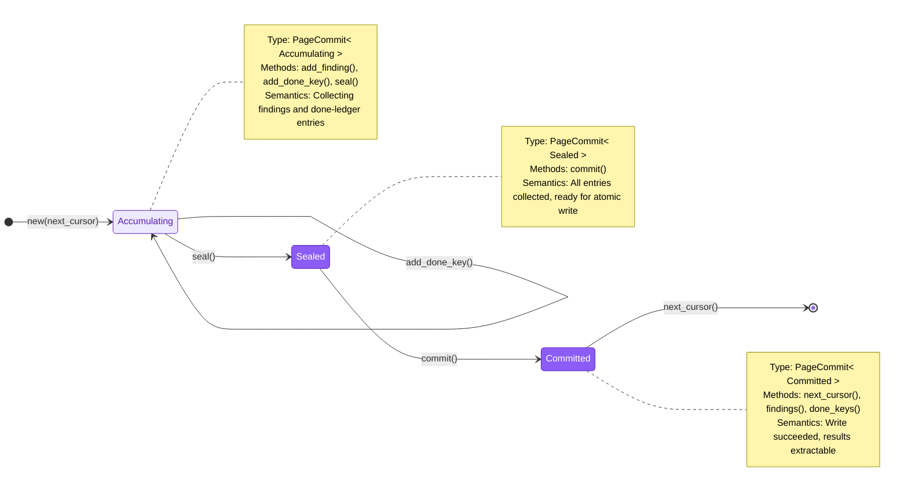
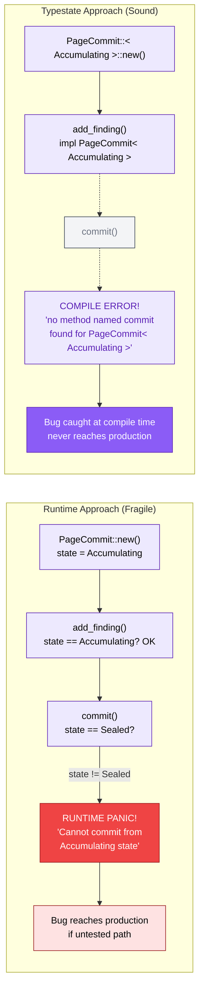
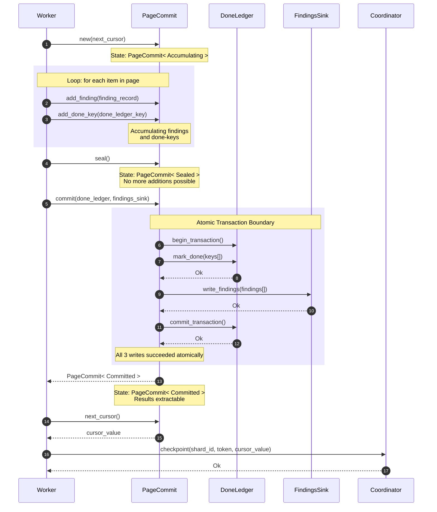

# PageCommit Typestate Machine

> **Implementation status: Contract Spec.** The PageCommit typestate is defined as a
> contract in `persistence/mod.rs`. The in-memory reference backend exercises the full
> protocol. A durable persistence backend is pending. This document describes the target
> design.

The `PageCommit` type encodes a critical safety invariant directly into the Rust
type system: **a page of scan results cannot be committed until it has been
sealed, and committed results cannot be modified after the fact.** This is the
typestate pattern -- the state of the commit is tracked as a generic type
parameter, and invalid transitions become compile-time errors rather than runtime
panics. The result is zero-cost (the state markers are zero-sized types erased
at compile time) and total (there is no way to circumvent the protocol without
`unsafe`).

PageCommit lives in the **B5 Persistence** boundary. It is the final step in
the worker's hot path: after scanning a page of items, the worker must
atomically persist three things -- findings, done-ledger entries, and the cursor
advancement. If any one of these three writes succeeds without the others, the
system enters an inconsistent state that produces **false negatives** -- the
worst possible failure mode for a secret scanner, because secrets silently slip
through undetected.

> **Notation.** Solid lines represent valid transitions. Dashed lines represent
> compile-error paths (transitions that the type system prevents). All diagrams
> use the B5 Persistence color palette (purple theme: fill `#8B5CF6`, light fill
> `#EDE9FE`, stroke `#5B21B6`).

---

## 1. Typestate State Machine

The PageCommit lifecycle has exactly three states. Each state is a zero-sized
marker type (`Accumulating`, `Sealed`, `Committed`) that parameterizes the
`PageCommit<S>` struct. The methods available on `PageCommit` change depending
on the state parameter: you can call `add_finding()` on `PageCommit<Accumulating>`
but not on `PageCommit<Sealed>`, and you can call `commit()` on
`PageCommit<Sealed>` but not on `PageCommit<Accumulating>`. These constraints
are enforced at compile time -- there is no runtime state enum, no match
statement, no panic path.

The self-transitions on `Accumulating` represent the collection phase: the
worker adds findings and done-ledger keys one at a time as it processes each
item in the page. Once all items are processed, `seal()` consumes the
`PageCommit<Accumulating>` and returns a `PageCommit<Sealed>`, making further
additions impossible. The `commit()` method on `Sealed` performs the atomic
write and returns `PageCommit<Committed>`, from which the worker extracts the
next cursor to advance the coordinator.

The three states correspond to three phases of a page commit:

| State | Type Parameter | Available Methods | Semantics |
|:------|:---------------|:------------------|:----------|
| **Accumulating** | `PageCommit<Accumulating>` | `add_finding()`, `add_done_key()`, `seal()` | Collecting results from the current page scan |
| **Sealed** | `PageCommit<Sealed>` | `commit()` | Collection complete, ready for atomic persistence |
| **Committed** | `PageCommit<Committed>` | `next_cursor()`, `findings()`, `done_keys()` | Write succeeded, results are immutable and extractable |

---

## 2. Partial Write Failure Scenarios

Why does atomicity matter? Consider what happens if the three writes
(done-ledger, findings, cursor advancement) are performed independently and one
fails. There are three failure scenarios, and **two of the three produce false
negatives** -- secrets that the scanner processed but never reported. The only
acceptable failure mode is the one where findings are written but done-ledger
entries are not, because that produces duplicates on re-scan rather than missed
secrets.

The PageCommit's atomic `commit()` method eliminates all three partial-failure
scenarios by bundling the writes into a single transaction. Either all three
succeed, or none of them do. On failure, the cursor is not advanced, so the
page will be re-scanned on the next attempt.

The failure analysis summarized:

| Scenario | Done-Ledger | Findings | Cursor | Outcome | Severity |
|:---------|:------------|:---------|:-------|:--------|:---------|
| 1 | OK | FAIL | FAIL | Items marked done but findings lost | **FALSE NEGATIVES** (worst case) |
| 2 | FAIL | OK | FAIL | Duplicates on re-scan | Acceptable (idempotent dedup) |
| 3 | FAIL | FAIL | OK | Page skipped on resume | **FALSE NEGATIVES** (worst case) |
| Atomic | All or none | All or none | All or none | Consistent state guaranteed | **Safe** |

False negatives are the worst possible failure for a secret scanner. A false
positive (duplicate finding) wastes human time but is ultimately harmless. A
false negative means a leaked secret goes undetected. The atomic commit exists
specifically to make false negatives from partial writes impossible.

---

## 3. Runtime vs. Typestate Comparison

The typestate pattern is not the only way to prevent invalid state transitions.
A simpler approach is to store the state in an enum field and check it at
runtime. But runtime checks have a fatal flaw: they only catch bugs that are
exercised in tests. If a code path that calls `commit()` on an unsealed
`PageCommit` is never tested, the bug ships to production and manifests as a
runtime panic (or worse, silent data corruption if the check is missing).

The typestate approach shifts enforcement to the compiler. The invalid call is
not a runtime panic -- it is a **compile error**. The code physically cannot be
written, tested, or shipped. This is a strictly stronger guarantee at zero
runtime cost.

The comparison distills to a single principle: **errors that are structurally
impossible are better than errors that are dynamically caught.** The runtime
approach relies on discipline -- every caller must remember to seal before
committing, and every test suite must exercise the forgotten-seal path. The
typestate approach relies on the compiler -- the forgotten-seal path cannot
compile, so it cannot exist in the binary.

The dashed lines in the typestate flow represent code that **cannot be written**.
There is no `commit()` method on `PageCommit<Accumulating>`. The compiler
rejects it with a type error, not a runtime check. This is the fundamental
difference: runtime safety is probabilistic (depends on test coverage), typestate
safety is total (enforced for all possible programs).

---

## 4. Full Commit Flow

The complete lifecycle of a page commit involves four participants: the
**Worker** (scanning items), the **PageCommit** instance (tracking state), the
**DoneLedger** (recording which items have been processed), and the
**FindingsSink** (receiving discovered secrets). The **Coordinator** is notified
after the commit succeeds so it can advance the shard's cursor.

The critical section is the atomic transaction inside `commit()`. The three
writes -- marking items done, writing findings, and acknowledging the
transaction -- must all succeed or all fail. This is where the partial-write
failure scenarios from Diagram 2 are prevented.

The sequence breaks down into five phases:

1. **Construction** (step 1): The worker creates a `PageCommit<Accumulating>`
   with the cursor value it will advance to after the commit succeeds. The
   cursor is stored inside the PageCommit but is not sent to the coordinator
   until the commit is confirmed.

2. **Accumulation** (steps 2-3): The worker iterates over items in the page.
   For each item, it may call `add_finding()` (if a secret was detected) and
   `add_done_key()` (always, to mark the item as processed). These methods are
   only available on `PageCommit<Accumulating>`.

3. **Sealing** (step 4): The worker calls `seal()`, which consumes the
   `PageCommit<Accumulating>` and returns a `PageCommit<Sealed>`. After this
   point, no more findings or done-keys can be added. The seal is a one-way
   gate.

4. **Atomic commit** (steps 5-11): The worker calls `commit()` on the sealed
   PageCommit, passing references to the DoneLedger and FindingsSink. Inside
   `commit()`, a transaction is opened, done-keys are marked, findings are
   written, and the transaction is committed. If any step fails, the transaction
   is rolled back and no state changes are persisted. On success, the method
   returns `PageCommit<Committed>`.

5. **Cursor advancement** (steps 12-14): The worker extracts `next_cursor()`
   from the committed PageCommit and sends it to the Coordinator via
   `checkpoint()`. This is the only point at which the coordinator learns
   that the page has been processed. Because the cursor is only advanced after
   the atomic commit succeeds, partial writes cannot cause the coordinator to
   skip a page.

The transaction boundary (the inner `rect` block in the sequence diagram) is the
heart of the protocol. Everything outside that boundary is type-system
enforcement (preventing invalid method calls). Everything inside it is
persistence enforcement (preventing partial writes). Together, they provide
end-to-end safety: you cannot commit without sealing, and you cannot partially
commit.

---

## Cross-References

- [Shard and Run State Machines](05-shard-and-run-state-machines.md) -- the
  shard lifecycle that the cursor advancement feeds into
- [Fencing Protocol](06-fencing-protocol.md) -- the `checkpoint` call in
  step 14 passes through the 5-check fencing preamble
- [System Overview](01-system-overview.md) -- where PageCommit fits in the
  overall architecture

## Source Code References

- **Deep dive document**: `07-boundary-5-persistence/04-commit-protocol-typestate.md`
- **Persistence contracts**: `crates/gossip-contracts/src/persistence/`
- **Typestate markers**: `crates/gossip-contracts/src/persistence/`
- **Done-ledger interface**: `crates/gossip-contracts/src/persistence/`
- **Findings sink interface**: `crates/gossip-contracts/src/persistence/`
