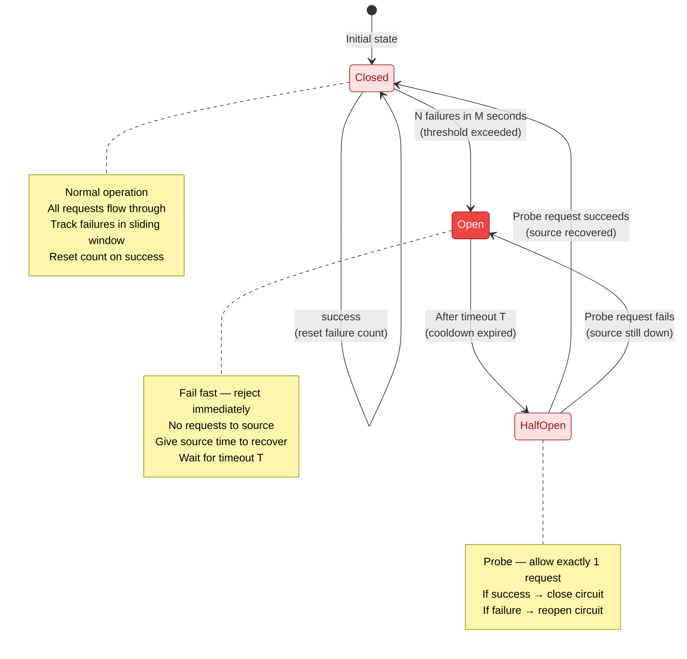
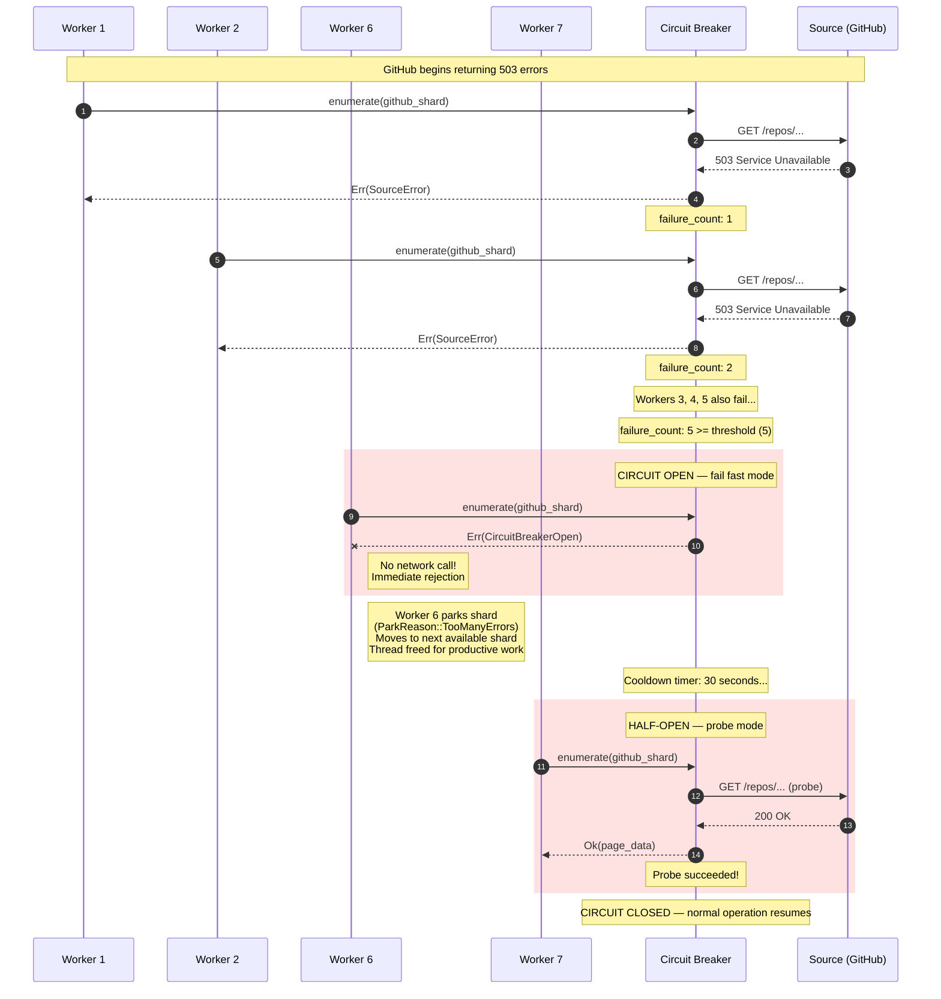
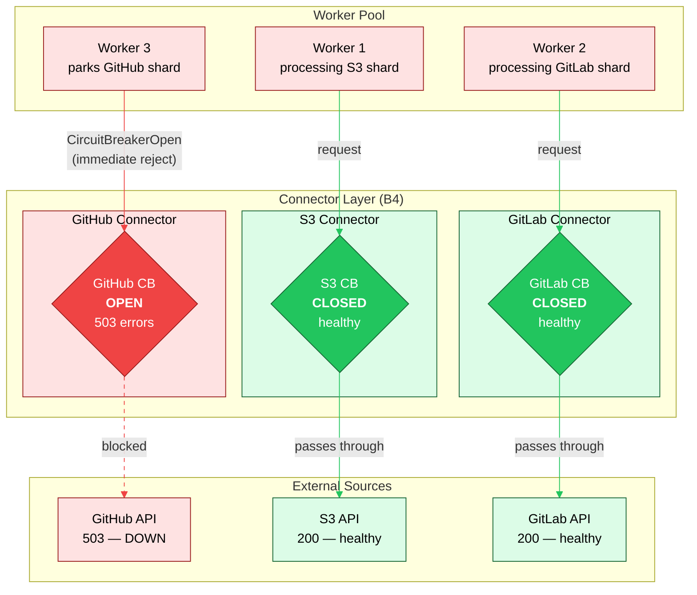
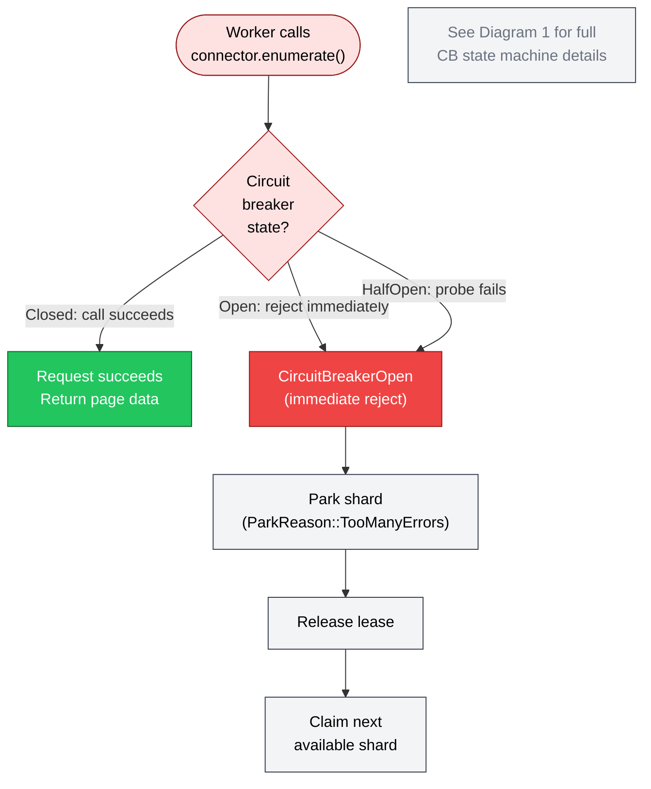

# Circuit Breaker

> **Implementation status: Design Target.** The circuit breaker types described below
> (`CircuitBreakerState`, `CircuitConfig`) do **not** exist in compiled source code. The
> current retry mechanism is a consecutive-failure counter in the scan loop
> (`scan_loop.rs:131`, `DEFAULT_MAX_TRANSIENT_RETRIES = 3`). This document describes the
> target design for a future circuit breaker implementation.

The circuit breaker is a fault-isolation mechanism in the **B4 Connector** boundary that
prevents cascading failures when external data sources become unavailable. The core
insight, first articulated by Michael Nygard in *Release It!* (2007, 2nd ed. 2018), is
deceptively simple: **when a source is down, stop calling it**. Instead of letting
hundreds of workers block on timeouts and retries against a failing API, the circuit
breaker trips open after a small number of consecutive failures and begins rejecting
requests immediately -- no network call, no timeout, no blocked thread.

This matters enormously for system throughput. Without a circuit breaker, a single
degraded source (say, GitHub returning 503s) can drag down the entire scanner: every
worker that encounters a GitHub shard blocks for 30 seconds waiting for a timeout, then
retries, then blocks again. Within minutes, all workers are stuck waiting on a source
that cannot serve them, and throughput for *every other source* drops to zero. The
circuit breaker eliminates this failure mode by converting a slow failure (timeout) into
a fast failure (immediate rejection), freeing workers to move on to productive work.

Each connector maintains its own independent circuit breaker, providing fault isolation
at the source level. GitHub being down does not affect S3 scanning. S3 rate-limiting
does not affect GitLab. This per-connector isolation is a direct consequence of the
boundary architecture: B4 connectors are independent units with no shared mutable state
between them.

> **Notation.** All diagrams use the B4 Connector color palette (red theme: fill
> `#EF4444`, light fill `#FEE2E2`, stroke `#991B1B`). Dashed lines represent failure
> paths. Solid lines represent success paths.

---

## 1. Circuit Breaker State Machine

The circuit breaker has exactly three states. The state machine is small by design --
the value is in the transitions, not the states. Each transition carries a precise
trigger condition and a concrete system effect.

**Closed** is the normal operating state. All requests flow through to the external
source. The breaker tracks failures in a sliding time window (typically 10 seconds).
Every success resets the failure count. When the failure count exceeds a threshold
(typically 3-5 failures within the window), the breaker trips to Open.

**Open** is the fail-fast state. No requests reach the external source. Every incoming
request is rejected immediately with a `CircuitBreakerOpen` error. This gives the
source time to recover without being hammered by retry traffic. The breaker stays Open
for a configurable cooldown period (typically 30-60 seconds).

**HalfOpen** is the probe state. After the cooldown expires, the breaker allows exactly
one request through as a probe. If the probe succeeds, the source has recovered and the
breaker closes. If the probe fails, the source is still down and the breaker reopens
for another cooldown period.

The three states correspond to three distinct behaviors from the caller's perspective:

| State | Caller Experience | Source Load | Thread Impact |
|:------|:------------------|:------------|:--------------|
| Closed | Normal latency, normal errors | Full traffic | Workers block on I/O normally |
| Open | Immediate `CircuitBreakerOpen` error | Zero traffic | Workers freed instantly |
| HalfOpen | One probe in-flight, others rejected | Single request | One worker probes, others freed |

Typical configuration thresholds:

- **Failure threshold**: 3-5 failures within the sliding window
- **Sliding window**: 10 seconds
- **Cooldown timeout (T)**: 30-60 seconds
- **Probe count in HalfOpen**: exactly 1

> **Note:** These thresholds are design guidance. `CircuitConfig` defines them as
> runtime-configurable parameters, not protocol constants.

---

## 2. Cascade Prevention

The circuit breaker's value becomes concrete when you compare system behavior with and
without it during a source outage. The contrast is stark.

**Without a circuit breaker**, the failure cascades. Suppose GitHub starts returning
503 errors. Worker 1 sends a request, waits 30 seconds for a timeout, retries. Worker
2 does the same. Worker 3, 4, 5, ... 100 all pile on. Within seconds, every worker in
the pool is blocked waiting on GitHub. No worker is available to process S3 shards,
GitLab shards, or any other source. The system's effective throughput drops to zero
even though GitHub is the only source that is down. This is the cascading failure
pattern: one component's failure propagates to consume all shared resources (worker
threads).

**With a circuit breaker**, the failure is contained. The first few workers hit GitHub,
get errors, and the circuit breaker records the failures. After the threshold is
reached, the breaker trips open. Every subsequent worker that tries to access GitHub
gets an immediate `CircuitBreakerOpen` rejection -- no network call, no 30-second
timeout. Those workers park their GitHub shards and move on to process S3 and GitLab
shards. System throughput for healthy sources is unaffected.

The critical moment is step 8: Worker 6's request never reaches GitHub. The circuit
breaker rejects it immediately, returning `CircuitBreakerOpen` without making any
network call. Worker 6 is freed in microseconds instead of blocking for 30 seconds.
It parks the shard, releases the lease, and moves on to productive work -- perhaps
processing an S3 shard or a GitLab shard that is perfectly healthy.

After the cooldown period expires, the breaker transitions to HalfOpen and allows
Worker 7's request through as a probe. When the probe succeeds (step 12), the breaker
closes and normal operation resumes. If the probe had failed, the breaker would have
reopened for another cooldown period, and the cycle would repeat until the source
recovers.

---

## 3. Per-Connector Isolation

Each connector in the system maintains its own independent circuit breaker. This is
the fault-isolation property that prevents a single source outage from affecting the
entire system. The diagram below shows a snapshot where GitHub is experiencing an
outage (circuit open) while S3 and GitLab are operating normally (circuits closed).

Workers processing S3 shards and GitLab shards are completely unaffected by the GitHub
outage. Only workers that attempt to process GitHub shards encounter the open circuit,
and they handle it by parking their shards and moving on to other work.

The per-connector isolation follows directly from the boundary architecture. Each
connector is an independent implementation of the connector trait, with its own
configuration, its own rate limiter, and its own circuit breaker. There is no shared
state between connectors that could allow a failure in one to propagate to another.

Key observations:

- **Worker 3** receives `CircuitBreakerOpen` immediately when it attempts to process
  a GitHub shard. It parks the shard with `ParkReason::TooManyErrors`, releases
  the lease, and is free to claim a shard from a healthy source.
- **Workers 1 and 2** are completely unaware that GitHub is down. Their requests flow
  through their respective circuit breakers (both closed) to healthy APIs.
- **The dashed line** from the GitHub circuit breaker to the GitHub API indicates that
  no traffic flows on this path while the circuit is open. The API receives zero
  requests, giving it maximum opportunity to recover.

**ParkReason variants** — when a circuit breaker trips, the worker parks the shard with
`ParkReason::TooManyErrors`. For the full `ParkReason` enum and all variants, see
[Shard and Run State Machines — ParkReason table](05-shard-and-run-state-machines.md).

---

## 4. Shard Parking Flow

When a circuit breaker trips, the system does not simply discard the work -- it parks
the shard so that it can be retried later when the source recovers. The decision flow
below traces the complete path from a connector call through circuit breaker evaluation
to either successful processing or shard parking.

The diagram below focuses on the parking integration -- what happens after the
circuit breaker rejects a request. For the full CB state machine (Closed, Open,
HalfOpen transitions), see Diagram 1 above.

Regardless of *how* the circuit breaker determined the source is unavailable (threshold
exceeded, open-state rejection, or failed probe), the worker's response is the same --
park the shard and move on. All `CircuitBreakerOpen` paths converge on the same
parking flow.

The parking flow is significant because it integrates the circuit breaker with the
coordination protocol (B2). When a worker parks a shard:

1. **`coordinator.park_shard(ParkReason::TooManyErrors)`** transitions the shard
   to the `Parked` terminal state. This is a normal shard state transition through the
   B2 coordination backend, subject to the same fencing token validation as any other
   mutation.
2. **The lease is released**, freeing the shard from this worker's ownership. The
   worker's fencing token for this shard becomes stale.
3. **The worker moves on** to the next available shard, which may belong to a completely
   different source. The worker thread is never blocked -- it is always doing productive
   work or quickly discovering that it cannot.

This is the fundamental throughput guarantee: **INV-L30** (if a source API is healthy,
enumeration of its shards eventually completes) is enforced by the circuit breaker. The circuit breaker is the mechanism that
ensures unhealthy sources do not prevent healthy ones from making progress. Workers are
a shared resource, and the circuit breaker prevents any single source from monopolizing
them.

---

## Cross-References

- [Shard and Run State Machines](05-shard-and-run-state-machines.md) -- the `Parked`
  terminal state that shards enter when the circuit breaker trips
- [Fencing Protocol](06-fencing-protocol.md) -- fencing token validation that guards
  the `park_shard` mutation
- [System Overview](01-system-overview.md) -- the five-boundary architecture and how
  B4 Connector fits within it

## Source Code References

- **Connector design doc**: `docs/boundary-4-connectors.md`
- **Connector module**: `crates/gossip-connectors/`
- **Connector trait**: `crates/gossip-contracts/src/connector/`
- **Scan loop retry logic**: `crates/gossip-scan-pipeline/src/scan_loop.rs`
- **Coordination backend**: `crates/gossip-coordination/src/traits.rs`
- **Park reason types**: `crates/gossip-coordination/src/record.rs`
