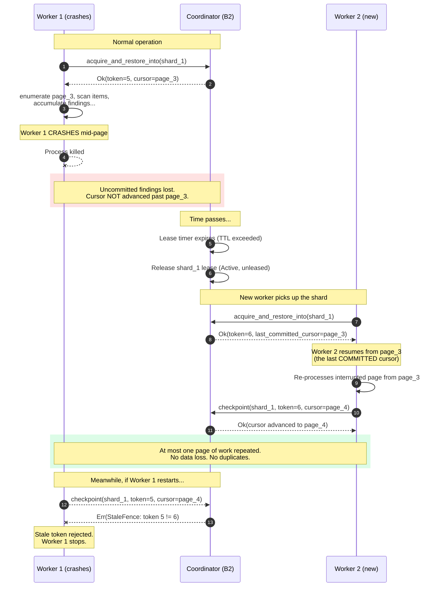
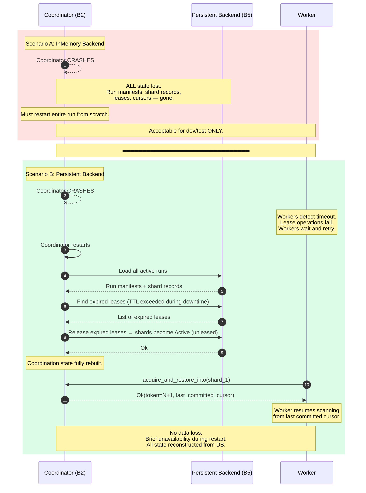
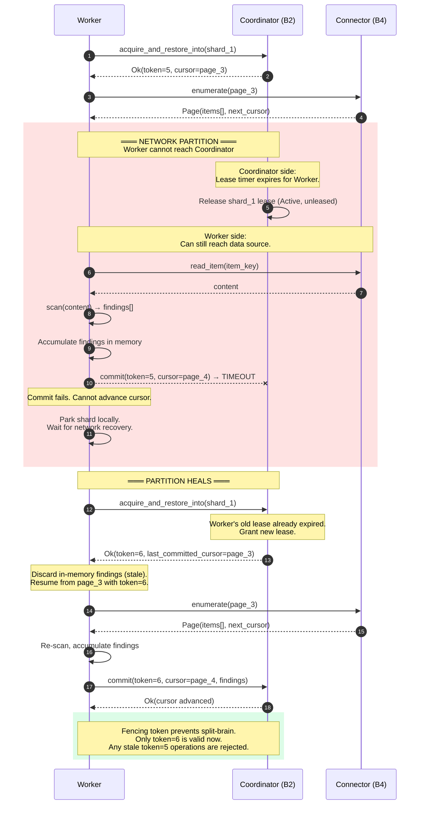
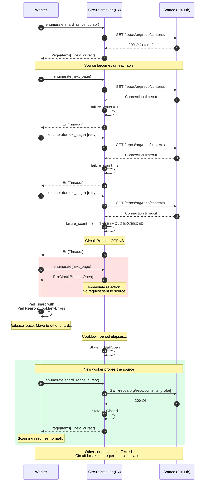
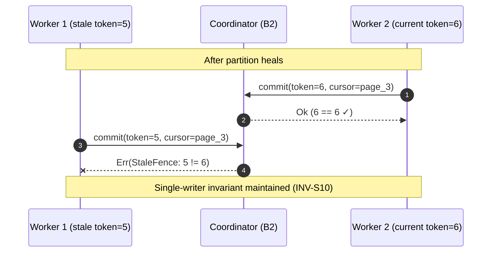
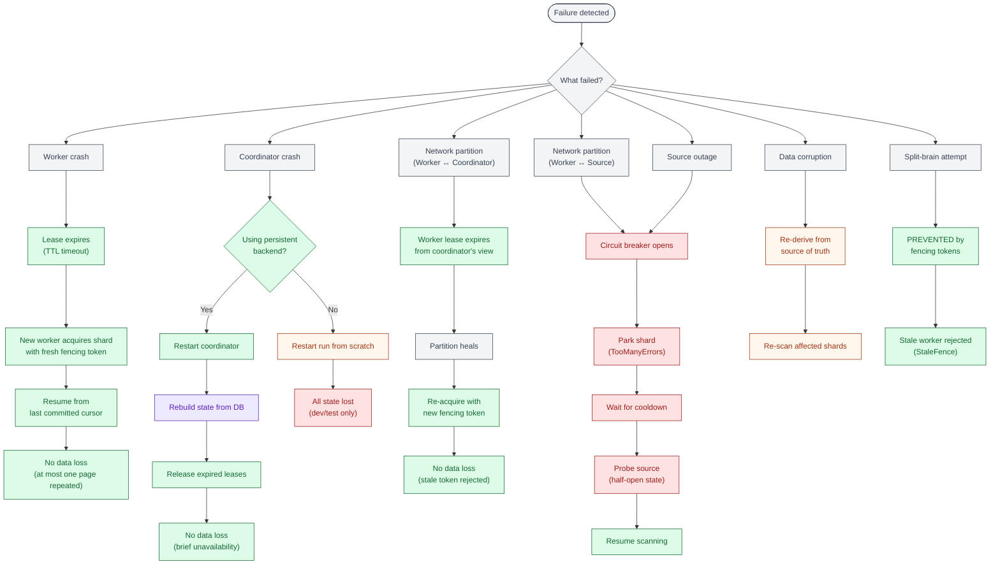

# Failure Modes and Recovery

Distributed systems fail in countless ways. Networks partition, processes crash,
disks fill, clocks drift, and external services disappear without warning. A
system that only works on the happy path is not a system -- it is a prototype.
This chapter catalogs the primary failure modes in Gossip-rs and traces the
recovery path for each one, demonstrating that the architecture handles every
cataloged failure with a defined, tested response.

The system's failure philosophy rests on five principles:

1. **Fail Fast.** Detect failures as close to the source as possible. Do not
   allow corrupt state to propagate through the pipeline. Fencing tokens reject
   stale writers immediately; circuit breakers trip after a small number of
   failures rather than letting timeouts accumulate.

2. **Fail Safe.** When in doubt, stop and let someone else try. A worker that
   cannot reach the coordinator parks its shard and yields. A coordinator that
   restarts rebuilds from persistent state rather than guessing.

3. **Fail Visibly.** Every failure produces a typed error, a log entry, or both.
   Silent failures -- where work is lost but nobody notices -- are the most
   dangerous class of bug. The op-log, fencing protocol, and done-ledger
   collectively ensure that lost work is detected and retried.

4. **Recover Automatically.** The system should heal without human intervention
   whenever possible. Lease expiry reclaims crashed workers' shards. Circuit
   breaker cooldowns probe recovering sources. Cursor-based replay resumes from
   the last committed position.

5. **Minimize Blast Radius.** A failure in one connector should not affect other
   connectors. A crashed worker should not stall the entire run. A network
   partition between one worker and the coordinator should not prevent other
   workers from making progress.

The overriding design choice is that **safety takes priority over liveness**.
The system will tolerate brief periods of unavailability -- a shard sitting idle
while a lease expires, a source unreachable while a circuit breaker cools down --
but it will never tolerate data loss or data corruption. An uncommitted page can
be re-processed; a corrupted cursor or a double-counted finding cannot be
un-corrupted.

---

## Diagram 1: Worker Crash Recovery

The most common failure mode is a worker crashing mid-page. The worker may have
enumerated items, derived identities, and accumulated findings -- but if it
crashes before the atomic commit (Step 9 in the scan flow), all that in-flight
work is lost. This is acceptable by design: the cursor has not advanced, so the
next worker to claim the shard will re-process the same page from the last
committed position.

The recovery sequence relies on three mechanisms working together: lease expiry
detects the crash, the fencing token prevents the crashed worker from interfering
if it restarts, and cursor atomicity ensures exactly-once semantics for committed
pages.

The critical property is **cursor atomicity**: the cursor only advances inside
the receipt-chained commit boundary. If the commit did not reach
`CheckpointDurable`, the cursor did not advance. This means the next worker
always starts from a consistent position.
The fencing token (incrementing from 5 to 6 on the new acquisition) ensures that
Worker 1 cannot interfere even if it comes back to life -- its stale token is
rejected immediately by the 5-check validation preamble (INV-S12).

---

## Diagram 2: Coordinator Crash Recovery

The coordinator is the central authority for shard ownership, lease management,
and run lifecycle. When it crashes, the impact depends entirely on the storage
backend. Gossip-rs supports two backend modes -- in-memory and persistent -- with
dramatically different recovery characteristics.

With an in-memory backend, all coordination state lives in the coordinator's
process memory. A crash destroys everything: run manifests, shard records, lease
tables, cursors. The run must restart from scratch. This is acceptable for
development and testing but unsuitable for production.

With a persistent backend, the coordinator is effectively stateless. All
coordination state lives in the database. The coordinator can crash, restart,
reconnect to the database, and rebuild its entire in-memory view. Workers
experience a brief period of unavailability (lease operations time out during
the restart window), but no data is lost and no work is duplicated.

The persistent backend transforms the coordinator from a stateful singleton into
a stateless service that can be restarted, migrated, or even replaced without
losing any scan progress. The key insight is that all durable state -- shard
records, cursors, lease metadata -- lives in the database. The coordinator's
in-memory state is a cache that can be rebuilt from the persistent store at any
time.

During the restart window, workers will experience timeouts on lease operations.
This is by design: the system prefers a brief pause over any risk of
inconsistency. Once the coordinator is back, it releases any leases that expired
during downtime (the original holders may have crashed or moved on), and workers
can acquire shards again with fresh fencing tokens.

---

## Diagram 3: Network Partition -- Worker to Coordinator

A network partition between a worker and the coordinator is one of the most
subtle failure modes. The worker may still be able to reach the data source (via
the connector), so it can continue reading items and accumulating findings. But
it cannot commit those findings because the commit operation requires
coordinator involvement (cursor advancement, fencing token validation). The
worker is forced to stop and wait.

Meanwhile, the coordinator sees the worker's lease expire and makes the shard
available for other workers. When the partition heals, the original worker
discovers that its lease is gone (fencing token is stale) and must re-acquire
the shard to continue.

The partition scenario reveals why fencing tokens are essential. Without them,
two workers could simultaneously believe they own the same shard -- the original
worker (still running, unable to reach the coordinator) and a new worker that
acquired the shard after the lease expired. The fencing token resolves this
ambiguity: only the holder of the highest token can commit mutations. The
original worker's token (5) is permanently stale once token 6 is issued.

The worker discards its in-memory findings after the partition heals because
those findings were accumulated under a stale lease. While the findings
themselves might be correct, the system cannot verify this without re-running the
full pipeline from the committed cursor. Re-processing one page is a small cost
compared to the risk of inconsistency.

---

## Diagram 4: Network Partition -- Worker to Source

When the failure is between the worker and the external data source (GitHub, S3,
etc.) rather than between the worker and the coordinator, the retry-budget
pattern contains the damage. The scan loop uses a `RetryBudget` that classifies
errors via `BackendError` into `RetryableReason` and `PermanentReason` categories.
After the retry budget is exhausted, the shard is parked with
`ParkReason::TooManyErrors`, freeing the worker for other shards.

> **Note:** The sequence diagram below shows a **target design** where a full
> circuit breaker state machine (Closed/Open/HalfOpen) mediates connector calls.
> The current implementation uses a `RetryBudget` with `BackendError` classification
> in `scanner-scheduler/src/scheduler/failure.rs`. The parking outcome (`ParkReason::TooManyErrors`) is the same;
> the intermediate states (Open, HalfOpen, probe) are aspirational.

The worker responds by parking the shard with a `ParkReason::TooManyErrors`
designation and moving on to other available work.

The retry-budget pattern achieves two goals simultaneously. First, it
**fails fast**: once the budget is exhausted, the worker stops retrying a source
that is known to be unhealthy. Second, it **minimizes blast radius**: the budget
is scoped to a single shard's connector interaction. If GitHub is unreachable but
S3 is fine, workers can continue scanning S3 shards without interruption.

> **Note:** The target design introduces a full circuit breaker state machine
> (Closed → Open → HalfOpen) with cooldown and probe phases (shown in the
> sequence diagram above). The current implementation achieves the same parking
> outcome (`ParkReason::TooManyErrors`) via `RetryBudget` and `BackendError`
> classification, without the intermediate Open/HalfOpen states.

The parking mechanism ensures the shard is not lost. A parked shard retains its
cursor position and can be unparked (an admin operation) or picked up by a
future run. The `ParkReason` field records why the shard was parked, enabling
operators to diagnose and remediate the underlying issue.

---

## Diagram 5: Split-Brain Prevention via Fencing

Split-brain is the nightmare scenario in any distributed system: two processes
both believe they are the sole owner of a resource, and both write to it
simultaneously, producing inconsistent state. In Gossip-rs, split-brain would
mean two workers advancing the cursor on the same shard, potentially committing
overlapping or conflicting findings.

The fencing token protocol makes split-brain impossible. The monotonically
increasing token (INV-S11) combined with the stale-token rejection rule
(INV-S12) ensures that at most one writer can succeed at any point in time. A
partition may temporarily create two workers that *believe* they own the shard,
but only the one with the highest token can *write* to it.

> For the full sequence including partition onset, lease expiry, and shard
> re-acquisition, see
> [Fencing Protocol -- Diagram 2: Zombie Worker Resolution](06-fencing-protocol.md).

The diagram illustrates the fundamental asymmetry of the fencing protocol.
Worker 2's commit succeeds because `6 == 6` is true -- it holds the current
token and is the rightful owner. Worker 1's commit fails because `5 != 6` --
its token is stale, and no amount of retrying will make it valid again. The
only option for Worker 1 is to stop, discard its in-flight work, and
re-acquire the shard if it wants to continue (which would give it token 7).

This is not eventual consistency -- it is **immediate rejection**. There is no
window of ambiguity, no reconciliation phase, no conflict resolution. The stale
writer is told "no" on its first attempt to write, before any damage can occur.

---

## Diagram 6: Recovery Decision Tree

The following decision tree provides a diagnostic guide for operators and the
system's own recovery logic. Given a detected failure, the tree walks through
the failure type, the automatic recovery mechanism, and the expected outcome.
Most paths lead to automatic recovery with no data loss. The few paths that
require human intervention (coordinator crash with in-memory backend, data
corruption) are clearly marked.

**Reading the decision tree.** Green terminal nodes indicate automatic recovery
with no data loss -- the system heals itself. Orange nodes indicate recoverable
situations that require a restart or manual re-scan. The single red terminal
node ("All state lost") represents the only path where work is genuinely lost,
and it only applies to the in-memory backend, which is not used in production.

The tree reveals a reassuring pattern: **most failure paths terminate in
automatic recovery**. Worker crashes, network partitions, and source outages all
resolve through the same two mechanisms -- lease expiry and cursor-based replay.
Split-brain is not a recovery scenario at all; it is prevented outright by the
fencing protocol.

---

## Recovery Principles in Practice

The following table summarizes each failure mode, its detection mechanism, the
recovery path, and the worst-case impact:

| Failure Mode                           | Detection                              | Recovery                                                      | Worst-Case Impact            |
| :------------------------------------- | :------------------------------------- | :------------------------------------------------------------ | :--------------------------- |
| Worker crash mid-page                  | Lease TTL expiry                       | New worker resumes from last committed cursor                 | One page re-processed        |
| Coordinator crash (persistent)         | Worker timeouts on lease ops           | Restart coordinator, rebuild from DB, release expired leases  | Brief unavailability         |
| Coordinator crash (in-memory)          | Worker timeouts on lease ops           | Restart entire run from scratch                               | All in-flight progress lost  |
| Network partition (worker-coordinator) | Lease TTL expiry + commit timeout      | Re-acquire shard with new fencing token after partition heals | One page re-processed        |
| Network partition (worker-source)      | Consecutive timeouts → circuit breaker | Park shard, cooldown, probe, resume                           | Shard temporarily parked     |
| Source outage                          | Same as network partition with source  | Same circuit breaker pattern                                  | Affected connector paused    |
| Split-brain                            | Fencing token comparison (INV-S12)     | Stale writer rejected immediately                             | No impact (prevented)        |
| Data corruption                        | Application-level integrity checks     | Re-derive from source of truth, re-scan affected shards       | Manual intervention required |

Two observations stand out. First, lease TTL expiry is the universal detection
mechanism for any failure involving a worker or the coordinator. The system does
not try to distinguish between a crash, a partition, and a slow worker -- it
treats them all as "the lease holder did not renew in time." This simplification
is deliberate: the correct recovery action (re-acquire with a new token, resume
from last cursor) is the same regardless of the root cause.

Second, cursor-based replay is the universal recovery mechanism for any failure
involving data processing. Whether the failure was a crash, a partition, or a
transient error, the worker resumes from the last committed cursor and
re-processes at most one page. The done-ledger provides a secondary safety net:
even if items appear in overlapping pages, previously committed items are
skipped.

---

## Cross-References

- [Fencing Protocol](./06-fencing-protocol.md) -- the 5-check validation
  preamble and zombie worker resolution that underpin Diagrams 1, 3, and 5
- [Shard and Run State Machines](./05-shard-and-run-state-machines.md) -- the
  state transitions (Active, Done, Split, Parked) referenced throughout
- [End-to-End Scan Flow](./04-end-to-end-scan-flow.md) -- ScanDriver
  architecture and distributed worker loop
- [System Overview](./01-system-overview.md) -- the five architectural
  boundaries (B1-B5) referenced by color coding
- [Circuit Breaker](./09-circuit-breaker.md) -- the circuit breaker state machine
  and cascade prevention that underpin Diagrams 4 and 6

## Source Code References

| Component                                                              | Path                                                                     |
| :--------------------------------------------------------------------- | :----------------------------------------------------------------------- |
| Coordination data types (shard_spec, cursor, pooled, manifest, limits) | `crates/gossip-contracts/src/coordination/`                              |
| Coordination protocol (lease, fencing, shard ops)                      | `crates/gossip-coordination/src/`                                        |
| Connector module (circuit breaker, source abstraction)                 | `crates/gossip-contracts/src/connector/` and `crates/gossip-connectors/` |
| Shard record and state transitions                                     | `crates/gossip-coordination/src/record.rs`                               |
| Fencing validation logic                                               | `crates/gossip-coordination/src/validation.rs`                           |
| Lease management                                                       | `crates/gossip-coordination/src/lease.rs`                                |
| Error types (StaleFence, AcquireError, etc.)                           | `crates/gossip-coordination/src/error.rs`                                |
