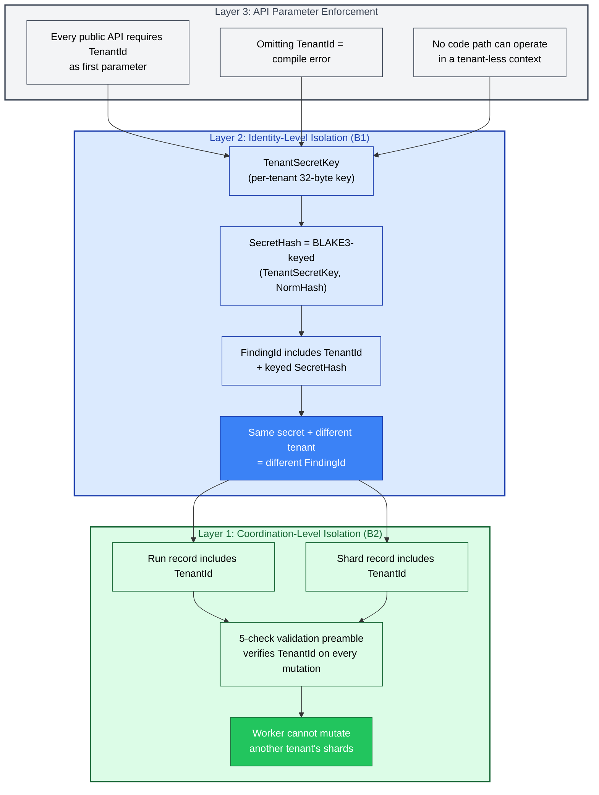
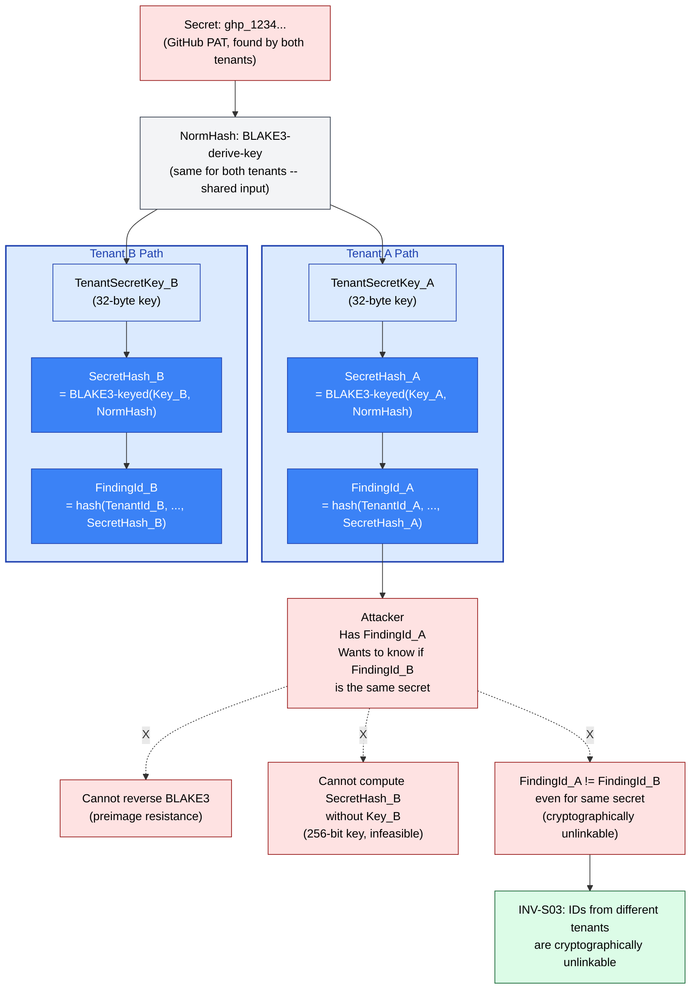
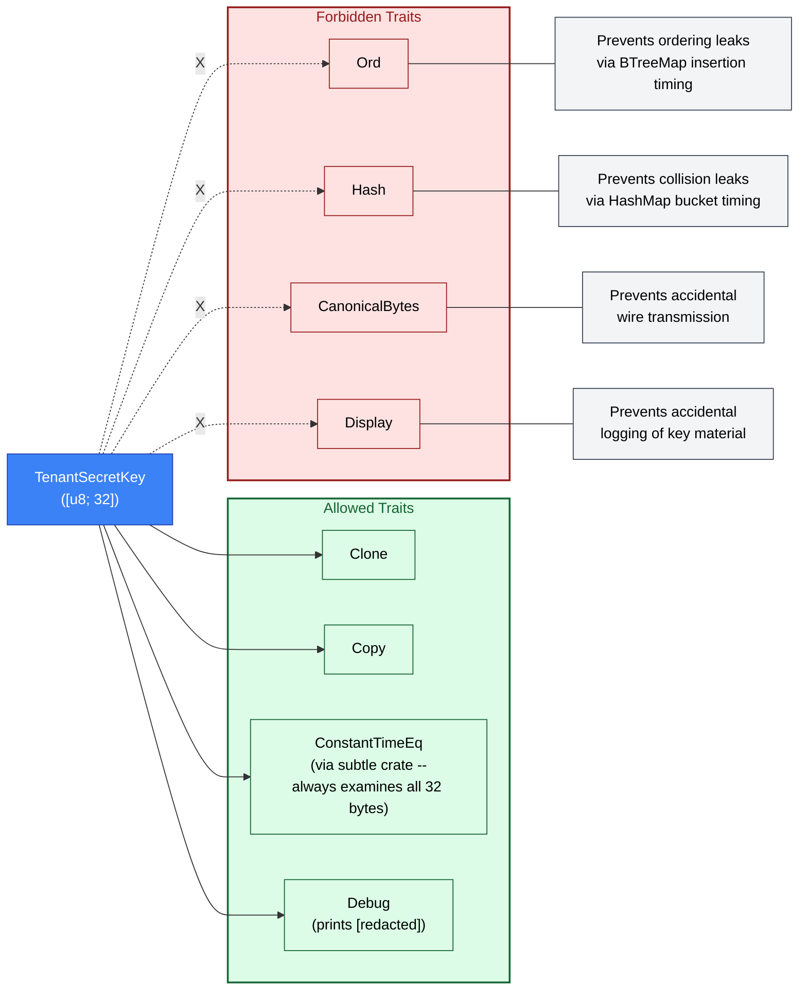
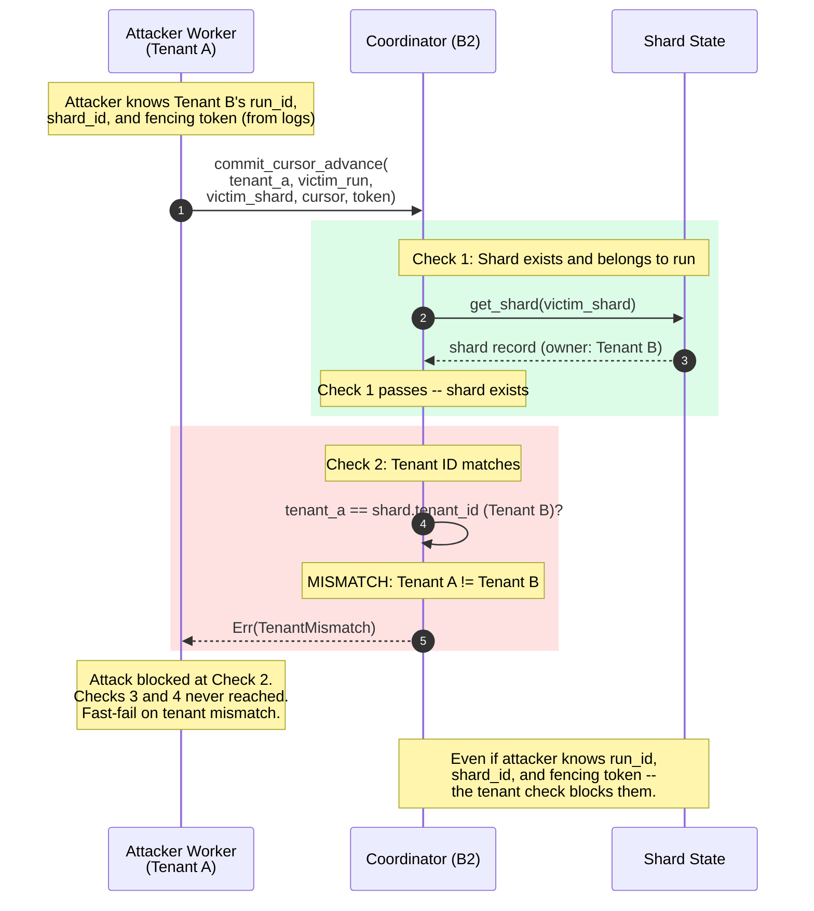
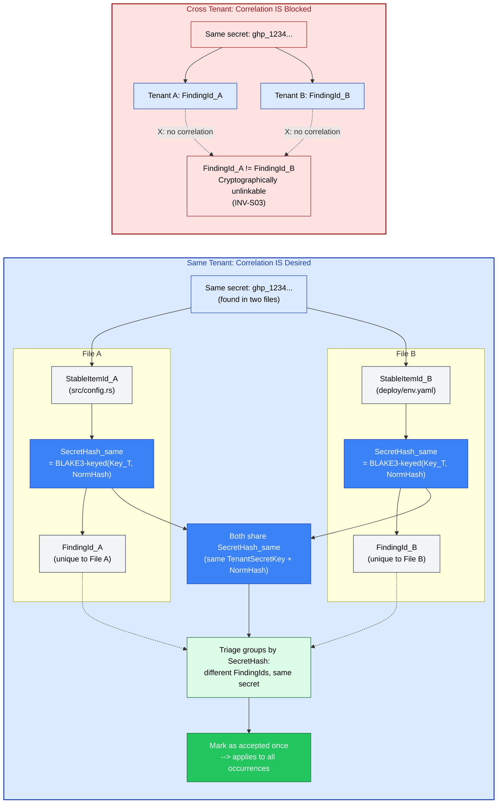

# Tenant Isolation

Multi-tenant secret scanning introduces a class of threats that single-tenant systems
never encounter. When two organizations share the same scanning infrastructure, the
system must guarantee that tenant A cannot learn anything about tenant B's secrets --
not their values, not their locations, not even whether two tenants share the same
secret. A leak of this kind is worse than a data breach: it is a *correlation breach*,
allowing an attacker to map the blast radius of a compromised credential across
organizations without ever seeing the credential itself.

Gossip-rs prevents this through three defense-in-depth layers that operate at different
abstraction levels. Any single layer is sufficient to block cross-tenant access, but
all three are active simultaneously, ensuring that a bug in one layer does not
compromise tenant isolation. The governing invariant is:

> **INV-S03**: IDs derived from different tenants are cryptographically unlinkable.
> Cross-tenant correlation is computationally infeasible.

The threat model covers four attack categories:

1. **Cross-tenant data leakage** -- a worker returns findings belonging to another tenant.
2. **Cross-tenant correlation** -- an attacker determines whether two tenants share the
   same secret by comparing FindingIds or SecretHashes.
3. **Cross-tenant impersonation** -- a worker submits mutations (cursor advances, shard
   completions) against another tenant's shards.
4. **Operational isolation failure** -- triage decisions, scan progress, or detection
   state from one tenant leaks into another tenant's view.

The three layers address these threats at different points in the stack:

- **Layer 1 (Coordination)**: TenantId is verified on every mutating operation via the
  5-check validation preamble. A worker cannot advance a cursor, complete a shard, or
  split a shard belonging to another tenant.
- **Layer 2 (Identity)**: BLAKE3 keyed-mode hashing with a per-tenant 32-byte
  TenantSecretKey ensures that the same raw secret produces a completely different
  SecretHash for each tenant. FindingId includes TenantId as an input, so even if the
  SecretHash were somehow identical (it is not), the FindingId would still differ.
- **Layer 3 (API)**: Every public API function requires TenantId as its first parameter.
  Omitting it is a compile-time error. There is no code path that can accidentally
  operate in a "tenant-less" context.

Performance impact is minimal: the cryptographic overhead is approximately 1% of total
request latency, dominated by I/O rather than hashing. BLAKE3 is hardware-accelerated
on modern CPUs and processes the 32-byte inputs in a single compression call.

---

## Diagram 1: Three Isolation Layers

The three layers form a defense-in-depth stack. An attack must bypass all three layers
to achieve cross-tenant access. The outermost layer (API enforcement) is checked at
compile time -- it cannot be bypassed at runtime at all. The middle layer (Identity)
provides cryptographic guarantees that hold even if the coordination layer has bugs.
The innermost layer (Coordination) provides runtime enforcement on every mutation.

Arrows flow inward: API enforcement gates access to the identity layer, which feeds
into coordination-level checks. Each layer is colored according to its boundary
ownership.

Layer 3 (grey, cross-cutting) is enforced by the Rust type system at compile time. If a
developer writes a function that processes scan results without accepting a TenantId
parameter, the code will not compile -- the downstream identity and coordination calls
all require it. Layer 2 (blue, B1 Identity) provides cryptographic isolation: even if a
bug allowed a worker to see another tenant's SecretHash, the attacker could not correlate
it with their own tenant's data because the keyed hash outputs are independent. Layer 1
(green, B2 Coordination) provides runtime enforcement: every shard mutation passes through
the 5-check preamble, and Check 2 verifies tenant ownership before any state change occurs.

---

## Diagram 2: Cross-Tenant Correlation Attack Analysis

This diagram traces the most sophisticated attack against tenant isolation: a cross-tenant
correlation attack. The attacker has legitimate access to tenant A and wants to determine
whether tenant B has the same secret (for example, a shared GitHub personal access token
that was committed to both organizations' repositories).

The attack fails at three independent points, each of which is sufficient on its own to
prevent correlation. The dashed lines with X marks show the blocked attack paths.

The attack fails for three independent reasons:

1. **Preimage resistance**: The attacker cannot reverse BLAKE3 to recover NormHash from
   SecretHash_A. BLAKE3 provides 256-bit preimage resistance, meaning the computational
   cost of inverting the hash exceeds 2^128 operations.
2. **Key secrecy**: Even if the attacker could somehow obtain NormHash, they cannot compute
   SecretHash_B without TenantSecretKey_B. The key is a 256-bit random value that never
   leaves the tenant's security boundary. Brute-forcing 2^256 possible keys is physically
   impossible.
3. **Unlinkability**: FindingId_A and FindingId_B differ in *two* ways -- different
   TenantId inputs and different SecretHash inputs. Even a theoretical attack that
   bypassed one difference would still face the other. The FindingIds are
   cryptographically unlinkable (INV-S03).

---

## Diagram 3: TenantSecretKey Trait Design

TenantSecretKey is a 32-byte type with a deliberately restricted trait surface. The traits
it implements -- and, critically, the traits it *does not* implement -- are security
decisions, not convenience omissions. Each forbidden trait prevents a specific class of
side-channel attack.

The allowed traits serve specific purposes:

- **Clone / Copy**: Required so that TenantSecretKey can be passed to multiple derivation
  functions without ownership transfer. BLAKE3 keyed-mode hashing consumes the key by
  value, so copying is necessary for repeated use.
- **ConstantTimeEq** (from the `subtle` crate): Equality comparison always examines all
  32 bytes regardless of whether the first byte matches or not. This prevents timing
  attacks where an attacker measures how long a comparison takes to determine how many
  leading bytes of the key they have guessed correctly.
- **Debug**: Implemented manually to print `[redacted]` instead of the actual key bytes.
  This allows TenantSecretKey to appear in debug output, error messages, and log
  statements without leaking key material.

The forbidden traits each prevent a distinct attack vector:

- **Ord**: If TenantSecretKey implemented `Ord`, it could be inserted into a `BTreeMap`.
  BTreeMap insertions perform comparisons that short-circuit on the first differing byte,
  creating a timing side-channel. An attacker with precise timing measurements could
  determine the key one byte at a time.
- **Hash**: If TenantSecretKey implemented `Hash`, it could be inserted into a `HashMap`.
  The hash function used by HashMap is not cryptographic and could leak information about
  the key through collision patterns and bucket distribution.
- **CanonicalBytes**: This trait enables serialization to a wire format. Implementing it
  for TenantSecretKey would allow the key to be accidentally included in network messages,
  persistence records, or other exported data.
- **Display**: Unlike Debug (which is for developers), Display is for user-facing output.
  Implementing it would risk the key appearing in UI elements, HTTP responses, or
  user-visible log messages.

---

## Diagram 4: 5-Check Tenant Validation Focus

This sequence diagram shows a specific attack scenario: a worker operating on behalf of
tenant A attempts to mutate a shard belonging to tenant B. The attacker has somehow
obtained the victim's run_id, shard_id, and fencing token (perhaps from leaked log files
or a compromised monitoring system). Despite having all of this information, the attack
fails at Check 2 of the 5-check preamble.

The ordering of checks is deliberate. Tenant mismatch is Check 2 (immediately after
shard existence) because it is a security boundary violation that should be caught before
any business logic executes. The coordinator does not evaluate the fencing token (Check 3)
or the shard state (Check 4) -- there is no point validating whether a token is fresh if
the caller has no right to use the shard at all.

This fast-fail behavior also limits information leakage. The attacker learns only that the
shard exists (from Check 1 passing) and that they are not authorized (from Check 2
failing). They do not learn whether the fencing token is valid or what state the shard is
in, because those checks are never reached.

---

## Diagram 5: Same-Tenant Correlation (Intentional)

Cross-tenant correlation is forbidden, but *same-tenant* correlation is a feature.
When the same secret appears in multiple files within a single tenant, each occurrence
gets a distinct FindingId (because FindingId depends on StableItemId, which varies per
file). However, all occurrences share the same **SecretHash** -- since SecretHash is
derived solely from TenantSecretKey and NormHash, it is independent of where the secret
was found. The triage system groups findings by SecretHash (via a TriageGroupKey), so
an operator marks a secret as "accepted" once and that decision automatically applies
to every occurrence across all scanned files. `TriageGroupKey` has a domain separation
constant in `identity/domain.rs` (`TRIAGE_GROUP_KEY_V1`), and the concrete persistence
type definition lives in the persistence contracts.

The left side shows same-tenant behavior. Both `src/config.rs` and `deploy/env.yaml`
contain the same GitHub PAT. Because both files are scanned under the same tenant, they
use the same TenantSecretKey, producing the same SecretHash. However, each file has a
distinct StableItemId, so the FindingIds differ (FindingId_A vs FindingId_B). The triage
system correlates findings by SecretHash (via a TriageGroupKey), not by FindingId
equality. Marking the secret as "accepted" once applies to every occurrence that shares
the same SecretHash, regardless of which file it appears in.

The right side shows cross-tenant behavior. The same GitHub PAT exists in both tenant A
and tenant B. Despite the raw secret being identical, the different TenantSecretKeys
produce different SecretHashes, and the different TenantIds provide a second layer of
divergence. The resulting FindingIds are cryptographically unlinkable -- no amount of
computation can determine that they refer to the same underlying secret (INV-S03).

This asymmetry is the core design insight: correlation is a feature *within* a tenant
(it powers triage grouping) and a vulnerability *across* tenants (it would enable
reconnaissance). The identity system provides both properties simultaneously through
the keyed hash construction.

---

## Cross-References

| Topic                                            | Diagram File                                                    |
| ------------------------------------------------ | --------------------------------------------------------------- |
| ID derivation DAG (full 19-type hierarchy)       | [03-id-derivation-dag.md](03-id-derivation-dag.md)              |
| Secret identity chain (BLAKE3 keyed mode detail) | [03-id-derivation-dag.md](03-id-derivation-dag.md) -- Section 3 |
| Finding identity chain (FindingId derivation)    | [03-id-derivation-dag.md](03-id-derivation-dag.md) -- Section 4 |
| 5-check validation preamble (full flow)          | [06-fencing-protocol.md](06-fencing-protocol.md) -- Diagram 1   |
| Fencing decision tree (all error paths)          | [06-fencing-protocol.md](06-fencing-protocol.md) -- Diagram 4   |
| Five-boundary architecture (B1, B2 placement)    | [01-system-overview.md](01-system-overview.md)                  |

## Source Code References

| File                                              | Purpose                                                                               |
| ------------------------------------------------- | ------------------------------------------------------------------------------------- |
| `crates/gossip-contracts/src/identity/finding.rs` | `SecretHash`, `FindingId` types; `key_secret_hash()`, `derive_finding_id()` functions |
| `crates/gossip-contracts/src/identity/types.rs`   | `TenantId`, `TenantSecretKey` root types; restricted trait surface                    |
| `crates/gossip-contracts/src/identity/domain.rs`  | Domain-separation constants (`SECRET_HASH_V1`, `FINDING_ID_V1`)                       |
| `crates/gossip-contracts/src/identity/`           | Full identity boundary (B1) implementation                                            |
| `crates/gossip-contracts/src/coordination/`       | Coordination data types (shard_spec, cursor, pooled, manifest, limits)                |
| `crates/gossip-coordination/src/`                 | Coordination protocol (B2) with 5-check validation preamble                           |
