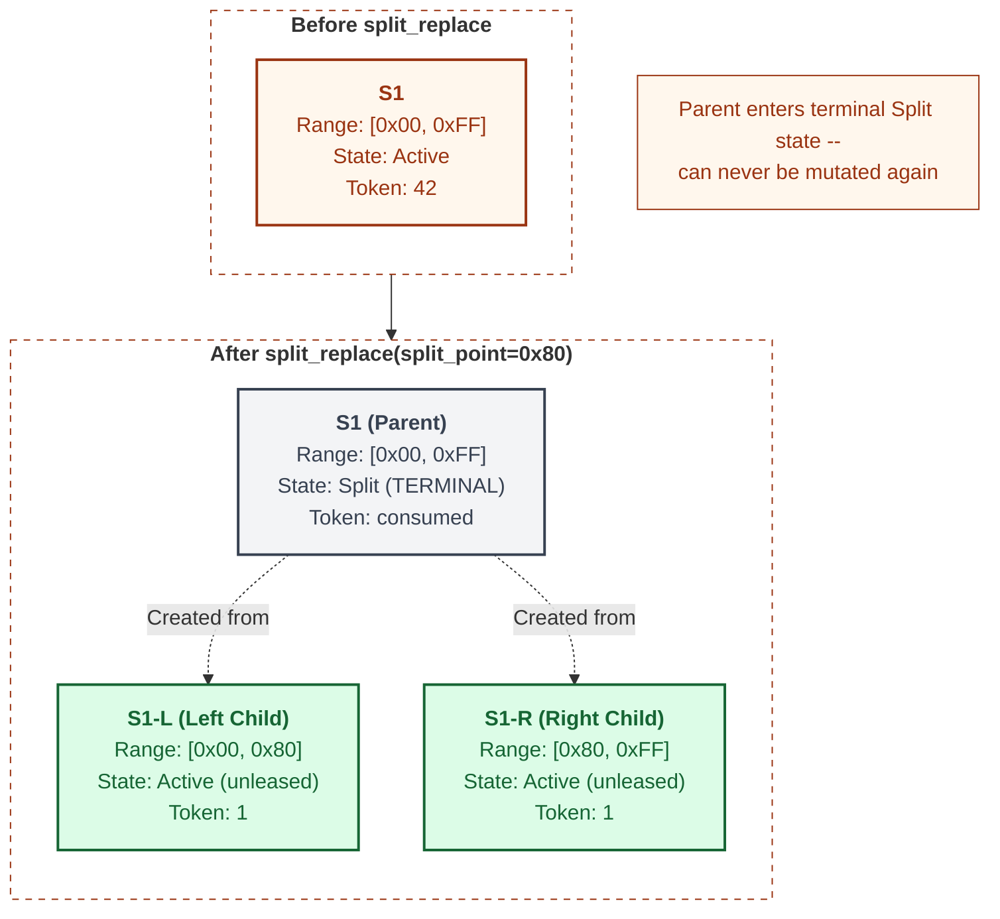
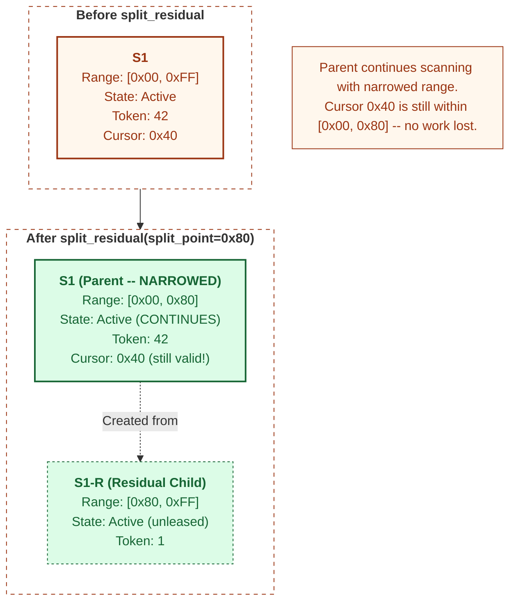
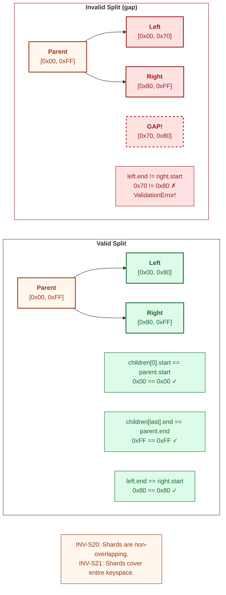
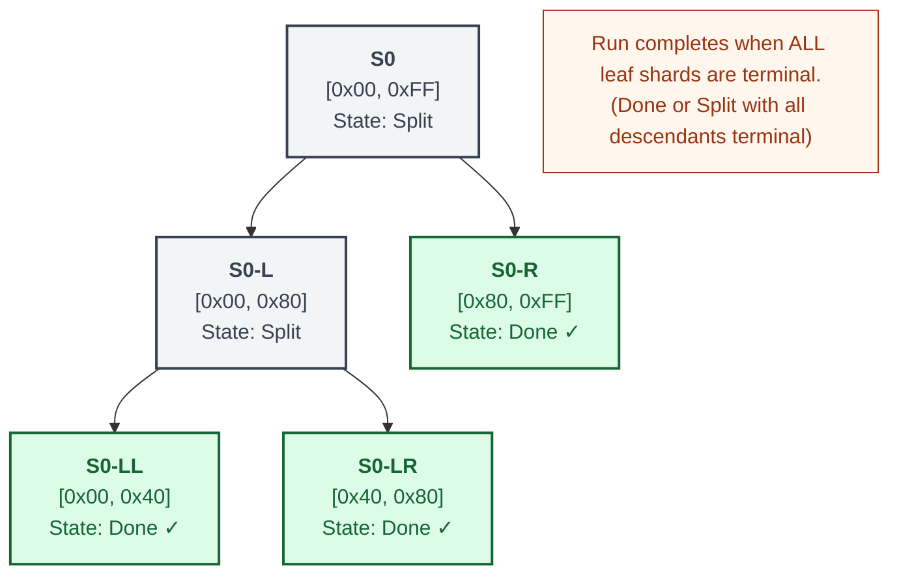
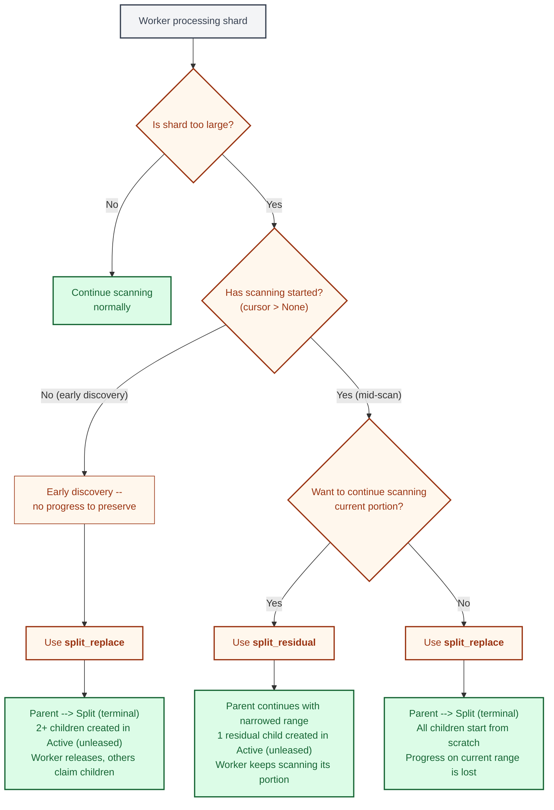

# Split Operations

Split operations are the mechanism by which Gossip-rs dynamically redistributes
work across workers at runtime. When a shard turns out to be too large for a
single worker to process efficiently, the coordinator splits it into smaller
children that can be claimed independently. This is not a rare edge case -- it is
a core part of the system's elasticity model. Without splitting, the initial
shard partitioning would be permanent, and any imbalance in data distribution
would persist for the entire run.

Gossip-rs provides two distinct split operations, each serving a different
purpose:

- **`split_replace`** (terminal split) -- the parent shard enters the terminal
  `Split` state and is replaced entirely by its children. The parent can
  never be mutated again. This is used when the worker has not yet begun
  scanning, or when a complete restart of all sub-ranges is acceptable.

- **`split_residual`** (non-terminal split) -- the parent shard continues
  scanning with a narrowed range, and a residual child is carved off for another
  worker. The parent remains `Active` and keeps its cursor. This is used when a
  worker is mid-scan and wants to shed load without losing progress.

Both operations are validated against strict coverage invariants: children must
cover the parent's entire key range with no gaps and no overlaps. Child shard IDs
are derived deterministically using the `SPLIT_ID_V1` domain hash, so retrying
the same split produces the same children -- making the operation idempotent
at the identity level.

---

## 1. split_replace (Terminal Split)

`split_replace` is the simpler and more common of the two split types. The worker
decides (typically during early shard evaluation) that the shard is too large to
process as a single unit. It submits a `SplitReplacePlan` with a split point, and
the coordinator:

1. Validates the caller's fencing token (5-check preamble).
2. Validates coverage: the children's ranges must exactly partition the parent's range.
3. Transitions the parent to the terminal `Split` state.
4. Creates new child shards in the `Active` (unleased) state with fresh, independent tokens.

The parent's token is consumed -- it can never be used again. The parent is
effectively retired. Other workers will discover and claim the children through
the normal lease protocol.

Key observations:

- The parent shard turns grey because it is now terminal. No worker can acquire,
  advance, complete, or further split it.
- Both children start in `Active` (unleased) with FenceEpoch::INITIAL (1). They must be claimed
  through the normal lease protocol before any scanning can occur.
- The dashed arrows indicate the derivation relationship, not a runtime message.
  Child IDs are computed deterministically from the parent ID and split point
  using the `SPLIT_ID_V1` domain separator.

---

## 2. split_residual (Non-Terminal Split)

`split_residual` is the more nuanced operation. A worker is mid-scan -- its cursor
is at position `0x40` within range `[0x00, 0xFF]` -- and it determines that it
should shed the upper portion of the range. Rather than abandoning all progress
and starting over (as `split_replace` would require), the worker submits a
`SplitResidualPlan` that:

1. **Narrows** the parent's range to `[0x00, 0x80]` -- the portion containing
   the current cursor.
2. **Creates** a single residual child `S1-R` covering `[0x80, 0xFF]` in the
   `Active` (unleased) state.
3. **Preserves** the parent's `Active` state, its fencing token, and its cursor.

The parent keeps scanning without interruption. The residual child is available
for another worker to claim. This is pure load shedding with zero wasted work.

**Terminal vs. non-terminal ownership semantics:**
- `split_replace` consumes `self` on `WorkerSession` — the session cannot be used after the split (compile-time enforcement). Parent transitions to the terminal `Split` state.
- `split_residual` takes `&mut self` — the session remains usable. Parent stays `Active` with a narrowed range and keeps its lease and fencing token.

The critical constraint for `split_residual` is that the parent's cursor must
fall within the narrowed range. If the cursor were at `0x90` and the split point
were `0x80`, the cursor would end up outside the parent's new range -- an
invariant violation. The coordinator validates this before applying the split.

The parent retains its fencing token (42) and continues using it for subsequent
mutations. The residual child gets an independent fresh token. There is no token
sharing between parent and child.

---

## 3. Range Coverage Validation

Every split operation must satisfy two invariants:

- **INV-S20**: Shards are non-overlapping. No two sibling shards may cover the
  same portion of the key space.
- **INV-S21**: Shards cover the entire keyspace. The union of all child ranges
  must exactly equal the parent's original range.

These invariants are enforced by the `validate_split_coverage()` function in the coordination
backend and are verified in the shard lifecycle tests (see [Shard and Run State Machines](./05-shard-and-run-state-machines.md)
for the shard state machine that constrains when splits can occur).

The coordinator checks three conditions to enforce these invariants:

1. The first child's start must equal the parent's start.
2. The last child's end must equal the parent's end.
3. For every adjacent pair of children, the left child's end must equal the right
   child's start (contiguous, no gaps, no overlaps).

If validation fails, the coordinator returns a `SplitError::SplitInvalid(SplitValidationError)`
and no state changes occur. The parent remains in its original state, and no
children are created. This makes the validation check a gate, not a cleanup step
-- the system never enters a state with gaps or overlaps.

---

## 4. Nested Split Tree

Splits are not limited to a single level. A child shard created by a split can
itself be split later, producing a tree of shard derivations. This happens
naturally when the initial split produces children that are still too large, or
when data distribution within a range is highly skewed.

The run completion algorithm must account for this recursion. A run is complete
when **all leaf shards are terminal** -- meaning every shard that does not have
children has reached `Done`, `Split` (with all its descendants terminal), or
another terminal state.

In this example:

| Shard | Range        | State | Terminal? | Notes                             |
| :---- | :----------- | :---- | :-------- | :-------------------------------- |
| S0    | [0x00, 0xFF] | Split | Yes       | Root, replaced by S0-L and S0-R   |
| S0-L  | [0x00, 0x80] | Split | Yes       | Itself split into S0-LL and S0-LR |
| S0-R  | [0x80, 0xFF] | Done  | Yes       | Leaf -- scanned successfully      |
| S0-LL | [0x00, 0x40] | Done  | Yes       | Leaf -- scanned successfully      |
| S0-LR | [0x40, 0x80] | Done  | Yes       | Leaf -- scanned successfully      |

All five shards are terminal. The three leaves (S0-R, S0-LL, S0-LR) are
`Done`, and the two interior nodes (S0, S0-L) are `Split`. Coverage is
preserved at every level: S0-LL + S0-LR = S0-L, and S0-L + S0-R = S0. The run
is complete.

---

## 5. Split Decision Flowchart

Workers use this decision tree to determine which split operation to invoke and
when. The decision depends on two factors: whether scanning has started (i.e.,
whether the cursor is non-`None`) and whether the worker wants to continue
processing the current portion of the range.

The decision breaks down as follows:

- **Shard not too large** -- no split needed. The worker continues scanning
  normally and completes the shard in the usual way.

- **Shard too large, no scanning started** -- `split_replace` is the clear
  choice. There is no progress to preserve, and the parent can be cleanly
  retired. The children start fresh, and other workers can claim them in
  parallel.

- **Shard too large, scanning in progress, want to keep going** --
  `split_residual` lets the worker shed the unscanned portion without losing
  any work. The parent's range narrows, its cursor stays valid, and a single
  residual child is created for someone else.

- **Shard too large, scanning in progress, want to restart** -- `split_replace`
  is used even though there is a cursor. The worker accepts the loss of
  progress in exchange for a cleaner partition. This is rare but valid -- for
  example, when the worker detects that the data distribution within its range
  is heavily skewed and a fresh partition would be more balanced.

---

## Design Principles

Several cross-cutting design decisions underpin both split operations:

**Deterministic child IDs.** Child shard IDs are derived from a `SPLIT_ID_V1`
domain hash over the parent ID and split parameters. If a worker retries the
same split (e.g., after a transient network failure), the coordinator produces
the exact same child IDs. This prevents duplicate children from accumulating
and makes the identity layer idempotent.

**Fencing across splits.** The parent's fencing token is validated through the
standard 5-check preamble before the split is applied. After a `split_replace`,
the parent's token is consumed and can never be reused. After a
`split_residual`, the parent retains its token. Children always receive fresh
FenceEpoch::INITIAL (1) that are independent of the parent's token lineage.

**Coverage is a hard invariant.** The coverage validation is not advisory -- it
is a gate. If the children's ranges do not exactly partition the parent's range,
the split is rejected and no state changes. This prevents the system from ever
entering a state where portions of the keyspace are unscanned (gap) or
double-scanned (overlap).

**Nested splits are recursive.** The run completion algorithm walks the shard
tree recursively. A `Split` parent is considered terminal only if all of its
descendants are also terminal. This means splits at any depth are handled
uniformly, with no special-casing for the root level.

**Spawn-cap validation.** Each split operation validates that the number of
children being created does not exceed the configured spawn cap. This prevents
a single split from creating an excessive number of children that could
overwhelm the coordinator's shard tracking.

---

## Cross-References

- [Shard and Run State Machines](./05-shard-and-run-state-machines.md) -- the
  `Split` terminal state and how it fits into the shard lifecycle
- [Fencing Protocol](./06-fencing-protocol.md) -- the 5-check validation
  preamble that gates every split operation
- [ID Derivation DAG](./03-id-derivation-dag.md) -- `SPLIT_ID_V1` domain
  separator used for deterministic child ID derivation
- [System Overview](./01-system-overview.md) -- B2 Coordination and B3 Shard
  Algebra boundaries that house split logic
- [Shard Algebra Types](./13-shard-algebra-types.md) -- B3 deep dive covering
  key encoding, hint framing, builder lifecycle, and connector enumeration

## Source Code References

| File                                                     | Purpose                                                                      |
| :------------------------------------------------------- | :--------------------------------------------------------------------------- |
| `crates/gossip-contracts/src/coordination/split.rs`      | `SplitReplacePlan`, `SplitResidualPlan`, `plan_split_replace_at_points()`    |
| `crates/gossip-coordination/src/split_execution.rs`      | `derive_split_shard_id()`, `DerivedShardKind`, payload hash                  |
| `crates/gossip-contracts/src/coordination/shard_spec.rs` | `validate_split_coverage()`, `validate_split_coverage_bounds()`, `ShardSpec` |
| `crates/gossip-coordination/src/error.rs`                | `SplitError::SplitInvalid(SplitValidationError)`                             |
| `crates/gossip-coordination/src/traits.rs`               | `CoordinationBackend::split_replace()`, `split_residual()`                   |
| `crates/gossip-coordination/src/record.rs`               | `ShardStatus::Split`, `ShardRecord`                                          |
| `crates/gossip-frontier/src/hint.rs`                     | `propagate_hint_on_split()`                                                  |
| `crates/gossip-frontier/src/builder.rs`                  | `PreallocShardBuilder::split_range_by_boundaries()`                          |
| `crates/gossip-contracts/src/connector/api.rs`           | `EnumerationConnector::choose_split_point()`                                 |
