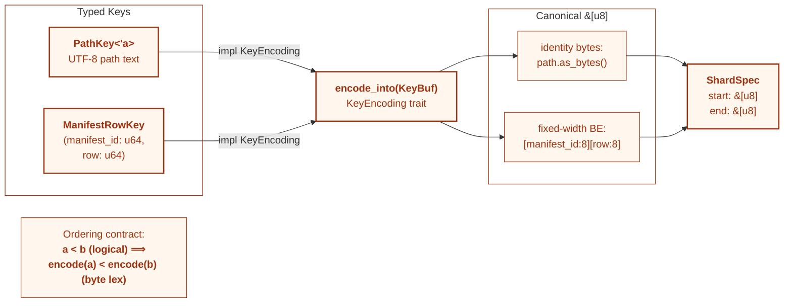
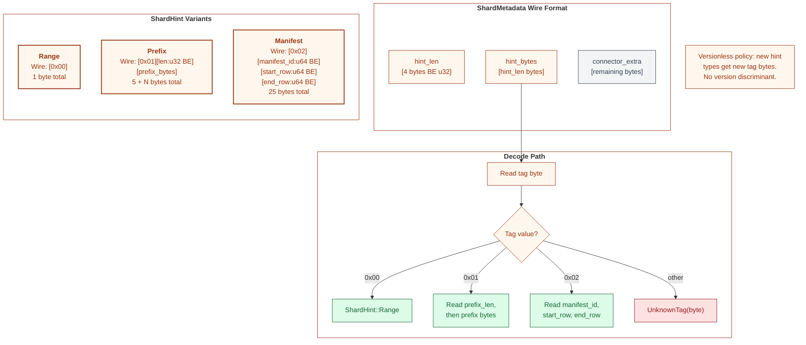
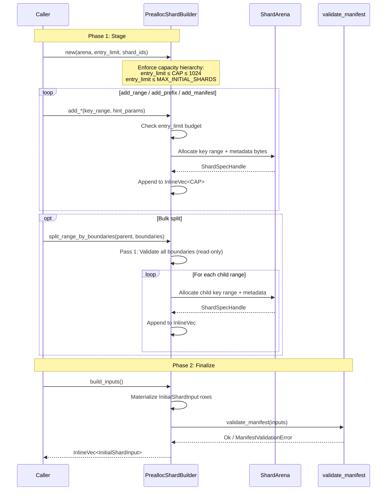
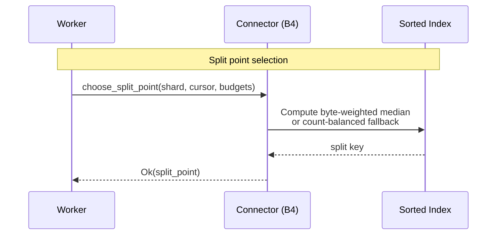
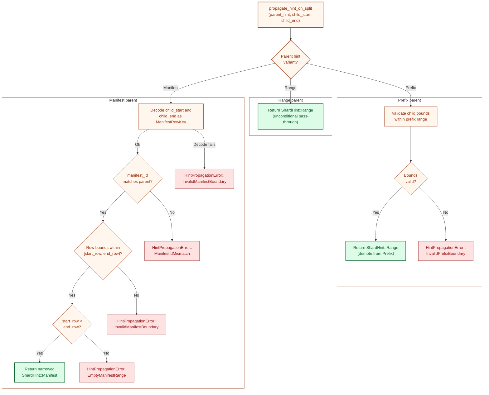

# Shard Algebra Types

This document is the Boundary 3 (Shard Algebra) deep dive, paralleling
[03-id-derivation-dag.md](03-id-derivation-dag.md) for B1 (Identity). It covers
the type hierarchy, key encoding contract, key-range arithmetic, shard hint wire
framing, the preallocated shard builder, connector split-point lifecycle, and
split hint propagation.

B3 spans two crates. `gossip-contracts` provides the shard data model: `ShardSpec`,
`ShardSpecRef`, `ShardArena`, split plans, and coverage validation. `gossip-frontier`
provides the key encoding trait, typed key implementations, key-range arithmetic,
shard hint framing, and the preallocated shard builder. Both crates are Tier 0:
they depend only on B1 (Identity) and `gossip-stdx`, with no I/O or async runtime.

All diagrams use the B3 orange color palette (fill `#FFF7ED`, stroke `#9A3412`).

---

## 1. Shard Algebra Type Hierarchy

The diagram below shows all major B3 types and their relationships across the two
crates. The left subgraph contains the pure data model in `gossip-contracts`:
`ShardSpec` (owned), `ShardSpecRef` (borrowed view), `ShardArena` (slab allocator),
`ShardSpecHandle` (arena index), and the split planning types. The right subgraph
contains the key encoding and hint types in `gossip-frontier`: the `KeyEncoding`
trait, typed key implementations, `ShardHint`, `ShardMetadata`, and the
`PreallocShardBuilder`.

The `IntoShardSpecRef` trait bridges the two: it allows generic functions
(like `validate_split_coverage`) to accept either `&ShardSpec`, `ShardSpecRef`,
or an arena handle transparently.

```mermaid
%% Diagram: shard-algebra-type-hierarchy
graph TD
    subgraph contracts["gossip-contracts (B3 data model)"]
        ShardSpec["<b>ShardSpec</b><br/>Owned shard: start, end,<br/>metadata bytes"]
        ShardSpecRef["<b>ShardSpecRef&lt;'a&gt;</b><br/>Borrowed view into<br/>arena or stack"]
        ShardArena["<b>ShardArena</b><br/>Slab allocator for<br/>shard key ranges + metadata"]
        ShardSpecHandle["<b>ShardSpecHandle</b><br/>Arena slot index<br/>(u32 slot + u32 generation + u32 arena_id)"]
        IntoShardSpecRef["<b>IntoShardSpecRef</b><br/>(trait) Generic shard<br/>access for validation"]
        SplitReplacePlan["<b>SplitReplacePlan</b><br/>Terminal split:<br/>parent → N children"]
        SplitResidualPlan["<b>SplitResidualPlan</b><br/>Non-terminal split:<br/>parent narrows + residual"]
        SplitValidationError["<b>SplitValidationError</b><br/>Gap, overlap,<br/>boundary mismatch"]
    end

    subgraph frontier["gossip-frontier (B3 key encoding &amp; hints)"]
        KeyEncoding["<b>KeyEncoding</b><br/>(trait) encode_into(KeyBuf)<br/>order-preserving"]
        PathKey["<b>PathKey&lt;'a&gt;</b><br/>UTF-8 identity encoding"]
        ManifestRowKey["<b>ManifestRowKey</b><br/>16-byte BE (u64, u64)"]
        KeyBuf["<b>KeyBuf</b><br/>Fixed-capacity<br/>key buffer"]
        ShardHint["<b>ShardHint&lt;'a&gt;</b><br/>Range | Prefix | Manifest"]
        ShardMetadata["<b>ShardMetadata&lt;'a&gt;</b><br/>hint + connector_extra<br/>envelope"]
        MetadataBuf["<b>MetadataBuf</b><br/>Fixed-capacity<br/>metadata buffer"]
        ShardSpecScratch["<b>ShardSpecScratch</b><br/>Reusable scratch for<br/>shard construction"]
        PreallocShardBuilder["<b>PreallocShardBuilder&lt;'a, CAP&gt;</b><br/>Two-phase staged builder<br/>with arena allocation"]
    end

    PathKey -->|"impl"| KeyEncoding
    ManifestRowKey -->|"impl"| KeyEncoding
    KeyEncoding -->|"writes into"| KeyBuf

    ShardSpecHandle -->|"resolves via"| ShardArena
    ShardArena -->|"produces"| ShardSpecRef
    ShardSpec -->|"borrows as"| ShardSpecRef
    ShardSpecRef -->|"impl"| IntoShardSpecRef
    ShardSpec -->|"impl"| IntoShardSpecRef

    ShardHint -->|"framed inside"| ShardMetadata
    ShardMetadata -->|"encoded into"| MetadataBuf
    PreallocShardBuilder -->|"allocates via"| ShardArena
    PreallocShardBuilder -->|"uses"| ShardSpecScratch

    style contracts fill:none,stroke:#9A3412,stroke-width:1px
    style frontier fill:none,stroke:#9A3412,stroke-width:1px

    style ShardSpec fill:#FFF7ED,stroke:#9A3412,stroke-width:2px,color:#9A3412
    style ShardSpecRef fill:#FFF7ED,stroke:#9A3412,stroke-width:2px,color:#9A3412
    style ShardArena fill:#FFF7ED,stroke:#9A3412,stroke-width:2px,color:#9A3412
    style ShardSpecHandle fill:#FFF7ED,stroke:#9A3412,stroke-width:2px,color:#9A3412
    style IntoShardSpecRef fill:#FFF7ED,stroke:#9A3412,stroke-width:2px,color:#9A3412
    style SplitReplacePlan fill:#FFF7ED,stroke:#9A3412,stroke-width:2px,color:#9A3412
    style SplitResidualPlan fill:#FFF7ED,stroke:#9A3412,stroke-width:2px,color:#9A3412
    style SplitValidationError fill:#FEE2E2,stroke:#991B1B,stroke-width:1px,color:#991B1B

    style KeyEncoding fill:#FFF7ED,stroke:#9A3412,stroke-width:2px,color:#9A3412
    style PathKey fill:#FFF7ED,stroke:#9A3412,stroke-width:2px,color:#9A3412
    style ManifestRowKey fill:#FFF7ED,stroke:#9A3412,stroke-width:2px,color:#9A3412
    style KeyBuf fill:#FFF7ED,stroke:#9A3412,stroke-width:2px,color:#9A3412
    style ShardHint fill:#FFF7ED,stroke:#9A3412,stroke-width:2px,color:#9A3412
    style ShardMetadata fill:#FFF7ED,stroke:#9A3412,stroke-width:2px,color:#9A3412
    style MetadataBuf fill:#FFF7ED,stroke:#9A3412,stroke-width:2px,color:#9A3412
    style ShardSpecScratch fill:#FFF7ED,stroke:#9A3412,stroke-width:2px,color:#9A3412
    style PreallocShardBuilder fill:#FFF7ED,stroke:#9A3412,stroke-width:2px,color:#9A3412
```

Key observations:

- **Ownership split.** `ShardSpec` owns its key-range and metadata bytes on the heap.
  `ShardSpecRef` borrows them from either a stack-local `ShardSpec` or an arena slot.
  `ShardSpecHandle` is a validated index into `ShardArena` that can be resolved to a
  `ShardSpecRef` without allocation.
- **Trait unification.** `IntoShardSpecRef` lets `validate_split_coverage` and other
  generic validation functions accept any shard representation without monomorphizing
  over every concrete type.
- **Builder lifecycle.** `PreallocShardBuilder` borrows a `ShardArena`, stages entries
  into an `InlineVec`, and materializes `InitialShardInput` rows at build time.

---

## 2. Key Encoding Flow

Every shard key passes through the `KeyEncoding` trait to produce a canonical
byte representation that preserves logical ordering under lexicographic byte
comparison. This ordering contract is the foundation of all shard-range arithmetic:
range bounds, split points, and coverage checks all operate on encoded `&[u8]` bytes.

**PathKey** encodes as raw UTF-8 bytes with no normalization, no separator rewriting,
and no case folding. This keeps encoding deterministic and allocation-free, but
callers that need canonical path semantics must normalize before constructing the key.

**ManifestRowKey** encodes as two big-endian `u64` fields in a fixed 16-byte layout.
Lexicographic byte ordering matches tuple ordering: compare by `manifest_id` first,
then by `row`. The fixed width avoids delimiters and keeps decode cost constant.

Source: `crates/gossip-frontier/src/key_encoding.rs`

---

## 3. Key Range Arithmetic

Three pure functions in `key_encoding.rs` underpin all split planning. They operate
on raw `&[u8]` slices and a `KeyBuf` output buffer, producing the byte values needed
to compute split points and child range boundaries.

```mermaid
%% Diagram: key-range-arithmetic
graph TD
    subgraph PS["<b>prefix_successor(prefix, buf)</b><br/>Find rightmost non-0xFF byte,<br/>truncate, increment"]
        PS_IN["prefix: &amp;[u8]"] --> PS_SCAN["Scan right-to-left<br/>for byte &lt; 0xFF"]
        PS_SCAN -->|"Found at i"| PS_TRUNC["Truncate to prefix[..=i]"]
        PS_TRUNC --> PS_INC["Increment byte at i"]
        PS_INC --> PS_OUT["Result: first key<br/>outside prefix range"]
        PS_SCAN -->|"All 0xFF"| PS_NONE["None<br/>(prefix covers<br/>max keyspace)"]
    end

    subgraph KS["<b>key_successor(key, buf)</b><br/>Append 0x00 byte"]
        KS_IN["key: &amp;[u8]"] --> KS_CHECK{"key.len() &lt;<br/>MAX_KEY_SIZE?"}
        KS_CHECK -->|"Yes"| KS_APPEND["Append 0x00"]
        KS_APPEND --> KS_OUT["Result: next key<br/>in lex order"]
        KS_CHECK -->|"No"| KS_NONE["None<br/>(key at max width)"]
    end

    subgraph BM["<b>byte_midpoint(a, b, out)</b><br/>4-phase bisection"]
        BM_IN["a, b: &amp;[u8]"] --> BM_PAD["Phase 1: Pad shorter<br/>operand with 0x00"]
        BM_PAD --> BM_ADD["Phase 2: Byte-wise<br/>add with carry"]
        BM_ADD --> BM_HALF["Phase 3: Right-shift<br/>sum by 1 (halve)"]
        BM_HALF --> BM_NORM["Phase 4: Truncate<br/>trailing zeros"]
        BM_NORM --> BM_CHECK{"mid != a<br/>AND mid != b?"}
        BM_CHECK -->|"Yes"| BM_OUT["Result: midpoint<br/>between a and b"]
        BM_CHECK -->|"No"| BM_FALLBACK["Fallback:<br/>key_successor(a)"]
    end

    style PS fill:none,stroke:#9A3412,stroke-width:1px
    style KS fill:none,stroke:#9A3412,stroke-width:1px
    style BM fill:none,stroke:#9A3412,stroke-width:1px

    style PS_IN fill:#FFF7ED,stroke:#9A3412,stroke-width:1px,color:#9A3412
    style PS_SCAN fill:#FFF7ED,stroke:#9A3412,stroke-width:1px,color:#9A3412
    style PS_TRUNC fill:#FFF7ED,stroke:#9A3412,stroke-width:1px,color:#9A3412
    style PS_INC fill:#FFF7ED,stroke:#9A3412,stroke-width:1px,color:#9A3412
    style PS_OUT fill:#DCFCE7,stroke:#166534,stroke-width:1px,color:#166534
    style PS_NONE fill:#FEE2E2,stroke:#991B1B,stroke-width:1px,color:#991B1B

    style KS_IN fill:#FFF7ED,stroke:#9A3412,stroke-width:1px,color:#9A3412
    style KS_CHECK fill:#FFF7ED,stroke:#9A3412,stroke-width:1px,color:#9A3412
    style KS_APPEND fill:#FFF7ED,stroke:#9A3412,stroke-width:1px,color:#9A3412
    style KS_OUT fill:#DCFCE7,stroke:#166534,stroke-width:1px,color:#166534
    style KS_NONE fill:#FEE2E2,stroke:#991B1B,stroke-width:1px,color:#991B1B

    style BM_IN fill:#FFF7ED,stroke:#9A3412,stroke-width:1px,color:#9A3412
    style BM_PAD fill:#FFF7ED,stroke:#9A3412,stroke-width:1px,color:#9A3412
    style BM_ADD fill:#FFF7ED,stroke:#9A3412,stroke-width:1px,color:#9A3412
    style BM_HALF fill:#FFF7ED,stroke:#9A3412,stroke-width:1px,color:#9A3412
    style BM_NORM fill:#FFF7ED,stroke:#9A3412,stroke-width:1px,color:#9A3412
    style BM_CHECK fill:#FFF7ED,stroke:#9A3412,stroke-width:1px,color:#9A3412
    style BM_OUT fill:#DCFCE7,stroke:#166534,stroke-width:1px,color:#166534
    style BM_FALLBACK fill:#FFF7ED,stroke:#9A3412,stroke-width:1px,color:#9A3412
```

**`prefix_successor`** is the FoundationDB `strinc` analog. Given a prefix like
`[0x41, 0x42]`, it finds the rightmost byte less than `0xFF` (here `0x42`),
truncates to that position, and increments to produce `[0x41, 0x43]` -- the
first key lexicographically beyond any key starting with the original prefix.

**`key_successor`** appends a `0x00` byte, producing the immediate next key in
lexicographic order. Returns `None` if the key is already at `MAX_KEY_SIZE`.

**`byte_midpoint`** computes the arithmetic midpoint of two byte strings using a
4-phase algorithm: pad the shorter operand, add byte-by-byte with carry, halve
the sum, and normalize. Falls back to `key_successor(a)` when the midpoint
collapses to one of the inputs (adjacent keys).

Source: `crates/gossip-frontier/src/key_encoding.rs`

---

## 4. ShardHint Wire Framing

`ShardMetadata` is the envelope format that embeds a coordination-visible `ShardHint`
alongside opaque connector-private bytes. The wire layout uses a 4-byte big-endian
length prefix for the hint portion, followed by the hint bytes, followed by any
remaining bytes as `connector_extra`.

The three `ShardHint` variants use a versionless, tag-discriminated format. There is
no version field: if a future variant is needed, it gets a new tag byte. Unknown tags
produce a `ShardHintDecodeError::UnknownTag`.

Wire sizes per variant:

| Variant    | Tag    | Payload                                                      | Total       |
| :--------- | :----- | :----------------------------------------------------------- | :---------- |
| `Range`    | `0x00` | (none)                                                       | 1 byte      |
| `Prefix`   | `0x01` | `prefix_len:u32 BE` + `prefix_bytes`                         | 5 + N bytes |
| `Manifest` | `0x02` | `manifest_id:u64 BE` + `start_row:u64 BE` + `end_row:u64 BE` | 25 bytes    |

Source: `crates/gossip-frontier/src/hint.rs`

---

## 5. PreallocShardBuilder Transaction Flow

The builder follows a strict two-phase workflow. In Phase 1 (Stage), the caller
constructs the builder with a capacity hierarchy and adds shard entries one at a time
or in bulk via split helpers. In Phase 2 (Finalize), `build_inputs()` materializes
`InitialShardInput` rows, validates manifest-level invariants, and returns the
result for run registration.

**Capacity hierarchy.** Three limits are checked from innermost to outermost:
`entry_limit` (caller-chosen logical cap), `CAP` (const-generic inline buffer
size), and `MAX_INITIAL_SHARDS` (system-wide absolute ceiling). The constructor
enforces `entry_limit ≤ CAP ≤ 1024` and `entry_limit ≤ MAX_INITIAL_SHARDS`.

**Transactional semantics.** A successful `add_*` call appends exactly one entry.
Failed calls leave the builder unchanged. Bulk split helpers preflight fan-out and
budget before the allocation loop. `split_range_by_boundaries` additionally validates
all boundaries in a read-only pass before allocating, so boundary errors leave the
builder state completely unchanged.

Source: `crates/gossip-frontier/src/builder.rs`

---

## 6. Connector Split-Point Lifecycle

Connectors (B4) use `ShardSpec` range bounds from B3 to operate within a
shard's key range. Each connector exposes `choose_split_point`
as an inherent method, with cursor state distinguishing initial and resume
requests.

**Split point strategies.** `FilesystemConnector`,
`InMemoryDeterministicConnector`, and `GitConnector` all use
`StreamingSplitEstimator` for byte-weighted split selection.
`FilesystemConnector` feeds the estimator incrementally during
pagination walks; in-memory and git connectors bulk-load their
already-sorted ranges via `from_sorted_entries`. The estimator falls
back to a count-balanced midpoint when all entries are zero-size or
weight concentrates in the leading entry.

**ConnectorCapabilities.** Each connector advertises its abilities through a
capabilities struct: `seek_by_key`, `token_resume`, `range_read`, and `split_hints`.
The worker uses these flags to choose the optimal enumeration and split strategy.

Source: `crates/gossip-contracts/src/connector/api.rs`,
`crates/gossip-connectors/src/filesystem.rs`,
`crates/gossip-connectors/src/git.rs`,
`crates/gossip-connectors/src/in_memory.rs`,
`crates/gossip-connectors/src/split_estimator.rs`

---

## 7. Split Hint Propagation

When a shard is split, the parent's `ShardHint` must be propagated to each child.
The `propagate_hint_on_split()` function implements a variant-specific decision tree
that validates child bounds against the parent hint and either passes through,
demotes, or narrows the hint.

Propagation rules per variant:

| Parent Hint  | Validation                                                                            | Result                 |
| :----------- | :------------------------------------------------------------------------------------ | :--------------------- |
| **Range**    | None                                                                                  | `Range` (pass-through) |
| **Prefix**   | `child_start ≥ prefix`, `child_end ≤ prefix_successor(prefix)`                        | `Range` (demote)       |
| **Manifest** | Decode child keys as `ManifestRowKey`, verify `manifest_id` match, row containment, and non-empty range | Narrowed `Manifest`    |

The Prefix → Range demotion is intentional: after splitting, child ranges are
expressed as raw byte bounds, not prefix bounds. The prefix structure is no longer
meaningful at the child level.

The Manifest path additionally rejects splits that would produce a child hint with
zero rows (`start_row >= end_row`) via `EmptyManifestRange { start_row, end_row }`.
This prevents degenerate manifest shards that have no work to enumerate.

Source: `crates/gossip-frontier/src/hint.rs`

---

## Cross-References

| Topic                                            | Diagram File                                                             |
| ------------------------------------------------ | ------------------------------------------------------------------------ |
| System overview and five-boundary architecture   | [01-system-overview.md](01-system-overview.md)                           |
| Boundary dependency graph                        | [02-boundary-dependency-graph.md](02-boundary-dependency-graph.md)       |
| Identity boundary deep-dive (B1 parallel)        | [03-id-derivation-dag.md](03-id-derivation-dag.md)                       |
| Split operations (split_replace, split_residual) | [12-split-operations.md](12-split-operations.md)                         |
| Shard and run state machines                     | [05-shard-and-run-state-machines.md](05-shard-and-run-state-machines.md) |
| End-to-end scan flow                             | [04-end-to-end-scan-flow.md](04-end-to-end-scan-flow.md)                 |

## Source Code References

| File                                                     | Purpose                                                                                                                |
| :------------------------------------------------------- | :--------------------------------------------------------------------------------------------------------------------- |
| `crates/gossip-contracts/src/coordination/shard_spec.rs` | `ShardSpec`, `ShardSpecRef`, `ShardArena`, `ShardSpecHandle`, `IntoShardSpecRef`, `validate_split_coverage()`          |
| `crates/gossip-contracts/src/coordination/split.rs`      | `SplitReplacePlan`, `SplitResidualPlan`, `plan_split_replace_at_points()`                                              |
| `crates/gossip-frontier/src/key_encoding.rs`             | `KeyEncoding` trait, `PathKey`, `ManifestRowKey`, `KeyBuf`, `prefix_successor()`, `byte_midpoint()`, `key_successor()` |
| `crates/gossip-frontier/src/hint.rs`                     | `ShardHint`, `ShardMetadata`, `MetadataBuf`, `ShardSpecScratch`, `propagate_hint_on_split()`, `HintPropagationError`   |
| `crates/gossip-frontier/src/builder.rs`                  | `PreallocShardBuilder`, `split_range_by_boundaries()`                                                                  |
| `crates/gossip-contracts/src/connector/api.rs`           | `ConnectorCapabilities`, `choose_split_point()` (inherent method on each connector)                                    |
| `crates/gossip-connectors/src/filesystem.rs`             | `FilesystemConnector` split point selection                                                                            |
| `crates/gossip-connectors/src/in_memory.rs`              | `InMemoryDeterministicConnector` split point selection                                                                 |
