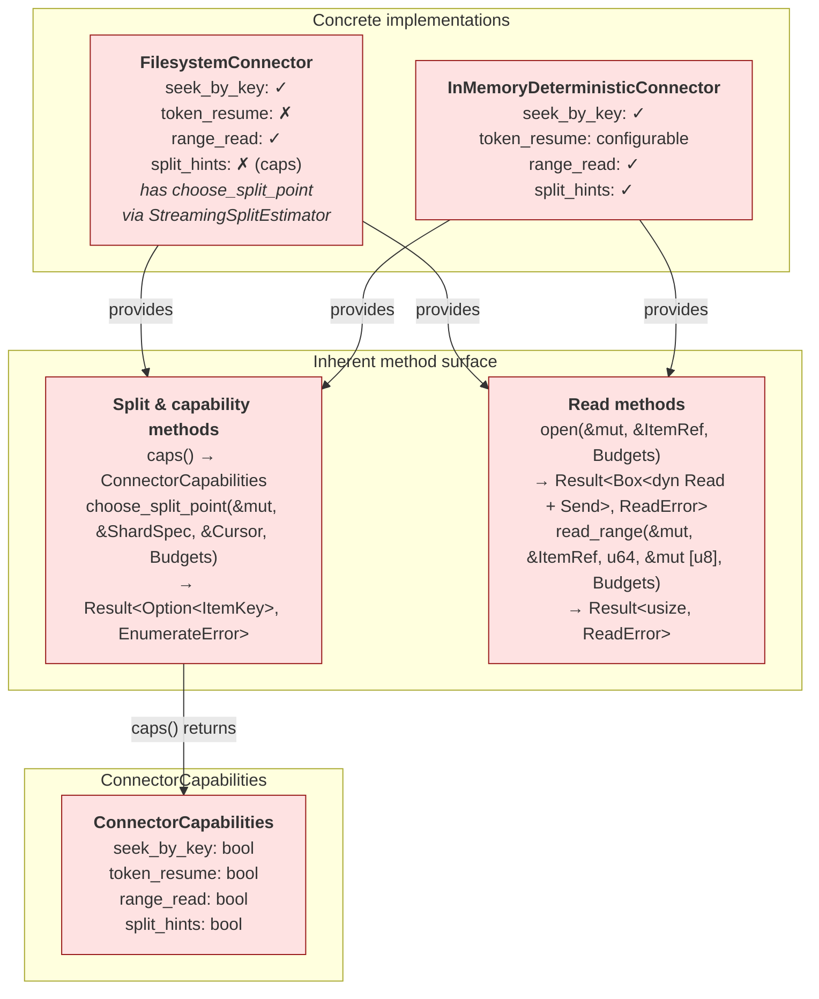
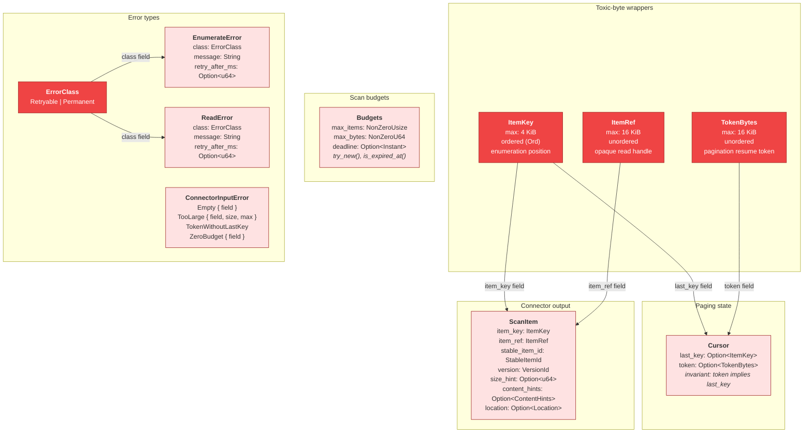
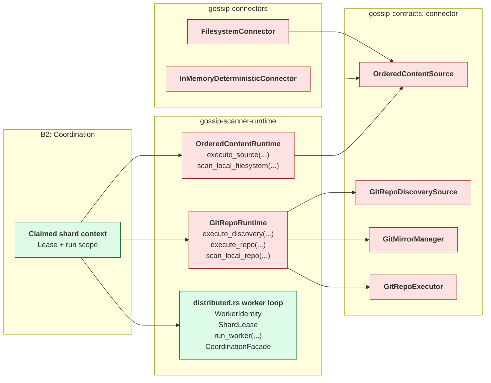
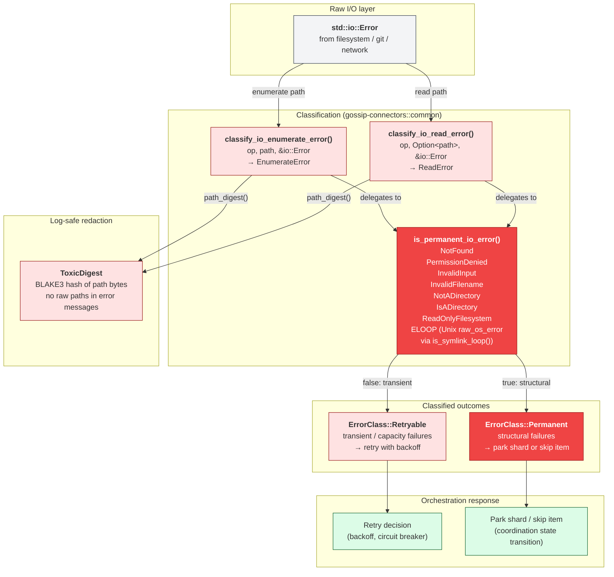

# 14 -- Connector Architecture

This document diagrams the B4 Connector boundary: trait contracts, core value
types, family-runtime integration, and error classification. Connectors bridge
external data sources into the shard-based enumeration and read model defined
in `gossip-contracts`.

**Color coding**: All B4 Connector components use fill `#EF4444` / `#FEE2E2`,
stroke `#991B1B` (red -- external I/O, highest risk). Cross-boundary
components use their respective boundary colors per [00-README.md](./00-README.md).

---

## 1. Connector Method Surface

Each concrete connector exposes read and split-point operations as inherent
methods. `ConnectorCapabilities` advertises which optional operations are
available per connector instance.

**Key design decisions:**

- Reading payload bytes and selecting split points are separate method groups.
  Orchestration can apply different retry and circuit-breaker policies to each
  path.
- `choose_split_point` is only meaningful for connectors that advertise
  `split_hints: true`. `FilesystemConnector` reports `split_hints: false`
  via `caps()` but does implement `choose_split_point` backed by a
  `StreamingSplitEstimator` — the capability flag under-reports what the
  connector can do.
- `FilesystemConnector` keeps a simpler capability profile: key-based seek and
  range reads are available, while token resume is not. Split estimation is
  available via `StreamingSplitEstimator` even though `split_hints` reports
  `false` in `caps()`.
- `InMemoryDeterministicConnector` can expose token resume
  conditionally through `with_tokens(bool)`.

See also: [09-circuit-breaker.md](./09-circuit-breaker.md) for failure
isolation per connector, [13-shard-algebra-types.md](./13-shard-algebra-types.md)
for shard key encoding.

---

## 2. Core Type Relationships

Connector boundary types enforce invariants at construction time so downstream
code can operate on strongly typed values without repeating validation.

**Design notes:**

- `ItemKey` has `Ord` because it participates in cursor progression and shard
  range membership. `ItemRef` and `TokenBytes` are looked up, not ranged.
- `Cursor` constructors make the `(None, Some(token))` state unrepresentable.
- `EnumerateError` and `ReadError` share the same shape but remain nominally
  distinct so orchestration cannot mix the two operation paths by accident.
- Pooled toxic-byte wrappers retain a shared slab so page-scoped data can
  escape a page boundary without copying raw bytes into ad hoc buffers.

See also: [03-id-derivation-dag.md](./03-id-derivation-dag.md) for
`StableItemId` and `VersionId` derivation, [08-pagecommit-typestate.md](./08-pagecommit-typestate.md)
for how `ScanItem` flows into persistence commits.

---

## 3. Connector-to-Runtime Family Bridge

Runtime orchestration imports shared connector nouns from
`gossip-contracts::connector` and selects a family module inside
`gossip-scanner-runtime`. Ordered-content work flows through
`OrderedContentRuntime`; Git repository work flows through `GitRepoRuntime`;
the distributed module contributes the concrete worker-loop foundation types
and talks directly to `gossip-coordination`.

**Runtime surface:**

| Runtime entry | Purpose |
| ------------- | ------- |
| `OrderedContentRuntime::execute_source` | Generic ordered-content execution hook |
| `ordered_content::scan_local_filesystem` | Filesystem-facing ordered-content entrypoint |
| `GitRepoRuntime::execute_discovery` | Generic repository-discovery hook |
| `GitRepoRuntime::execute_repo` | Generic mirror + executor hook |
| `git_repo::scan_local_repo` | Local repository entrypoint |
| `distributed.rs` worker loop | Worker identity, concrete lease payload, persistence, config, and error layer for the distributed worker loop |

**Boundary split.** `gossip-connectors` owns concrete source implementations;
`gossip-contracts` owns the family traits and value contracts; `gossip-scanner-runtime`
owns the orchestration modules that sit between callers and those family traits.

See also: [04-end-to-end-scan-flow.md](./04-end-to-end-scan-flow.md) for the
runtime entrypoints and commit-sink flow, [05-shard-and-run-state-machines.md](./05-shard-and-run-state-machines.md)
for shard lifecycle.

---

## 4. Error Classification Flow

I/O errors from the host OS are classified at the connector boundary into a
binary `ErrorClass` posture. Shared helpers in `gossip-connectors::common`
centralize this decision so all three connectors use identical permanence
logic.

**Classification rules:**

| `io::ErrorKind` | Classification | Rationale |
| --------------- | -------------- | --------- |
| `NotFound` | Permanent | Resource does not exist |
| `PermissionDenied` | Permanent | Access control failure |
| `InvalidInput` | Permanent | Malformed argument |
| `InvalidFilename` | Permanent | OS-rejected filename |
| `NotADirectory` | Permanent | Type mismatch |
| `IsADirectory` | Permanent | Type mismatch |
| `ReadOnlyFilesystem` | Permanent | Read-only mount / filesystem state |
| `ELOOP` (Unix) | Permanent | Symlink cycle (detected via `raw_os_error`, not `ErrorKind`) |
| Everything else | Retryable | Interrupted, would-block, timeout, or capacity failure |

See also: [09-circuit-breaker.md](./09-circuit-breaker.md) for how classified
errors feed circuit-breaker state transitions, [10-failure-modes-and-recovery.md](./10-failure-modes-and-recovery.md)
for system-wide recovery patterns.

---

## Source Code References

| Crate | File | Key types / functions |
| ----- | ---- | --------------------- |
| `gossip-contracts` | `crates/gossip-contracts/src/connector/api.rs` | `ErrorClass`, `EnumerateError`, `ReadError`, `ConnectorCapabilities` |
| `gossip-contracts` | `crates/gossip-contracts/src/connector/types.rs` | `ItemKey`, `ItemRef`, `TokenBytes`, `Cursor`, `ScanItem`, `Budgets`, `ConnectorInputError`, `ContentHints`, `Location`, `VersionId`, `PooledByteSlab`, `ToxicDigest` |
| `gossip-contracts` | `crates/gossip-contracts/src/connector/ordered.rs` | `OrderedContentSource`, `OrderedContentCapabilities` |
| `gossip-contracts` | `crates/gossip-contracts/src/connector/git.rs` | `GitRepoDiscoverySource`, `GitMirrorManager`, `GitRepoExecutor`, `GitRepoTarget`, `LocalMirror`, `GitRunOutcome`, `GitRunError` |
| `gossip-contracts` | `crates/gossip-contracts/src/connector/mod.rs` | `FILESYSTEM_CONNECTOR_TAG`, `GIT_CONNECTOR_TAG`, `IN_MEMORY_CONNECTOR_TAG`, re-export hub |
| `gossip-connectors` | `crates/gossip-connectors/src/common.rs` | `is_permanent_io_error`, `classify_io_enumerate_error`, `classify_io_read_error`, `path_digest`, `path_buf_from_bytes`, `borrowed_shard_bound`, `resolve_bounds`, `key_resume_start`, `estimate_split_from_sorted`, `is_valid_split_candidate` |
| `gossip-connectors` | `crates/gossip-connectors/src/filesystem.rs` | `FilesystemConnector` |
| `gossip-connectors` | `crates/gossip-connectors/src/in_memory.rs` | `InMemoryDeterministicConnector`, `MemItem` |
| `gossip-scanner-runtime` | `crates/gossip-scanner-runtime/src/ordered_content.rs` | `OrderedContentRuntime`, `scan_local_filesystem` (pub(crate)) |
| `gossip-scanner-runtime` | `crates/gossip-scanner-runtime/src/git_repo.rs` | `GitRepoRuntime`, `scan_local_repo` (pub(crate)) |
| `gossip-scanner-runtime` | `crates/gossip-scanner-runtime/src/distributed.rs` | `WorkerIdentity`, concrete `ShardLease`, `DistributedPersistence<F, D>`, `DistributedRuntimeConfig`, `DistributedRunReport`, `DistributedRuntimeError`, `run_worker` |
