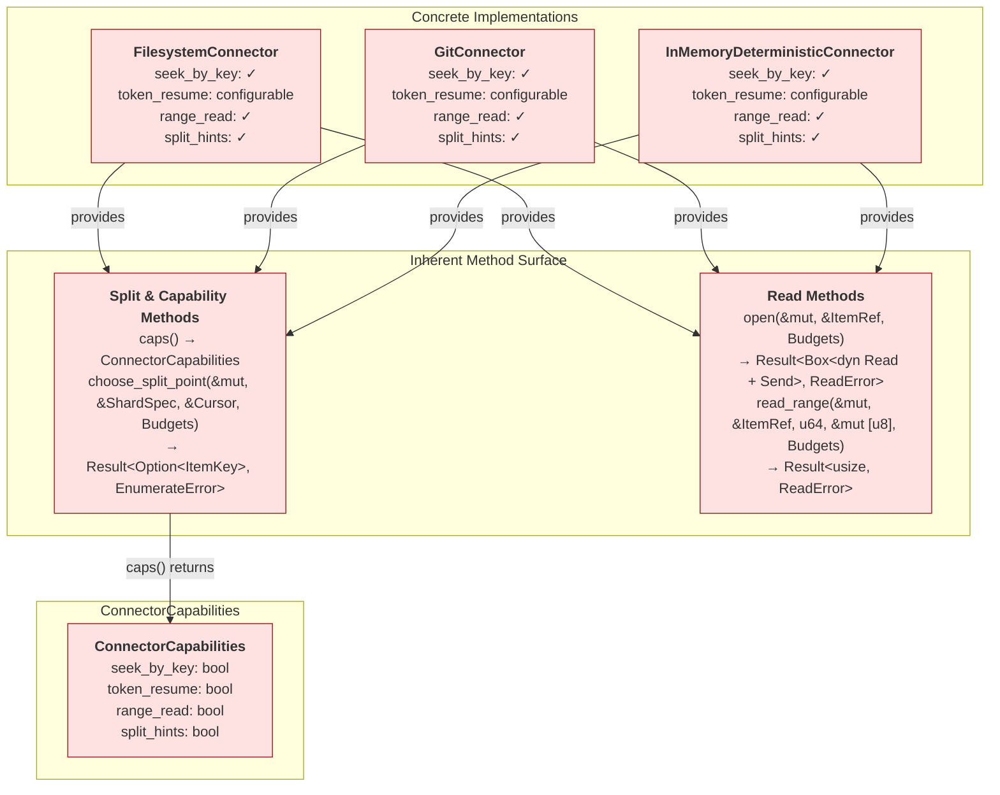
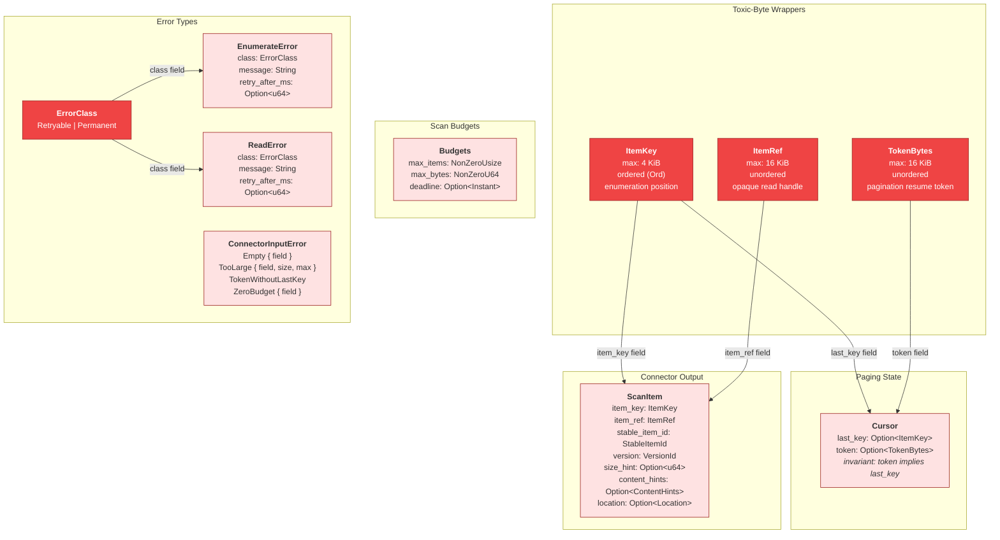
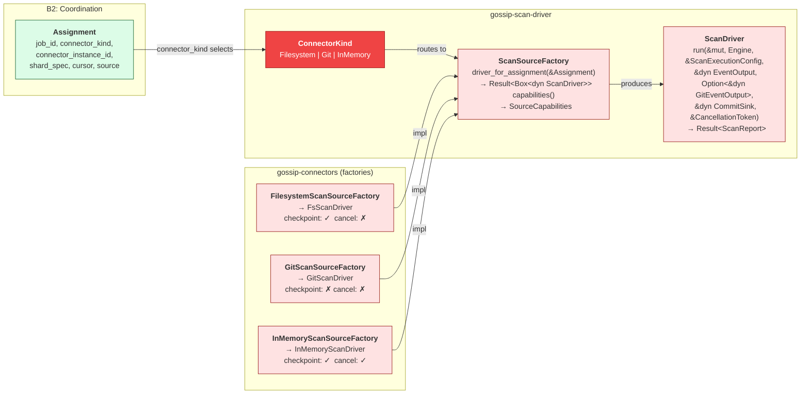
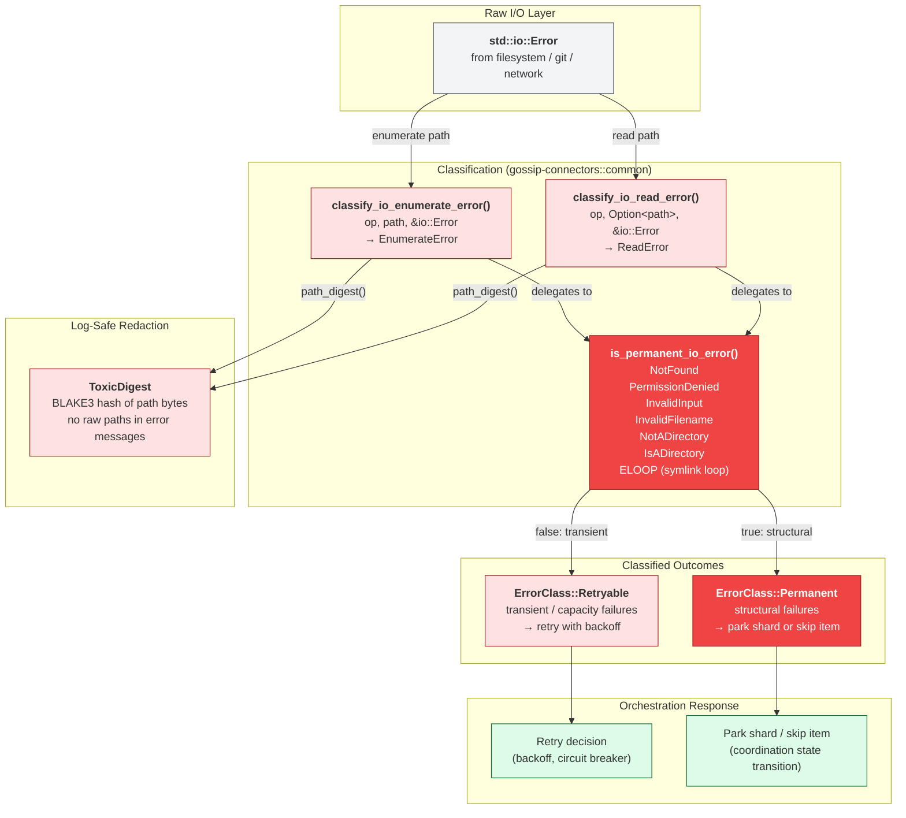

# 14 — Connector Architecture

This document diagrams the B4 Connector boundary: trait contracts, core value types, scan-driver integration, and error classification. Connectors bridge external data sources into the unified shard-based enumeration and read model defined in `gossip-contracts`.

**Color coding**: All B4 Connector components use fill `#EF4444` / `#FEE2E2`, stroke `#991B1B` (red — external I/O, highest risk). Cross-boundary components use their respective boundary colors per [00-README.md](./00-README.md).

---

## 1. Connector Method Surface

Each concrete connector exposes read and split-point operations as inherent methods (not trait dispatch). All three connectors share the same method signatures and advertise capabilities via `ConnectorCapabilities`, a four-flag struct that orchestration reads at registration time. All three connectors support `seek_by_key`, `range_read`, and `split_hints`; `token_resume` is configurable per instance.

**Key design decisions:**

- Reading (payload I/O) and split-point selection are separate method groups from capability advertisement. Orchestration applies independent retry and circuit-breaker policies per operation.
- `choose_split_point` is provided by connectors that advertise `split_hints: true`. Only connectors with natural partition boundaries (tree objects, directory structure) implement it.
- Connectors without native random-access support must explicitly return `Err(ReadError::unsupported("range_read"))` from `read_range`. All three current connectors implement full range-read support.
- `token_resume` is instance-configurable via `with_tokens(bool)` on each connector rather than hardcoded, because some test scenarios disable tokens to exercise key-only resume.

See also: [09-circuit-breaker.md](./09-circuit-breaker.md) for failure isolation per connector, [13-shard-algebra-types.md](./13-shard-algebra-types.md) for shard key encoding.

---

## 2. Core Type Relationships

Connector boundary types enforce invariants at construction time so downstream code can operate on strongly-typed values without repeating validation. The toxic-byte wrappers (`ItemKey`, `ItemRef`, `TokenBytes`) never expose raw bytes in `Debug`/`Display` output — both produce an identical redacted format (`TypeName(len=N, hash=XXXXXXXX..)`) using a truncated BLAKE3 prefix.

**Design notes:**

- `ItemKey` has `Ord` (lexicographic byte comparison) because it participates in cursor progression and shard range membership. `ItemRef` and `TokenBytes` are unordered — they are looked up, not ranged.
- `MAX_ITEM_KEY_SIZE` (4 KiB) and `MAX_TOKEN_SIZE` (16 KiB) track coordination cursor field limits so connector paging state fits in cursor updates without truncation. `MAX_ITEM_REF_SIZE` (16 KiB) is independent — refs never enter cursor state.
- `Cursor` constructors make the `(None, Some(token))` state unrepresentable. `try_from_update` rejects `TokenWithoutLastKey`.
- `EnumerateError` and `ReadError` are structurally identical but distinct nominal types. This prevents accidental cross-assignment and lets orchestration apply different retry policies per operation path.
- All toxic-byte wrappers support both owned (`Box<[u8]>`) and pooled (`ByteSlot` + `Arc<PooledByteSlab>`) storage. Pooled values avoid per-item heap allocation on HOT enumeration paths.

See also: [03-id-derivation-dag.md](./03-id-derivation-dag.md) for `StableItemId` and `VersionId` derivation, [08-pagecommit-typestate.md](./08-pagecommit-typestate.md) for how `ScanItem` flows into the persistence commit protocol.

---

## 3. Connector-to-Driver Bridge

The scan-driver layer (`gossip-scan-driver`) defines a second trait surface that bridges connectors into the scan execution pipeline. `ConnectorKind` discriminates the source backend; `ScanSourceFactory` maps `Assignment`s to boxed `ScanDriver` instances. This separation keeps `gossip-contracts` a lightweight leaf crate while scan-driver concerns (engines, event sinks, cancellation) live in their own crate.

**Execution flow:**

1. The coordination layer builds an `Assignment` from a shard claim, including `ConnectorKind`, `ShardSpec`, `Cursor`, and source-specific payload (`AssignmentSource::Filesystem { root }`, `AssignmentSource::Git { repo_root }`, or `AssignmentSource::InMemory { dataset_id }`).
2. The runtime selects a `ScanSourceFactory` by `ConnectorKind` and calls `driver_for_assignment` to produce a boxed `ScanDriver`.
3. The driver's `run()` method receives a compiled `Engine`, execution config, event/commit sinks, and a `CancellationToken`, then returns a `ScanReport` with aggregate counters.

**Capability differences by factory:**

| Factory | Checkpoint hints | Cooperative cancel |
|---------|------------------|--------------------|
| `FilesystemScanSourceFactory` | Yes | No (`parallel_scan_dir` has no mid-scan cancel) |
| `GitScanSourceFactory` | No | No |
| `InMemoryScanSourceFactory` | Yes | Yes (polls `is_cancelled()` per item) |

See also: [04-end-to-end-scan-flow.md](./04-end-to-end-scan-flow.md) for the ScanDriver architecture and distributed worker loop, [05-shard-and-run-state-machines.md](./05-shard-and-run-state-machines.md) for shard assignment lifecycle.

---

## 4. Error Classification Flow

I/O errors from the host OS are classified at the connector boundary into a binary `ErrorClass` posture. The shared helpers in `gossip-connectors::common` centralize this decision so all three connectors use identical permanence logic. Classified errors carry a log-safe `ToxicDigest` of the affected path rather than raw filesystem paths.

**Classification rules:**

| `io::ErrorKind` | Classification | Rationale |
|------------------|----------------|-----------|
| `NotFound` | Permanent | Resource does not exist |
| `PermissionDenied` | Permanent | Access control failure |
| `InvalidInput` | Permanent | Malformed argument |
| `InvalidFilename` | Permanent | OS-rejected filename |
| `NotADirectory` | Permanent | Type mismatch |
| `IsADirectory` | Permanent | Type mismatch |
| `ELOOP` (Unix) | Permanent | Symlink cycle |
| Everything else | Retryable | Network timeout, interrupted, would-block, etc. |

**Design notes:**

- `retry_after_ms` is advisory backoff metadata from the connector (e.g., HTTP `Retry-After` header). The runtime may enforce stricter global policies.
- `classify_io_enumerate_error` always includes a `ToxicDigest` of the path. `classify_io_read_error` accepts `Option<&Path>` because some read operations do not have an associated filesystem path.
- `enumerate_error_to_read` bridges an `EnumerateError` to a `ReadError` preserving retryability, used when a read operation requires enumeration-phase setup (e.g., `ensure_root_fd` in `FilesystemConnector::open`).
- Error `message` fields undergo control-character sanitization in `Display` (C0/C1 replaced with U+FFFD, preserving HT/LF/CR) to prevent log injection.

See also: [09-circuit-breaker.md](./09-circuit-breaker.md) for how classified errors feed circuit breaker state transitions, [10-failure-modes-and-recovery.md](./10-failure-modes-and-recovery.md) for system-wide failure recovery patterns.

---

## Source Code References

| Crate | File | Key Types / Functions |
|-------|------|----------------------|
| `gossip-contracts` | `crates/gossip-contracts/src/connector/api.rs` | `ErrorClass`, `EnumerateError`, `ReadError`, `ConnectorCapabilities` |
| `gossip-contracts` | `crates/gossip-contracts/src/connector/types.rs` | `ItemKey`, `ItemRef`, `TokenBytes`, `Cursor`, `ScanItem`, `Budgets`, `ConnectorInputError`, `ContentHints`, `Location`, `VersionId`, `PooledByteSlab` |
| `gossip-contracts` | `crates/gossip-contracts/src/connector/mod.rs` | Module structure and re-exports |
| `gossip-connectors` | `crates/gossip-connectors/src/lib.rs` | `connector_tag_for_kind`, re-exports of connectors and factories |
| `gossip-connectors` | `crates/gossip-connectors/src/common.rs` | `is_permanent_io_error`, `classify_io_enumerate_error`, `classify_io_read_error`, `path_digest`, `borrowed_shard_bound`, `resolve_bounds`, `key_resume_start`, `estimate_split_from_sorted` |
| `gossip-connectors` | `crates/gossip-connectors/src/filesystem.rs` | `FilesystemConnector` |
| `gossip-connectors` | `crates/gossip-connectors/src/git.rs` | `GitConnector` |
| `gossip-connectors` | `crates/gossip-connectors/src/in_memory.rs` | `InMemoryDeterministicConnector`, `MemItem` |
| `gossip-connectors` | `crates/gossip-connectors/src/scan_driver.rs` | `FilesystemScanSourceFactory`, `GitScanSourceFactory`, `InMemoryScanSourceFactory` |
| `gossip-scan-driver` | `crates/gossip-scan-driver/src/lib.rs` | `ConnectorKind`, `Assignment`, `AssignmentSource`, `ScanSourceFactory`, `ScanDriver`, `ScanReport`, `SourceCapabilities`, `CancellationToken`, `CommitSink` |
