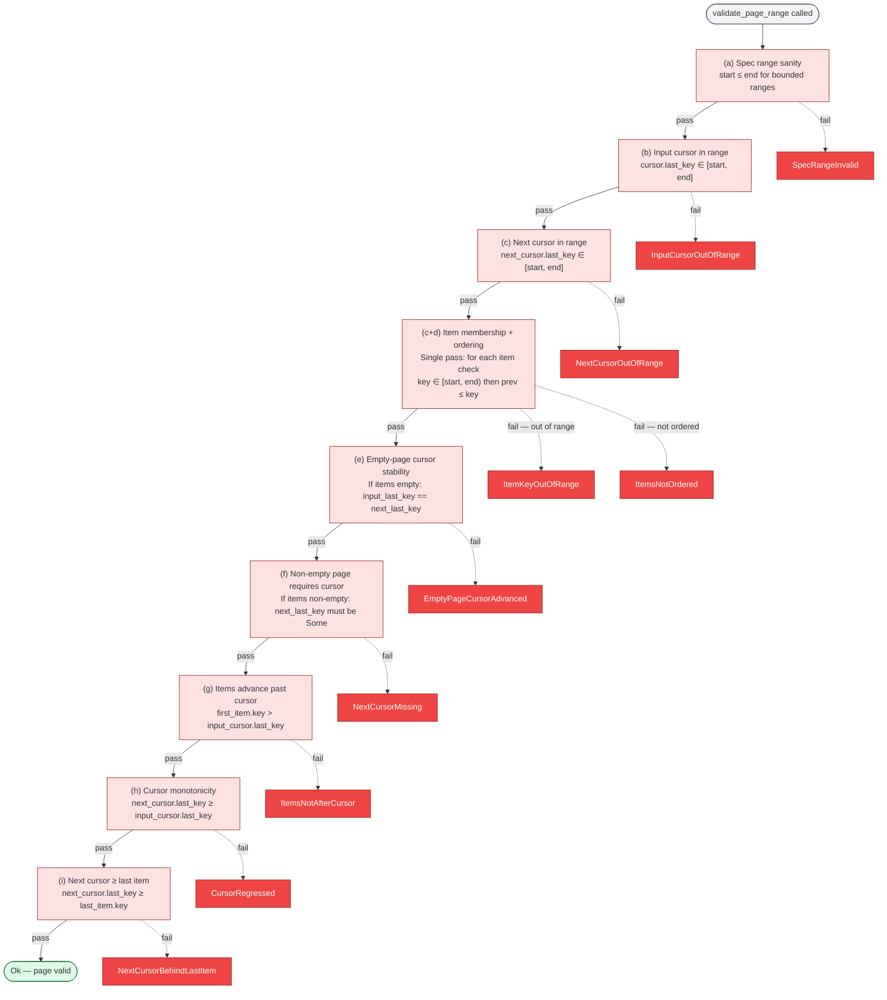
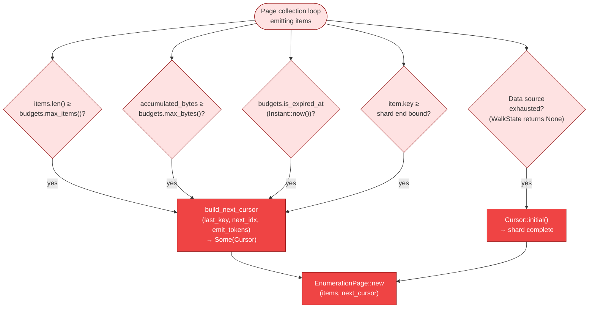

# Enumeration Page Lifecycle

The enumeration page is the fundamental unit of connector-to-coordinator communication.
Each call to `EnumerationConnector::enumerate_page` transforms a `(ShardSpec, Cursor,
Budgets)` triple into an `EnumerationPage` containing validated `ScanItem`s and a
continuation `Cursor`. This document traces that transformation through bound resolution,
data-source walking, pooled page assembly, and 9-check validation.

The lifecycle spans two crates:

- **`gossip-contracts`** defines the trait contract (`EnumerationConnector`), the value
  types (`Cursor`, `EnumerationPage`, `ScanItem`, `Budgets`), and the validation surface
  (`validate_page`, `validate_page_range`).
- **`gossip-connectors`** provides the shared implementation machinery (`common.rs`) and
  concrete connectors (`filesystem.rs`, `git.rs`, `in_memory.rs`).

> **Notation.** All diagrams use the B4 Connector color palette (red theme: fill
> `#EF4444`, light fill `#FEE2E2`, stroke `#991B1B`). Dashed lines represent error
> paths. Solid lines represent success paths.

---

## 1. Single-Page Enumeration Flow

A single `enumerate_page` call proceeds through eight logical stages. The caller
(typically the scan loop or coordination layer) provides a shard specification, the
current cursor position, and budget constraints. The connector resolves effective key
bounds, determines where to resume, walks the data source to collect items within budget,
constructs a continuation cursor, assembles a pooled page, validates it, and returns.

The sequence below uses the filesystem connector as the concrete example, but the stages
are common to all connector implementations — only the data-source walking step differs.

```mermaid
%% Diagram: single-page-enumeration-flow
sequenceDiagram
    participant Caller as Caller<br/>(Scan Loop)
    participant EC as EnumerationConnector<br/>::enumerate_page
    participant RB as resolve_page_bounds<br/>(common.rs)
    participant KR as key_resume_start<br/>+ cursor_token_index<br/>(common.rs)
    participant DS as Data Source<br/>(WalkState / entries)
    participant BC as build_next_cursor<br/>(common.rs)
    participant AP as assemble_pooled_page<br/>(common.rs)
    participant VP as validate_page<br/>(page_validator.rs)

    Caller->>EC: enumerate_page(shard, cursor, budgets)

    Note over EC,RB: Stage 1–2: Bound resolution
    EC->>RB: resolve_page_bounds(items, start, end, budgets)
    RB-->>RB: Check deadline expiry
    RB-->>RB: borrowed_shard_bound(start) → Option<&[u8]>
    RB-->>RB: borrowed_shard_bound(end) → Option<&[u8]>
    RB-->>RB: Validate start ≤ end
    RB-->>RB: lower_bound → range_start index
    RB-->>RB: lower_bound → range_end index
    RB-->>EC: ResolvedBounds { range_start, range_end }

    Note over EC,KR: Stage 3: Resume position
    EC->>KR: key_resume_start(items, cursor, range_start)
    KR-->>KR: upper_bound(last_key) → first index past last emitted key
    KR-->>KR: max(key_pos, range_start) → floor
    KR-->>EC: resume_idx
    EC-->>EC: cursor_token_index(cursor) → Option<token_idx>
    EC-->>EC: Validate token/key agreement; use token_idx or resume_idx

    Note over EC,DS: Stage 4: Walk/collect items under budget
    loop Until budget exhausted or source done
        EC->>DS: next item from data source
        DS-->>EC: FileEntry / PreparedItem
        EC-->>EC: Check items budget (max_items)
        EC-->>EC: Check bytes budget (max_bytes via size_hint)
        EC-->>EC: Check deadline (is_expired_at)
        EC-->>EC: Check shard end bound (key < end)
    end

    Note over EC,BC: Stage 5: Build continuation cursor
    EC->>BC: build_next_cursor(last_key, next_idx, emit_tokens)
    BC-->>BC: Cursor::with_last_key or Cursor::with_token
    BC-->>EC: Cursor (Some = continuation, initial = complete)

    Note over EC,AP: Stage 6: Assemble pooled page
    EC->>AP: assemble_pooled_page[_shared_key_ref](key_ref_pairs, ...)
    AP-->>AP: page_slab_capacity → pre-size ByteSlab
    AP-->>AP: Stage key/ref slots → PooledByteSlab
    AP-->>AP: stage_token_slot → optional token slot
    AP-->>AP: Arc::new(page_slab) → shared ownership
    AP-->>AP: ItemKey/ItemRef::try_from_slot → wrappers
    AP-->>EC: StagedPage { wrappers, token }
    EC-->>EC: Zip wrappers with (StableItemId, VersionId, size_hint)
    EC-->>EC: Build Vec<ScanItem> + EnumerationPage

    Note over EC,VP: Stage 7: Validate page
    EC->>VP: validate_page(shard, input_cursor, items, next_cursor)
    VP-->>VP: 9-check validation chain (see §2)
    VP-->>EC: Ok(()) or PageValidationError

    Note over EC,Caller: Stage 8: Return
    EC-->>Caller: Ok(EnumerationPage { items, next_cursor })

    style Caller fill:#F3F4F6,stroke:#374151
    style EC fill:#EF4444,stroke:#991B1B,color:#fff
    style RB fill:#FEE2E2,stroke:#991B1B
    style KR fill:#FEE2E2,stroke:#991B1B
    style DS fill:#FEE2E2,stroke:#991B1B
    style BC fill:#FEE2E2,stroke:#991B1B
    style AP fill:#FEE2E2,stroke:#991B1B
    style VP fill:#FEE2E2,stroke:#991B1B
```

**Key points:**

- **Bound resolution** is shared across all connectors via `resolve_page_bounds` and
  `resolve_bounds`. Empty byte slices (`b""`) represent unbounded lower/upper limits,
  matching `ShardSpec` semantics.
- **Resume position** combines key-authoritative search (`upper_bound` on `last_key`)
  with optional token-based O(1) index resume. Token agreement is validated by checking
  that `items[token_idx - 1].key == cursor.last_key`; disagreement falls back to
  key-only resume.
- **Budget enforcement** is connector-side advisory. The trait contract documents that
  callers must not assume compliance; the runtime orchestration layer is responsible for
  enforcement (truncation, backpressure, or termination).

---

## 2. Page Validation 9-Check Chain

After page assembly, `validate_page` (which delegates to the generic
`validate_page_range`) runs a fixed-order chain of nine checks. Validation is
**fail-fast**: processing stops at the first violated rule, and the corresponding
`PageValidationViolation` variant is returned inside a `PageValidationError`.

Item keys are validated against a half-open range `[start, end)`. Cursor keys are
validated against a closed range `[start, end]`. This asymmetry is deliberate: item
membership follows shard half-open semantics, while cursor checks stay permissive at the
upper boundary for connectors that park continuation state at the shard end.



**Validation is allocation-free on the success path.** `ToxicDigest` hashing (BLAKE3) is
performed only when constructing error payloads. Each `PageValidationError` pairs a
`Copy`-able `PageValidationViolation` discriminant (for programmatic dispatch and metrics)
with a `PageValidationDetails` variant carrying redacted diagnostic context. Raw
connector bytes never appear in validation errors — only lengths and hash prefixes.

**Check (c+d) is a single fused pass.** For each item, membership is checked first
(priority over ordering), then non-decreasing order relative to the predecessor. This
avoids a second iteration while preserving the property that a membership error always
takes precedence over an ordering error at the same index.

---

## 3. Page Assembly Paths

Connector page assembly converts raw byte slices from the data source into pooled
`ItemKey`/`ItemRef` wrappers backed by a shared `PooledByteSlab`. Two assembly paths
exist, selected based on whether the connector's key bytes and ref bytes are identical.

The filesystem connector uses the shared-slot path because `ItemRef` bytes are
identical-by-construction to `ItemKey` bytes (both are the encoded relative path). The
git and in-memory connectors use the two-slot path because their `ItemRef` bytes differ
from key bytes (e.g., blob OID vs tree path).

```mermaid
%% Diagram: page-assembly-paths
graph LR
    subgraph INPUT["Connector Page Loop Output"]
        KR["(key_bytes, ref_bytes)<br/>per item pairs"]
        KB["key_bytes only<br/>per item (key == ref)"]
    end

    subgraph STAGE["Phase 1–3: Staging"]
        CAP1["page_slab_capacity<br/>Sum rounded sizes<br/>(2 slots per item + token)"]
        CAP2["page_slab_capacity<br/>Sum rounded sizes<br/>(1 slot per item + token)"]
        SLAB1["PooledByteSlab::new<br/>ByteSlab::with_capacity"]
        SLAB2["PooledByteSlab::new<br/>ByteSlab::with_capacity"]
        STG1["Stage key_slot + ref_slot<br/>per item"]
        STG2["Stage single slot<br/>per item (shared)"]
        TOK1["stage_token_slot<br/>(optional)"]
        TOK2["stage_token_slot<br/>(optional)"]
    end

    subgraph WRAP["Phase 4: Arc + Wrap"]
        ARC["Arc::new(page_slab)"]
        W1["ItemKey::try_from_slot<br/>ItemRef::try_from_slot<br/>(separate slots)"]
        W2["ItemKey::try_from_slot<br/>ItemRef::try_from_slot<br/>(same slot)"]
        TW["TokenBytes::try_from_slot"]
    end

    subgraph OUTPUT["StagedPage"]
        SP["StagedPage {<br/>  wrappers: Vec‹(ItemKey, ItemRef)›,<br/>  token: Option‹TokenBytes›<br/>}"]
    end

    KR -->|"assemble_pooled_page()"| CAP1
    KB -->|"assemble_pooled_page<br/>_shared_key_ref()"| CAP2

    CAP1 --> SLAB1 --> STG1 --> TOK1 --> ARC
    CAP2 --> SLAB2 --> STG2 --> TOK2 --> ARC

    ARC --> W1 --> SP
    ARC --> W2 --> SP
    ARC --> TW --> SP

    style INPUT fill:#F3F4F6,stroke:#374151
    style STAGE fill:#FEE2E2,stroke:#991B1B
    style WRAP fill:#FEE2E2,stroke:#991B1B
    style OUTPUT fill:#FEE2E2,stroke:#991B1B

    style KR fill:#F3F4F6,stroke:#374151
    style KB fill:#F3F4F6,stroke:#374151
    style CAP1 fill:#FEE2E2,stroke:#991B1B
    style CAP2 fill:#FEE2E2,stroke:#991B1B
    style SLAB1 fill:#EF4444,stroke:#991B1B,color:#fff
    style SLAB2 fill:#EF4444,stroke:#991B1B,color:#fff
    style STG1 fill:#FEE2E2,stroke:#991B1B
    style STG2 fill:#FEE2E2,stroke:#991B1B
    style TOK1 fill:#FEE2E2,stroke:#991B1B
    style TOK2 fill:#FEE2E2,stroke:#991B1B
    style ARC fill:#EF4444,stroke:#991B1B,color:#fff
    style W1 fill:#FEE2E2,stroke:#991B1B
    style W2 fill:#FEE2E2,stroke:#991B1B
    style TW fill:#FEE2E2,stroke:#991B1B
    style SP fill:#EF4444,stroke:#991B1B,color:#fff
```



**Why pooled allocation?** Page assembly is on the HOT enumeration path. Without pooling,
each `ItemKey` and `ItemRef` would require a separate heap allocation (`Box<[u8]>`) via
`try_from_vec` or `try_from_slice`. The `PooledByteSlab` approach pre-sizes a single
contiguous buffer using `page_slab_capacity` (which mirrors `ByteSlab`'s size-class
rounding), stages all fields into that buffer, then wraps it in `Arc<PooledByteSlab>` for
shared read-only access. Each wrapper holds an `Arc` clone — cloning is
allocation-free, and the slab stays alive as long as any wrapper exists.

**The shared-slot path halves slab consumption.** When key bytes and ref bytes are
identical (filesystem connector), `assemble_pooled_page_shared_key_ref` allocates one
slot per item and creates both `ItemKey` and `ItemRef` from the same `ByteSlot`. A
`debug_assert_eq!` on pointer equality verifies the shared-slot invariant in debug
builds.

**Slab lifecycle.** `PooledByteSlab` implements `Drop` to `zeroize_used()` (overwrite
sensitive toxic-byte residue) and `clear()` (reset slab state). This runs when the `Arc`
reference count reaches zero, ensuring cleanup on all exit paths including early-return
failures during staging.

---

## 4. Budget-Driven Termination

The page collection loop terminates when any of five conditions is met. Each condition
leads to a different continuation outcome: either a `Some(Cursor)` signaling more data
remains, or `Cursor::initial()` signaling the shard is fully enumerated.



**Termination semantics by condition:**

| Condition | Continuation | Rationale |
|-----------|-------------|-----------|
| Items budget exhausted | `Some(Cursor)` — more data exists | `max_items` reached; the data source has more entries to emit. |
| Bytes budget exhausted | `Some(Cursor)` — more data exists | Cumulative `size_hint` bytes reached `max_bytes`; remaining items are unvisited. |
| Deadline reached | `Some(Cursor)` — more data exists | `budgets.is_expired_at(Instant::now())` returned true. The page is valid but partial. `resolve_page_bounds` also checks the deadline before starting, returning `EnumerateError::retryable` if already expired. |
| Data source exhausted | `Cursor::initial()` — shard complete | The walk (or sorted entry list) has no more items in the shard range. An initial cursor signals enumeration is done. |
| Shard end bound reached | `Some(Cursor)` — items emitted, shard end detected | The next item's key is `≥ end`, so the page stops collecting. Items already gathered are returned with a continuation cursor. The coordination layer detects shard completion on the next call when no items remain in range. |

**Budget fields are `NonZero`.** `Budgets::try_new` rejects zero values for `max_items`
(`NonZeroUsize`) and `max_bytes` (`NonZeroU64`), so a vacuous zero budget is
unrepresentable at the type level. The deadline field (`Option<Instant>`) is optional;
`None` means no time limit.

**Budget enforcement is advisory at the trait layer.** The `EnumerationConnector` trait
documents that connectors *should* honor budgets, but callers *must not* assume
compliance. The runtime orchestration layer is responsible for enforcement: it may
truncate excess items, apply backpressure, or terminate a misbehaving connector.

---

## Cross-References

| Topic | Diagram |
|-------|---------|
| Circuit breaker failure isolation for connectors | `09-circuit-breaker.md` §1 |
| Shard state machine (how shards reach enumeration) | `05-shard-and-run-state-machines.md` §1 |
| End-to-end scan flow (page enumeration in context) | `04-end-to-end-scan-flow.md` §1 |
| Cursor monotonicity in lease lifecycle | `07-lease-lifecycle.md` §4 |
| Shard algebra types (key encoding, shard specs) | `13-shard-algebra-types.md` |
| Split operations (how split hints from enumeration feed shard splitting) | `12-split-operations.md` §1 |

---

## Source Code References

| Symbol | File | Role |
|--------|------|------|
| `EnumerationConnector` | `crates/gossip-contracts/src/connector/api.rs` | Trait contract: `enumerate_page`, `caps`, `choose_split_point` |
| `EnumerationPage` | `crates/gossip-contracts/src/connector/types.rs` | Page output: `items: Vec<ScanItem>`, `next_cursor: Cursor` |
| `ScanItem` | `crates/gossip-contracts/src/connector/types.rs` | Per-item metadata: `ItemKey`, `ItemRef`, `StableItemId`, `VersionId`, optional hints |
| `Cursor` | `crates/gossip-contracts/src/connector/types.rs` | Paging state: `last_key: Option<ItemKey>`, `token: Option<TokenBytes>` |
| `Budgets` | `crates/gossip-contracts/src/connector/types.rs` | Stop conditions: `max_items: NonZeroUsize`, `max_bytes: NonZeroU64`, `deadline: Option<Instant>` |
| `ItemKey` | `crates/gossip-contracts/src/connector/types.rs` | Ordered toxic-byte wrapper (4 KiB max, lexicographic `Ord`) |
| `ItemRef` | `crates/gossip-contracts/src/connector/types.rs` | Opaque toxic-byte handle (16 KiB max, no `Ord`) |
| `TokenBytes` | `crates/gossip-contracts/src/connector/types.rs` | Opaque pagination token (16 KiB max, no `Ord`) |
| `PooledByteSlab` | `crates/gossip-contracts/src/connector/types.rs` | Page-local slab owner: `allocate`, `Arc`-wrapped for shared access |
| `validate_page` | `crates/gossip-contracts/src/connector/page_validator.rs` | Concrete adapter: `ShardSpec` + `Cursor` + `ScanItem` → `validate_page_range` |
| `validate_page_range` | `crates/gossip-contracts/src/connector/page_validator.rs` | Generic 9-check validation chain |
| `PageValidationViolation` | `crates/gossip-contracts/src/connector/page_validator.rs` | `Copy`-able violation discriminant (10 variants) |
| `PageValidationError` | `crates/gossip-contracts/src/connector/page_validator.rs` | Structured error: `violation` + `PageValidationDetails` |
| `ToxicDigest` | `crates/gossip-contracts/src/connector/page_validator.rs` | Redacted byte digest: `len` + BLAKE3 hash (16 hex char display) |
| `resolve_page_bounds` | `crates/gossip-connectors/src/common.rs` | Validate shard bounds + deadline, binary search to index range |
| `resolve_bounds` | `crates/gossip-connectors/src/common.rs` | Pure bound resolution: `start`/`end` → `ResolvedBounds { range_start, range_end }` |
| `key_resume_start` | `crates/gossip-connectors/src/common.rs` | Key-authoritative resume: `upper_bound(last_key)` clamped to `range_start` |
| `cursor_token_index` | `crates/gossip-connectors/src/common.rs` | Decode optional cursor token as absolute `usize` index |
| `build_next_cursor` | `crates/gossip-connectors/src/common.rs` | Cursor from last key + optional big-endian `u64` token |
| `build_next_cursor_from_staged` | `crates/gossip-connectors/src/common.rs` | Cursor preserving staged pooled token when available |
| `assemble_pooled_page` | `crates/gossip-connectors/src/common.rs` | Two-slot assembly: separate key and ref slab allocations |
| `assemble_pooled_page_shared_key_ref` | `crates/gossip-connectors/src/common.rs` | Shared-slot assembly: single allocation when key == ref |
| `StagedPage` | `crates/gossip-connectors/src/common.rs` | Intermediate: `wrappers: Vec<(ItemKey, ItemRef)>`, `token: Option<TokenBytes>` |
| `page_slab_capacity` | `crates/gossip-connectors/src/common.rs` | Pre-size slab using ByteSlab size-class rounding |
| `borrowed_shard_bound` | `crates/gossip-connectors/src/common.rs` | Validate shard bound: empty = unbounded, else ≤ `MAX_ITEM_KEY_SIZE` |
| `FilesystemConnector` | `crates/gossip-connectors/src/filesystem.rs` | Concrete connector: streaming sorted DFS walk, `O_NOFOLLOW` read confinement |
| `ConnectorCapabilities` | `crates/gossip-contracts/src/connector/api.rs` | Feature flags: `seek_by_key`, `token_resume`, `range_read`, `split_hints` |
