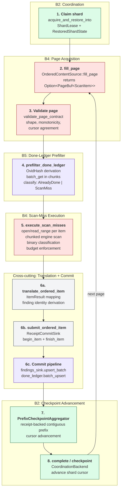
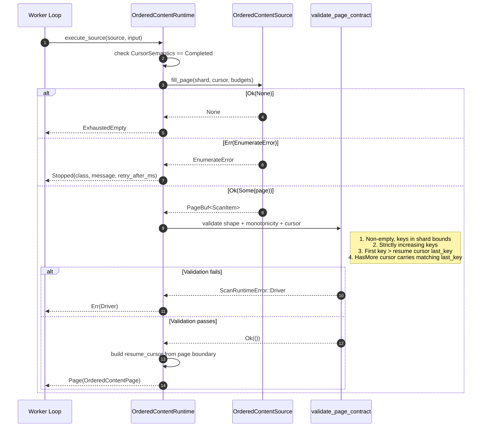
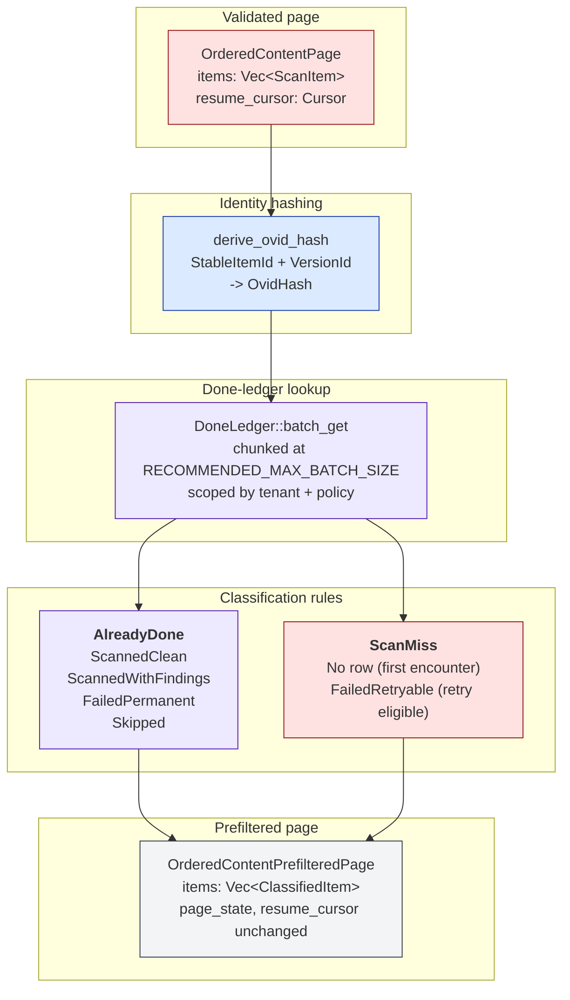
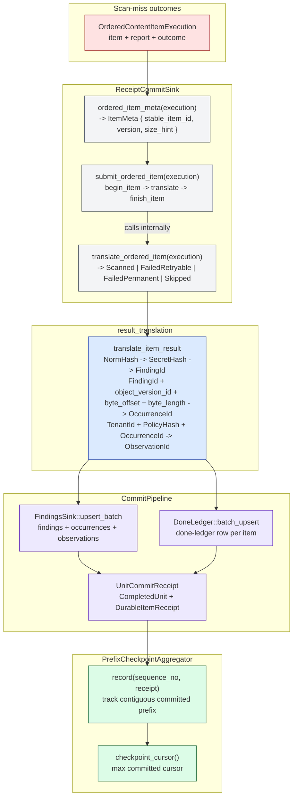

# 15 -- Ordered-Content Scan Flow

This document traces a single shard's ordered-content lifecycle from
coordination claim through page acquisition, done-ledger prefiltering,
scan-miss execution, result translation, and checkpoint advancement. It
consolidates the ordered-content execution path that is distributed across
[04-end-to-end-scan-flow.md](./04-end-to-end-scan-flow.md),
[14-connector-architecture.md](./14-connector-architecture.md),
[16-cursor-resume-strategy.md](./16-cursor-resume-strategy.md), and
[17-filesystem-walk-state-machine.md](./17-filesystem-walk-state-machine.md)
into a single end-to-end reference.

**Color coding**: Components follow the standard boundary palette from
[00-README.md](./00-README.md). The diagrams use B2 (green) for coordination,
B4 (red) for connector operations, B5 (purple) for persistence, B1 (blue) for
identity derivation, and grey for cross-cutting runtime glue.

---

## 1. End-to-End Shard Lifecycle

A claimed shard flows through six phases (eight numbered steps) inside the
distributed worker loop. Each phase has a single owner module and a
well-defined handoff contract.



**Phase boundaries:**

| Phase | Module | Key type |
| ----- | ------ | -------- |
| 1. Claim | `gossip-coordination` | `ShardLease`, `RestoredShardState` |
| 2-3. Page acquisition | `ordered_content.rs` | `OrderedContentRuntimeInput` -> `OrderedContentPage` |
| 4. Prefilter | `ordered_content.rs` | `OrderedContentPrefilteredPage` |
| 5. Scan-miss execution | `ordered_content.rs` | `OrderedContentScanMissExecution` |
| 6. Translation + commit | `distributed.rs` | `ReceiptCommitSink`, `CommitPipeline` |
| 7-8. Checkpoint | `checkpoint_aggregator.rs` | `PrefixCheckpointAggregator` |

The loop at the bottom (`complete -> next page -> fill_page`) repeats until the
connector signals `PageState::Complete` followed by an exhausted-empty
confirmation, or the lease expires, or the shard is terminated.

---

## 2. Page Acquisition and Validation

`OrderedContentRuntime::execute_source` performs one connector-driven page fill,
then validates four page-level invariants before any downstream work begins.



**Three-outcome dispatch.** The worker loop matches on `ExhaustedEmpty`
(terminal), `Stopped` (connector failure with retry classification), or
`Page` (validated, ready for prefiltering). `ExhaustedEmpty` is returned
whenever `fill_page` yields `Ok(None)`, which covers two accepted cases
and one rejected case:

(a) the source is empty from the start (first call returns no items,
`executed_any_page` is false);

(b) the two-call suffix handshake after a non-empty terminal page
(`PageState::Complete` triggers `AwaitingExhaustedEmpty`; the next
`fill_page` returns `Ok(None)` to confirm exhaustion);

(c) **rejected** — `ExhaustedEmpty` while the loop is still in
`Paging` phase after at least one `HasMore` page has been executed.
This means the connector skipped the required `PageState::Complete`
terminal page. The page loop raises `ScanRuntimeError::Driver` to
surface the suffix protocol violation.

In accepted cases (a) and (b) the runtime page loop confirms exhaustion
before `checkpoint`/`complete` is sent to the coordinator.

---

## 3. Done-Ledger Prefilter

The prefilter classifies every validated page item against the done ledger
before any content is opened. Items with terminal done-ledger status are
skipped, saving I/O and scan budget.



**Batching strategy.** Lookups are chunked at `RECOMMENDED_MAX_BATCH_SIZE`
to respect backend batch ceilings. Chunks are issued sequentially and
their results concatenated, preserving positional alignment with the
original page order.

**Bloom pre-check.** Distributed worker startup may wrap the done ledger in
`BloomFilteredDoneLedger`, which returns `None` immediately for Bloom-negative
hashes and delegates only Bloom-positive hashes to the backing store. Once any
clone successfully commits a non-empty write batch, the wrapper disables
prefiltering and falls back to the inner ledger for later reads so newly
written keys stay visible.

**Version-aware dedup.** The `OvidHash` includes version strength (strong
vs. weak), so the same stable item under a different version claim is
correctly treated as a miss.

---

## 4. Scan-Miss Execution

`execute_scan_misses` processes the `ScanMiss` subset one item at a time
under bounded open/read budgets. `AlreadyDone` items are counted but never
opened.

```mermaid
%% Diagram: ordered-content-scan-miss-execution
sequenceDiagram
    autonumber

    participant LOOP as Miss Loop
    participant SRC as OrderedContentSource
    participant ENG as scanner_engine::Engine
    participant OUT as Outcomes

    note over LOOP: For each classified item in page order

    alt AlreadyDone
        LOOP->>LOOP: already_done_len += 1
    else ScanMiss
        LOOP->>LOOP: check remaining items + bytes budget

        alt Budget exhausted
            LOOP->>OUT: defer remaining misses
        else size_hint > remaining_bytes
            LOOP->>OUT: defer this item only (skip ahead)
        else Admitted
            alt range_read capable
                LOOP->>SRC: read_range(item_ref, offset, dst, budgets)
                SRC-->>LOOP: bytes
            else open fallback
                LOOP->>SRC: open(item_ref, budgets)
                SRC-->>LOOP: Box<dyn Read>
            end

            note right of LOOP: First chunk: classify_content<br/>Binary -> Skipped(Binary)<br/>BinaryExtractable -> Skipped(BinaryExtractable)<br/>Text -> continue scanning

            loop Chunked scan until EOF or budget
                LOOP->>ENG: scan_chunk_postprocess(buf, metrics)
                ENG-->>LOOP: findings
            end

            note right of LOOP: Budget exhausted? 1-byte EOF probe:<br/>Ok(0) -> Scanned (real EOF)<br/>Ok(n) -> Truncated (content beyond budget)

            LOOP->>OUT: OrderedContentItemExecution(item, report, outcome)
        end
    end
```

**Budget enforcement.** Each item's `size_hint` (when available) serves as
both the admission gate and the per-item read cap. Items whose hint exceeds
the remaining byte budget are individually deferred, allowing smaller items
behind them to still be processed. Items without a `size_hint` receive a
fixed 16 MiB cap to prevent unbounded consumption.

**Read strategy.** Connectors that advertise `range_read` are driven through
repeated `read_range` calls so the runtime can reuse the scheduler's chunking
helpers without forcing a whole-item buffer. Other connectors use `open` and
stream bytes from the returned reader.

**Item outcomes:**

| Outcome | Meaning | Checkpoint effect |
| ------- | ------- | ----------------- |
| `Scanned { findings }` | Content fully scanned | Terminal -- cursor may advance |
| `Truncated { findings }` | Budget exhausted before EOF | Retryable -- cursor must NOT advance |
| `Failed(stop)` | Connector open/read error | Retryable or permanent per `ErrorClass` |
| `Skipped(Binary)` | Binary content, scan_binary disabled | Terminal -- cursor may advance |
| `Skipped(BinaryExtractable)` | Extractable binary, not supported in chunked path | Terminal -- cursor may advance |

---

## 5. Result Translation and Commit Pipeline

Each item execution flows through the `ReceiptCommitSink`, which bridges
ordered-content outcomes into the receipt-driven commit pipeline. The commit
pipeline persists findings and done-ledger rows, producing receipts that the
checkpoint aggregator consumes.



**Outcome-to-result mapping:**

| `OrderedContentItemOutcome` | `ItemResult` | Done-ledger status |
| --------------------------- | ------------ | ------------------ |
| `Scanned { findings: [] }` | `Scanned` | `ScannedClean` |
| `Scanned { findings: [..] }` | `Scanned` | `ScannedWithFindings` |
| `Truncated { .. }` | `FailedRetryable { TRUNCATED }` | `FailedRetryable` |
| `Failed(Retryable)` | `FailedRetryable { READ_FAILED }` | `FailedRetryable` |
| `Failed(Permanent)` | `FailedPermanent { READ_FAILED }` | `FailedPermanent` |
| `Skipped(Binary)` | `Skipped { BINARY }` | `Skipped` |
| `Skipped(BinaryExtractable)` | `Skipped { BINARY_EXTRACTABLE }` | `Skipped` |

**Checkpoint safety.** The `PrefixCheckpointAggregator` only advances the
checkpoint cursor to the maximum contiguous committed sequence number. A gap
(e.g., from a retryable failure) blocks cursor advancement past that point,
ensuring the item is re-scanned on the next shard claim.

---

## Cross-References

| Diagram | Related Document |
| ------- | ---------------- |
| Shard lifecycle | [05-shard-and-run-state-machines.md](./05-shard-and-run-state-machines.md) -- shard state transitions |
| Page acquisition | [14-connector-architecture.md](./14-connector-architecture.md) -- `OrderedContentSource` trait |
| Cursor resume | [16-cursor-resume-strategy.md](./16-cursor-resume-strategy.md) -- two-layer cursor model |
| Filesystem walk | [17-filesystem-walk-state-machine.md](./17-filesystem-walk-state-machine.md) -- DFS walk internals |
| Findings identity | [03-id-derivation-dag.md](./03-id-derivation-dag.md) -- finding identity derivation chain |
| Commit pipeline | [08-pagecommit-typestate.md](./08-pagecommit-typestate.md) -- typestate commit safety |
| Done-ledger persistence | [22-done-ledger-postgres.md](./22-done-ledger-postgres.md) -- PostgreSQL done-ledger backend |
| Findings persistence | [21-findings-postgres-dedup.md](./21-findings-postgres-dedup.md) -- findings dedup pipeline |
| Persistence contracts | [19-persistence-contracts.md](./19-persistence-contracts.md) -- OVID, receipts, done-ledger lattice |

## Source Code References

| Component | Path |
| --------- | ---- |
| `OrderedContentSource` trait | `crates/gossip-contracts/src/connector/ordered.rs` |
| `OrderedContentRuntime` (execute_source, execute_scan_misses) | `crates/gossip-scanner-runtime/src/ordered_content.rs` |
| `OrderedContentPage::prefilter_done_ledger` | `crates/gossip-scanner-runtime/src/ordered_content.rs` |
| `scan_local_filesystem` | `crates/gossip-scanner-runtime/src/ordered_content.rs` |
| `ReceiptCommitSink` (translate_ordered_item, submit_ordered_item) | `crates/gossip-scanner-runtime/src/distributed.rs` |
| `translate_item_result` | `crates/gossip-scanner-runtime/src/result_translation.rs` |
| `PrefixCheckpointAggregator` | `crates/gossip-scanner-runtime/src/checkpoint_aggregator.rs` |
| `CommitPipeline` | `crates/gossip-scanner-runtime/src/commit_pipeline.rs` |
| `FilesystemConnector` | `crates/gossip-connectors/src/filesystem.rs` |
| `InMemoryDeterministicConnector` | `crates/gossip-connectors/src/in_memory.rs` |
| `derive_ovid_hash` | `crates/gossip-contracts/src/persistence/ovid.rs` |
| `DoneLedger::batch_get` | `crates/gossip-contracts/src/persistence/done_ledger.rs` |
| `validate_page_sequence` | `crates/gossip-contracts/src/connector/common.rs` |
| `validate_page_contract` (wraps `validate_page_sequence`) | `crates/gossip-scanner-runtime/src/ordered_content.rs` |
| Page loop (`scan_ordered_source_with_engine`) | `crates/gossip-scanner-runtime/src/distributed.rs` |
