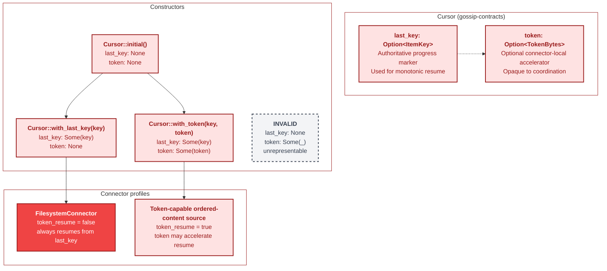
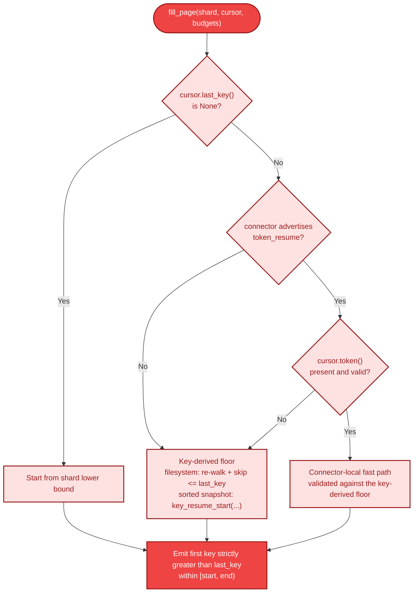
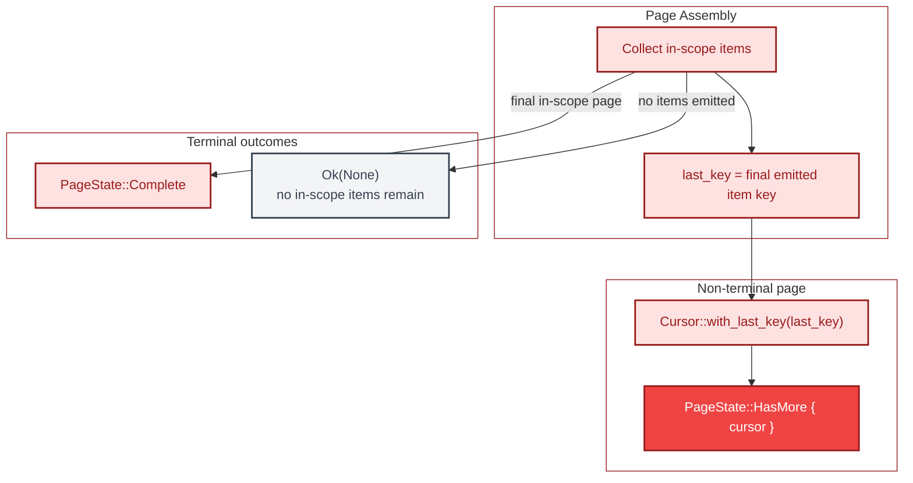

# Cursor Resume Strategy

This document describes the current cursor contract for Boundary 4 connectors.
`Cursor` always carries an authoritative `last_key` progress marker and may
also carry an opaque token. The key is the only correctness boundary: a
connector must resume from the first item strictly greater than `last_key`
even when no token is present or a token is unusable.

The filesystem connector is explicitly key-only. It rebuilds its live
directory walk from the canonical root on each `fill_page` call and skips every
entry at or below `cursor.last_key()`. Token-aware resume remains an optional
capability for other ordered-content surfaces, but it cannot weaken the
key-derived floor.

All diagrams use the B4 Connector color palette (fill `#EF4444` / `#FEE2E2`,
stroke `#991B1B`). Cross-boundary references use the boundary colors from the
[color legend](00-README.md#color-coding-legend).

---

## 1. Cursor Contract

The `Cursor` type encodes progress in two layers:

- `last_key: Option<ItemKey>` is the mandatory resume anchor once any progress
  exists.
- `token: Option<TokenBytes>` is an optional connector-local accelerator.

The invalid state `(None, Some(token))` is unrepresentable through the public
constructors and rejected when crossing from coordination's borrowed cursor
types.

---

## 2. Resume Decision Tree

Every ordered-content resume starts from the key-derived floor:

- Filesystem resume: re-walk from the canonical root and skip `<= last_key`.
- Sorted-snapshot resume: use `key_resume_start()` to find the first key
  strictly greater than `last_key`.

When a connector supports tokens, token handling is advisory. A token may move
the start position forward to a validated fast path, but it must never move
behind the `last_key` floor.

---

## 3. Connector Profiles

### FilesystemConnector

- `token_resume` is always `false`.
- `fill_page_directory()` computes a resume floor from the maximum of shard
  start and `cursor.last_key()`.
- `DirectoryWalker::new(...)` rebuilds the walk from the canonical root on
  each call and `next_file()` skips every key `<= floor`.
- `PageState::HasMore` carries `Cursor::with_last_key(last_key)` only.

### Token-capable ordered-content sources

- Token handling is capability-gated rather than universal.
- The connector still needs a key-derived floor so token loss or validation
  failure preserves the same suffix of items.
- Token payloads remain opaque to coordination and bounded by
  `MAX_TOKEN_SIZE`.

---

## 4. Cursor Construction and Terminal Signaling

Connectors only build a continuation cursor when a non-terminal page returns
`PageState::HasMore`. Terminal signaling uses the ordered-content page state:

- `PageState::HasMore { cursor }` means more in-scope data remains.
- `PageState::Complete` means the returned page was the last in-scope page.
- `Ok(None)` means no in-scope items remain at all for this call.

---

## Cross-References

| Topic | Diagram | Relevance |
|-------|---------|-----------|
| Connector boundary overview | [14-connector-architecture.md](14-connector-architecture.md) | Capability flags and method surface |
| Filesystem walk internals | [17-filesystem-walk-state-machine.md](17-filesystem-walk-state-machine.md) | Key-only filesystem resume path |
| Shard key ranges and splits | [12-split-operations.md](12-split-operations.md) | Shard bounds constraining cursor ranges |
| End-to-end scan flow | [04-end-to-end-scan-flow.md](04-end-to-end-scan-flow.md) | Family-oriented runtime entrypoints |
| Lease lifecycle | [07-lease-lifecycle.md](07-lease-lifecycle.md) | Coordination-side cursor monotonicity |

---

## Source Code References

| Symbol / Concept | File | Notes |
|------------------|------|-------|
| `Cursor` | `crates/gossip-contracts/src/connector/types.rs` | Two-field progress type: `last_key` + optional `token` |
| `Cursor::initial()` | `crates/gossip-contracts/src/connector/types.rs` | No-progress neutral state |
| `Cursor::with_last_key()` | `crates/gossip-contracts/src/connector/types.rs` | Key-only continuation cursor |
| `Cursor::with_token()` | `crates/gossip-contracts/src/connector/types.rs` | Key + token continuation cursor |
| `Cursor::try_from_update()` | `crates/gossip-contracts/src/connector/types.rs` | Rejects token-without-key state |
| `TokenBytes` | `crates/gossip-contracts/src/connector/types.rs` | Opaque bounded token wrapper |
| `OrderedContentCapabilities::token_resume` | `crates/gossip-contracts/src/connector/ordered.rs` | Capability bit for optional token handling |
| `key_resume_start()` | `crates/gossip-connectors/src/common.rs` | Key-derived resume floor for sorted snapshots |
| `parse_u64_be()` | `crates/gossip-connectors/src/common.rs` | Shared helper for 8-byte opaque payload decoding |
| `FilesystemConnector::caps()` | `crates/gossip-connectors/src/filesystem.rs` | Advertises `token_resume: false` |
| `FilesystemConnector::fill_page()` | `crates/gossip-connectors/src/filesystem.rs` | Ordered-content entrypoint for filesystem pages |
| `FilesystemConnector::fill_page_directory()` | `crates/gossip-connectors/src/filesystem.rs` | Directory-mode key-only resume path |
| `DirectoryWalker::new()` | `crates/gossip-connectors/src/filesystem.rs` | Rebuilds the live walk from the canonical root |
| `DirectoryWalker::next_file()` | `crates/gossip-connectors/src/filesystem.rs` | Skips all keys at or below the resume floor |
| `InMemoryDeterministicConnector::with_tokens()` | `crates/gossip-connectors/src/in_memory.rs` | Capability toggle for token-aware fixture behavior |
