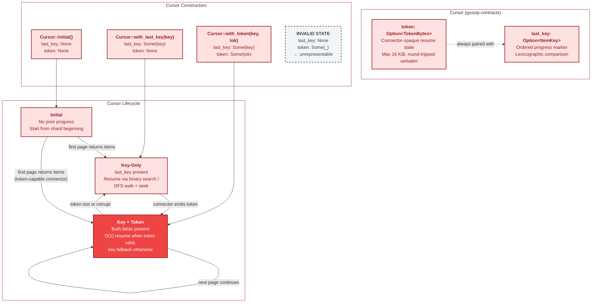
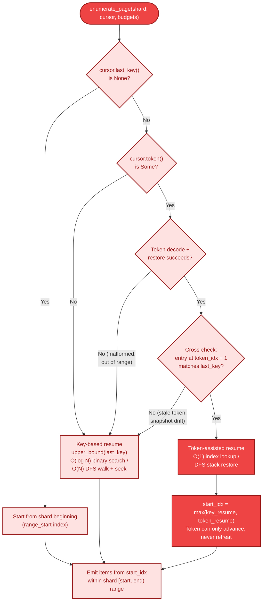
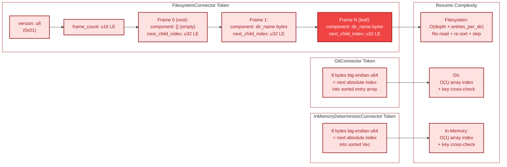
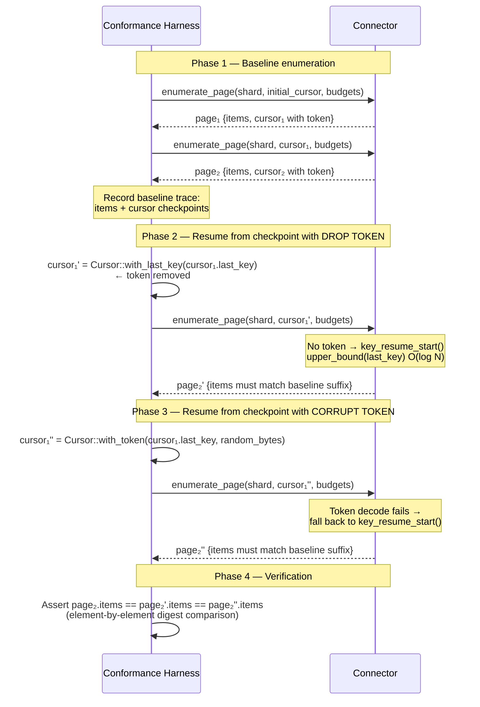
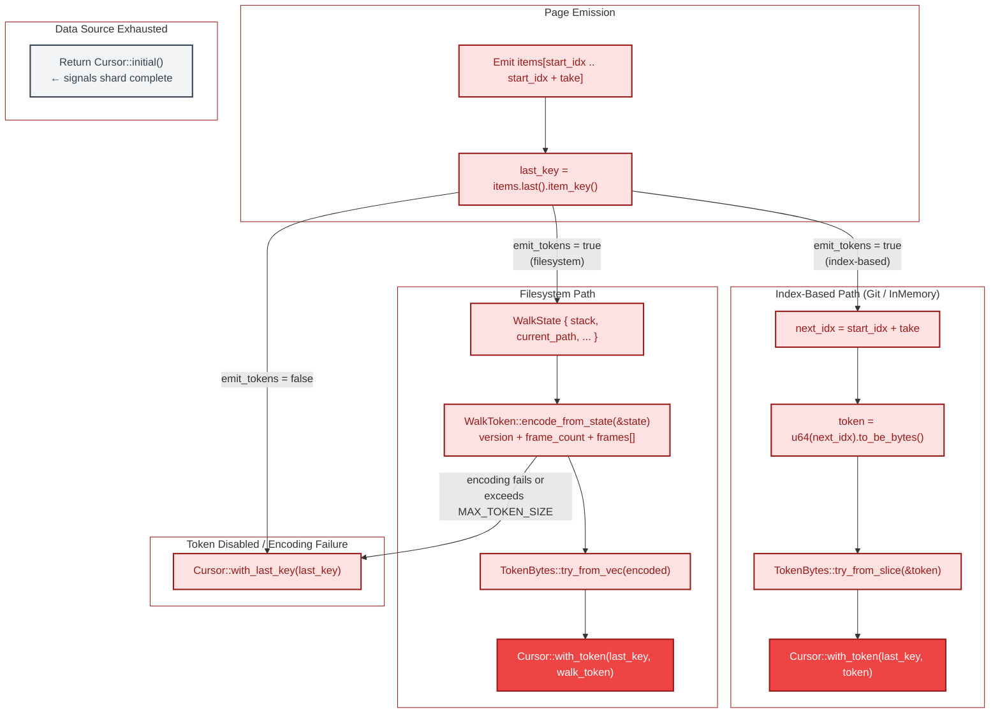

# Cursor Resume Strategy

This document details the two-layer cursor architecture used by the **B4 Connector**
boundary for paginated enumeration and fault-tolerant resume. Every connector must
produce globally sorted item keys and advance a `Cursor` that allows the coordination
layer to resume enumeration from an arbitrary checkpoint. The cursor carries both a
key-authoritative progress marker and an optional connector-opaque token that enables
O(1) position restoration when the token is valid.

The key insight is a **safety-first, speed-second** design: the `last_key` field
guarantees correct resume under any conditions (token loss, corruption, connector
restart, filesystem mutation), while the optional `token` field accelerates the common
case by allowing connectors to skip binary search or DFS traversal when the token is
still valid.

All diagrams use the B4 Connector color palette (fill `#EF4444` / `#FEE2E2`, stroke
`#991B1B`). Cross-boundary references use the corresponding boundary colors from the
[color legend](00-README.md#color-coding-legend).

---

## 1. Two-Layer Cursor Architecture

The `Cursor` struct encodes enumeration progress in two complementary layers. The
`last_key` field (an `ItemKey`) records the lexicographically greatest key that has
been fully processed. This field is **always present** after the first page and is
the authoritative resume position — the coordination layer uses it for cursor
monotonicity enforcement, and connectors use it as the fallback resume anchor.

The `token` field (an `Option<TokenBytes>`) carries connector-specific opaque state
that can restore enumeration position in O(1) time. Connectors that support tokens
encode internal state (DFS stack positions, sorted-index offsets) into this field.
Token content is opaque to the coordination layer; it is round-tripped verbatim
between `enumerate_page` calls.

The `Cursor` type makes the invalid state `(None, Some(token))` — a token without
a progress key — unrepresentable. All constructors enforce this invariant, and
`try_from_update` rejects it when crossing the coordination boundary.

---

## 2. Resume Decision Tree

When `enumerate_page()` receives a cursor, every connector follows the same logical
decision tree to determine where to begin emitting items. The two resume paths —
token-assisted (O(1)) and key-based (O(log N) or O(N)) — are **semantically
equivalent**: both must resume from the first item strictly greater than
`cursor.last_key()`. The token path is a performance optimization, not a correctness
requirement.

Key-based resume uses `key_resume_start()`, which performs an O(log N)
`upper_bound` binary search on sorted entries (git, in-memory connectors) or an
O(N) DFS walk-and-skip from root (filesystem connector).

Token-assisted resume decodes the token and attempts to restore position directly.
For index-based connectors (git, in-memory), this is an O(1) array index lookup
cross-checked against the last emitted key. For the filesystem connector, this
reconstructs the DFS stack from a serialized walk checkpoint, then seeks forward
from the restored position.

The token can only **advance** the resume position forward, never behind the
key-derived floor — this is enforced by `start_idx = start_idx.max(token_idx)`.

---

## 3. Token Encoding per Connector

Each connector stores different internal state in the `TokenBytes` field. The
coordination layer never interprets token contents — it validates only presence
and size (`MAX_TOKEN_SIZE = 16 KiB`). The three concrete connectors use
fundamentally different encoding strategies matched to their data access patterns.

**FilesystemConnector** encodes a `WalkToken` — a serialized snapshot of the DFS
stack. Each frame records a directory path component and a `next_child_index` (the
count of already-consumed children in that directory's sorted entry list). On
resume, the connector re-reads each directory from disk, re-sorts entries, and
fast-forwards past the consumed children. This restores DFS position without
replaying the entire walk from root. The wire format includes a version byte for
forward compatibility. When the token's frame count exceeds `MAX_TOKEN_SIZE`, deeper
frames are truncated and the leaf frame's index is rewound by one to force
re-descent into the truncated subtree.

**GitConnector** encodes the next absolute index in the sorted entry array as an
8-byte big-endian `u64`. Since the git snapshot is immutable after indexing, the
index is stable for the connector's lifetime. Resume decodes the u64, verifies
`entries[token_idx - 1].key == cursor.last_key()`, and jumps directly to
`entries[token_idx]`.

**InMemoryDeterministicConnector** uses the same 8-byte big-endian `u64` encoding
as the git connector. The sorted `Vec<PreparedItem>` is immutable after
construction, so the index provides the same O(1) guarantee.

---

## 4. Token Resilience Model

The conformance harness validates that token loss or corruption never causes data
loss. Every connector must produce semantically identical results regardless of
whether the cursor carries a valid token, no token, or a corrupted token. The
`ResumeChecks` configuration controls two independent perturbation scenarios:

- **Drop token** (`ResumeMode::DropToken`): The harness removes the cursor's
  `token` field entirely, leaving only `last_key`. The connector must resume
  from the key position using binary search or DFS walk-and-seek.

- **Corrupt token** (`ResumeMode::CorruptToken`): The harness replaces the
  cursor's `token` with random bytes. The connector must detect the invalid
  token (wrong version byte, malformed frames, index out of bounds, key
  cross-check failure) and fall back to key-based resume.

Both perturbation paths must produce the same suffix of items as normal
token-assisted resume. This is verified by comparing `ItemObservation` sequences
(BLAKE3 digests of key and fingerprint) element-by-element against the baseline
trace.

---

## 5. Cursor Construction

After emitting a page of items, each connector builds the continuation cursor
using shared helpers in `common.rs`. The process varies slightly between the
streaming filesystem connector (which encodes DFS stack state) and the
index-based connectors (git, in-memory) that encode a simple array offset.

For index-based connectors, `build_next_cursor()` encodes `next_idx` (the index
of the first un-emitted item) as an 8-byte big-endian `u64` token. The
`build_next_cursor_from_staged()` variant reuses a pre-staged pooled token when
one was already allocated during page assembly, avoiding a redundant allocation.

For the filesystem connector, `build_next_walk_cursor()` serializes the current
`WalkState` stack into a `WalkToken` via `WalkToken::encode_from_state()`. Token
construction failure (for example, when the encoded size exceeds `MAX_TOKEN_SIZE`)
gracefully degrades to a key-only cursor.

When the data source is exhausted (no more items to emit), the connector returns
`Cursor::initial()` — signalling that the shard is complete. An empty page with a
non-initial cursor signals "no items in this range, but more data may exist beyond."

---

## Cross-References

| Topic | Diagram | Relevance |
|-------|---------|-----------|
| Connector boundary overview | [09-circuit-breaker.md](09-circuit-breaker.md) | B4 fault isolation context |
| Shard key ranges and splits | [12-split-operations.md](12-split-operations.md) | Shard bounds that constrain cursor ranges |
| Shard algebra types | [13-shard-algebra-types.md](13-shard-algebra-types.md) | `ShardSpec` key range encoding that cursors operate within |
| End-to-end scan flow | [04-end-to-end-scan-flow.md](04-end-to-end-scan-flow.md) | Where cursor resume fits in the 12-step scan sequence |
| Lease lifecycle | [07-lease-lifecycle.md](07-lease-lifecycle.md) | Cursor monotonicity enforcement by the coordination layer |

---

## Source Code References

| Symbol / Concept | File | Line(s) | Notes |
|-----------------|------|---------|-------|
| `Cursor` struct | `crates/gossip-contracts/src/connector/types.rs` | 592–595 | Two-field struct: `last_key` + `token` |
| `Cursor::initial()` | `crates/gossip-contracts/src/connector/types.rs` | 604–609 | No-progress neutral state |
| `Cursor::with_last_key()` | `crates/gossip-contracts/src/connector/types.rs` | 617–621 | Key-only cursor constructor |
| `Cursor::with_token()` | `crates/gossip-contracts/src/connector/types.rs` | 630–635 | Key + token cursor constructor |
| `Cursor::try_from_update()` | `crates/gossip-contracts/src/connector/types.rs` | 688–702 | Validates `TokenWithoutLastKey` invariant |
| `ItemKey` | `crates/gossip-contracts/src/connector/types.rs` | 512–530 | Ordered toxic-byte wrapper, max 4 KiB |
| `TokenBytes` | `crates/gossip-contracts/src/connector/types.rs` | 555–576 | Unordered toxic-byte wrapper, max 16 KiB |
| `key_resume_start()` | `crates/gossip-connectors/src/common.rs` | 202–210 | O(log N) key-authoritative resume position |
| `cursor_token_index()` | `crates/gossip-connectors/src/common.rs` | 271–276 | Decode u64 token as array index |
| `build_next_cursor()` | `crates/gossip-connectors/src/common.rs` | 289–303 | Encode next_idx as u64 BE token |
| `build_next_cursor_from_staged()` | `crates/gossip-connectors/src/common.rs` | 317–333 | Reuse pre-staged pooled token |
| `upper_bound()` | `crates/gossip-connectors/src/common.rs` | 126–128 | First index where key > target |
| `WalkToken` struct | `crates/gossip-connectors/src/filesystem.rs` | 230–232 | Serialized DFS stack checkpoint |
| `WalkTokenFrame` | `crates/gossip-connectors/src/filesystem.rs` | 234–244 | Per-frame component + child index |
| `WALK_TOKEN_VERSION` | `crates/gossip-connectors/src/filesystem.rs` | 219 | Version byte `0x01` |
| `WalkToken::decode_bytes()` | `crates/gossip-connectors/src/filesystem.rs` | 1270–1319 | Deserialize with validation |
| `WalkToken::encode_from_state()` | `crates/gossip-connectors/src/filesystem.rs` | 1321–1377 | Serialize walk stack with size truncation |
| `WalkState::from_token()` | `crates/gossip-connectors/src/filesystem.rs` | 1571–1702 | Restore DFS state from token |
| `align_walk_to_cursor()` | `crates/gossip-connectors/src/filesystem.rs` | 593–671 | Token-first, key-fallback resume |
| `build_next_walk_cursor()` | `crates/gossip-connectors/src/filesystem.rs` | 677–689 | Encode walk state into cursor token |
| Git token resume | `crates/gossip-connectors/src/git.rs` | 398–418 | O(1) token + key cross-check |
| `ResumeChecks` | `crates/gossip-contracts/src/connector/conformance.rs` | 151–156 | Drop-token and corrupt-token flags |
| `ResumeMode` | `crates/gossip-contracts/src/connector/conformance.rs` | 388–397 | `DropToken` and `CorruptToken` variants |
| `ConformanceConfig` | `crates/gossip-contracts/src/connector/conformance.rs` | 258–286 | Harness configuration with resume checks |
