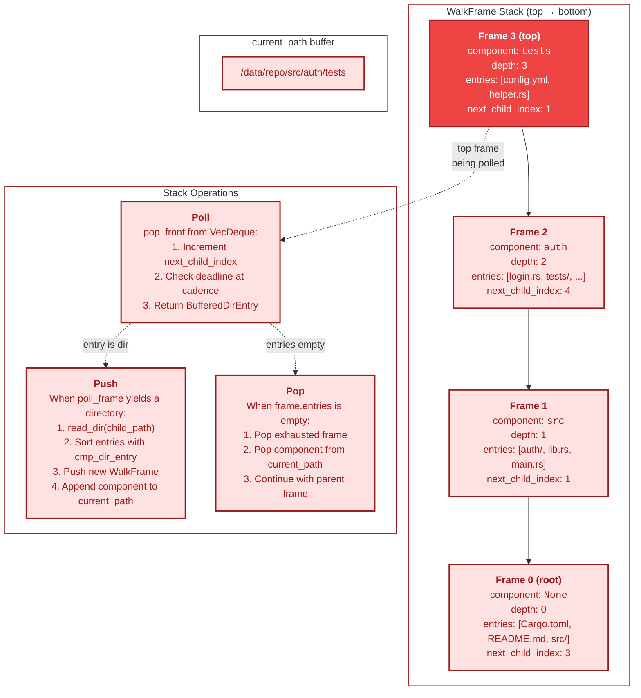
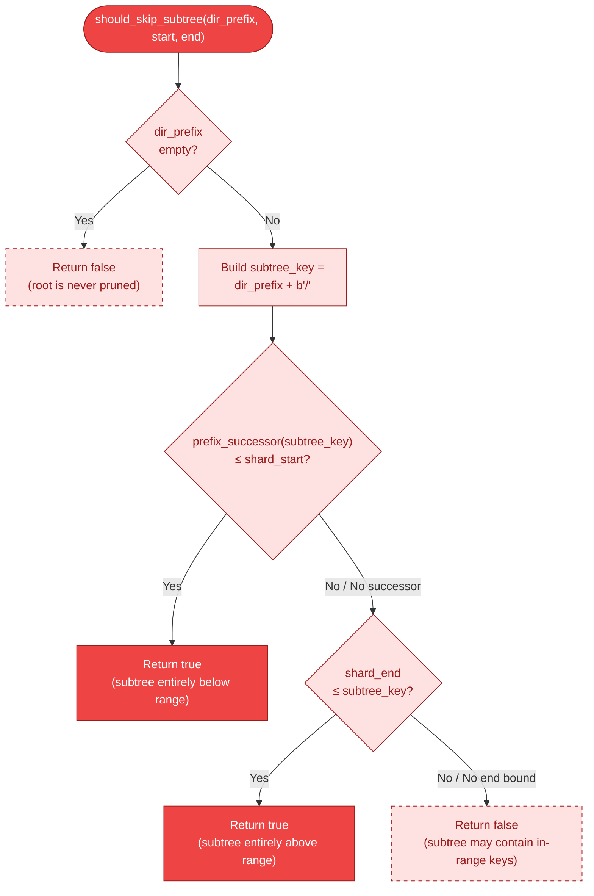
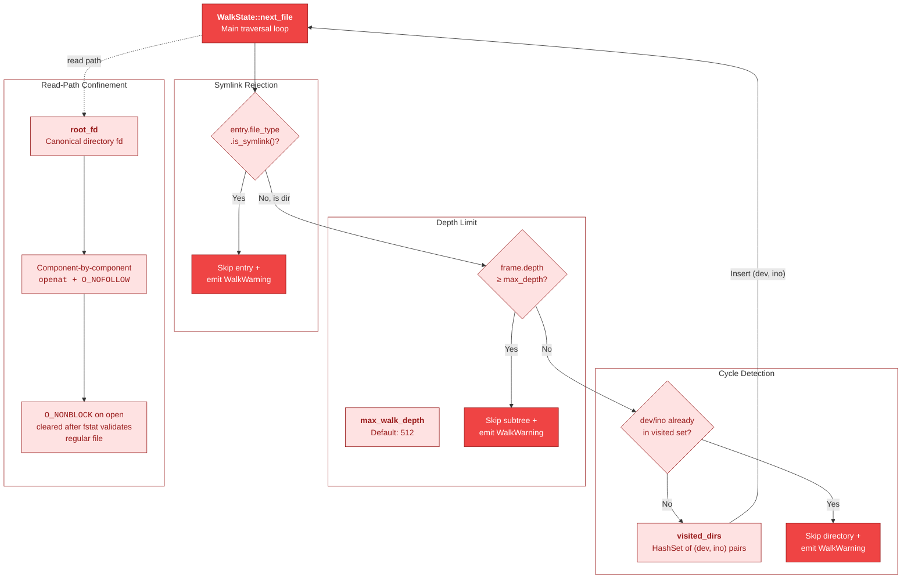

# Filesystem Walk State Machine

This document covers the internal DFS walk engine inside `FilesystemConnector`,
which serves as the streaming enumeration backend for the filesystem connector
(Boundary 4: Connector). The walk engine converts a rooted directory tree into a
globally sorted stream of `FileEntry` records without materializing a full-tree
index. Memory stays proportional to `O(Σ entries_per_active_dir)` for buffered
DFS frames plus `O(visited_dirs)` for cycle-detection identities.

The walk integrates with the shard-range types described in
[13-shard-algebra-types.md](13-shard-algebra-types.md) (connector split-point
lifecycle) and with the cursor resume protocol that keeps pagination consistent
across calls. Walk state is either created fresh from a root directory or restored
from a serialized `WalkToken` embedded in the cursor.

All diagrams use the B4 Connector color palette (fill `#EF4444` / `#FEE2E2`,
stroke `#991B1B`).

---

## 1. DFS Walk State Machine

`WalkState` is the resumable traversal engine. It maintains a stack of
`WalkFrame` values (one per open directory), a mutable path buffer, and cursor
alignment metadata. The state machine has two creation paths: fresh from root
(`WalkState::new`) or restored from a serialized token (`WalkState::from_token`).
Both converge into the same active traversal loop.

The `pending` field holds at most one already-discovered file that must be emitted
before continuing traversal. This arises during cursor seek (the first file past
the cursor position) or upper-bound stop (a file beyond the shard range, stashed
for potential reuse by a later request with different bounds).

Once the stack drains completely, `exhausted` latches to `true` and no further
files are produced. The `exhausted` flag is sticky — it is never cleared without
rebuilding or replacing the entire `WalkState`.

```mermaid
%% Diagram: walk-state-lifecycle
stateDiagram-v2
    direction TB

    state "Create from Root" as create_root
    state "Restore from Token" as restore_token
    state "Active: Push Dir" as push_dir
    state "Active: Buffer & Sort" as buffer_sort
    state "Active: Yield File" as yield_file
    state "Active: Pop Frame" as pop_frame
    state "Active: Pending Drain" as pending_drain
    state "Exhausted" as exhausted

    [*] --> create_root : WalkState::new(root)
    [*] --> restore_token : WalkState::from_token(root, token)

    create_root --> buffer_sort : read_dir(root) +<br/>sort entries
    restore_token --> buffer_sort : re-open dirs,<br/>fast-forward each frame

    buffer_sort --> pending_drain : pending.take() non-None
    buffer_sort --> push_dir : poll_frame → directory entry

    pending_drain --> yield_file : emit stashed file

    push_dir --> buffer_sort : read_dir(child),<br/>sort, push WalkFrame
    push_dir --> yield_file : poll_frame → regular file

    yield_file --> push_dir : poll_frame → directory entry
    yield_file --> yield_file : poll_frame → regular file
    yield_file --> pop_frame : frame entries exhausted

    pop_frame --> push_dir : parent frame has entries
    pop_frame --> pop_frame : parent also exhausted
    pop_frame --> exhausted : stack empty

    exhausted --> [*]

    note right of push_dir
        Cycle detection, depth limit,
        and subtree pruning checked
        before push.
    end note

    note right of yield_file
        Key bounds filtering applied.
        Files outside [start, end)
        are skipped or stashed.
    end note

    note left of exhausted
        Sticky flag — once set,
        all subsequent next_file()
        calls return None.
    end note

    classDef initState fill:#FEE2E2,stroke:#991B1B,color:#991B1B
    classDef activeState fill:#FEE2E2,stroke:#991B1B,color:#991B1B
    classDef terminalState fill:#EF4444,stroke:#991B1B,color:#FFFFFF

    class create_root,restore_token initState
    class push_dir,buffer_sort,yield_file,pop_frame,pending_drain activeState
    class exhausted terminalState
```

Key observations from the source:

- **`WalkState::new`** opens the root directory, buffers and sorts its entries into
  a `VecDeque<BufferedDirEntry>`, seeds the `visited_dirs` set with the root's
  `(dev, ino)`, and pushes the root `WalkFrame` onto the stack.
- **`WalkState::from_token`** replays each serialized frame: re-opens the directory,
  buffers and sorts entries, then calls `fast_forward_frame_entries` to drain the
  first `next_child_index` entries. Non-leaf frames must retain at least one entry
  after fast-forward to preserve sibling files in DFS order.
- **`pending`** is drained before any stack traversal in `next_file()`. This ensures
  cursor seek results and upper-bound stash entries are emitted exactly once.
- **`exhausted`** is set when the main `while !self.stack.is_empty()` loop exits
  naturally (all frames drained). It is never set when an upper-bound stop returns
  `None` — the walk may be reused with different bounds.

---

## 2. Stack-Based DFS Traversal

The walk uses an explicit stack of `WalkFrame` values to perform depth-first
traversal. Each frame represents one open directory and holds a pre-sorted
`VecDeque<BufferedDirEntry>` of that directory's children. The `next_child_index`
field tracks how many children have been consumed, enabling both in-memory
progress tracking and serialized token resume.

Sorting entries per-directory with `cmp_dir_entry` (which uses `cmp_with_trailing_sep`
for Git tree-order comparison) guarantees globally sorted keys when combined with
DFS descent. Directory names sort as if they had a trailing `/` byte, ensuring
`src/a` sorts before `src/a.txt` which sorts before `src/b/`.



Implementation details:

- **`BufferedDirEntry`** holds `name: OsString` and `file_type: fs::FileType`. The
  file type is captured at `readdir` time to avoid a separate `stat` call for the
  directory-vs-file decision. File metadata is read later only when an entry is
  actually emitted.
- **`cmp_with_trailing_sep`** appends a virtual `b'/'` to directory names during
  comparison. This produces the same total ordering as sorting fully qualified
  relative paths lexicographically, because `/` (0x2F) is less than any printable
  ASCII filename character.
- **`MAX_ENTRIES_PER_DIR`** (500,000) caps per-directory buffering. Pathological
  directories (e.g., `/proc`-like mounts) that exceed this limit trigger a
  retryable error rather than unbounded memory growth.
- **`DEADLINE_CHECK_INTERVAL`** (512) controls how often `Instant::now()` is polled
  during entry iteration, balancing deadline responsiveness against syscall overhead.

---

## 3. Subtree Pruning with Shard Bounds

The `should_skip_subtree` function enables shard-scoped filesystem walks by
eliminating entire directory subtrees whose key prefixes cannot overlap the
half-open shard range `[start_key, end_key)`. This avoids descending into
irrelevant branches of the tree, reducing both I/O and CPU proportionally to
the fraction of the tree outside the shard range.

The pruning is conservative: returning `true` guarantees safety (no in-range
keys exist in the subtree), but returning `false` does not guarantee relevance
(leaf-level filtering handles the remainder). Empty prefixes (root directory)
and prefixes whose last byte is `0xFF` (no finite successor) are never pruned
on the below-range side.



### Worked example

Given shard range `[src/b, src/d)` and a tree:

| Directory prefix | subtree_key     | prefix_successor    | Below range?       | Above range?       | Decision  |
| ---------------- | --------------- | ------------------- | ------------------ | ------------------ | --------- |
| `src/a`          | `src/a/`        | `src/b/` (0x61→0x62)| `src/b/` ≤ `src/b` | —                  | **Skip**  |
| `src/b`          | `src/b/`        | `src/c/`            | `src/c/` > `src/b` | `src/d` > `src/b/` | **Enter** |
| `src/c`          | `src/c/`        | `src/d/`            | `src/d/` > `src/b` | `src/d` > `src/c/` | **Enter** |
| `src/d`          | `src/d/`        | `src/e/`            | —                  | `src/d` ≤ `src/d/` | **Skip**  |
| `tests`          | `tests/`        | `testu/`            | —                  | `src/d` ≤ `tests/` | **Skip**  |

The `prefix_successor` function increments the last byte of its input. For
`src/a/` (last byte `0x2F` = `/`), the successor is `src/a0` (0x30). For
`src/b/`, the successor is `src/c/` (0x62→0x63 after the `/` is replaced
by incrementing `b`). The function returns `None` when the last byte is `0xFF`,
preventing false-positive pruning from arithmetic overflow.

Pruning is placed *before* cycle detection in the walk loop so that a pruned
directory does not poison the `visited_dirs` set. A later in-range path to the
same inode can still descend.

---

## 4. WalkToken Serialization Format

`WalkToken` serializes the DFS stack position into a compact binary format
embedded in the cursor's opaque token field. This allows resuming a walk from
the exact stack position without re-scanning from root, trading token size for
I/O savings on resume.

Token-based resume is advisory: any decode or restore failure falls back to
key-only resume (rebuild from root, seek past `cursor.last_key()`). In test
builds, a cross-check verifies that token-based resume agrees with key-only
resume and falls back on mismatch.

### Wire format

```mermaid
%% Diagram: walk-token-wire-format
graph LR
    subgraph header["Header"]
        V["Version<br/><code>0x01</code><br/>(1 byte)"]
        FC["Frame Count<br/><code>u16 LE</code><br/>(2 bytes)"]
    end

    subgraph frame0["Frame 0 (root)"]
        CL0["Component Len<br/><code>0x0000</code><br/>(u16 LE)"]
        CI0["next_child_index<br/><code>u32 LE</code><br/>(4 bytes)"]
    end

    subgraph frame1["Frame 1"]
        CL1["Component Len<br/><code>u16 LE</code><br/>(2 bytes)"]
        CB1["Component Bytes<br/><code>e.g. 'src'</code><br/>(variable)"]
        CI1["next_child_index<br/><code>u32 LE</code><br/>(4 bytes)"]
    end

    subgraph frame2["Frame N"]
        CL2["Component Len<br/><code>u16 LE</code><br/>(2 bytes)"]
        CB2["Component Bytes<br/>(variable)"]
        CI2["next_child_index<br/><code>u32 LE</code><br/>(4 bytes)"]
    end

    V --> FC --> CL0 --> CI0 --> CL1 --> CB1 --> CI1 --> CL2 --> CB2 --> CI2

    style header fill:none,stroke:#991B1B,stroke-width:1px
    style frame0 fill:none,stroke:#991B1B,stroke-width:1px
    style frame1 fill:none,stroke:#991B1B,stroke-width:1px
    style frame2 fill:none,stroke:#991B1B,stroke-width:1px

    style V fill:#EF4444,stroke:#991B1B,color:#FFFFFF
    style FC fill:#EF4444,stroke:#991B1B,color:#FFFFFF
    style CL0 fill:#FEE2E2,stroke:#991B1B,color:#991B1B
    style CI0 fill:#FEE2E2,stroke:#991B1B,color:#991B1B
    style CL1 fill:#FEE2E2,stroke:#991B1B,color:#991B1B
    style CB1 fill:#FEE2E2,stroke:#991B1B,color:#991B1B
    style CI1 fill:#FEE2E2,stroke:#991B1B,color:#991B1B
    style CL2 fill:#FEE2E2,stroke:#991B1B,color:#991B1B
    style CB2 fill:#FEE2E2,stroke:#991B1B,color:#991B1B
    style CI2 fill:#FEE2E2,stroke:#991B1B,color:#991B1B
```



### Encoding rules

| Field                | Size     | Notes                                                                |
| -------------------- | -------- | -------------------------------------------------------------------- |
| Version              | 1 byte   | Fixed `0x01`. Unrecognized versions cause decode to return `None`.   |
| Frame count          | u16 LE   | Number of frames. Root frame is always index 0.                      |
| Component length     | u16 LE   | Root frame must be 0. Non-root must be > 0, no `/`, no NUL, no `.`/`..`. |
| Component bytes      | variable | Single path segment relative to parent directory.                    |
| next_child_index     | u32 LE   | Count of already-consumed children in this directory's sorted list.  |

### Encoding (`encode_from_state`)

The encoder performs two passes over `state.stack`:

1. **Size pass**: computes `encoded_size` and counts how many frames fit within
   `MAX_TOKEN_SIZE`. Frames with component names exceeding `u16::MAX` bytes are
   truncated (the token stops at the last frame that fits).
2. **Serialize pass**: writes version, frame count, and each frame's component
   and index directly into a `Vec<u8>`.

When truncation occurs (deep stacks exceed `MAX_TOKEN_SIZE`), the last retained
frame's `next_child_index` is decremented by one. This forces the truncated
directory to be re-entered on resume so its descendants are not silently skipped.

### Decoding (`decode_bytes`)

The decoder validates every frame:

- Root frame (index 0) must have an empty component.
- Non-root frames reject empty components, embedded `/`, NUL bytes, and `.`/`..`
  (preventing path traversal attacks in untrusted tokens).
- Pre-allocation is capped at `min(frame_count, remaining_bytes / 6, 64)` to
  prevent forged frame counts from triggering outsized allocations.
- Trailing bytes after the last frame cause decode to return `None`.

### Restore (`from_token`)

`WalkState::from_token` replays each frame from the token:

1. Open the root directory, buffer and sort entries, fast-forward past the first
   `next_child_index` entries.
2. For each child frame: validate the component, append to `current_path`, check
   for symlinks (reject), check for cycle detection (`dev/ino` visited set),
   open and buffer the directory, fast-forward.
3. Non-leaf frames must retain at least one entry after fast-forward; otherwise
   sibling files after the child subtree would be lost.
4. Any failure at any step returns `Ok(None)`, triggering key-only fallback.

---

## 5. Safety Mechanisms

The filesystem walk operates on untrusted input (the filesystem itself may contain
adversarial structures: symlink farms, bind-mount cycles, deeply nested directories,
race conditions). Four mechanisms prevent the walk from hanging, escaping its root,
or consuming unbounded resources.



### Cycle detection

The `visited_dirs` field is a `HashSet<(u64, u64)>` tracking `(dev, ino)` pairs
of every directory the walk has descended into. Before entering a directory, the
walk checks whether its identity is already in the set. Duplicates arise from
bind mounts or (rare) directory hardlinks and would cause infinite traversal.

The root directory's identity is inserted during `WalkState::new` so that a
bind-mount cycle back to root is caught immediately. During token restore,
`symlink_metadata` (not `metadata`) is used to detect and reject symlinks before
they can be followed.

Cycle detection is placed *after* subtree pruning in the walk loop. This is
intentional: a pruned directory should not poison the visited set, because a
later in-range path to the same inode must still be able to descend.

### Depth limit

`max_walk_depth` (default 512) caps the DFS stack depth. Directories at or
beyond the limit are skipped with a `WalkWarning` rather than causing an error.
This prevents stack overflow from pathological nesting and bounds memory for the
DFS stack itself.

### Symlink skipping

Symlinks are unconditionally skipped during the walk. The `file_type` obtained
from `readdir` identifies symlinks without an extra `stat` call. Skipping
symlinks prevents two classes of attack:

- **Escape**: A symlink pointing outside the connector root could expose
  files the connector should not enumerate.
- **TOCTOU**: A symlink target can change between enumeration and read time.
  By never following symlinks during enumeration, the walk avoids discovering
  files that become inaccessible (or different) at read time.

### Read-path confinement (`openat` + `O_NOFOLLOW`)

The read path (`open_beneath_root`) does not use the walk's `current_path`.
Instead, it decomposes the `item_ref` into individual path components and
traverses from `root_fd` using `openat` with `O_NOFOLLOW` at every step:

- **`O_NOFOLLOW`** causes `openat` to fail with `ELOOP` if any intermediate
  component is a symlink, preventing symlink-to-read races.
- **`O_DIRECTORY`** on intermediate components ensures only actual directories
  are traversed.
- **`O_NONBLOCK`** on the final (leaf) open prevents blocking on FIFOs or
  device nodes that might appear via TOCTOU. After `fstat` confirms the file
  is regular, `clear_nonblock` removes the flag for normal read semantics.
- **Component validation** rejects empty segments, `.`, `..`, embedded NUL
  bytes, and names exceeding `NAME_MAX`.

Root identity is verified at connector initialization: `fs::metadata` captures
the expected `(dev, ino)` *before* opening the fd, then `fstat` on the opened
fd confirms the match. This narrows the TOCTOU window to stat→open (same
direction) rather than open→stat.

---

## Cross-References

| Topic                              | Diagram                                                                                                 |
| ---------------------------------- | ------------------------------------------------------------------------------------------------------- |
| Connector split-point lifecycle   | [13-shard-algebra-types.md](13-shard-algebra-types.md) §6 (Connector Split-Point Lifecycle)             |
| Circuit breaker for connectors     | [09-circuit-breaker.md](09-circuit-breaker.md)                                                          |
| Shard key ranges and split algebra | [12-split-operations.md](12-split-operations.md), [13-shard-algebra-types.md](13-shard-algebra-types.md)|
| End-to-end scan flow               | [04-end-to-end-scan-flow.md](04-end-to-end-scan-flow.md)                                               |
| Fencing and cursor monotonicity    | [06-fencing-protocol.md](06-fencing-protocol.md), [07-lease-lifecycle.md](07-lease-lifecycle.md)        |

---

## Source Code References

| Type / Function                | Location                                              | Purpose                                                         |
| ------------------------------ | ----------------------------------------------------- | --------------------------------------------------------------- |
| `FilesystemConnector`          | `crates/gossip-connectors/src/filesystem.rs`      | Top-level connector struct; owns walk state, root fd, estimator |
| `WalkState`                    | `crates/gossip-connectors/src/filesystem.rs`      | Resumable DFS traversal state: stack, path buffer, cursor data  |
| `WalkFrame`                    | `crates/gossip-connectors/src/filesystem.rs`      | Single DFS stack frame: component, depth, sorted entries, index |
| `BufferedDirEntry`             | `crates/gossip-connectors/src/filesystem.rs`      | Name + file type pair for one directory entry                   |
| `FileEntry`                    | `crates/gossip-connectors/src/filesystem.rs`      | Internal staging type: key, stable ID, version, size            |
| `WalkToken`                    | `crates/gossip-connectors/src/filesystem.rs`      | Serialized DFS stack checkpoint for cursor resume               |
| `WalkTokenFrame`               | `crates/gossip-connectors/src/filesystem.rs`      | Per-frame component bytes + consumed child count                |
| `WalkQuery`                    | `crates/gossip-connectors/src/filesystem.rs`      | Borrowed per-call parameters: root, bounds, deadline, limits    |
| `WalkWarning`                  | `crates/gossip-connectors/src/filesystem.rs`      | Non-fatal walk diagnostic with redacted path digest             |
| `WalkState::new`               | `crates/gossip-connectors/src/filesystem.rs`     | Create fresh walk from root directory                           |
| `WalkState::from_token`        | `crates/gossip-connectors/src/filesystem.rs`     | Restore walk state from serialized token                        |
| `WalkState::next_file`         | `crates/gossip-connectors/src/filesystem.rs`     | Core traversal: produce next file in sorted DFS order           |
| `WalkState::poll_frame`        | `crates/gossip-connectors/src/filesystem.rs`     | Pop next entry from frame with deadline cadence                 |
| `should_skip_subtree`          | `crates/gossip-connectors/src/filesystem.rs`     | Shard-range subtree pruning predicate                           |
| `prefix_successor`             | `crates/gossip-connectors/src/filesystem.rs`     | Lexicographic next prefix for pruning bound computation         |
| `cmp_with_trailing_sep`        | `crates/gossip-connectors/src/filesystem.rs`     | Git tree-order comparison with virtual trailing `/`             |
| `cmp_dir_entry`                | `crates/gossip-connectors/src/filesystem.rs`     | Entry sort comparator using `cmp_with_trailing_sep`             |
| `read_dir_sorted_entries`      | `crates/gossip-connectors/src/filesystem.rs`     | Buffer, sort, and cap one directory's entries                   |
| `fast_forward_frame_entries`   | `crates/gossip-connectors/src/filesystem.rs`     | Skip past consumed entries during token restore                 |
| `WalkToken::encode_from_state` | `crates/gossip-connectors/src/filesystem.rs`     | Two-pass serialization of DFS stack to token bytes              |
| `WalkToken::decode_bytes`      | `crates/gossip-connectors/src/filesystem.rs`     | Validated deserialization with traversal-attack rejection        |
| `encode_rel_path`              | `crates/gossip-connectors/src/filesystem.rs`     | Relative path → `/`-separated byte key                          |
| `derive_fs_version_id`         | `crates/gossip-connectors/src/filesystem.rs`     | Metadata-based weak version ID (mtime, size, ino, dev)          |
| `open_beneath_root`            | `crates/gossip-connectors/src/filesystem.rs`      | Component-by-component `openat + O_NOFOLLOW` read path          |
| `open_dir_fd`                  | `crates/gossip-connectors/src/filesystem.rs`     | Open directory fd with `O_DIRECTORY + O_CLOEXEC`                |
| `clear_nonblock`               | `crates/gossip-connectors/src/filesystem.rs`     | Remove `O_NONBLOCK` after regular-file validation               |
| `verify_root_identity`         | `crates/gossip-connectors/src/filesystem.rs`     | fstat-based root `(dev, ino)` verification                      |
| `intersect_key_bounds`         | `crates/gossip-connectors/src/filesystem.rs`     | Merge request + connector key-range bounds                      |
| `choose_split_point_range`     | `crates/gossip-connectors/src/filesystem.rs`      | Shard-range split-point selection using walk data                        |
| `align_walk_to_cursor`         | `crates/gossip-connectors/src/filesystem.rs`      | Token restore → key-only fallback cursor alignment              |
| `StreamingSplitEstimator`      | `crates/gossip-connectors/src/split_estimator.rs`     | Reservoir-sampled split-point estimation fed during walk         |
| `DEADLINE_CHECK_INTERVAL`      | `crates/gossip-connectors/src/filesystem.rs`     | Entries between deadline polls (512)                             |
| `MAX_ENTRIES_PER_DIR`          | `crates/gossip-connectors/src/filesystem.rs`     | Per-directory buffer cap (500,000)                               |
| `WALK_TOKEN_VERSION`           | `crates/gossip-connectors/src/filesystem.rs`      | Current token format version byte (`0x01`)                       |
| `MAX_TOKEN_SIZE`               | `crates/gossip-contracts/src/connector/`              | Upper bound on serialized token bytes                            |
