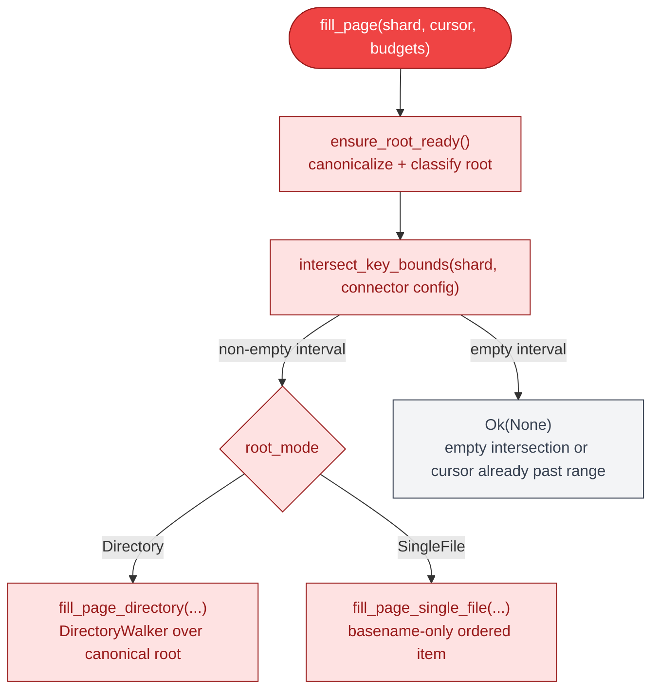
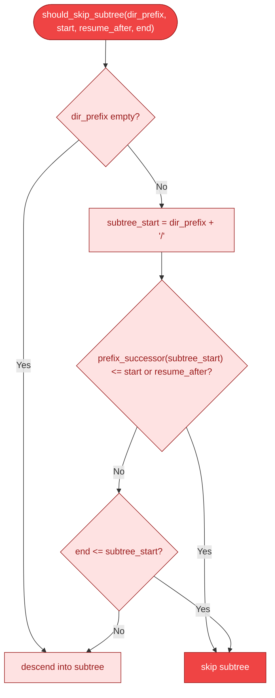
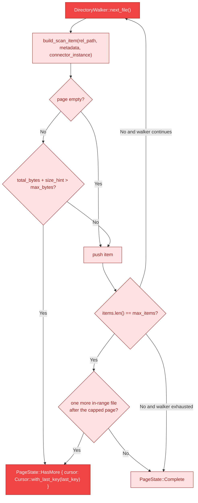
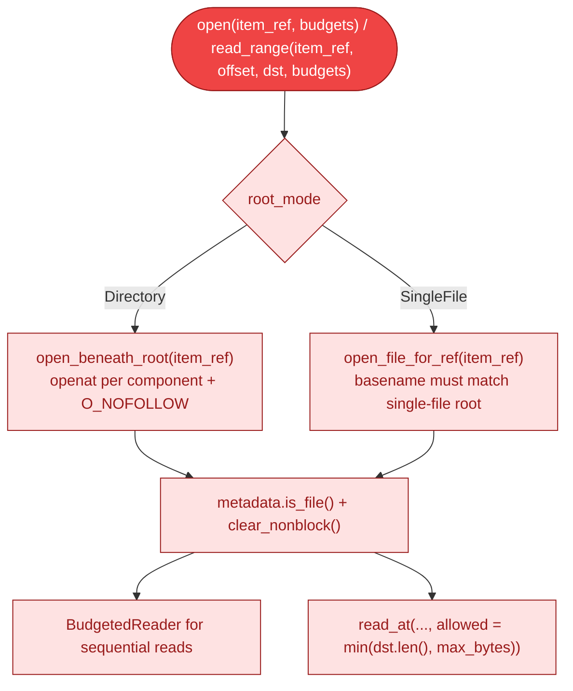

# Filesystem Walk State Machine

This document covers the current filesystem enumeration engine inside
`FilesystemConnector`. The connector serves ordered-content pages directly from
the live canonical filesystem view without storing a resumable DFS token or a
whole-tree snapshot. Each page request rebuilds the walk from the canonical
root, applies the shard/cursor floor, and emits relative-path items in
lexicographic order.

The walk is bounded by the active directory stack only. Memory scales with the
sorted entry buffers for directories currently on the traversal stack rather
than the total size of the tree.

All diagrams use the B4 Connector color palette (fill `#EF4444` / `#FEE2E2`,
stroke `#991B1B`).

---

## 1. Root Preparation and Fill Dispatch

`FilesystemConnector::ensure_root_ready()` canonicalizes the configured root
exactly once and classifies it as either:

- `RootMode::Directory` for a directory tree walked through `DirectoryWalker`.
- `RootMode::SingleFile` for a single canonical file exposed under its basename.

Every `fill_page()` call first intersects shard bounds with connector-level
key-range restrictions and then dispatches through the cached root mode.



---

## 2. DirectoryWalker Lifecycle

`DirectoryWalker` is a per-call DFS walker. It owns:

- `stack: Vec<WalkFrame>` for the active directory chain
- `floor: Option<&[u8]>` derived from shard start and `cursor.last_key()`
- `end: Option<&[u8]>` for the upper half-open bound
- `deadline: Option<Instant>` for connector-local budget expiry

Each `WalkFrame` stores:

- `abs_path`: canonical absolute directory path
- `rel_path`: relative key prefix for children
- `entries`: the current directory's sorted `BufferedDirEntry` list
- `next_index`: the next child to inspect

The walker does not persist across requests. A subsequent page call builds a
new walker from the canonical root and replays progress through the
key-derived floor.

```mermaid
%% Diagram: directory-walker-lifecycle
stateDiagram-v2
    direction TB

    [*] --> init: DirectoryWalker::new(root, start, resume_after, end, deadline)
    init --> poll: root WalkFrame seeded with sorted entries

    poll --> pop: frame.next_index >= frame.entries.len()
    poll --> descend: next entry is directory and subtree may overlap range
    poll --> skip: entry empty / non-file / pruned
    poll --> emit: next entry is regular file in [start, end) and > resume_after
    poll --> done: next entry sorts at-or-above end

    skip --> poll
    descend --> poll: push child WalkFrame with sorted entries
    emit --> poll
    pop --> poll: parent frame remains
    pop --> done: stack empty
    done --> [*]
```

Key behavior from `next_file()`:

- Deadline expiry returns a retryable `EnumerateError`.
- Directory entries are joined into relative keys with `join_relative_path()`.
- Subtrees are pruned before opening child directories when every descendant
  must sort below `floor` or at-or-above `end`.
- File metadata is read with `fs::symlink_metadata()` only when a candidate
  file survives prefix and bound checks.
- Returning `Ok(None)` is terminal for the current call only; the next page
  call rebuilds a fresh walker.

---

## 3. Ordering and Subtree Pruning

Directory siblings are sorted with `cmp_buffered_dir_entries()`, which treats
directory names as if they carried a synthetic trailing `/`. That makes the DFS
yield order match lexicographic ordering over full relative paths.

`should_skip_subtree()` uses a synthetic `prefix/` key and its strict
lexicographic successor to decide whether an entire directory subtree can be
skipped before opening it.



---

## 4. Budgeted Page Assembly

`fill_page_directory()` converts `WalkFile` values into `ScanItem`s and applies
connector-local budgets directly:

- `max_items` limits page cardinality.
- `max_bytes` limits the cumulative `size_hint` budget after the first emitted
  item.
- The first in-scope item is always admitted, even when its `size_hint` alone
  exceeds `max_bytes`, so cursor progress cannot stall on one oversized file.
- `PageState::HasMore` uses `Cursor::with_last_key(last_key)`.
- `PageState::Complete` marks the last non-empty page in range.

Single-file roots use `fill_page_single_file()` to emit at most one
`ScanItem`, keyed by the canonical file basename.



---

## 5. Read-Path Confinement

Enumeration and reading are intentionally separate:

- Enumeration walks relative paths from the canonical root.
- Reads reopen the target from the canonical root rather than trusting
  enumeration-time state.

Directory roots use `open_beneath_root()` to traverse every path component with
`openat + O_NOFOLLOW`. Single-file roots open the canonical file path directly
and require the `item_ref` to match the cached basename. Full reads wrap the
result in `BudgetedReader`, while `read_range()` clamps bytes to the caller's
buffer length and `budgets.max_bytes()`.



---

## Cross-References

| Topic | Diagram |
|-------|---------|
| Connector method surface | [14-connector-architecture.md](14-connector-architecture.md) |
| Cursor contract | [16-cursor-resume-strategy.md](16-cursor-resume-strategy.md) |
| End-to-end scan flow | [04-end-to-end-scan-flow.md](04-end-to-end-scan-flow.md) |
| Shard algebra and split ranges | [12-split-operations.md](12-split-operations.md), [13-shard-algebra-types.md](13-shard-algebra-types.md) |

---

## Source Code References

| Type / Function | Location | Purpose |
|-----------------|----------|---------|
| `FilesystemConnector` | `crates/gossip-connectors/src/filesystem.rs` | Top-level ordered-content connector |
| `RootMode` | `crates/gossip-connectors/src/filesystem.rs` | Directory vs single-file root dispatch |
| `DirectoryWalker` | `crates/gossip-connectors/src/filesystem.rs` | Per-call DFS walker over the canonical directory root |
| `WalkFrame` | `crates/gossip-connectors/src/filesystem.rs` | One active directory frame: path, entries, next index |
| `WalkFile` | `crates/gossip-connectors/src/filesystem.rs` | Relative path plus file metadata yielded by the walk |
| `BufferedDirEntry` | `crates/gossip-connectors/src/filesystem.rs` | Directory child name plus `FileType` |
| `ensure_root_ready()` | `crates/gossip-connectors/src/filesystem.rs` | Canonicalizes the root and caches identity scope |
| `fill_page_directory()` | `crates/gossip-connectors/src/filesystem.rs` | Directory-mode page assembly with key-only resume |
| `fill_page_single_file()` | `crates/gossip-connectors/src/filesystem.rs` | Single-file ordered-content page path |
| `build_scan_item()` | `crates/gossip-connectors/src/filesystem.rs` | Relative path to `ScanItem` conversion |
| `derive_filesystem_version()` | `crates/gossip-connectors/src/filesystem.rs` | Weak metadata-based version derivation |
| `read_sorted_dir_entries()` | `crates/gossip-connectors/src/filesystem.rs` | Reads and sorts one directory's entries |
| `cmp_buffered_dir_entries()` | `crates/gossip-connectors/src/filesystem.rs` | Sort comparator for sibling entries |
| `cmp_component_with_dir_suffix()` | `crates/gossip-connectors/src/filesystem.rs` | Virtual trailing `/` ordering rule |
| `join_relative_path()` | `crates/gossip-connectors/src/filesystem.rs` | Builds child relative keys from parent prefix + component |
| `should_skip_subtree()` | `crates/gossip-connectors/src/filesystem.rs` | Prefix-based subtree pruning |
| `prefix_successor()` | `crates/gossip-connectors/src/filesystem.rs` | Strict lexicographic successor for subtree pruning |
| `intersect_key_bounds()` | `crates/gossip-connectors/src/filesystem.rs` | Request/config range intersection |
| `BudgetedReader` | `crates/gossip-connectors/src/filesystem.rs` | Sequential-read adapter enforcing `max_bytes` and deadline |
| `open_beneath_root()` | `crates/gossip-connectors/src/filesystem.rs` | Component-by-component `openat` read path |
| `open_file_for_ref()` | `crates/gossip-connectors/src/filesystem.rs` | Root-mode-aware read dispatch |
| `get_or_open_cached()` | `crates/gossip-connectors/src/filesystem.rs` | One-entry file-descriptor cache for `read_range()` |
| `deadline_expired()` | `crates/gossip-connectors/src/common.rs` | Shared deadline gate used by walk and read paths |
