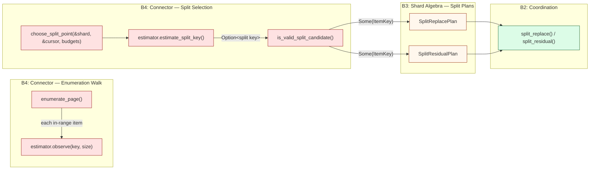
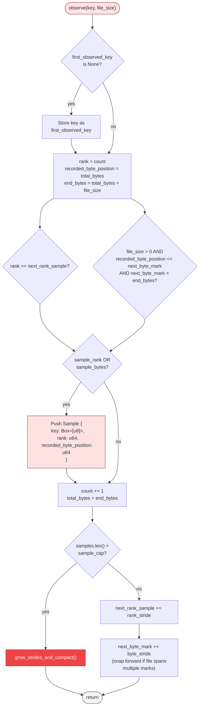
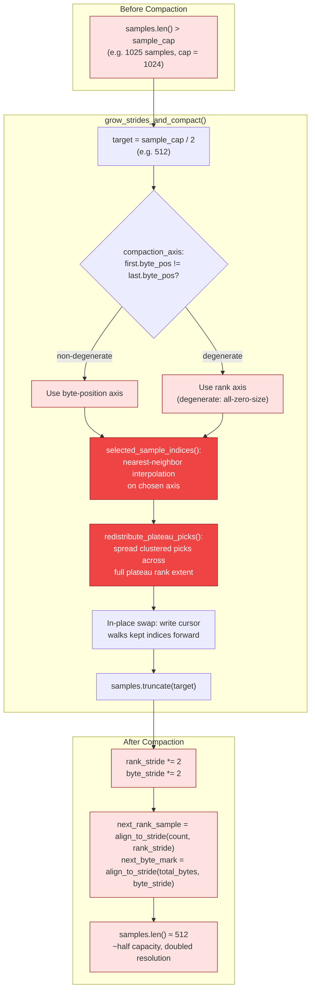
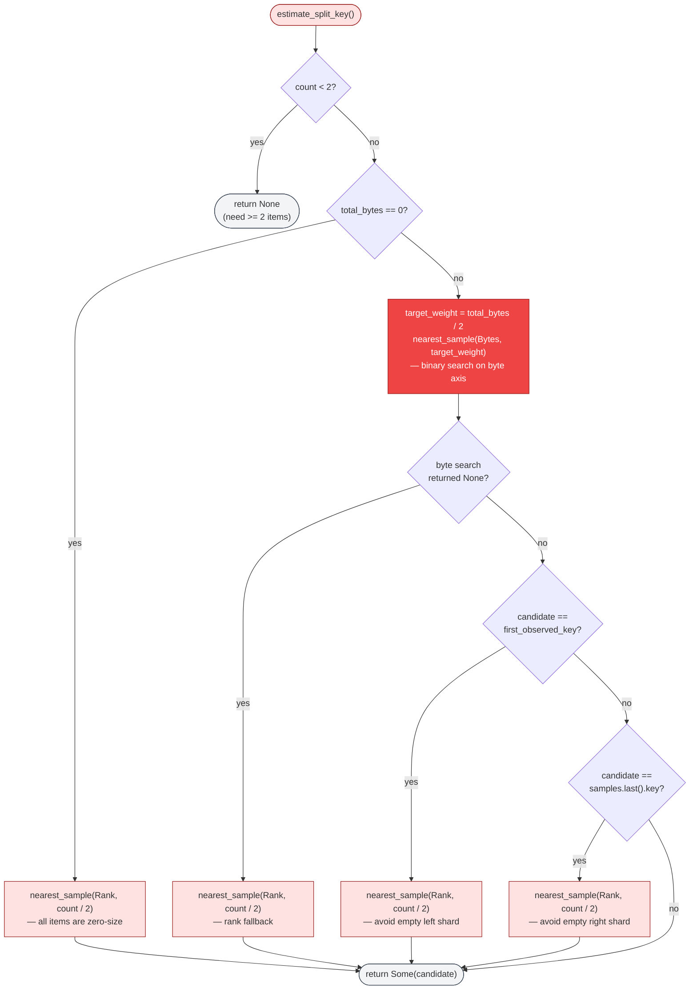
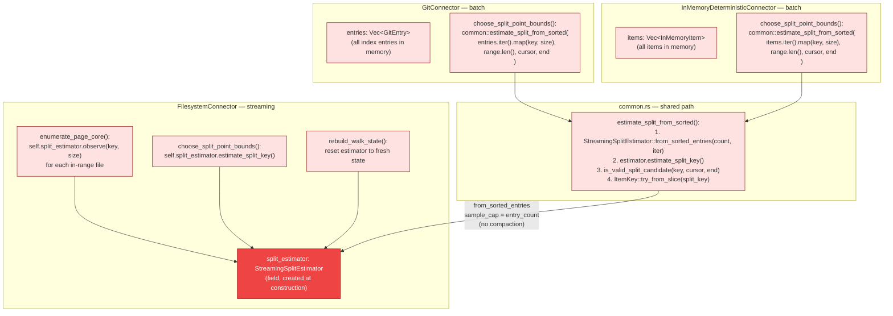

# Streaming Split Estimation

Split estimation is the mechanism by which connectors propose a key that divides a
shard's key space into two roughly equal halves **by total byte weight**, not by
item count. The `StreamingSplitEstimator` solves this as a bounded-memory streaming
problem: it observes keys one at a time during normal pagination walks, retains a
sparse sketch of representative samples, and produces a byte-weighted midpoint
estimate on demand.

Byte-balanced splitting matters because storage systems have skewed file-size
distributions. A naive count-based midpoint would assign a shard with one 10 GB
file and 10 000 tiny files almost entirely to one child. Byte-weighting ensures
each child inherits roughly half the total I/O cost.

The estimator achieves sub-linear memory (O(sample\_cap) regardless of stream
length), O(1) amortised per-observation cost, and O(log sample\_cap) estimation
via binary search. Compaction fires at most O(log(N / sample\_cap)) times over a
stream of N items, so the total cost of all compactions is O(N) amortised.

---

## 1. Split Estimation in the Scan Pipeline

Where split estimation fits within the larger enumeration and split lifecycle.
During pagination, each connector feeds observed `(key, file_size)` pairs into
the estimator. When the coordination layer decides a shard should split, it calls
`choose_split_point()`, which delegates to `estimate_split_key()`. The resulting
key becomes the split boundary for either a `SplitReplacePlan` (terminal) or
`SplitResidualPlan` (non-terminal).

The filesystem connector feeds the estimator incrementally as each DFS file is
emitted. The git and in-memory connectors hold all entries in memory, so they
bulk-load via `estimate_split_from_sorted()` at split-selection time. Both paths
converge on the same `StreamingSplitEstimator` algorithm — the batch connectors
simply set `sample_cap = entry_count` to avoid compaction and produce exact
results.

> **Cross-reference**: diagram 12 (Split Operations) details the `split_replace`
> and `split_residual` coordination protocol that consumes the split key produced
> here. Diagram 15 (Page Lifecycle) shows where `enumerate_page()` sits in the
> broader scan loop.

---

## 2. Dual-Axis Sampling Algorithm

The `observe()` method uses two independent sampling axes to decide whether an
incoming item should be retained as a sample. This dual-axis approach captures
both ordinal and byte-space coverage, giving the estimator resilience against
skewed file-size distributions.

Key properties of the dual-axis trigger:

- **Rank axis** — samples every `rank_stride`-th item (initially 1, doubles on
  compaction). Provides ordinal coverage independent of file sizes.
- **Byte axis** — samples when a file's byte interval straddles `next_byte_mark`
  (initially every 1 byte, doubles on compaction). Provides byte-space fidelity
  for accurate median estimation.
- **At most one sample per `observe()` call** — even if a single large file spans
  multiple byte marks, only one sample is recorded. This guarantees O(1)
  per-observation cost at the expense of byte-axis gaps in regions dominated by
  very large files.
- **Byte-triggered samples record the exact stride mark** as their
  `recorded_byte_position`, giving tighter byte-space interpolation than
  rank-triggered samples (which record the position at the file's start).

---

## 3. Stride-Doubling Compaction

When the sample buffer exceeds `sample_cap`, the estimator runs
`grow_strides_and_compact()`. This halves the buffer and doubles both strides,
maintaining representative coverage as the stream grows. The total number of
compaction events over a stream of N items is at most O(log(N / sample\_cap)).

### Compaction invariants

- **Sample cap**: after each public operation returns, `samples.len() <= sample_cap`.
- **Monotonicity**: retained samples are strictly increasing in rank and
  non-decreasing in byte position, including after compaction.
- **Endpoint preservation**: the first and last samples are always retained,
  preventing boundary drift.
- **Plateau redistribution**: after nearest-neighbor selection, runs of picks that
  share the same axis value are spread evenly across the plateau's rank extent.
  Without this, byte-axis plateaus (e.g. a run of zero-size files after a single
  heavy file) cluster retained samples at the plateau's leading edge, degrading
  rank-axis diversity.

### Memory and convergence

The sketch's memory is bounded at `sample_cap` retained samples regardless of
stream length. Each compaction discards roughly half the samples and doubles the
sampling resolution, so the remaining samples span the entire observed range at
progressively coarser granularity. The `DEFAULT_SAMPLE_CAP` of 1024 achieves <1%
byte-weighted error on the crate's 20 000-key descending-size regression workload.

---

## 4. Split Key Estimation Decision

The `estimate_split_key()` method finds the retained key whose recorded byte
position is closest to the byte-weighted midpoint. Two boundary guards prevent
degenerate splits that would produce empty left or right shards.

### Key design details

- **`nearest_sample` uses `partition_point`** (binary search) on the sample array
  for O(log sample\_cap) lookup. When the target falls between two samples, the
  one with smaller absolute distance wins; ties break to the earlier sample.
- **First-key guard**: the very first key observed is tracked in a separate
  `first_observed_key` field, surviving compaction. When weight is front-loaded
  (one huge file followed by many small files), the byte median can land on
  item 0. The guard falls back to rank midpoint instead, preventing an empty
  left shard.
- **Last-key guard**: the symmetric case for back-loaded weight. Compaction always
  preserves the last sample, so checking `samples.last()` is sufficient.
- **u128 arithmetic**: interpolation uses `u128` intermediate products to avoid
  overflow and floating-point precision loss for byte offsets above 2^53.
- **Key fidelity**: the estimator only returns actually observed keys — it never
  synthesizes or interpolates key bytes.

---

## 5. Integration with Connectors

All three connector implementations use `StreamingSplitEstimator` for split-point
selection, but they differ in how they feed observations into it.

### Streaming vs batch loading

| Connector | Estimator Lifetime | Feed Mechanism | Compaction? |
|---|---|---|---|
| `FilesystemConnector` | Persistent field, reset on walk rebuild | `observe()` called per emitted file during `enumerate_page_core()` | Yes — `sample_cap = DEFAULT_SAMPLE_CAP` (1024) |
| `GitConnector` | Ephemeral, built at split-selection time | `from_sorted_entries()` bulk-loads all in-range entries | No — `sample_cap = entry_count` |
| `InMemoryDeterministicConnector` | Ephemeral, built at split-selection time | `from_sorted_entries()` bulk-loads all in-range items | No — `sample_cap = entry_count` |

The filesystem connector benefits from streaming estimation because its DFS walk
is incremental — the estimator accumulates observations across multiple pagination
calls on the same connector instance. The git and in-memory connectors already
hold all entries in memory, so they set `sample_cap = entry_count` to avoid
compaction and produce exact byte-weighted midpoints.

### Post-selection validation

After the estimator produces a candidate key, every connector applies the same
validation via `common::is_valid_split_candidate()`:

1. The candidate must advance past the cursor's last emitted key (no backward
   splits).
2. The candidate must be strictly less than the shard's upper bound (no empty
   right child).

If validation fails, `choose_split_point()` returns `Ok(None)`, signaling that
no usable split is available. The coordination layer handles this by deferring
the split or continuing to scan the shard as-is.

> **Cross-reference**: diagram 12 (Split Operations) shows how the validated
> `ItemKey` flows into `SplitReplacePlan` / `SplitResidualPlan` and through
> the coordination protocol's fencing and coverage validation.

---

## Source Code References

| Symbol | Location | Role |
|---|---|---|
| `StreamingSplitEstimator` | `crates/gossip-connectors/src/split_estimator.rs` | Core estimator struct |
| `Sample` | `crates/gossip-connectors/src/split_estimator.rs` | Retained checkpoint (rank + byte position + key) |
| `SampleAxis` | `crates/gossip-connectors/src/split_estimator.rs` | Rank vs Bytes axis selector |
| `observe()` | `crates/gossip-connectors/src/split_estimator.rs` | Per-item streaming observation |
| `estimate_split_key()` | `crates/gossip-connectors/src/split_estimator.rs` | Byte-weighted midpoint estimation |
| `compact_samples()` | `crates/gossip-connectors/src/split_estimator.rs` | In-place buffer compaction |
| `selected_sample_indices()` | `crates/gossip-connectors/src/split_estimator.rs` | Nearest-neighbor index selection |
| `redistribute_plateau_picks()` | `crates/gossip-connectors/src/split_estimator.rs` | Post-compaction plateau spreading |
| `nearest_by_rank_in_range()` | `crates/gossip-connectors/src/split_estimator.rs` | Binary search for nearest rank in subslice |
| `interpolated_position()` | `crates/gossip-connectors/src/split_estimator.rs` | u128 linear interpolation |
| `from_sorted_entries()` | `crates/gossip-connectors/src/split_estimator.rs` | Bulk-load constructor |
| `estimate_split_from_sorted()` | `crates/gossip-connectors/src/common.rs` | Shared batch-connector split path |
| `is_valid_split_candidate()` | `crates/gossip-connectors/src/common.rs` | Post-selection cursor/bound guard |
| `FilesystemConnector::choose_split_point()` | `crates/gossip-connectors/src/filesystem.rs` | Shard-based split-point entry point (delegates to `choose_split_point_bounds`) |
| `GitConnector::choose_split_point()` | `crates/gossip-connectors/src/git.rs` | Shard-based split-point entry point (delegates to `choose_split_point_bounds`) |
| `InMemoryDeterministicConnector::choose_split_point()` | `crates/gossip-connectors/src/in_memory.rs` | Shard-based split-point entry point (delegates to `choose_split_point_bounds`) |
| `FilesystemConnector::split_estimator` | `crates/gossip-connectors/src/filesystem.rs` | Persistent estimator field |
| `FilesystemConnector::choose_split_point_bounds()` | `crates/gossip-connectors/src/filesystem.rs` | FS split selection entry point |
| `GitConnector::choose_split_point_bounds()` | `crates/gossip-connectors/src/git.rs` | Git split selection entry point |
| `InMemoryDeterministicConnector::choose_split_point_bounds()` | `crates/gossip-connectors/src/in_memory.rs` | In-memory split selection entry point |
