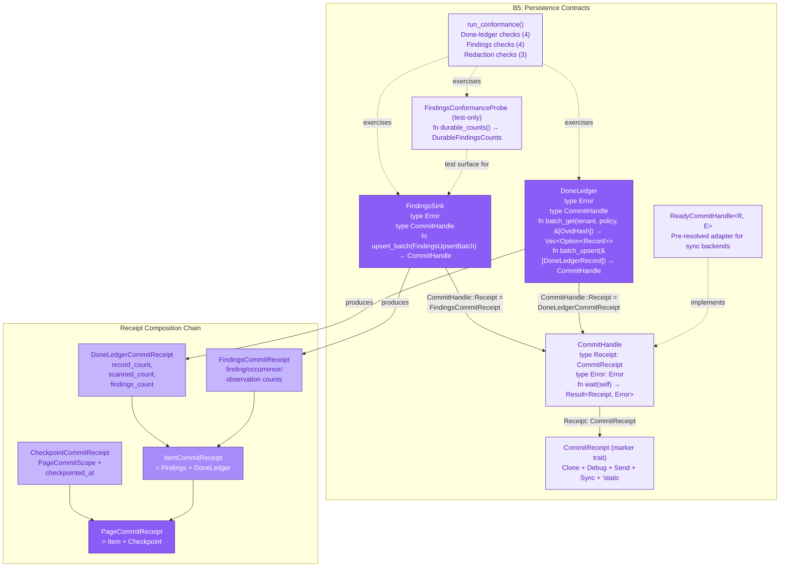
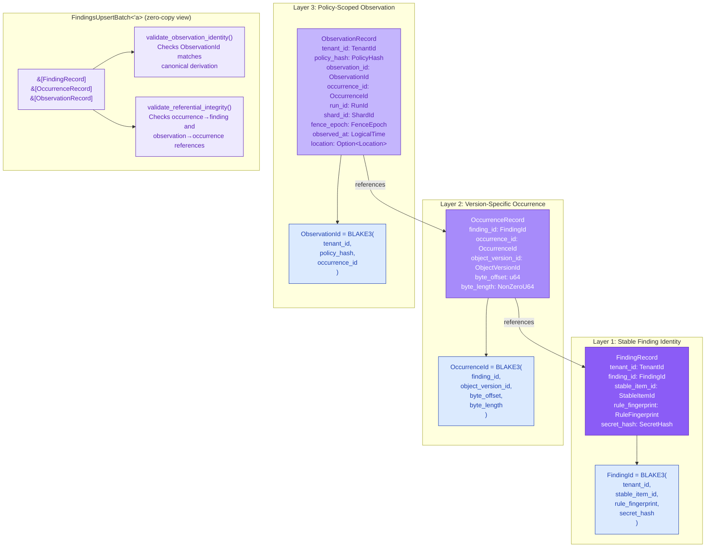
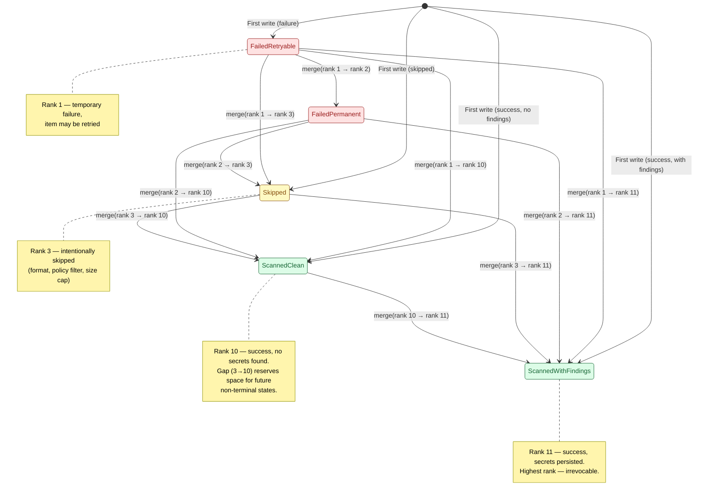
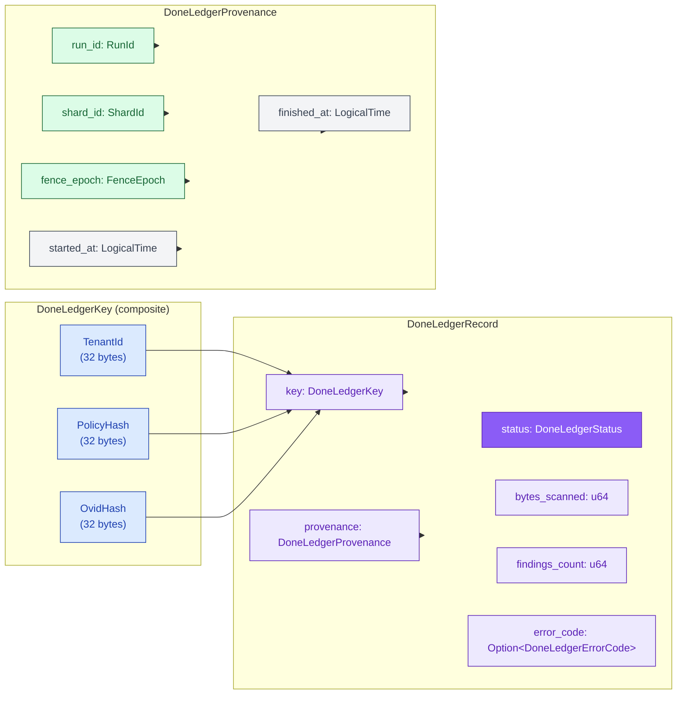
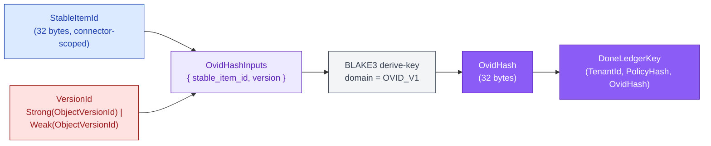
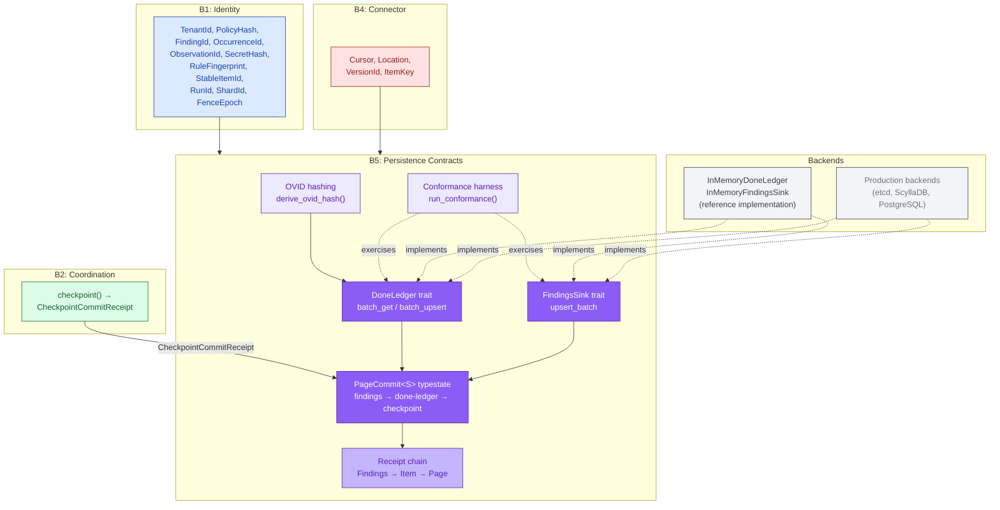

# Persistence Contracts: Traits, Data Model, and Durability Semantics

The `gossip-contracts` persistence module defines the storage-agnostic contracts
that all persistence backends compile against. It specifies **what** is persisted
(record shapes), **how** durability is proven (commit handles and receipts), and
**what invariants** must hold (monotonic lattice merge, referential integrity,
content-addressed identity). The module is intentionally silent on transaction
boundaries, retry strategies, and batching semantics — those belong to the
backend implementation.

This diagram covers four related systems that together form the B5 Persistence
boundary's contract surface:

1. **Persistence trait hierarchy** — `CommitHandle`, `CommitReceipt`, `DoneLedger`,
   `FindingsSink`, and the conformance harness.
2. **Three-layer findings data model** — `FindingRecord`, `OccurrenceRecord`,
   `ObservationRecord`, and their content-addressed identity chains.
3. **Done-ledger status lattice** — the monotonic join-semilattice that makes
   deduplication safe under crash-recovery and at-least-once delivery.
4. **Object-Version Identity (OVID)** — domain-separated BLAKE3 hashing that
   derives the done-ledger join key from stable item identity and version claim.

The [PageCommit typestate machine](08-pagecommit-typestate.md) enforces the
cross-trait ordering contract (findings before done-ledger before checkpoint)
and is documented in its own diagram.

> **Notation.** Solid lines represent data flow and composition. Dashed lines
> represent trait bounds or type constraints. All diagrams use the B5 Persistence
> color palette (purple theme: fill `#8B5CF6`, light fill `#EDE9FE`, stroke
> `#5B21B6`). Identity types from B1 use blue (`#3B82F6` / `#DBEAFE` / `#1E40AF`).

---

## 1. Persistence Trait Hierarchy

The persistence surface is split into two durable sinks (findings and
done-ledger) unified by a shared two-phase durability protocol. Submission and
durability are intentionally separate: `Ok(handle)` means the backend accepted
the write; `handle.wait()` blocks until the write is durable and returns a typed
receipt. This separation lets backends coalesce writes (group-commit fsync) or
pipeline I/O without weakening the caller-visible contract.

The `CommitHandle` trait consumes `self` on `wait()`, preventing double-waits.
`ReadyCommitHandle` provides a zero-cost adapter for synchronous backends and
test doubles that already hold a pre-computed result.

The trait hierarchy summarized:

| Trait / Type | Role | Associated Types |
|:---|:---|:---|
| `CommitReceipt` | Marker: proof of durability | (supertraits: `Clone + Debug + Send + Sync`) |
| `CommitHandle` | Two-phase durability handle | `Receipt: CommitReceipt`, `Error` |
| `ReadyCommitHandle<R, E>` | Sync adapter wrapping `Result<R, E>` | (implements `CommitHandle`) |
| `DoneLedger` | Deduplication store | `Error`, `CommitHandle` (receipt = `DoneLedgerCommitReceipt`) |
| `FindingsSink` | Findings persistence | `Error`, `CommitHandle` (receipt = `FindingsCommitReceipt`) |
| `FindingsConformanceProbe` | Test-only read surface | `Error` |

### Conformance harness

`run_conformance()` executes 11 checks across three suites:

| Suite | Checks | Validates |
|:---|:---|:---|
| Done-ledger (4) | Idempotent upsert, fail-then-scan dominance, scan-then-fail dominance, batch-get positional alignment | Lattice merge correctness |
| Findings (4) | Idempotent upsert, orphan occurrence rejection, orphan observation rejection, observation upsert merge | Referential integrity and idempotency |
| Redaction (3) | `NormHash`, `SecretHash`, and `FindingRecord` `Debug` output must not leak raw secret bytes | No secret leakage through debug formatting |

---

## 2. Three-Layer Findings Data Model

Scan results are persisted in three normalized layers with decreasing stability
and increasing scope:

- **Layer 1 (Finding)** — stable identity, version-independent,
  policy-independent. One per unique `(tenant, item, rule, secret)` triple.
- **Layer 2 (Occurrence)** — version-specific byte range. Pins a finding to
  a specific object version at an exact byte offset and length.
- **Layer 3 (Observation)** — policy- and run-scoped. Records that an
  occurrence was seen during a specific scan run, under a specific policy,
  in a specific shard and fence epoch. Display metadata (`Location`) lives
  here because it is presentation context, not stable identity.

All IDs are content-addressed via domain-separated BLAKE3: identical natural
key inputs always produce the same ID without coordination.

| Layer | Record Type | Natural Key | ID Derivation | Stability |
|:---|:---|:---|:---|:---|
| 1 | `FindingRecord` | `(tenant, stable_item_id, rule_fingerprint, secret_hash)` | `FindingId` via BLAKE3 | Version- and policy-independent |
| 2 | `OccurrenceRecord` | `(finding_id, object_version_id, byte_offset, byte_length)` | `OccurrenceId` via BLAKE3 | Version-specific, policy-independent |
| 3 | `ObservationRecord` | `(tenant_id, policy_hash, occurrence_id)` | `ObservationId` via BLAKE3 | Policy- and run-scoped |

### Referential integrity

Each layer references the one above it:
- Every `OccurrenceRecord` carries a `FindingId` that must correspond to a
  `FindingRecord` in the same batch or already persisted.
- Every `ObservationRecord` carries an `OccurrenceId` that must correspond to
  an `OccurrenceRecord` in the same batch or already persisted.

`FindingsUpsertBatch::validate_referential_integrity()` checks these references
plus tenant consistency within the batch. Backends must either enforce
referential closure within a single upsert batch or via foreign key constraints.

### Observation-identity enforcement

`ObservationRecord::from_persisted()` rejects records whose `observation_id`
does not match the canonical derivation from `(tenant_id, policy_hash,
occurrence_id)`. This prevents callers from constructing records with arbitrary
IDs and is validated both at construction time and via
`FindingsUpsertBatch::validate_observation_identity()`.

---

## 3. Done-Ledger Status Lattice

The done-ledger tracks whether each object-version has been processed. Its
status field is a **monotonic join-semilattice**: once a status reaches a higher
rank, no concurrent or replayed write can downgrade it. This property is the
foundation of crash-safe deduplication under at-least-once delivery.

The lattice merge rule is `merge(a, b) = max(a.rank(), b.rank())`. The three
required semilattice properties (idempotence, commutativity, associativity) hold
by construction because `rank()` returns a `u8` discriminant and `max` over
integers satisfies all three.

| Variant | Rank | Category | Merge behavior |
|:---|:---|:---|:---|
| `FailedRetryable` | 1 | Non-terminal failure | Any higher-rank write dominates |
| `FailedPermanent` | 2 | Terminal failure | Dominates retryable; dominated by skip/scan |
| `Skipped` | 3 | Intentional skip | Dominates all failures; dominated by scan |
| `ScannedClean` | 10 | Terminal success | Dominates all non-scan states |
| `ScannedWithFindings` | 11 | Terminal success | Highest rank — irrevocable |

The intentional gap between ranks 3 and 10 reserves discriminant space for
future non-terminal states without changing the relative ordering of existing
variants.

### Done-ledger record structure

Cross-field validation enforced by `DoneLedgerRecord::validate()`:
- `ScannedWithFindings` requires `findings_count > 0`; `ScannedClean` requires
  `findings_count == 0`.
- Failure/skip statuses require a non-`None` `error_code`; scan statuses reject
  an `error_code`.
- `DoneLedgerErrorCode` is bounded to 128 bytes of safe ASCII characters.

---

## 4. Object-Version Identity (OVID) Hashing

The done-ledger join key is `(TenantId, PolicyHash, OvidHash)`. The `OvidHash`
component collapses `(StableItemId, VersionId)` into a single 32-byte BLAKE3
hash. This decouples the done-ledger key width from the connector's version
representation and makes strong vs. weak version claims produce distinct hashes.

Key properties:
- **Deterministic**: same `(StableItemId, VersionId)` always produces the same
  `OvidHash`.
- **Strong/weak separation**: `VersionId::Strong(x)` and `VersionId::Weak(x)`
  produce different hashes even for the same `ObjectVersionId`, because a
  1-byte domain tag (0 for strong, 1 for weak) is written before the version
  bytes.
- **Cached hasher**: the BLAKE3 derive-key context (`OVID_V1`) is initialized
  once via `LazyLock` and reused across all derivations.

---

## 5. Full Persistence Contract Surface

How the persistence contracts connect to the broader system. Identity types
from B1, connector types from B4, and coordination types from B2 flow into
the persistence surface. The `PageCommit<S>` typestate machine (documented
in [08-pagecommit-typestate.md](08-pagecommit-typestate.md)) orchestrates the
cross-trait ordering.

### Key design invariants

1. **No raw secret bytes** in any public record shape. Secret-derived fields
   use fixed-width hash newtypes with redacted `Debug` output.
2. **Submission is not durability.** `Ok(handle)` means the backend accepted
   the write; `handle.wait()` establishes durability and returns a typed receipt.
3. **Cross-trait ordering.** Findings must be durable before done-ledger, and
   done-ledger must be durable before the cursor checkpoint. Enforced at compile
   time by the `PageCommit<S>` typestate.
4. **Monotonic status lattice.** Once an object-version reaches a scanned state,
   no concurrent or replayed failure/skip write can downgrade it.
5. **Content-addressed identity.** All IDs are derived from natural keys via
   domain-separated BLAKE3, ensuring deterministic deduplication without
   coordination.
6. **Backend neutrality.** Traits define contracts without committing to any
   specific storage technology's transaction or batching semantics.

---

## Cross-References

- [PageCommit Typestate Machine](08-pagecommit-typestate.md) — enforces the
  findings → done-ledger → checkpoint ordering at compile time
- [End-to-End Scan Flow](04-end-to-end-scan-flow.md) — shows where identity
  derivation and commit lifecycle occur in the scan pipeline
- [ID Derivation DAG](03-id-derivation-dag.md) — the full 19-type identity
  hierarchy that persistence record types depend on
- [Boundary Dependency Graph](02-boundary-dependency-graph.md) — how B5
  Persistence depends on B1 Identity and B2 Coordination

## Source Code References

| File | Purpose |
|:---|:---|
| `crates/gossip-contracts/src/persistence/mod.rs` | Module root, public re-exports, cross-trait ordering contract |
| `crates/gossip-contracts/src/persistence/commit.rs` | `CommitHandle`, `CommitReceipt`, all receipt types |
| `crates/gossip-contracts/src/persistence/findings.rs` | `FindingRecord`, `OccurrenceRecord`, `ObservationRecord`, `FindingsSink`, `FindingsUpsertBatch` |
| `crates/gossip-contracts/src/persistence/done_ledger.rs` | `DoneLedgerKey`, `DoneLedgerStatus`, `DoneLedgerRecord`, `DoneLedger` trait |
| `crates/gossip-contracts/src/persistence/ovid.rs` | `OvidHash`, `OvidHashInputs`, `derive_ovid_hash()` |
| `crates/gossip-contracts/src/persistence/page_commit.rs` | `PageCommit<S>` typestate, `PageCommitScope`, validation errors |
| `crates/gossip-contracts/src/persistence/error.rs` | `PersistenceInputError` shared validation errors |
| `crates/gossip-contracts/src/persistence/conformance.rs` | `run_conformance()`, `FindingsConformanceProbe`, conformance report |
| `crates/gossip-persistence-inmemory/src/` | Reference implementation: `InMemoryDoneLedger`, `InMemoryFindingsSink` |
