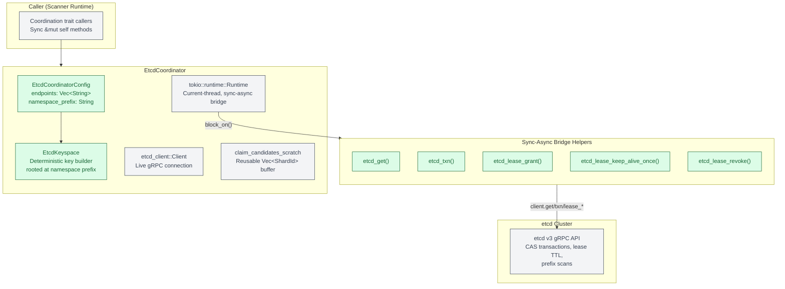
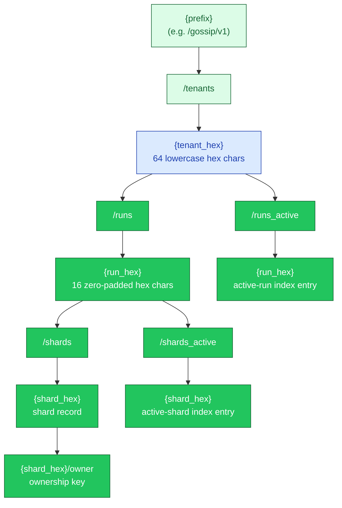
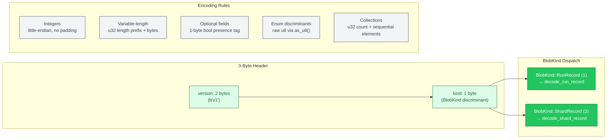
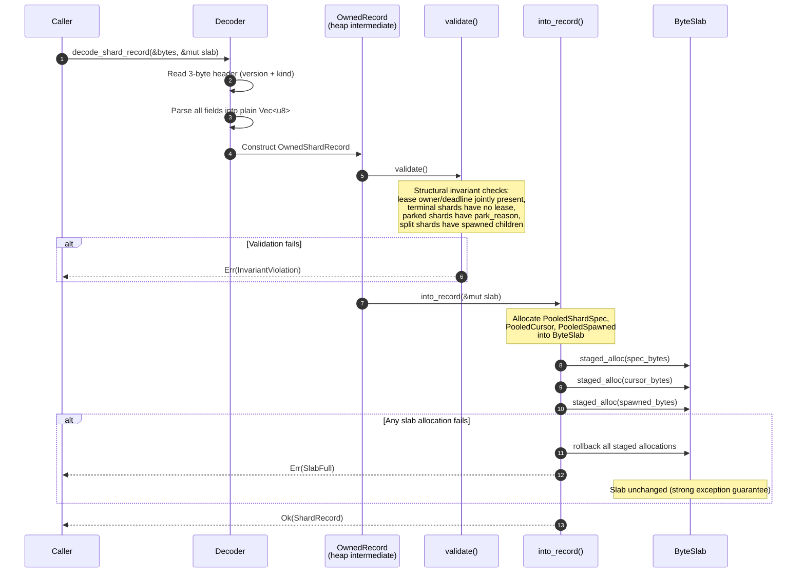
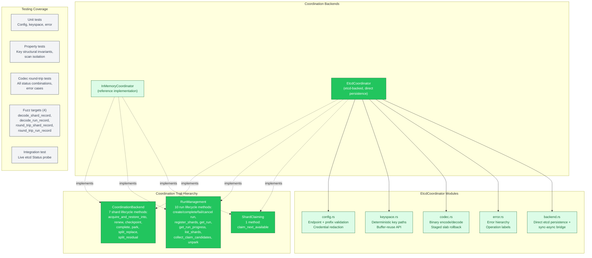

# etcd Coordinator Persistence

The `gossip-coordination-etcd` crate implements the B2 Coordination backend
against an etcd cluster. It provides the keyspace layout, binary codecs,
connection management, and optimistic CAS transaction logic needed to persist
coordination records (runs, shards, leases, op-logs) to etcd.

This diagram covers four systems that together form the etcd coordination
persistence layer:

1. **Backend architecture** — the direct-persistence model, sync-async bridge,
   and connection lifecycle.
2. **Keyspace design** — the hierarchical etcd key layout with sibling
   separation, fixed-width hex encoding, and scan isolation.
3. **Codec wire format** — the hand-written binary encoding for `RunRecord`
   and `ShardRecord`, including two-phase decode with staged slab rollback.
4. **Integration** — how the etcd backend plugs into the coordination trait
   hierarchy and connects to the broader system.

> **Notation.** Solid lines represent data flow and composition. Dashed lines
> represent delegation, trait implementation, or future connections. Coordination
> types use the B2 green palette (fill `#22C55E`, light fill `#DCFCE7`, stroke
> `#166534`). Worker / cross-cutting components use grey.

---

## 1. Backend Architecture

`EtcdCoordinator` directly persists all coordination state to etcd using
optimistic CAS (compare-and-swap) transactions. Each mutating operation reads
the current record, validates preconditions locally, builds a CAS transaction
conditioned on the record's `mod_revision`, and retries with jittered
exponential backoff on CAS failure. There is no in-process delegation layer —
the etcd cluster is the single source of truth.

Shard ownership uses a dual-key design: a persistent shard record (keyed under
`/shards/{id}`) and an ephemeral `/owner` key with an etcd lease TTL. When the
lease expires (worker crash, network partition), etcd automatically deletes the
owner key, making the shard eligible for re-acquisition.



### Connection lifecycle

`EtcdCoordinator::connect()` performs a two-phase fail-fast initialization:

| Phase | Action | Error |
|:---|:---|:---|
| 1. gRPC connect | Establishes a channel with a 5-second connect timeout | `EtcdCoordinatorError::Etcd { Connect }` |
| 2. Status probe | Round-trips a maintenance `Status` RPC to confirm reachability | `EtcdCoordinatorError::Etcd { Status }` |

On success the caller holds a validated config, a live etcd connection, and
a `EtcdKeyspace` for deterministic key generation. A `debug_assert!` prevents
nested `block_on` calls by verifying no Tokio runtime is already active.

### Sync-async bridge

The coordination traits are synchronous. The etcd client is async (tonic/gRPC).
A private current-thread Tokio runtime bridges the gap via `block_on()`. A
`debug_assert!` guard prevents calling trait methods from within an active Tokio
async context (nested `block_on` panics).

---

## 2. Keyspace Design

All coordination records map to deterministic ASCII etcd key paths rooted at a
configurable namespace prefix. The tree separates record keys from active-index
keys as **siblings** (not nested) to prevent prefix-scan cross-contamination.



### Key layout in full-path form

```text
{prefix}/tenants/{tenant_hex}/runs/{run_hex}                    → run record
{prefix}/tenants/{tenant_hex}/runs/{run_hex}/shards/{shard_hex} → shard record
{prefix}/tenants/{tenant_hex}/runs/{run_hex}/shards/{shard_hex}/owner → ownership
{prefix}/tenants/{tenant_hex}/runs/{run_hex}/shards_active/{shard_hex} → active index
{prefix}/tenants/{tenant_hex}/runs_active/{run_hex}             → active-run index
```

### Design rationale

| Decision | Why |
|:---|:---|
| **`runs/` vs `runs_active/` as siblings** | A prefix scan on `runs/` must not pull in active-index entries, and vice versa. Sibling placement under the tenant guarantees scan isolation. |
| **`shards/` vs `shards_active/` as siblings** | Same sibling separation under each run key. The trailing-slash convention on scan prefixes (`shards/`) prevents cross-category matches. |
| **Fixed-width hex encoding** | `RunId` and `ShardId` are zero-padded to 16 hex chars (u64), `TenantId` to 64 hex chars (32 bytes). Fixed width ensures lexicographic key order matches numeric order, making etcd range scans predictable. |
| **Lowercase-only hex** | All hex uses `[0-9a-f]`. No uppercase letters, so byte-level equality works for key comparison. |
| **Buffer-reuse `_into` API** | Every key method has a `_into` variant appending into a `&mut String`, enabling hot-path callers to reuse a single buffer across multiple key constructions. |

### Prefix validation

`EtcdKeyspace::new()` enforces:
- Must start with `/` (absolute etcd paths).
- Must not end with `/` (unless exactly `"/"`), preventing double-slash joins.
- No consecutive slashes (`//`) anywhere, preventing invisible empty path segments.

### Scan isolation

The trailing-slash convention is critical: `shard_records_scan_prefix()` returns
`.../shards/` (with trailing slash) while `shards_active_prefix()` returns
`.../shards_active` (without). An etcd prefix query on `.../shards/` matches
shard record keys but not the `shards_active` subtree, because `shards/` is not
a prefix of `shards_active`.

---

## 3. Codec Wire Format

The codec provides hand-written binary serialization for `RunRecord` and
`ShardRecord`. No serde is involved — every byte is explicit, and the decode
path interleaves validation with field reads, rejecting malformed blobs early
without wasted allocation.

### Wire format structure



### Two-phase decode: validate-then-materialize

Decoding separates wire-format parsing from domain-type construction. This
keeps codec concerns out of domain types and lets the decoder reject invalid
data before touching the caller's `ByteSlab`.



### Staged slab allocation

`ShardRecord` fields live in a caller-provided `ByteSlab` to avoid per-decode
heap allocation on the hot path. The `StagedShardAllocations` guard tracks
every slab allocation made during decode. If any allocation fails, the guard
rolls back all previously staged allocations, leaving the slab unchanged. This
provides a **strong exception guarantee**: either the full `ShardRecord`
materializes into the slab, or the slab is untouched.

### Invariant enforcement (defense-in-depth)

Invariants are checked **twice** during decode:

| Check point | Phase | Purpose |
|:---|:---|:---|
| `OwnedRecord::validate()` | After wire parse | Catches wire corruption early, before slab allocation |
| Domain type construction | During materialization | Defense-in-depth against inconsistent intermediate state |

Invariants checked for `ShardRecord`:
- Active runs must have root shards; Initializing must not
- `completed_at` presence matches terminal status
- Lease owner and deadline must be jointly present or absent
- Terminal shards must not have leases
- Parked shards must have `park_reason`
- Split shards must have spawned children
- `parent` presence matches shard derived-bit
- Op-log entries: non-zero `payload_hash`, positive `executed_at`,
  non-decreasing timestamps, no duplicate `OpId`s

### Security bounds

`MAX_FIELD_SIZE = 1 MiB` prevents crafted length prefixes from triggering
unbounded allocations. Collection lengths are further bounded by domain
constants (`OP_LOG_CAP`, `MAX_SPAWNED_PER_SHARD`) and by structural upper
bounds derived from remaining wire bytes.

---

## 4. Error Hierarchy

```mermaid
%% Diagram: etcd-error-hierarchy
graph TB
    ECE["EtcdCoordinatorError"]

    CFG["Config(EtcdCoordinatorConfigError)<br/>Validation before I/O"]
    RTB["RuntimeBuild(io::Error)<br/>Tokio runtime creation failure"]
    CODEC_ERR["Codec { operation, source }<br/>Encode/decode failures"]
    ETCD["Etcd { operation, source }<br/>gRPC failures"]
    KSE["Keyspace(EtcdKeyspaceError)<br/>Namespace prefix validation"]

    OP_CONNECT["EtcdOperation::Connect"]
    OP_STATUS["EtcdOperation::Status"]

    CFGE_NE["NoEndpoints"]
    CFGE_EE["EmptyEndpoint { index }"]
    CFGE_IS["InvalidEndpointScheme { index }"]
    CFGE_EP["EmptyNamespacePrefix"]
    CFGE_SS["PrefixMustStartWithSlash"]
    CFGE_ES["PrefixMustNotEndWithSlash"]
    CFGE_DS["PrefixContainsDoubleSlash"]

    CODEC["EtcdCodecError (12 variants)<br/>Truncated, InvalidVersionPrefix,<br/>InvalidBlobKind, UnexpectedBlobKind,<br/>InvalidBool, InvalidEnum,<br/>InvalidSpec, InvalidCursor,<br/>SlabFull, TrailingBytes,<br/>InvariantViolation, FieldTooLarge"]

    ECE --> CFG
    ECE --> RTB
    ECE --> CODEC_ERR
    ECE --> ETCD
    ECE --> KSE

    ETCD --> OP_CONNECT
    ETCD --> OP_STATUS

    CFG --> CFGE_NE
    CFG --> CFGE_EE
    CFG --> CFGE_IS
    CFG --> CFGE_EP
    CFG --> CFGE_SS
    CFG --> CFGE_ES
    CFG --> CFGE_DS

    style ECE fill:#22C55E,stroke:#166534,color:#FFF
    style CFG fill:#DCFCE7,stroke:#166534,color:#166534
    style RTB fill:#F3F4F6,stroke:#374151,color:#374151
    style ETCD fill:#DCFCE7,stroke:#166534,color:#166534
    style KSE fill:#DCFCE7,stroke:#166534,color:#166534

    style OP_CONNECT fill:#F3F4F6,stroke:#374151,color:#374151
    style OP_STATUS fill:#F3F4F6,stroke:#374151,color:#374151

    style CFGE_NE fill:#F3F4F6,stroke:#374151,color:#374151
    style CFGE_EE fill:#F3F4F6,stroke:#374151,color:#374151
    style CFGE_IS fill:#F3F4F6,stroke:#374151,color:#374151
    style CFGE_EP fill:#F3F4F6,stroke:#374151,color:#374151
    style CFGE_SS fill:#F3F4F6,stroke:#374151,color:#374151
    style CFGE_ES fill:#F3F4F6,stroke:#374151,color:#374151
    style CFGE_DS fill:#F3F4F6,stroke:#374151,color:#374151

    style CODEC_ERR fill:#DCFCE7,stroke:#166534,color:#166534
```



Config `Debug` output redacts credentials from endpoint URIs, showing
`***@host:port` instead of `user:pass@host:port`.

---

## 5. Integration with Coordination Traits

The etcd backend plugs into the same trait hierarchy used by all coordination
backends. The three traits define the full coordination surface:



### Module readiness

| Module | Status | Notes |
|:---|:---|:---|
| `config.rs` | Complete | Endpoint validation, credential redaction, CSV parsing |
| `keyspace.rs` | Complete | Deterministic paths, buffer-reuse API, scan isolation |
| `codec.rs` | Complete | Binary encode/decode, staged rollback, fuzz-tested |
| `error.rs` | Complete | Full error hierarchy with operation labels |
| `backend.rs` | Mostly complete | Direct etcd persistence via CAS transactions; `complete`, `park_shard`, `complete_run`, `fail_run`, `cancel_run`, `unpark_shard` not yet implemented |

The keyspace and codec are shared infrastructure used by the CAS transaction
logic in `backend.rs`. Operations that are not yet implemented panic with
`fail_unimplemented` — they have clear protocol semantics from the in-memory
reference implementation and will be ported as the distributed runtime requires
them.

---

## Cross-References

- [Shard and Run State Machines](05-shard-and-run-state-machines.md) — the state
  machines that the coordination traits operate on
- [Fencing Protocol](06-fencing-protocol.md) — fence epoch validation performed
  by the coordination backend on every mutating operation
- [Lease Lifecycle](07-lease-lifecycle.md) — lease acquisition and renewal that
  the backend must enforce
- [System Overview](01-system-overview.md) — where the etcd backend fits in the
  five-boundary architecture
- [Persistence Contracts](19-persistence-contracts.md) — the B5 Persistence
  contracts that the etcd backend will need to integrate with for done-ledger
  and findings persistence

## Source Code References

| File | Purpose |
|:---|:---|
| `crates/gossip-coordination-etcd/src/lib.rs` | Crate root, public re-exports |
| `crates/gossip-coordination-etcd/src/backend.rs` | `EtcdCoordinator` struct, CAS transaction logic, sync-async bridge |
| `crates/gossip-coordination-etcd/src/keyspace.rs` | `EtcdKeyspace` deterministic key-path construction |
| `crates/gossip-coordination-etcd/src/codec.rs` | Binary encode/decode for `RunRecord` and `ShardRecord` |
| `crates/gossip-coordination-etcd/src/config.rs` | `EtcdCoordinatorConfig` validated connection parameters |
| `crates/gossip-coordination-etcd/src/error.rs` | `EtcdCoordinatorError` and `EtcdOperation` |
| `crates/gossip-coordination-etcd/src/tests.rs` | Config, keyspace, property tests, integration test |
| `crates/gossip-coordination-etcd/src/codec_tests.rs` | Codec round-trip and error-case tests |
| `crates/gossip-coordination-etcd/fuzz/fuzz_targets/` | 4 libfuzzer targets for decode/round-trip |
| `crates/gossip-coordination/src/traits.rs` | `CoordinationBackend`, `RunManagement`, `ShardClaiming` trait definitions |
| `crates/gossip-coordination/src/in_memory.rs` | `InMemoryCoordinator` reference implementation |
