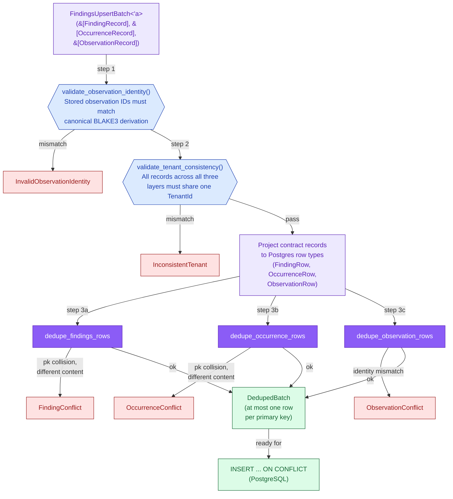
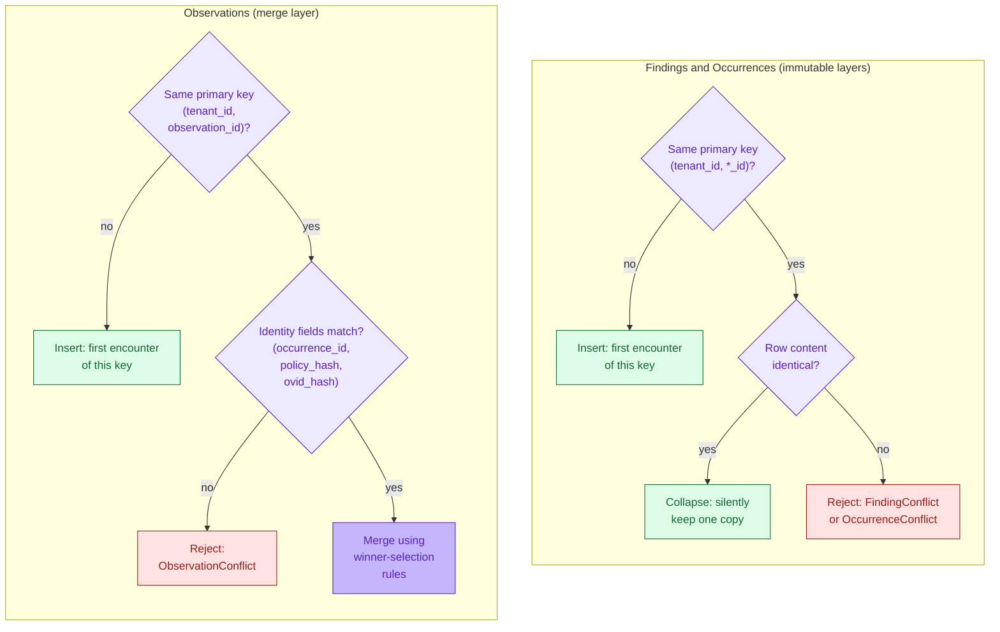
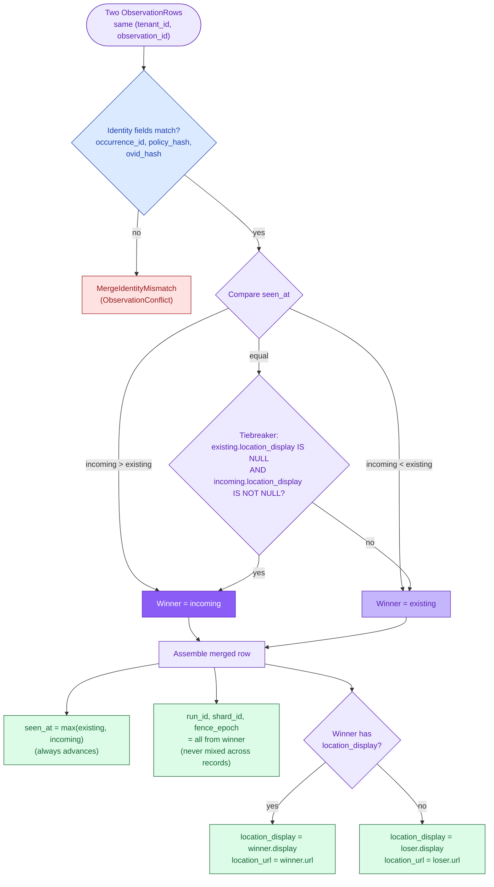
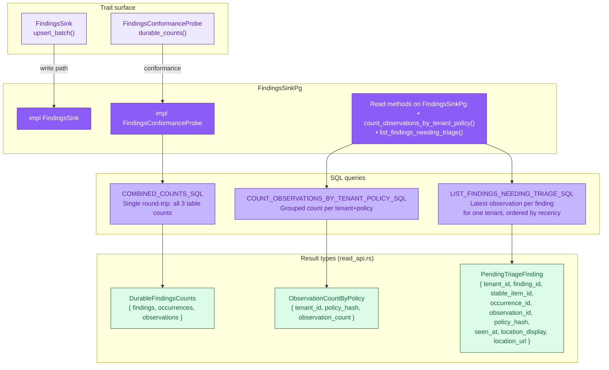

# Findings PostgreSQL Backend: Batch Dedup and Observation Merge

The `gossip-findings-postgres` crate preprocesses findings batches in Rust
before issuing SQL. The [persistence contracts](19-persistence-contracts.md)
define _what_ goes in (record shapes, referential integrity, content-addressed
IDs). This diagram covers _how_ the PostgreSQL backend validates, projects, and
deduplicates those records so that `INSERT ... ON CONFLICT` sees at most one row
per durable primary key.

The central correctness property is **dual convergence**: the Rust-side batch
preprocessing (`project_and_dedupe`) and the SQL-side `ON CONFLICT DO UPDATE`
replay must produce identical durable rows for the same inputs, regardless of
execution order. The observation merge rules are the most subtle part of this
guarantee.

This diagram covers four systems:

1. **`project_and_dedupe` pipeline** -- validation, projection, and per-layer
   deduplication flow.
2. **Per-layer dedup rules** -- immutable collapse (findings/occurrences) vs.
   merge semantics (observations).
3. **Observation merge decision tree** -- winner selection, provenance sourcing,
   and location pairing.
4. **Dual convergence** -- how Rust preprocessing and SQL replay converge to
   the same durable state.

> **Notation.** All diagrams use the B5 Persistence color palette (purple theme:
> fill `#8B5CF6`, light fill `#EDE9FE`, stroke `#5B21B6`). Identity types from
> B1 use blue (`#3B82F6` / `#DBEAFE` / `#1E40AF`). Error paths use red
> (`#EF4444` / `#FEE2E2` / `#991B1B`). Resolved/success states use green
> (`#22C55E` / `#DCFCE7` / `#166534`).

---

## 1. `project_and_dedupe` Pipeline

The `project_and_dedupe` function is the single entry point for batch
preprocessing. It takes a `FindingsUpsertBatch<'_>` (a zero-copy borrowed view
over all three record layers) and returns a `DedupedBatch` with at most one row
per primary key per layer. The pipeline is fail-fast: validation errors abort
before any dedup work begins.



Key properties:

| Step | Function | Guarantees |
|:---|:---|:---|
| 1 | `validate_observation_identity()` | Stored `observation_id` matches canonical `BLAKE3(tenant_id, policy_hash, occurrence_id)` derivation. Catches corrupted persisted records before they reach SQL. |
| 2 | `validate_tenant_consistency()` | Every record across all three layers belongs to the same `TenantId`. Prevents cross-tenant writes that would violate partition routing and row-level security. |
| 3 | Per-layer dedup | Each layer deduplicates independently. The three dedup functions share the same `HashMap + order Vec` structure and `drain_in_order` helper to preserve first-seen insertion order. |

### Row projection

The projection step converts contract-layer types to Postgres-ready row structs.
The conversion is not trivial -- it includes two distinct `u64 -> BIGINT`
strategies:

| Column class | Strategy | Columns | Why |
|:---|:---|:---|:---|
| Equality-only identifiers | Bit-pattern (`as i64`) | `run_id`, `shard_id` | SQL only uses `=` and `GROUP BY` -- signed ordering is irrelevant |
| Ordered counters | Checked non-negative | `fence_epoch`, `seen_at`, `byte_offset`, `byte_length` | SQL `ORDER BY` and indexed range scans depend on signed integer ordering matching logical counter ordering |

Values above `i64::MAX` in ordered columns are rejected rather than silently
misordered. The span constraint `byte_offset + byte_length <= i64::MAX` mirrors
the SQL `occurrences_span_no_overflow_ck` check constraint.

---

## 2. Per-Layer Deduplication Rules

Findings and occurrences are **immutable** layers -- their content is
determined entirely by content-addressed identity. Observations are
**mergeable** -- provenance fields can be updated on re-observation. This
difference dictates the dedup semantics:



Summary:

| Layer | Duplicate, same content | Duplicate, identity fields differ | Duplicate, identity fields match, mutable fields differ |
|:---|:---|:---|:---|
| **Findings** | Silently collapse | `FindingConflict` error | N/A (no merge layer) |
| **Occurrences** | Silently collapse | `OccurrenceConflict` error | N/A (no merge layer) |
| **Observations** | Merge (winner = existing) | `ObservationConflict` error | Merge via winner-selection |

A content conflict on an immutable layer indicates a content-address collision --
a derivation bug upstream, not normal operation.

### SQL correspondence

The SQL `INSERT ... ON CONFLICT` statements use the same semantics:

| Layer | SQL pattern | Conflict detection |
|:---|:---|:---|
| Findings | `DO UPDATE SET col = table.col WHERE table.col = EXCLUDED.col` | Self-referencing SET creates a no-op UPDATE that still produces a `RETURNING 1` on match. The `WHERE` clause suppresses the row when natural-key fields differ, so the backend interprets a missing `RETURNING` as a conflict. |
| Occurrences | Same as findings | Same mechanism |
| Observations | `DO UPDATE SET ... CASE/WHEN ... WHERE identity_fields = EXCLUDED.identity_fields` | Merge expressions in CASE arms; identity-verifying WHERE clause |

---

## 3. Observation Merge: Winner-Selection Decision Tree

When two `ObservationRow` values share the same primary key `(tenant_id,
observation_id)`, the merge must decide which provenance to keep. The decision
tree below is implemented identically in Rust (`merge_observation_rows`) and
in SQL (`OBSERVATIONS_INSERT_OR_MERGE_SQL`).



### Merge-rule invariants

These invariants must hold in both the Rust implementation and the SQL
`CASE` expressions. Divergence between the two constitutes a correctness bug.

| # | Invariant | Rust | SQL |
|:---|:---|:---|:---|
| 1 | **Provenance winner**: `seen_at >` wins; on tie, `location_display IS NULL` (existing) + `IS NOT NULL` (incoming) wins | `use_incoming_provenance` boolean | Repeated CASE predicate in `run_id`, `shard_id`, `fence_epoch` arms |
| 2 | **`seen_at`**: always `max(existing, incoming)` | `.max()` call | `GREATEST(observations.seen_at, EXCLUDED.seen_at)` |
| 3 | **Provenance triple**: `(run_id, shard_id, fence_epoch)` all sourced from the winner | Single `winner` binding | All three CASE arms use the identical winner predicate |
| 4 | **`location_display`**: sourced from winner; falls back to loser | `location_source` binding | `COALESCE` with winner-first order |
| 5 | **`location_url`**: follows whichever record contributed `location_display` | Same `location_source` | Nested CASE gates on `location_display IS NOT NULL` |

### Why provenance is never mixed

`fence_epoch` is _not_ independently max-tracked. In the coordination layer,
`fence_epoch` is monotonic per shard; here it is provenance metadata that
records _which_ epoch the observation was created under. Independently
max-tracking `fence_epoch` would produce a record whose epoch belongs to a
different run/shard than the one stored -- incoherent provenance.

### Why location is paired

`location_display` and `location_url` are sourced as a unit from the same
observation record. The fallback chain is: winner then loser. `location_url`
follows whichever record provided `location_display`, not the other record's
URL. Independent `COALESCE` across records would pair a display path from
one scan run with a URL from a different scan run -- an incoherent combination.

---

## 4. Dual Convergence: Rust Preprocessing and SQL Replay

The PostgreSQL backend must be idempotent under retry and replay. This means
two execution paths must converge to the same durable state:

- **Path A (normal)**: Rust folds N batch rows into M deduplicated rows, then
  SQL inserts M rows.
- **Path B (replay)**: The same batch is resubmitted. Rust folds to the same
  M rows, then SQL's `ON CONFLICT DO UPDATE` merges them with the already-durable
  rows.

Both paths must produce identical durable rows.

```mermaid
%% Diagram: dual-convergence
flowchart LR
    subgraph batch ["Incoming batch"]
        direction TB
        r1["obs A (seen_at=10,<br/>run_id=7, no location)"]
        r2["obs A (seen_at=20,<br/>run_id=9, has location)"]
        r3["obs A (seen_at=15,<br/>run_id=8, no location)"]
    end

    subgraph rust ["Rust: project_and_dedupe"]
        direction TB
        fold["Fold 3 rows → 1 row<br/>Winner: seen_at=20 (run 9)<br/>seen_at = max(10,20,15) = 20<br/>location from run 9"]
    end

    subgraph sql ["SQL: ON CONFLICT DO UPDATE"]
        direction TB
        upsert["CASE WHEN EXCLUDED.seen_at<br/>&gt; observations.seen_at<br/>THEN EXCLUDED.run_id<br/>ELSE observations.run_id END<br/>...<br/>seen_at = GREATEST(...)"]
    end

    subgraph durable ["Durable state (PostgreSQL)"]
        direction TB
        final["obs A<br/>seen_at = 20<br/>run_id = 9<br/>location from run 9"]
    end

    batch -->|"first write"| rust
    rust -->|"1 row"| sql
    sql -->|"INSERT"| durable

    batch -.->|"replay / retry"| rust
    rust -.->|"same 1 row"| sql
    sql -.->|"ON CONFLICT<br/>same rules"| durable

    style r1 fill:#EDE9FE,stroke:#5B21B6,color:#5B21B6
    style r2 fill:#8B5CF6,stroke:#5B21B6,color:#FFF
    style r3 fill:#EDE9FE,stroke:#5B21B6,color:#5B21B6
    style fold fill:#C4B5FD,stroke:#5B21B6,color:#5B21B6
    style upsert fill:#C4B5FD,stroke:#5B21B6,color:#5B21B6
    style final fill:#DCFCE7,stroke:#166534,color:#166534
```



The convergence guarantee holds because:

1. **Deterministic winner selection**: The `seen_at` comparison and location
   tiebreaker produce the same winner regardless of row encounter order within
   the batch.
2. **Identical merge rules**: Every CASE arm in the SQL uses the same predicate
   as the Rust `use_incoming_provenance` boolean. Both implementations source
   provenance, `seen_at`, and location from the same winner/loser assignment.
3. **Idempotent identity layers**: Findings and occurrences use `DO UPDATE SET
   col = table.col` with a `WHERE` guard, so replaying an identical row is a
   no-op that still returns `RETURNING 1` (confirming the row exists).

### When convergence would break

| Scenario | How it would manifest | Prevention |
|:---|:---|:---|
| Rust uses `seen_at >=` but SQL uses `>` | Provenance flip-flops on equal timestamps depending on row encounter order | Test: `equal_seen_at_no_tiebreaker` asserts existing wins when neither has location |
| SQL `location_url` uses independent `COALESCE` | URL from run A paired with display from run B | Test: `observations_insert_sql_pairs_location_url_with_display_source` asserts no independent COALESCE |
| SQL CASE arms use different predicates per column | run_id from winner, shard_id from loser | Test: all three provenance CASE arms share identical predicate text |
| Rust mixes provenance fields | fence_epoch from incoming, run_id from existing | Single `winner` binding sources all three fields |

---

## 5. Read API Surface: Query-Plane Types and SQL

The findings PostgreSQL backend exposes a read surface alongside the write path.
While the write path (sections 1--4) handles batch upserts through
`FindingsSink`, the read surface provides typed queries for operational use
cases: conformance probing, triage listing, and grouped counts.



### Query summary

| Query | SQL constant | Bind params | Result type | Purpose |
|:---|:---|:---|:---|:---|
| Combined counts | `COMBINED_COUNTS_SQL` | None | `DurableFindingsCounts` | Single round-trip: `SELECT (SELECT COUNT(*) FROM findings), (SELECT COUNT(*) FROM occurrences), (SELECT COUNT(*) FROM observations)`. Used by `FindingsConformanceProbe::durable_counts()` for test assertions. |
| Observations by policy | `COUNT_OBSERVATIONS_BY_TENANT_POLICY_SQL` | `$1: tenant_id` | `Vec<ObservationCountByPolicy>` | Grouped observation count per tenant+policy. Omits `tenant_id` from `SELECT` and `GROUP BY` because the `WHERE` clause constrains every row to a single tenant. |
| Findings needing triage | `LIST_FINDINGS_NEEDING_TRIAGE_SQL` | `$1: tenant_id`, `$2: limit` | `Vec<PendingTriageFinding>` | Latest observation per finding for one tenant, ordered by recency. Uses `DISTINCT ON (finding_id)` in a subquery, then re-sorts by overall recency. |

### Triage query structure

The triage query is the most complex read query. It uses a subquery with
`DISTINCT ON` to select the most recent observation per finding, then
re-sorts those rows by overall recency for the tenant:

```
SELECT latest.*
FROM (
    SELECT DISTINCT ON (f.finding_id)
        f.finding_id, f.stable_item_id,
        o.occurrence_id, ob.observation_id, ob.policy_hash,
        ob.seen_at, ob.location_display, ob.location_url
    FROM findings AS f
    INNER JOIN occurrences AS o ON ...
    INNER JOIN observations AS ob ON ...
    WHERE f.tenant_id = $1
    ORDER BY f.finding_id, ob.seen_at DESC, ob.observation_id DESC
) AS latest
ORDER BY latest.seen_at DESC, latest.observation_id DESC
LIMIT $2
```

Key design decisions:

| Decision | Rationale |
|:---|:---|
| `tenant_id` omitted from projection | Reconstructed from the input parameter in the Rust decoder, avoiding per-row BYTEA decode overhead |
| Secondary tiebreaker `observation_id DESC` | Deterministic but semantically arbitrary (BYTEA sort over content-addressed hash) -- callers cannot predict ordering when `seen_at` ties |
| Full materialization before `LIMIT` | The outer `ORDER BY` differs from the inner `DISTINCT ON` ordering, so PostgreSQL materializes the full per-tenant result. At high finding counts, a `LATERAL` rewrite should be evaluated. |

### Backend structure: `FindingsSinkPg`

The backend struct mirrors `DoneLedgerPg` in design:

| Aspect | Detail |
|:---|:---|
| Internal state | `Arc<Mutex<Client>>` -- same pattern as `DoneLedgerPg` |
| Constructors | `from_client`, `connect` (test-utils), `connect_and_migrate` (test-utils) |
| Write path | Per-record SQL (`FINDINGS_INSERT_SQL`, `OCCURRENCES_INSERT_SQL`, `OBSERVATIONS_INSERT_OR_MERGE_SQL`) inside an explicit transaction |
| Commit model | `ReadyCommitHandle` after `tx.commit()` -- durable-before-return |
| Conformance | Implements `FindingsConformanceProbe` via `COMBINED_COUNTS_SQL` |

Unlike the done-ledger's `unnest()`-based bulk upsert, the findings backend
issues per-record SQL statements within a transaction because each of the three
layers has different conflict semantics (immutable vs. mergeable) and foreign-key
relationships.

---

## Cross-References

- [Persistence Contracts](19-persistence-contracts.md) -- the contract surface
  (traits, record types, identity chains) that this backend implements against
- [Done-Ledger PostgreSQL Backend](22-done-ledger-postgres.md) -- the sibling
  PostgreSQL backend for the done-ledger, using `unnest()`-based bulk upsert
  with lattice-monotonic merge
- [PageCommit Typestate Machine](08-pagecommit-typestate.md) -- the compile-time
  ordering guarantee that findings are durable before done-ledger and checkpoint
- [ID Derivation DAG](03-id-derivation-dag.md) -- the BLAKE3 content-addressing
  chains that produce `FindingId`, `OccurrenceId`, and `ObservationId`
- [End-to-End Scan Flow](04-end-to-end-scan-flow.md) -- where findings
  production and persistence occur in the scan pipeline

## Source Code References

| File | Purpose |
|:---|:---|
| `crates/gossip-findings-postgres/src/backend.rs` | `FindingsSinkPg` struct, `FindingsSink` impl, `project_and_dedupe`, per-layer dedup functions, `merge_observation_rows`, `drain_in_order` |
| `crates/gossip-findings-postgres/src/schema.rs` | Row projections (`FindingRow`, `OccurrenceRow`, `ObservationRow`), SQL constants (`FINDINGS_INSERT_SQL`, `OCCURRENCES_INSERT_SQL`, `OBSERVATIONS_INSERT_OR_MERGE_SQL`, `COMBINED_COUNTS_SQL`, `COUNT_OBSERVATIONS_BY_TENANT_POLICY_SQL`, `LIST_FINDINGS_NEEDING_TRIAGE_SQL`), table/column/index names |
| `crates/gossip-findings-postgres/src/read_api.rs` | `ObservationCountByPolicy`, `PendingTriageFinding` result types |
| `crates/gossip-findings-postgres/src/error.rs` | `FindingsPgError` (12 variants), `FindingsPgSchemaError` (3 variants) |
| `crates/gossip-contracts/src/persistence/findings.rs` | `FindingRecord`, `OccurrenceRecord`, `ObservationRecord`, `FindingsUpsertBatch`, `validate_observation_identity()`, `validate_tenant_consistency()` |
| `crates/gossip-contracts/src/persistence/conformance.rs` | `FindingsConformanceProbe`, `DurableFindingsCounts`, `run_findings_conformance` |
| `crates/gossip-persistence-inmemory/src/findings.rs` | Reference in-memory backend implementing the same validate-then-mutate pattern and merge rules |
