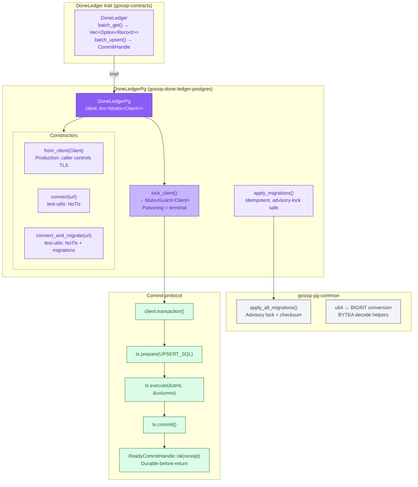
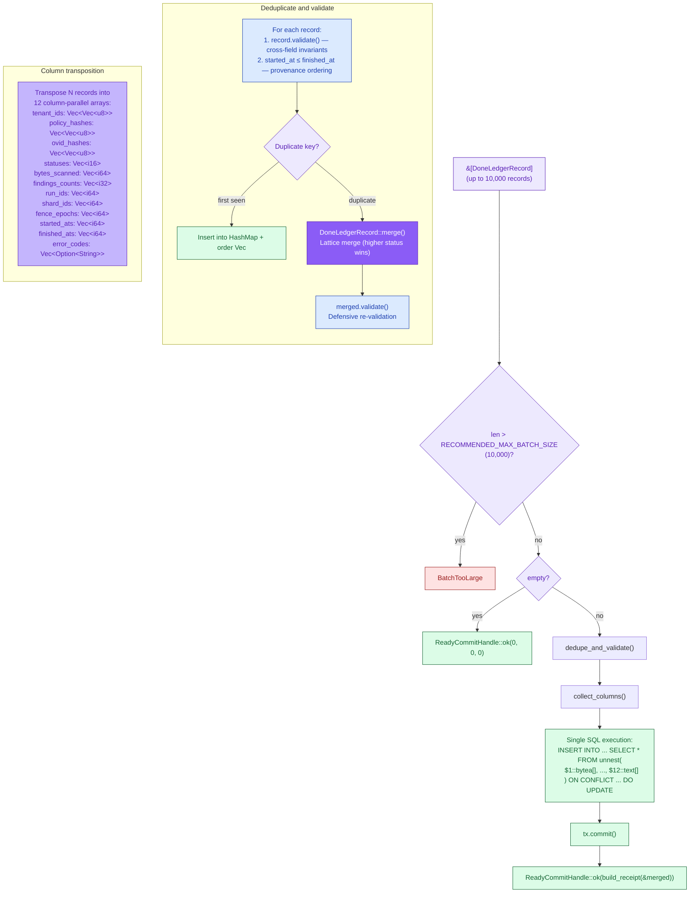
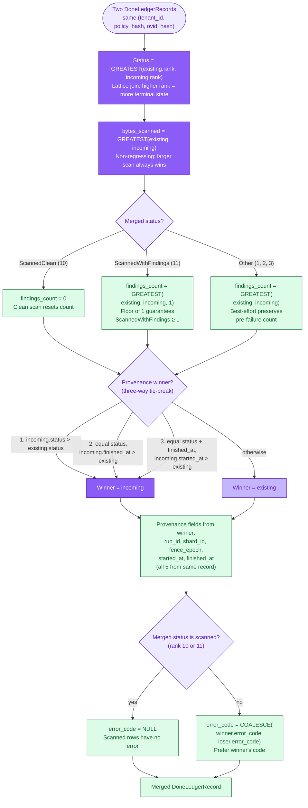
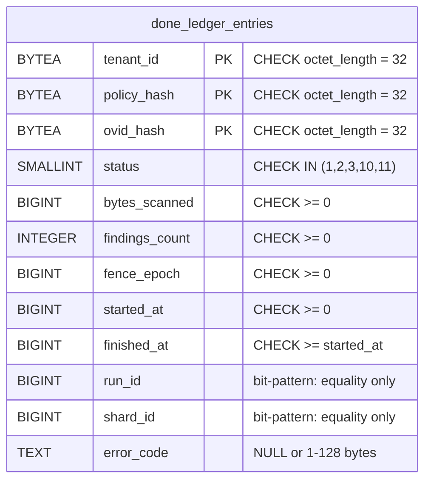
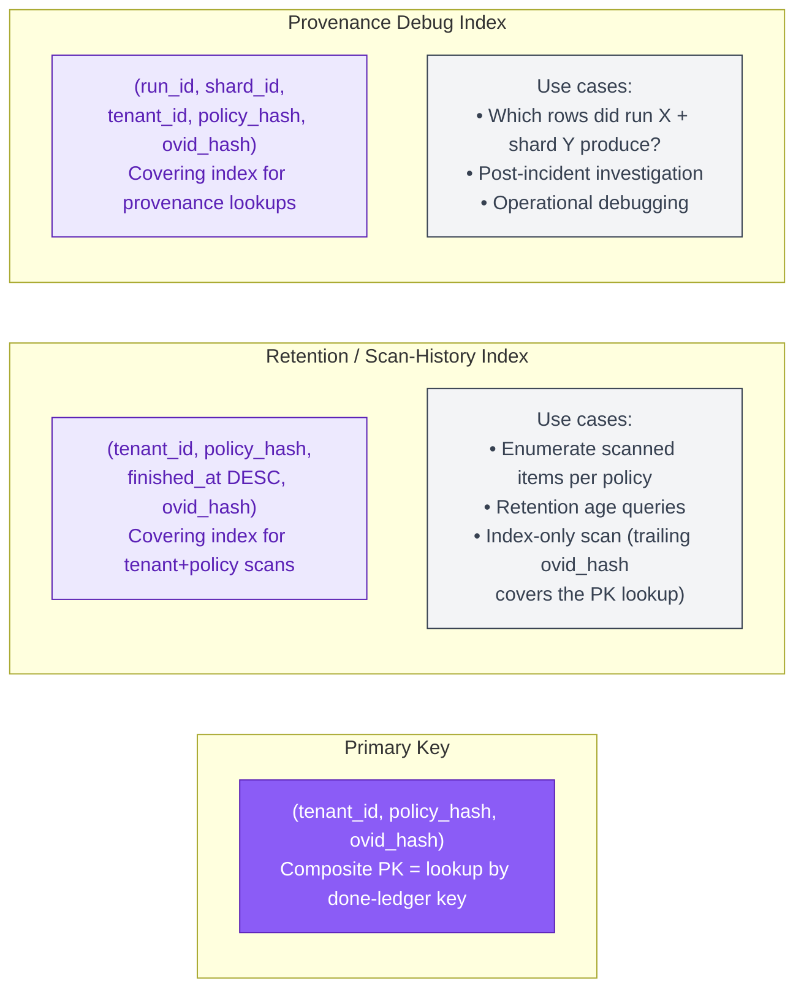
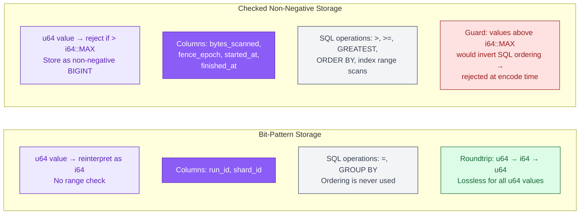
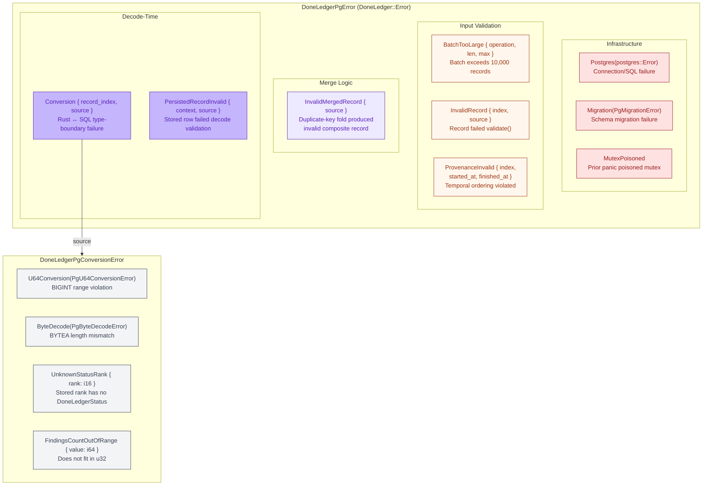

# Done-Ledger PostgreSQL Backend

The `gossip-done-ledger-postgres` crate implements the [`DoneLedger`] trait
against PostgreSQL. It records which `(tenant, policy, object-version)` tuples
have been scanned, what status they reached, and which pipeline run produced the
result. The done-ledger is the single source of truth for "has this item been
scanned?" queries that let workers skip already-processed items.

The backend uses a single synchronous `postgres::Client` behind
`Arc<Mutex<_>>`, explicit transactions for every write, and a single-statement
bulk `INSERT ... SELECT * FROM unnest() ON CONFLICT` upsert that avoids
per-row round-trips and sidesteps PostgreSQL's 65,535 bind-parameter limit.

The central correctness property is **lattice-monotonic merge**: both the
Rust-side batch preprocessing and the SQL `ON CONFLICT DO UPDATE` clause
implement the same merge rules, ensuring that the durable row for a given key
converges to the same state regardless of submission order or replay count.

This document covers five systems:

1. **Backend architecture** -- struct design, constructors, trait implementation,
   and concurrency model.
2. **Batch upsert pipeline** -- validation, deduplication, column transposition,
   and SQL execution.
3. **Provenance winner-selection** -- the three-way tie-break that determines
   which run's metadata survives a merge.
4. **SQL schema and indexes** -- table structure, CHECK constraints, and index
   design.
5. **Error hierarchy** -- error classification by failure category and recovery
   path.

> **Notation.** All diagrams use the B5 Persistence color palette (purple theme:
> fill `#8B5CF6`, light fill `#EDE9FE`, stroke `#5B21B6`). Identity types from
> B1 use blue (`#3B82F6` / `#DBEAFE` / `#1E40AF`). Error paths use red
> (`#EF4444` / `#FEE2E2` / `#991B1B`). Resolved/success states use green
> (`#22C55E` / `#DCFCE7` / `#166534`). Shared infrastructure (gossip-pg-common)
> uses grey (`#6B7280` / `#F3F4F6` / `#374151`).

---

## 1. Backend Architecture

`DoneLedgerPg` wraps a `postgres::Client` in `Arc<Mutex<_>>`, making the
struct cheaply cloneable and `Send + Sync`. The mutex serialises all database
access through a single connection -- concurrent `batch_get` / `batch_upsert`
calls block on the mutex, so throughput is limited to one operation at a time.
Callers needing connection-level parallelism should create multiple instances
or front them with a connection pool.

Every `batch_upsert` executes inside an explicit transaction. The
`ReadyCommitHandle` is only constructed after `tx.commit()` succeeds, so the
receipt returned to the caller is durable-before-return -- there is no async
lag between "receipt handed out" and "data on disk."



### Constructor summary

| Constructor | TLS | Migrations | Feature gate | Use case |
|:---|:---|:---|:---|:---|
| `from_client(Client)` | Caller-chosen | No | *(always)* | Production (TLS, pooling) |
| `connect(url)` | `NoTls` | No | `test-utils` | Quick local / test setup |
| `connect_and_migrate(url)` | `NoTls` | Yes | `test-utils` | Local dev with auto-schema |

After `from_client`, call `apply_migrations()` to run schema migrations if
needed. The advisory-lock protocol makes this safe for concurrent startup.

### Mutex poisoning

Poisoning is treated as terminal because the connection's internal state
(prepared statements, transaction nesting) is indeterminate after a panic
during SQL execution. Attempting to reuse a potentially half-committed
connection risks silent data corruption.

---

## 2. Batch Upsert Pipeline

The `batch_upsert` method is the write path. It validates, deduplicates,
transposes, and executes records in a single SQL round-trip per call.



### Why `unnest()` instead of multi-row `VALUES`

The PostgreSQL bind-parameter limit is 65,535. With 12 columns per row, a
dynamic multi-row `VALUES` clause hits the limit at ~5,461 rows (12 x 5,461 =
65,532). The `unnest()` approach uses exactly 12 parameters regardless of batch
size, and the server expands the arrays into rows internally. This avoids both
the parameter limit and the N round-trips of a per-row INSERT loop.

### Column encoding strategies

| Column class | Strategy | Columns | Rationale |
|:---|:---|:---|:---|
| Identity (equality-only) | Bit-pattern (`as i64`) | `run_id`, `shard_id` | SQL uses only `=` and `GROUP BY` -- signed ordering is irrelevant |
| Ordered (sortable) | Checked non-negative | `bytes_scanned`, `fence_epoch`, `started_at`, `finished_at` | SQL `ORDER BY`, `GREATEST`, and range-scan indexes depend on signed integer ordering matching logical counter ordering |
| Status rank | Direct cast (`rank as i16`) | `status` | SMALLINT holds the 1-11 rank range |
| Findings count | Checked (`u32 → i32`) | `findings_count` | INTEGER handles valid count range |
| Error code | Optional string | `error_code` | Nullable TEXT, max 128 bytes |

Values exceeding `i64::MAX` in ordered columns are rejected with
`Conversion { record_index }` rather than silently misordered.

### Receipt computation

The receipt is computed from the *merged* record set, not the original input.
Duplicates within a batch do not inflate the receipt counts.

| Receipt field | Computation |
|:---|:---|
| `record_count` | Number of distinct keys after dedup |
| `scanned_count` | Records with `status.is_scanned()` (ScannedClean or ScannedWithFindings) |
| `findings_count` | Saturating sum of `findings_count` across all records |

---

## 3. Provenance Winner-Selection: Three-Way Tie-Break

When two `DoneLedgerRecord` values share the same primary key `(tenant_id,
policy_hash, ovid_hash)`, the merge must decide which provenance to keep. The
decision tree below is implemented identically in Rust
(`DoneLedgerRecord::merge`) and in SQL (`UPSERT_SQL`).

The done-ledger merge differs from the observation merge (diagram 21) in two
key ways: (1) status uses a lattice join (`GREATEST`) rather than a simple
comparison, and (2) `findings_count` has status-dependent merge logic.



### Merge-rule invariants

These invariants must hold in both the Rust implementation and the SQL
`CASE` expressions. Divergence constitutes a correctness bug verified by
property tests in `merge_parity_proptest.rs`.

| # | Invariant | Rust | SQL |
|:---|:---|:---|:---|
| 1 | **Status**: lattice join via `GREATEST` | `DoneLedgerStatus::merge()` returns `max(rank)` | `GREATEST(EXCLUDED.status, done_ledger_entries.status)` |
| 2 | **bytes_scanned**: non-regressing | `.max()` | `GREATEST(EXCLUDED.bytes_scanned, ...)` |
| 3 | **findings_count**: status-dependent | Match on merged status: `ScannedClean → 0`, `ScannedWithFindings → max(existing, incoming, 1)`, other → `max` | 3-branch `CASE` on merged status values `10`, `11`, else |
| 4 | **Provenance winner**: `status > finished_at > started_at` | Three-condition boolean | Repeated CASE predicate across 6 columns (`run_id`, `shard_id`, `fence_epoch`, `started_at`, `finished_at`, `error_code`) |
| 5 | **Provenance fields**: all from same winner | Single `winner` binding | All 6 CASE arms use the identical 3-part predicate |
| 6 | **error_code**: cleared for scanned status | `None` when merged status is scanned | `CASE WHEN ... IN (10, 11) THEN NULL` |

### Why the SQL repeats the CASE predicate 6 times

PostgreSQL's `ON CONFLICT DO UPDATE SET` does not support CTEs or local
variables. Each column assignment requires its own `CASE` expression. All 6
CASE arms must use the identical three-part predicate to ensure every
provenance field is sourced from the same winner. Edits to one branch must be
mirrored in all others.

### Why provenance is never mixed

`fence_epoch` is not independently max-tracked. In the coordination layer,
`fence_epoch` is monotonic per shard; in the done-ledger it is provenance
metadata that records _which_ epoch produced the observation. Independently
max-tracking `fence_epoch` would produce a record whose epoch belongs to a
different run/shard than the one stored.

---

## 4. SQL Schema and Indexes

The done-ledger schema enforces the domain invariants from
[`DoneLedgerRecord`](19-persistence-contracts.md) at the SQL level through CHECK
constraints and a composite primary key.



### CHECK constraints

The schema enforces three categories of constraints:

| Constraint | SQL | Domain invariant |
|:---|:---|:---|
| **Byte-length identity** | `octet_length(tenant_id) = 32` (x3) | All identity fields are fixed-size 32-byte BLAKE3 hashes |
| **Status range** | `status IN (1, 2, 3, 10, 11)` | Only known `DoneLedgerStatus` rank values are stored |
| **Non-negative ordered fields** | `bytes_scanned >= 0`, `fence_epoch >= 0`, `started_at >= 0` | SQL signed ordering matches logical counter ordering |
| **Temporal ordering** | `finished_at >= started_at` | Provenance time range is well-formed |
| **Error code size** | `error_code IS NULL OR octet_length(...) BETWEEN 1 AND 128` | Matches `MAX_DONE_LEDGER_ERROR_CODE_SIZE` |
| **Status-shape** | 3-branch CHECK (see below) | Cross-field consistency between status, findings_count, and error_code |

The status-shape constraint is the most important:

```
(status = 10 AND findings_count = 0 AND error_code IS NULL)       -- ScannedClean
OR (status = 11 AND findings_count > 0 AND error_code IS NULL)    -- ScannedWithFindings
OR (status IN (1, 2, 3) AND error_code IS NOT NULL)               -- Failure/Skip
```

This mirrors the cross-field validation in `DoneLedgerRecord::try_new` and
`validate()`. A row that passes the Rust-side validation but violates the SQL
constraint would indicate a divergence between the domain model and the schema.

### Index design



The retention index uses `finished_at DESC` because the most common query
pattern is "newest completions first." The trailing `ovid_hash` column makes
the index _covering_ for the primary key, so retention scans operate as
index-only scans without hitting the heap.

The provenance index enables operational debugging: "which rows did a specific
run + shard produce?" This is essential for post-incident investigation when a
pipeline run produced incorrect results.

### u64 ↔ BIGINT encoding

Done-ledger columns use two encoding strategies depending on how SQL accesses
them:



---

## 5. Error Hierarchy

The error types are organized into two enums: `DoneLedgerPgError` (the
`DoneLedger::Error` associated type) and `DoneLedgerPgConversionError` (Rust ↔
PostgreSQL type-boundary failures). Errors fall into four categories:
infrastructure, input validation, merge logic, and decode-time.



### Error categorization

| Category | Variants | Typical cause | Recovery |
|:---|:---|:---|:---|
| **Infrastructure** | `Postgres`, `Migration`, `MutexPoisoned` | Network failure, schema drift, prior panic | Retry (Postgres), fix schema (Migration), restart (MutexPoisoned) |
| **Input validation** | `BatchTooLarge`, `InvalidRecord`, `ProvenanceInvalid` | Caller-supplied invalid data | Fix upstream: smaller batches, valid records |
| **Merge logic** | `InvalidMergedRecord` | Duplicate-key fold produced a record violating domain invariants | Likely a bug in merge logic |
| **Decode-time** | `Conversion`, `PersistedRecordInvalid` | Schema drift or data corruption in stored rows | Investigate stored data; may require migration |

### Migration system

The migration subsystem delegates to `gossip-pg-common` and uses:

| Component | Value | Purpose |
|:---|:---|:---|
| Advisory lock key | `0x4753444c50474d31` ("GSDLPGM1") | Serialises concurrent migration attempts |
| History table | `done_ledger_schema_migrations` | Records applied versions with BLAKE3 checksums |
| Checksum algorithm | BLAKE3 | Detects SQL text tampering post-application |

Migrations are append-only: new migrations are added to the end of the
`MIGRATIONS` slice. Existing migrations are immutable -- the checksum
test in `migrations.rs` pins each migration's SQL text hash. If the SQL
changes, the test fails, preventing silent schema drift.

---

## Batch-Get: Positional Alignment

The `batch_get` method preserves the caller's requested order. PostgreSQL
returns matching rows in arbitrary order, so the Rust caller restores
positional alignment:

1. Execute `SELECT ... WHERE ovid_hash = ANY($3::bytea[])` in a single
   round-trip.
2. Index results into a `HashMap<OvidHash, DoneLedgerRecord>`.
3. Project back onto the input `ovid_hashes` slice, yielding `None` for
   missing keys and duplicated results for duplicated inputs.

This guarantees that `result[i]` corresponds to `ovid_hashes[i]`, enabling
callers to zip results with their input without sorting.

### Row decoding

Each row passes through three validation layers:

1. **Type-level conversion**: byte length checks, `u64` range mapping, status
   rank resolution.
2. **Construction-time invariants**: `DoneLedgerRecord::try_new` enforces
   cross-field rules (e.g., `ScannedClean` requires `findings_count == 0`).
3. **Post-construction validation**: `DoneLedgerRecord::validate()` catches any
   invariant the constructor might not enforce.

Any failure at any layer produces `PersistedRecordInvalid` or `Conversion`,
indicating data corruption or schema drift.

---

## Cross-References

- [Persistence Contracts](19-persistence-contracts.md) -- the `DoneLedger`
  trait, `DoneLedgerRecord`, `DoneLedgerStatus` lattice, `DoneLedgerKey`,
  `DoneLedgerProvenance`, and `OVID` hashing that this backend implements
- [Findings PostgreSQL Backend](21-findings-postgres-dedup.md) -- the sibling
  PostgreSQL backend for findings, using similar `ON CONFLICT` patterns with
  different merge semantics
- [PageCommit Typestate Machine](08-pagecommit-typestate.md) -- the compile-time
  ordering guarantee that findings are durable before done-ledger writes
- [End-to-End Scan Flow](04-end-to-end-scan-flow.md) -- where done-ledger
  lookups and updates occur in the scan pipeline

## Source Code References

| File | Purpose |
|:---|:---|
| `crates/gossip-done-ledger-postgres/src/backend.rs` | `DoneLedgerPg` struct, `DoneLedger` trait impl, `dedupe_and_validate`, `collect_columns`, `decode_row`, `build_receipt` |
| `crates/gossip-done-ledger-postgres/src/schema.rs` | SQL constants (`BATCH_GET_SQL`, `UPSERT_SQL`), table/index/lock-key names |
| `crates/gossip-done-ledger-postgres/src/error.rs` | `DoneLedgerPgError` (9 variants), `DoneLedgerPgConversionError` (4 variants) |
| `crates/gossip-done-ledger-postgres/src/migrations.rs` | `MIGRATIONS` slice, `apply_all_migrations`, migration config |
| `crates/gossip-done-ledger-postgres/migrations/0001_done_ledger_entries.sql` | DDL: table, CHECK constraints, 2 indexes |
| `crates/gossip-pg-common/src/migration.rs` | Shared advisory-lock migration runner, `EmbeddedMigration`, checksum protocol |
| `crates/gossip-pg-common/src/types.rs` | `u64_to_pg_bigint_bits`, `u64_to_pg_bigint_checked`, `pg_bigint_to_u64_bits`, `pg_bigint_nonnegative_to_u64`, `decode_fixed_32` |
| `crates/gossip-contracts/src/persistence/done_ledger.rs` | `DoneLedger` trait, `DoneLedgerRecord`, `DoneLedgerStatus`, `DoneLedgerKey`, `DoneLedgerProvenance`, `DoneLedgerErrorCode` |
