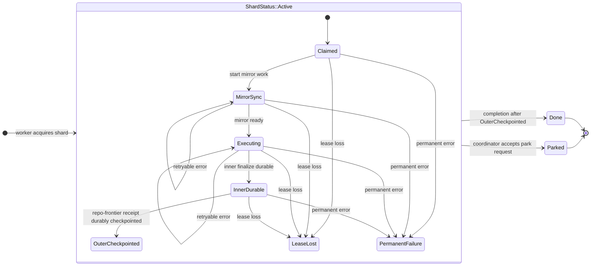
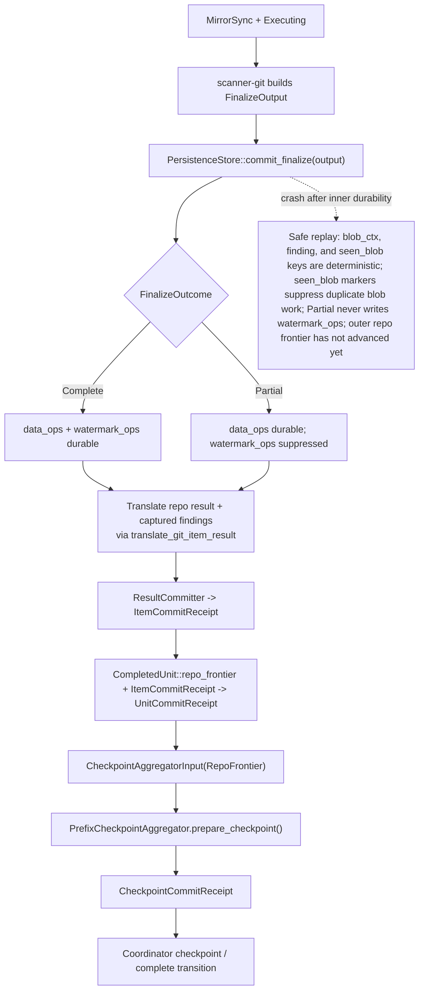

# ADR 0001: Git Repository Execution Model

- Status: Accepted
- Date: 2026-03-31

## Context

Git repository scanning uses a repo-native execution path, not the ordered-content
page loop. The repository already has most of the building blocks for that path:

| Existing building block | Current location | Why it matters |
| --- | --- | --- |
| `ShardStatus::{Active, Done, Split, Parked}` | `crates/gossip-coordination/src/record.rs` | The outer coordinator lifecycle is already fixed and persisted. |
| `LeaseUncertainty::{DeadlineElapsed, AdvanceStaleFence, AdvanceLeaseExpired}` | `crates/gossip-scanner-runtime/src/distributed.rs` | Lease-loss semantics already exist at runtime level. |
| `CheckpointBoundaryKind::RepoFrontier` | `crates/gossip-contracts/src/persistence/page_commit.rs` | Repo-frontier progress is already a first-class boundary kind. |
| `CompletedUnit::repo_frontier(...)` | `crates/gossip-scanner-runtime/src/commit_model.rs` | Repo-frontier units already fit the shared runtime commit vocabulary. |
| `CheckpointAggregatorInput` | `crates/gossip-scanner-runtime/src/commit_model.rs` | Outer progress already advances from durable receipts only. |
| `PersistenceStore::commit_finalize(&FinalizeOutput)` | `crates/scanner-git/src/persist.rs` | Inner Git execution already has an atomic finalize seam. |
| `FinalizeOutcome::{Complete, Partial}` with suppressed `watermark_ops` on `Partial` | `crates/scanner-git/src/finalize.rs` | Partial runs already prevent ref-frontier advancement. |
| `SeenBlobStore` and `seen_blob` markers | `crates/scanner-git/src/seen_store.rs`, `crates/scanner-git/src/finalize.rs` | Replay already has an idempotent dedupe surface. |
| `GitRepoDiscoverySource`, `GitMirrorManager`, `GitRepoExecutor`, `GitRunError` | `crates/gossip-contracts/src/connector/git.rs` | The repo-family contract surface already exists. |

This document locks how those pieces compose. It does not introduce a second
coordinator state machine, a second checkpoint path, or a compatibility layer.

## Decision Summary

1. Repo execution is a worker-local substate machine inside `ShardStatus::Active`.
2. Inner Git durability hands off to outer repo-frontier checkpointing through a
   sequential durable-receipt seam.
3. The connector-level Git runtime error model is ternary:
   `Retryable`, `Permanent`, and `StaleOwner`.
4. The first shipped scope stays narrow: one normalized repo target per shard,
   deterministic mirror and selection inputs, no repo-internal coordination state,
   and no repo-internal shard splitting.

## Decision 1: Repo Execution Lives Inside `ShardStatus::Active`

The coordinator keeps its current coarse shard lifecycle. Repo execution phases
are worker-local substates inside `ShardStatus::Active`; they do not add new
persisted `ShardStatus` variants.

`LeaseLost` is terminal only for the current worker attempt. The worker stops
immediately, discards in-flight local state, and leaves the shard `Active` so a
new owner can replay from the last durable frontier. `PermanentFailure` is a
worker-local decision to request parking; the actual persisted transition remains
the existing outer `Active -> Parked` coordination transition.

### Required behavior

- `ShardStatus` stays exactly `Active | Done | Split | Parked`.
- `Claimed`, `MirrorSync`, `Executing`, `InnerDurable`, and `OuterCheckpointed`
  are invisible to coordination storage.
- Retryable errors in `MirrorSync` or `Executing` may loop inside the same lease,
  bounded by the lease deadline.
- Lease loss from any inner phase stops execution immediately and never produces
  a new checkpoint or terminal transition.
- Permanent failure from any inner phase requests `Parked`.

### Alternatives considered

- Track repo execution in a second persisted state machine. Rejected because it
  duplicates lease-loss handling and creates desynchronization risk between the
  worker view and the coordinator view.
- Add repo-specific outer shard states. Rejected because coordination only needs
  coarse ownership and terminal-state information, and `ShardStatus` discriminants
  are already persisted.

## Decision 2: Inner Git Durability Hands Off Through a Durable-Receipt Seam

Inner Git persistence owns repo-data durability. The outer runtime owns shard
frontier durability. The handoff is sequential: inner persistence commits first,
then the runtime translates that durable outcome into the shared receipt chain
that drives repo-frontier checkpointing.

The seam is deliberately not a two-phase commit. The inner store already has the
atomic contract it needs:

- `data_ops` are always safe to write.
- `watermark_ops` are written only for `FinalizeOutcome::Complete`.
- `commit_finalize` writes the chosen operation set atomically.

The outer runtime already has the receipt-only rule it needs:

- `CheckpointAggregatorInput` accepts only `UnitCommitReceipt`.
- `PrefixCheckpointAggregator` advances only from durable contiguous prefixes.
- `RepoFrontier` remains a normal checkpoint-boundary kind in the shared
  aggregator rather than a Git-only side channel.

The translation step now includes Git findings themselves, not only finalize
outcome metadata. Repo-frontier workers capture emitted finding payloads during
scan execution, normalize them behind `PersistenceFinding`, and commit them
through the same findings-first, done-ledger-second `ResultCommitter` path used
by ordered-content scans before they synthesize the outer checkpoint receipt.

### Crash window: `InnerDurable -> OuterCheckpointed`

The only interesting crash window is after `commit_finalize` succeeds but before
the outer checkpoint receipt is durably acknowledged.

That window is safe because:

- inner writes are keyed deterministically, so reissuing them converges on the
  same persisted state;
- `seen_blob` markers provide replay-time dedupe for already-scanned blobs;
- `FinalizeOutcome::Partial` suppresses `watermark_ops`, so partial replays never
  advance ref-frontier watermarks; and
- outer repo-frontier advancement still has not happened, because only the
  receipt path through `CheckpointAggregatorInput` and `CheckpointCommitReceipt`
  may move the shard frontier.

The result is a single-writer outbox-style handoff: inner persistence proves the
repo-local writes are durable, and the outer runtime turns that proof into the
family-neutral checkpoint protocol.

### Alternatives considered

- Use a two-phase commit spanning scanner-git persistence and the outer runtime.
  Rejected because it adds a large coordination refactor without improving the
  safety properties that deterministic replay already provides.
- Advance the outer frontier from scan completion, queue drain, or another
  non-durable signal. Rejected because the shared runtime model already forbids
  raw completion signals from acting as authoritative progress.

## Decision 3: Connector-Level Git Errors Are Ternary

The Git repo-runtime contract needs a third connector-level error class:
`StaleOwner`.

### Scope of this decision

Three distinct `ErrorClass` enums exist today:

| Layer | Current location | Current shape | This ADR changes it? |
| --- | --- | --- | --- |
| Connector level | `crates/gossip-contracts/src/connector/api.rs` | `Retryable \| Permanent` | Yes, conceptually reserve `StaleOwner` here. |
| Scheduler level | `crates/scanner-scheduler/src/scheduler/failure.rs` | Binary with reason subtypes | No. |
| Remote backend level | `crates/scanner-scheduler/src/scheduler/remote.rs` | `Retryable \| Permanent` | No. |

This ADR changes only the connector-level meaning. Scheduler and remote error
taxonomies remain separate until they need their own explicit ownership-loss
mapping.

### Class table

| Class | Meaning | Worker action | Example |
| --- | --- | --- | --- |
| `Retryable` | The current owner may retry within the same lease. | Retry locally while the lease is still authoritative. | transient mirror sync failure, temporary rate limit, concurrent maintenance retry surface |
| `Permanent` | The current owner cannot make progress without an external change. | Request `Parked`. | permission denied, repository missing, unsupported selection or malformed configuration |
| `StaleOwner` | The work has become non-authoritative because lease ownership is no longer trustworthy. | Stop immediately, drop in-flight local state, leave the shard `Active` for reassignment. | deadline elapsed, stale fence rejection, lease-expired rejection, mirror or persistence detecting superseded ownership |

`StaleOwner` is not a retry request and not a park request. It means "the work
may be valid, but this worker is no longer allowed to finish it."

### Migration constraint

When the connector-level enum grows `StaleOwner`, every binary
`if err.is_retryable() { ... } else { ... }` call site must be audited. The
current `is_retryable()` helper is intentionally binary; without an audit it
would collapse `StaleOwner` into the non-retryable branch and silently treat
ownership loss like a permanent failure. Future code must branch on `class()` or
an equivalent three-way helper.

### Alternatives considered

- Keep the connector layer binary and model ownership loss only through
  `LeaseUncertainty` in the runtime. Rejected because ownership loss may be
  detected inside mirror management or persistence code that is naturally exposed
  through `GitRunError`.
- Add `StaleOwner` to every error enum immediately. Rejected because the
  connector, scheduler, and remote layers have different responsibilities and
  should not be forced into lockstep without a separate design decision.

## Decision 4: The First Scope Stays Narrow

The first shipped shape is intentionally constrained.

| Topic | Locked decision | Reason | Deferred expansion |
| --- | --- | --- | --- |
| Shard granularity | One normalized repo target maps to one shard. | Control-plane state scales with repo targets instead of repo-internal objects. | Multi-repo packing and shard-level packing heuristics. |
| Shard splitting | No repo-internal split points in this shape. A repo shard is either replayed, parked, or completed as one repo target. | Split-point discovery inside a repository adds coordination and replay complexity immediately. | Split/pack strategies that operate on multi-repo shards. |
| Coordinator visibility | The coordinator stores only coarse shard state, repo-frontier progress, and terminal outcomes. | Repo-internal commits, trees, blobs, and mirror details are worker-local execution state. | Repo-internal coordination state, if a later design proves it is needed. |
| Mirror lifecycle | Mirror location and refresh behavior are deterministic per repo target. The runtime implementation lives in `gossip-scanner-runtime::git_mirror::LocalMirrorManager`. | Reassignment and replay need a stable local execution surface. | Shared mirror pools, eviction policy, and provider-specific mirror orchestration. |
| Explicit commit selection | Explicit commit inputs lower to stable synthetic refs before execution. | Identical inputs must normalize to the same ordered repo targets and checkpoint identity. | Additional selection UX and provider-specific aliases. |
| `StaleOwner` rollout | The semantic is locked now, but the connector-level enum, constructor surface, and consumers may land in a separate change. | The behavior must be documented before wiring spreads through the runtime. | Scheduler-level and remote-level ownership-loss mappings. |

### Alternatives considered

- Pack multiple repositories into a single shard from the start. Rejected because
  it immediately couples checkpointing, split policy, and replay policy.
- Introduce repo-internal coordinator state early. Rejected because it increases
  storage and protocol surface before the coarse repo-frontier path is proven.

## Invariants for All Downstream Implementation Work

Every downstream implementation task, design note, and test plan for this
execution model keeps these invariants explicit:

1. A stale fence token is never accepted again.
2. Loss of lease stops repo execution quickly.
3. The outer repo frontier never advances before inner durable persistence completes.
4. Control-plane state scales with shards, not with objects inside repositories.
5. Identical request inputs normalize to the same ordered repo targets.
6. Identical explicit commit inputs lower to the same synthetic ref.
7. Logs, metrics, and traces never contain raw secret bytes, repo paths, refs, or tokens.
8. Duplicate submission and worker replay are idempotent.

Operational telemetry follows the same rule. Stage-oriented Git observability
may emit scalar timings, shard digests, and closed-set retry or lease-loss
labels, but never raw mirror roots, repo locators, refs, commit IDs, or
connector tokens.

## Consequences

- `ShardStatus` remains the only persisted outer lifecycle for repo work.
- `RepoFrontier` remains part of the shared receipt and checkpoint model rather
  than a Git-only completion path.
- Lease loss is a first-class outcome that stops work without parking the shard.
- Git stage telemetry stays low-cardinality and redaction-safe: worker logs and
  recorder events emit digests plus scalar timings rather than raw repository
  identifiers.
- The first scope optimizes for deterministic replay and narrow control-plane
  state, not for packing density.

## Complementary Documentation

- `docs/source-families.md` describes the family split between ordered-content
  and repo-native Git execution.
- `docs/gossip-coordination/coordination-error-model.md` complements this ADR
  with the coordination-layer error taxonomy and lease/fence validation model.
- `diagrams/05-shard-and-run-state-machines.md` describes the outer shard and
  run lifecycle that this ADR intentionally preserves.
- `diagrams/10-failure-modes-and-recovery.md` describes the failure and replay
  model that this ADR relies on for ownership loss and durable replay.
