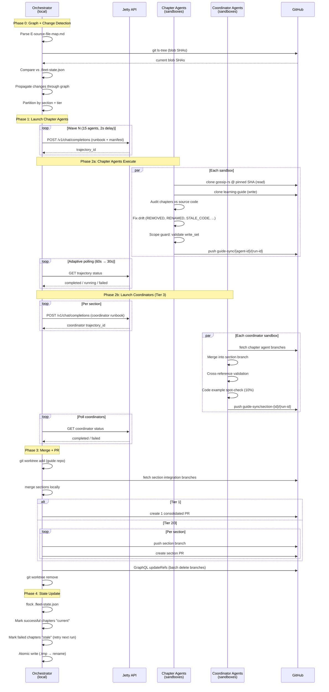
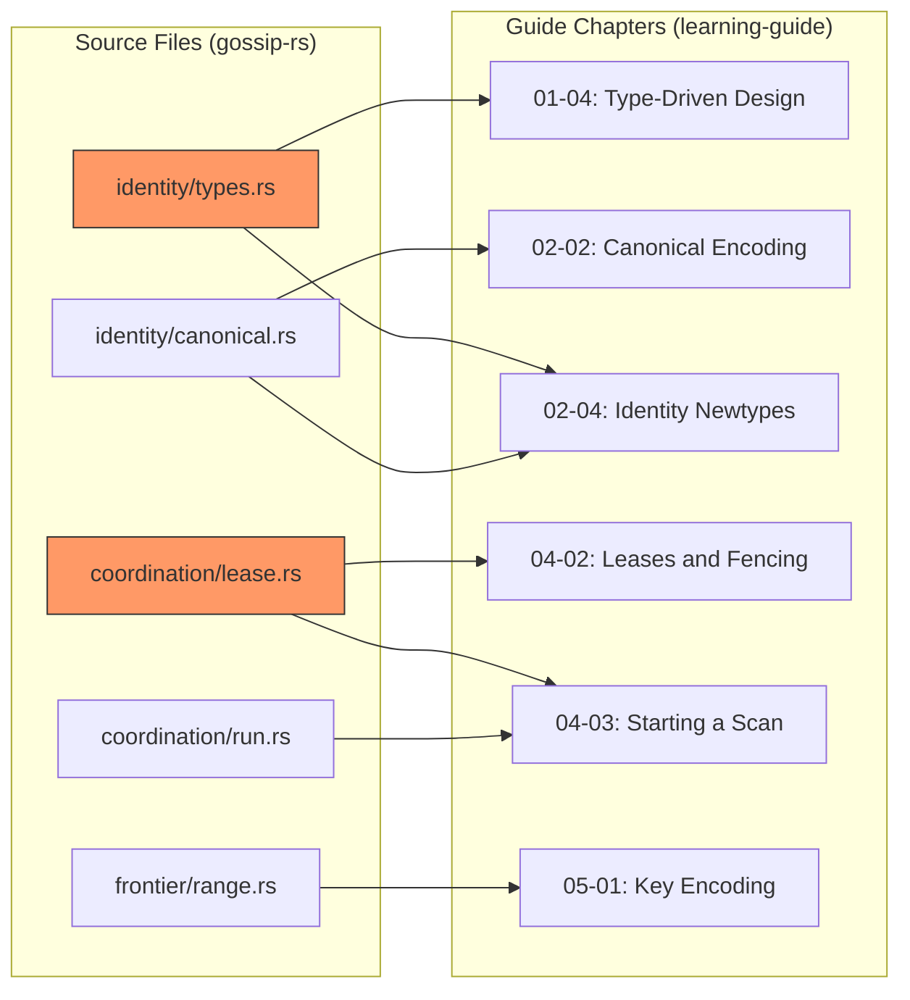
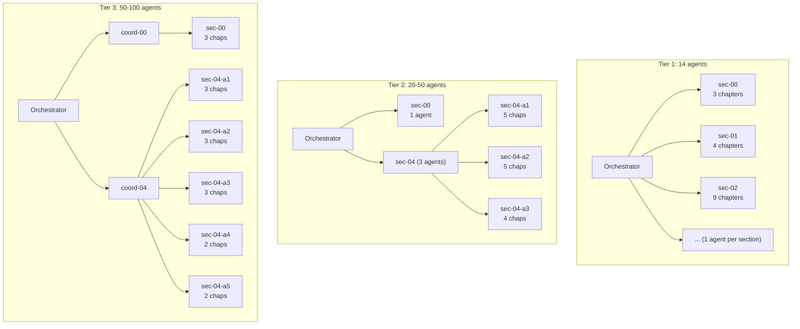

# Fleet Orchestrator Architecture

Guide-sync fleet orchestration system for synchronizing the
`gossip-rs-learning-guide` (99 chapters, 14 sections) with the `gossip-rs`
source codebase using 20-100 parallel agents.

## System Overview

Three execution zones: the local machine runs the Rust orchestrator binary,
Jetty Cloud hosts sandboxed agents, and GitHub stores repos/branches/PRs.

```
 LOCAL MACHINE                    JETTY CLOUD                        GITHUB
 (fleet-orchestrator)             (sandboxed agents)                 (repos + branches)
 ========================         ========================           ========================

 Phase 0: Graph + Detect
 +----------------------+
 | Parse E-source-file- |
 | map.md -> petgraph   |
 |                      |
 | git ls-tree (blobs)  |--- reads ------------------------------>  gossip-rs (source)
 | Compare vs state     |                                           origin/main @ BASE_SHA
 | Propagate -> affected|
 | chapters             |
 +----------+-----------+
            |
            | affected chapters
            | grouped by section
            v
 Phase 1: Partition + Launch
 +----------------------+         +-------------------------+
 | Partition by section |         |  WAVE 1 (15 agents)     |
 | Tier 3: ceil(N/3)   |         | +-----++-----++-----+   |
 | agents per section   |-- POST -| |ch-01||ch-02||ch-03|   |
 |                      |  /v1/   | | 02  || 02  || 02  |   |
 | Substitute runbook   |  chat/  | +--+--++--+--++--+--+   |
 | template per agent   |  compl. |    |      |      |      |
 |                      |         | +--+--++--+--++--+--+   |
 | Wave launch:         |         | |ch-01||ch-02||...  |   |
 |  15/wave, 2s delay   |         | | 04  || 04  ||     |   |
 +----------+-----------+         | +--+--++--+--++--+--+   |
            |                     |    :      :      :      |
            |                     +----+------+------+------+
            |                          |      |      |
            |                     +----+------+------+------+
            |                     |  WAVE 2 (5 agents)      |
            |              2s --> | +-----++-----++-----+   |
            |              delay  | |ch-01||ch-02||ch-03|   |
            |                     | | 07  || 07  || 08  |   |
            |                     | +--+--++--+--++--+--+   |
            |                     +----+------+------+------+
            |                          |      |      |
            |                          v      v      v
            |                     EACH AGENT SANDBOX:
            |                     +----------------------+
            |                     | 1. gh clone source   |
            |                     |    @ pinned SHA      |--- clone -->  gossip-rs
            |                     |    (READ ONLY)       |              (read only)
            |                     |                      |
            |                     | 2. gh clone guide    |--- clone -->  gossip-rs-
            |                     |    create branch     |              learning-guide
            |                     |                      |
            |                     | 3. Audit chapters:   |
            |                     |    - REMOVED types   |
            |                     |    - RENAMED items   |
            |                     |    - STALE_CODE      |
            |                     |    - WRONG_SIGNATURE |
            |                     |    - STALE_XREF      |
            |                     |                      |
            |                     | 4. Fix drift in      |
            |                     |    assigned chapters  |
            |                     |                      |
            |                     | 5. Scope guard check |
            |                     |    (HARD: unstage    |
            |                     |     non-manifest)    |
            |                     |                      |
            |                     | 6. git push branch   |--- push --->  guide-sync/
            |                     +----------------------+              sec-04-a1/
            |                                                           {run_id}
 Phase 2a: Poll Chapter Agents
 +----------------------+
 | tokio::join! poll    |-- GET -->  Jetty trajectory API
 | all trajectories     |<- status - {completed|running|failed}
 |                      |
 | Adaptive backoff:    |
 |  60s -> 30s when     |
 |  >50% done           |
 +----------+-----------+
            |
            | all chapter agents done
            v
 Phase 2b: Launch Coordinators (TIER 3 ONLY)
 +----------------------+         +-------------------------+
 | 1 coordinator per    |         |  COORDINATOR AGENTS     |
 | section (up to 8)    |         |                         |
 |                      |-- POST -| +-------+  +-------+   |
 | Uses coordinator     |  /v1/   | |coord  |  |coord  |   |
 | runbook template     |  chat/  | | sec-00|  | sec-01|   |
 |                      |  compl. | +---+---+  +---+---+   |
 | Can use different    |         |     :          :        |
 | model (frontier)     |         | +-------+  +-------+   |
 +----------+-----------+         | |coord  |  |coord  |   |
            |                     | | sec-07|  | sec-08|   |
            |                     | +---+---+  +---+---+   |
            |                     +-----+----------+-------+
            |                           |          |
            |                           v          v
            |                     EACH COORDINATOR:
            |                     +----------------------+
            |                     | 1. Fetch chapter     |
            |                     |    agent branches    |<- fetch ---  guide-sync/
            |                     |                      |             sec-04-a{1..5}/
            |                     | 2. Merge into        |             {run_id}
            |                     |    section branch    |
            |                     |                      |
            |                     | 3. Cross-ref check:  |
            |                     |    [Chapter N-M]     |
            |                     |    links valid?      |
            |                     |                      |
            |                     | 4. Code example      |
            |                     |    spot-check (10%)  |
            |                     |                      |
            |                     | 5. Push section      |--- push --->  guide-sync/
            |                     |    integration       |              section-04/
            |                     |    branch            |              {run_id}
            |                     +----------------------+
            |
            | poll coordinators
            v
 Phase 3: Merge + PR
 +----------------------+
 | git worktree add     |
 | (guide repo)         |
 |                      |
 | Fetch section        |<- fetch --------------------------------  guide-sync/
 | integration branches |                                           section-{00..08}/
 |                      |                                           {run_id}
 | Tier 2/3: create     |
 | per-section PRs      |--- gh pr create ----------------------->  PR per section
 |                      |                                           (up to 14)
 | GraphQL updateRefs   |--- mutation ----------------------------  delete agent +
 | batch branch cleanup |                                           section branches
 |                      |
 | git worktree remove  |
 +----------+-----------+
            |
            v
 Phase 4: State Update
 +----------------------+
 | flock .fleet-state.  |
 | json.lock            |
 |                      |
 | SUCCESS ONLY:        |
 |  completed + merged  |
 |  -> status: current  |
 |                      |
 | FAILED agents:       |
 |  -> status: stale    |
 |  (retried next run)  |
 |                      |
 | Atomic write:        |
 |  .tmp -> rename      |
 +----------------------+
```

## Tier 3 Hierarchy

Two-level agent hierarchy matching the guide's 14-section structure.
Coordinators validate cross-references between chapters that different
agents modified within the same section.

```
                    +----------------------+
                    |    ORCHESTRATOR      |
                    |    (local machine)   |
                    +----------+-----------+
                               |
              launches         |          polls + creates PRs
         +---------------------+---------------------+
         |                     |                     |
         v                     v                     v
 +---------------+   +---------------+     +---------------+
 |  coord-00     |   |  coord-04     | ... |  coord-08     |
 |  (Jetty)      |   |  (Jetty)      |     |  (Jetty)      |
 |               |   |               |     |               |
 | merge + xref  |   | merge + xref  |     | merge + xref  |
 | validate      |   | validate      |     | validate      |
 +-------+-------+   +-------+-------+     +-------+-------+
         |            +------+|+------+------+------+|
         |            |      ||      |      |      ||
         v            v      vv      v      v      vv
 +----------+  +--------++--------++--------++--------++--------+
 | sec-00   |  |sec-04  ||sec-04  ||sec-04  ||sec-04  ||sec-04  |
 | 3 chaps  |  |  -a1   ||  -a2   ||  -a3   ||  -a4   ||  -a5   |
 | (Jetty)  |  |3 chaps ||3 chaps ||3 chaps ||2 chaps ||2 chaps |
 +----------+  +--------++--------++--------++--------++--------+
                   |          |        |         |         |
                   v          v        v         v         v
               04-01      04-02     04-03     04-04     04-06
               04-06      04-08     04-09     04-10     04-11
               04-11      04-13     04-14

              (disjoint chapter ownership -- no file overlap)
```

## Pipeline Sequence



## State Tracking

Change detection flows through a bipartite dependency graph. When source
files change, affected chapters are computed via graph traversal with early
cutoff for chapters already synced to the current source SHA.



> In this example, if `types.rs` and `lease.rs` change (highlighted), the
> affected chapters are 01-04, 02-04, 04-02, and 04-03 — computed by
> traversing edges from the changed source nodes.

## Scaling Tiers



## Data Flow Summary

| Step | From | To | Mechanism |
|------|------|----|-----------|
| Read blob SHAs | Local | GitHub | `git ls-tree` |
| Read state | Local | `.fleet-state.json` | `flock` + JSON |
| Build graph | Local | petgraph | Parse `E-source-file-map.md` |
| Launch agents | Local | Jetty | `POST /v1/chat/completions` |
| Clone repos | Jetty sandbox | GitHub | `gh repo clone` |
| Audit + fix | Jetty sandbox | Jetty sandbox | Read source, edit guide |
| Push branch | Jetty sandbox | GitHub | `git push` |
| Poll status | Local | Jetty | `GET /api/v1/db/trajectory/...` |
| Merge branches | Local | Local worktree | `git fetch` + `git merge` |
| Create PRs | Local | GitHub | `gh pr create` |
| Clean branches | Local | GitHub | GraphQL `updateRefs` mutation |
| Update state | Local | `.fleet-state.json` | `flock` + atomic rename |
