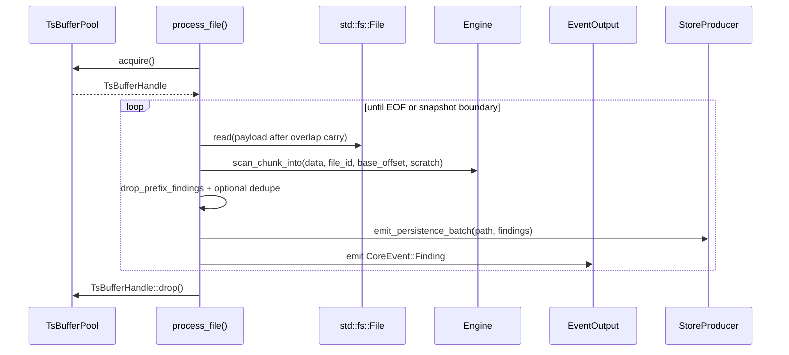

# Pipeline Flow

The active `scan fs` pipeline is orchestrated in `crates/scanner-scheduler/src/scheduler/parallel_scan.rs`
and executed by the scheduler in `crates/scanner-scheduler/src/scheduler/`. It does not use
`file_ring/chunk_ring/out_ring` stage queues in the current filesystem path.

```mermaid
flowchart LR
    Path["Path / root"] --> Orch["parallel_scan_dir()"]
    Orch --> PScan["parallel_scan_dir()"]

    PScan --> Walker["IterWalker::next_file()"]
    Walker --> Budget["CountBudget<br/>(max_in_flight_objects)"]
    Budget --> Exec["Executor<FileTask>"]

    Exec --> Worker["process_file()"]
    Worker --> Detect["Archive detect<br/>(extension -> header sniff)"]
    Detect -->|archive| Arch["dispatch_archive_scan()"]
    Detect -->|regular file| ChunkLoop["Sequential read + overlap carry"]
    ChunkLoop --> Engine["Engine::scan_chunk_into()"]
    Engine --> Emit["CoreEvent::Finding via EventOutput"]
    Engine --> Persist["emit_persistence_batch()<br/>via StoreProducer"]

    Pool["TsBufferPool"] -.->|"acquire()"| ChunkLoop
    ChunkLoop -.->|"TsBufferHandle::drop()"| Pool

    Emit --> Summary["Summary event + sink.flush()"]
    Persist -.->|"run end"| RunLoss["record_fs_run_loss()"]
```



## Stage Details

### Orchestration (`crates/scanner-scheduler/src/scheduler/parallel_scan.rs`)
- Entry point: `parallel_scan_dir(...)`
- Builds engine and event sink, then calls `parallel_scan_dir(...)`
- Emits final `CoreEvent::Summary` and flushes the sink

### Discovery (`crates/scanner-scheduler/src/scheduler/parallel_scan.rs`)
- `IterWalker` performs single-threaded filesystem discovery
- Produces `LocalFile` values
- Respects walker config (`follow_symlinks`, hidden files, gitignore)

### Scheduling + Scanning (`crates/scanner-scheduler/src/scheduler/local_fs_owner.rs`)
- `scan_local(...)` enqueues `FileTask` values and runs `Executor<FileTask>`
- `CountBudget` enforces discovery backpressure (`max_in_flight_objects`)
- Workers run `process_file(...)`:
  - Archive detection by extension, then header sniff when enabled
  - Binary skip/extract gate (content-policy based)
  - Sequential read with overlap carry (`copy_within` tail -> head)
  - `Engine::scan_chunk_into(...)` + `drop_prefix_findings(...)`
  - Optional within-chunk dedupe (includes `norm_hash` in dedup key) + `CoreEvent::Finding` emission
  - `build_persistence_batch()` + `emit_persistence_batch()` via `StoreProducer` (when configured)

### Output
- Findings are emitted directly through `EventOutput` (JSONL/Text/JSON/SARIF)
- No filesystem-path `OutputStage` queue in the scheduler flow

### Persistence (Optional)
- When `--persist-findings` is set, post-dedupe findings are also emitted to a
  `StoreProducer` via `emit_persistence_batch()` at every scan site
- Each batch carries the scanned object's path and its `FsFindingRecord` values
- At run end, `record_fs_run_loss()` emits loss accounting (`FsRunLoss`) so the
  backend can decide whether the run is complete or partial
- Errors from the producer are counted (`persistence_emit_failures`) but do not
  abort the scan — fail-soft semantics
- See [fs-persistence-pipeline.md](scanner-scheduler/fs-persistence-pipeline.md) for full details

`PipelineStats` in `crates/scanner-scheduler/src/pipeline.rs` includes `archive: ArchiveStats`, while
the active scheduler report type is `LocalReport`/`MetricsSnapshot`.

## Buffer Lifecycle (Scheduler Path)



## Capacities and Limits

Active filesystem defaults (high-level API):

| Setting                                    | Default       | Source                                                    |
| ------------------------------------------ | ------------- | --------------------------------------------------------- |
| `ParallelScanConfig.chunk_size`            | `256 KiB`     | `crates/scanner-scheduler/src/scheduler/parallel_scan.rs` |
| `ParallelScanConfig.pool_buffers`          | `workers * 4` | `crates/scanner-scheduler/src/scheduler/parallel_scan.rs` |
| `ParallelScanConfig.max_in_flight_objects` | `1024`        | `crates/scanner-scheduler/src/scheduler/parallel_scan.rs` |
| `ParallelScanConfig.local_queue_cap`       | `4`           | `crates/scanner-scheduler/src/scheduler/parallel_scan.rs` |

`scan_local` memory bound is approximately:

```
peak_buffer_bytes ~= pool_buffers * (chunk_size + engine.required_overlap())
```

For direct library usage, `crates/scanner-scheduler/src/runtime.rs` provides a single-threaded
`ScannerRuntime` + `read_file_chunks(...)` path with `BufferPool`.

## Design Rationale (Current FS Path)

- Backpressure is explicit via `CountBudget` and fixed-capacity `TsBufferPool`
- Discovery is single-threaded and bounded; scanning is parallel owner-compute
- Buffer ownership is RAII (`TsBufferHandle`), so release is deterministic on drop

## Git Scan Concurrency and Backpressure

Git scanning is staged and resource-bounded, but not strictly single-threaded:

- Parallelism knobs:
  - `GitScanConfig.pack_exec_workers` (pack decode/scan workers)
  - `GitScanConfig.blob_intro_workers` (parallel blob introduction)
- Deterministic output ordering is preserved by ordered merge/reassembly in the runner
- Key bounded points:
  - `SpillLimits` (spill bytes, chunk candidates, run caps)
  - `MappingBridgeConfig` (`path_arena_capacity`, candidate caps)
  - `PackPlanConfig` (`max_worklist_entries`, `max_delta_depth`)
  - `PackMmapLimits` (`max_open_packs`, `max_total_bytes`)
  - `PackDecodeLimits` (header/delta/object byte limits)

When limits are hit, runs can fail or become partial; watermark writes are only
advanced on complete finalize outcomes.
