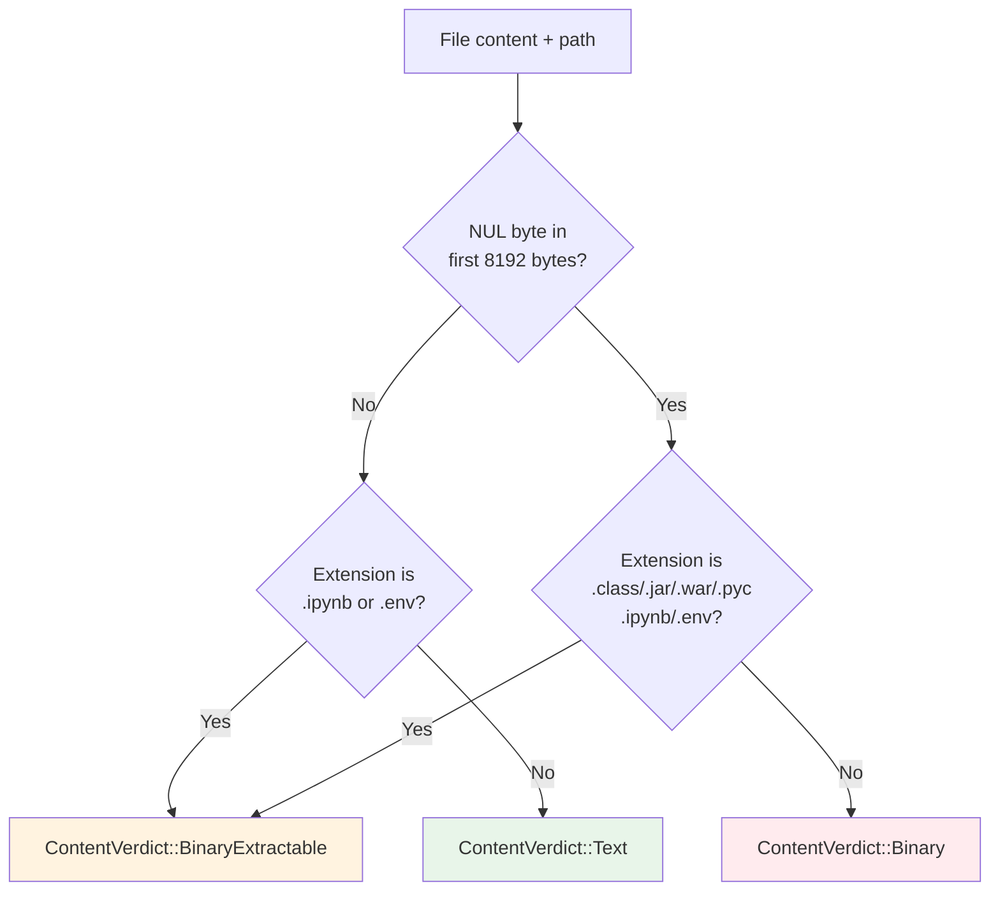

# Content Policy, YARA Base64 Gate, and Set-Associative Cache

Content classification, format-specific text extraction, base64 pre-decode gating, and cache-line-friendly CLOCK caching for the scanner engine.

Located in:
- `crates/scanner-engine/src/content_policy/` (classification and extraction)
- `crates/scanner-engine/src/b64_yara_gate.rs` (base64 gate)
- `crates/scanner-engine/src/lsm/set_associative_cache.rs` (CLOCK cache)

## Module Overview

These three subsystems serve different stages of the scan pipeline:

1. **Content Policy** — Decides whether incoming file content should be scanned as text, skipped as binary, or have text extracted from a known binary format. The primary entry point is `classify_content`, which combines a NUL-byte heuristic with file extension matching.

2. **YARA Base64 Gate** — A fast pre-filter that checks whether any base64-encoded form of known anchor patterns appears in a buffer. This gates downstream base64 decoding: if no anchor permutation is found, decoding is skipped entirely.

3. **Set-Associative Cache** — A compact, cache-line-friendly CLOCK Nth-Chance cache used by the LSM subsystem for hot data. Tags provide fast mismatch filtering; SIMD-accelerated tag search handles the common case in a single instruction.

## Content Policy

### Classification Flow



`classify_content(data, path, check_len)` is the single entry point. It operates in two phases:

1. **NUL-byte heuristic** — `is_likely_binary` scans the first `CHECK_LEN` (8192) bytes for a NUL byte using `memchr` (SIMD-accelerated). This mirrors Git's `buffer_is_binary` technique. Empty data is not considered binary.

2. **Extension matching** — `match_extractable_format` checks the file path for known extractable formats. Matching is case-insensitive on ASCII bytes. Dotenv files are matched by basename (`.env`, `.env.*`); other formats are matched by extension (`.ipynb`, `.class`, `.jar`, `.war`, `.pyc`).

The interaction between these two phases has an intentional asymmetry:

- **Text-extractable formats** (`.ipynb`, `.env`) — Classified as `BinaryExtractable` even when no NUL bytes are present. These are text files that benefit from structured extraction (e.g., stripping JSON noise from notebooks, normalizing dotenv quoting).

- **Binary-only formats** (`.class`, `.jar`, `.war`, `.pyc`) — Classified as `BinaryExtractable` only when NUL bytes are present. A NUL-free file with a `.class` extension is likely a misnamed text file and should be scanned as-is rather than passed through the class file parser.

### Content Verdicts

| Verdict | Meaning | Action |
|---------|---------|--------|
| `Text` | Content appears to be text | Scan normally |
| `Binary` | Content appears to be binary, no known extractor | Skip unless `--scan-binary` is set |
| `BinaryExtractable(fmt)` | Known format with text extraction strategy | Run format-specific extractor, then scan extracted text |

### Path Matching Details

- **Dotenv**: Matches basename `.env` exactly, or `.env.` followed by any suffix (e.g., `.env.local`, `.env.production`). Names like `.envrc` do not match. Matching uses `file_name()` which splits on both `/` and `\` separators.

- **Other formats**: Matched by the file extension after the last `.` in the filename component. Dotfiles (leading `.` with no other `.`) return no extension.

## Content Extraction Framework

### Extractor Trait

All format handlers implement the `Extractor` trait:

```rust
pub trait Extractor {
    fn extract(&self, data: &[u8], out: &mut Vec<u8>, scratch: &mut Vec<u8>) -> ExtractResult;
}
```

**Contract:**
- Implementations **append** to `out`; they must not clear it.
- On `ParseError` or `Empty`, `out` must be left unchanged from its state at entry.
- Implementations must not panic on arbitrary input.
- `scratch` is a caller-provided temporary workspace (e.g., for decompressing JAR entries). Extractors that don't need it ignore it.

### Dispatch

`extract_content(format, data, out, scratch)` clears `out` before dispatching to the correct extractor. Production code should use this function — it owns the clear-before-dispatch invariant.

```rust
pub fn extract_content(format: ExtractableFormat, data: &[u8],
                       out: &mut Vec<u8>, scratch: &mut Vec<u8>) -> ExtractResult;
```

### Pre-allocation Hints

| Constant | Value | Purpose |
|----------|-------|---------|
| `EXTRACT_INPUT_CAP` | 64 KiB | Pre-allocation hint for input buffers |
| `EXTRACT_OUTPUT_CAP` | 32 KiB | Output budget cap; extractors stop writing beyond this |
| `JAR_ENTRY_CAP` | 32 KiB | Pre-allocation hint for JAR entry scratch |

## Per-Format Handlers

### DotEnv (`.env`, `.env.*`)

**Extractor:** `DotEnvExtractor`

Produces normalized `KEY=VALUE\n` lines from dotenv content, stripping comments, quoting, escape sequences, and `export` prefixes.

**Supported syntax:**

| Form | Behavior |
|------|----------|
| `KEY=VALUE` | Bare assignment |
| `export KEY=VALUE` | Lowercase `export` prefix stripped |
| Empty lines, `# ...` | Skipped entirely |
| Unquoted value | Leading/trailing whitespace trimmed; `#` starts inline comment at position 0 or after whitespace |
| `'...'` | Single-quoted: literal bytes, no escape processing |
| `"..."` | Double-quoted: `\n`, `\r`, `\t`, `\\`, `\"` unescaped; unknown `\x` keeps `x` |
| Quoted multiline | Spans physical lines until closing quote |

**Algorithm (single forward pass):**

1. Advance through lines, skipping blanks and comments.
2. Strip optional `export` prefix, then locate the `=` separator.
3. Dispatch value to a quoting-specific parser (unquoted, single-quoted, double-quoted). Quoted parsers consume continuation lines via a shared `pos` cursor.
4. Each `KEY=value\n` entry is written atomically using checkpoint/rollback: if the value is malformed or the output budget is exhausted, `out` is truncated back to its pre-entry length.

**Robustness features:**
- Unterminated quotes trigger a fallback: the first physical line's raw value is emitted as unquoted, and the position cursor is rewound so continuation lines are re-evaluated as independent entries.
- `MAX_MULTILINE_LINES` (1024) caps continuation lines to prevent unbounded scanning from unclosed quotes.
- Line scanning and delimiter searches use `memchr`/`memchr2` for SIMD-accelerated matching.

### Jupyter Notebook (`.ipynb`)

**Extractor:** `IpynbExtractor`

Parses the JSON structure and extracts source lines from **all** cell types — code, markdown, and raw. Markdown cells are included because they frequently contain secrets in code fences, inline snippets, or configuration examples.

**Extraction strategy:**
- Each cell's `source` array is concatenated verbatim (lines already contain their own `\n` terminators).
- A trailing `\n` is appended after each non-empty cell to ensure cell boundaries are visible to line-oriented scan rules.
- `outputs` blobs are ignored — they are large, noisy, and rarely contain secrets.
- Uses a minimal typed `Notebook` / `Cell` struct for deserialization via serde, avoiding `serde_json::Value` allocations.

### Java Class (`.class`)

**Extractor:** `JavaClassExtractor`

Parses the constant pool of a compiled Java class file to extract `CONSTANT_Utf8` entries (tag 1). These contain string literals, class names, method signatures, and other text that may hold secrets.

**Format:**
```
Bytes 0-3:  0xCAFEBABE (magic)
Bytes 4-7:  Minor/major version
Bytes 8-9:  Constant pool count (u16)
Bytes 10+:  Constant pool entries
```

**Parsing:**
- Only `CONSTANT_Utf8` entries are extracted, each emitted as a newline-terminated string.
- All other constant types are skipped by their known fixed sizes per JVM spec §4.4.
- `CONSTANT_Long` and `CONSTANT_Double` consume two constant pool slots per §4.4.5.
- Parsing stops at the end of the constant pool — fields, methods, and attributes are not descended into because the constant pool already contains every string literal referenced in the class.
- Unknown tags cause immediate bail-out (cannot determine their size).

### JAR/WAR Archive

**Extractor:** `JarWarExtractor`

Opens a ZIP archive and iterates over `.class` entries, delegating each to `JavaClassExtractor`. Only `.class` files are processed — other text files inside JARs are scannable individually if encountered separately.

**Budget limits:**

| Limit | Value | Purpose |
|-------|-------|---------|
| `MAX_ENTRIES` | 10,000 | Cap on ZIP central directory iteration |
| `MAX_CLASS_SIZE` | 10 MiB | Skips anomalously large `.class` files |
| `MAX_TOTAL_EXTRACTED` | 100 MiB | Hard ceiling on output buffer size |

Per-entry limits skip the oversized entry. The total budget stops extraction entirely. In both cases, text already appended is kept.

The caller-provided `scratch` buffer is reused across entries to hold decompressed `.class` bytes, avoiding per-entry allocation. Extension matching is case-insensitive (e.g., `.CLASS`, `.Class` both match).

### Python Bytecode (`.pyc`)

**Extractor:** `PycExtractor`

Parses the marshal data in a compiled Python 3.6+ file to extract string constants.

**Extracted string types:**
- `TYPE_STRING` (`s`), `TYPE_UNICODE` (`u`), `TYPE_INTERNED` (`t`) — u32 LE length prefix
- `TYPE_SHORT_ASCII` (`z`), `TYPE_SHORT_ASCII_INTERNED` (`Z`) — u8 length prefix
- `TYPE_ASCII` (`a`), `TYPE_ASCII_INTERNED` (`A`) — u32 LE length prefix

**Header format:**
```
Bytes 0-3:  magic (2 bytes) + \r\n (2 bytes)
Python 3.6: Bytes 4-11: timestamp + source size → header_size = 12
Python 3.7+: Bytes 4-15: flags + hash/timestamp → header_size = 16
```

Header size is selected from the CPython magic number: values below 3390 use 12 bytes (pre-3.7), 3390+ use 16 bytes (PEP 552).

**Marshal walk strategy (linear sweep):**
- **String types:** content appended to output, one line per string.
- **Fixed-size types** (`int`, `ref`, `True`, etc.): skipped by known byte sizes. `float` and `complex` are variable-length (length-prefixed).
- **Container types** (`tuple`, `list`, `set`, `frozenset`, `dict`): only the element-count prefix is skipped; contained objects follow inline.
- **`TYPE_CODE`**: skips the 24-byte numeric prefix (Python 3.8+ layout: 6 × u32). Sub-fields are marshal objects parsed in subsequent iterations.
- **`FLAG_REF` (0x80)**: masked off before matching so ref-tagged objects are handled identically.
- **Unknown opcodes**: cause immediate bail-out.

## YARA Base64 Gate

### Problem

Base64 encoding groups bytes into 3-byte blocks. A raw anchor string can start at offsets 0, 1, or 2 within a block, yielding three base64 permutations. Leading and trailing base64 characters can be unstable because they depend on adjacent (unknown) bytes. YARA documents this for the string "This program cannot"; Sigma's `base64offset` modifier describes the same phenomenon.

### Build-Time Algorithm

For each anchor `A` and each offset `o` in `{0, 1, 2}`:

1. Prefix `A` with `o` zero bytes to model unknown preceding bytes.
2. Encode with the standard base64 alphabet.
3. Drop the unstable prefix: `o=0 → 0 chars`, `o=1 → 2 chars`, `o=2 → 3 chars`.
4. Drop the unstable suffix based on `(len(prefix+A) % 3)`: `rem=0 → 0`, `rem=1 → 3`, `rem=2 → 2`.
5. Keep the remaining substring if it is at least `min_pattern_len` characters.

Generated patterns are deduplicated across anchors and offsets using a `BTreeSet` for stable ordering.

**Example** — "This program cannot" produces three permutations:

| Offset | Pattern |
|--------|---------|
| 0 | `VGhpcyBwcm9ncmFtIGNhbm5vd` |
| 1 | `RoaXMgcHJvZ3JhbSBjYW5ub3` |
| 2 | `UaGlzIHByb2dyYW0gY2Fubm90` |

### Runtime Scanning

The compiled patterns are assembled into a dense Aho-Corasick automaton over a 64-symbol alphabet (one symbol per base64 character). Scan time is O(1) per byte — a single table lookup with no branches.

**Input canonicalization:**
- Whitespace is ignored per policy (`Rfc4648`: SP/TAB/CR/LF only; `AsciiWhitespace`: includes VT and FF).
- URL-safe characters are mapped: `'-'` → `'+'`, `'_'` → `'/'`.
- `'='` is handled per `PaddingPolicy`: `StopAndHalt` halts scanning (sticky across chunks); `ResetAndContinue` resets to root state and continues.
- Any other byte resets the automaton to the root state, so matches never span invalid bytes.

A 256-entry lookup table (`input_lut`) classifies each input byte into one of: a base64 symbol (0–63), whitespace tag (`TAG_WS = 0xFE`), padding tag (`TAG_PAD = 0xFD`), or invalid tag (`TAG_INVALID = 0xFF`). The LUT is built at compile time.

### Scan Modes

| Method | Behavior | Use Case |
|--------|----------|----------|
| `hits(encoded)` | One-shot scan; respects `PaddingPolicy` | Per-span scanning with precise boundaries |
| `hits_anywhere(encoded)` | Always treats `'='` as boundary (resets), continues scanning | Whole-buffer prefiltering |
| `scan_with_state(encoded, &mut GateState)` | Incremental scan across chunk boundaries; caller resets state between spans | Streaming input |

### Semantics

- **False positives expected** — this is a gate, not a validator.
- **False negatives possible** if short patterns are dropped via `min_pattern_len`.
- **Memory**: O(states × 64) for the dense automaton, trading space for predictable latency.

### Automaton Structure

`Ac64` is a dense Aho-Corasick automaton:
- `next: Box<[u32]>` — Dense transition table: `state * 64 + sym → next state`. Every state has a transition for every symbol (no branches on lookup).
- `out: Box<[u8]>` — Output marker per state (0/1). Output propagation through fail links ensures suffix matches are reported.
- The automaton is reference-counted (`Arc<Ac64>`) so cloning `Base64YaraGate` is cheap.

### Integration with Scan Engine

The scan engine (`engine/core.rs`) builds a `Base64YaraGate` during engine initialization. For rules with `Gate::AnchorsInDecoded` on base64 transforms, the gate is checked against encoded bytes before invoking the full decode pipeline. If the gate does not hit, base64 decoding is skipped entirely, saving significant work on buffers that don't contain the target patterns.

## Set-Associative Cache

### Purpose

Provides a compact, cache-line-friendly cache for LSM hot data. Designed for high-throughput lookups where both hit-rate and latency matter.

### Architecture

```
┌─────────────────────────────────────────────┐
│                Hash + fast_range             │
│              key → set index + tag           │
└──────────────────┬──────────────────────────┘
                   │
         ┌─────────▼─────────┐
         │   Set (WAYS slots) │
         ├───┬───┬───┬───┬───┤
         │tag│tag│tag│tag│...│  ← SIMD-compared
         ├───┼───┼───┼───┼───┤
         │cnt│cnt│cnt│cnt│...│  ← packed CLOCK counts
         ├───┼───┼───┼───┼───┤
         │val│val│val│val│...│  ← aligned value buffer
         └───┴───┴───┴───┴───┘
              ↑
         clock hand
```

### Lookup Algorithm

1. **Hash** the key to 64-bit entropy via `C::hash(key)`.
2. **Select set** with `fast_range(entropy, sets)` and derive tag via `Tag::truncate(entropy)`.
3. **Search tags** — SIMD-accelerated comparison of the tag against all `WAYS` tags in the set. Returns a bitmask of matching ways.
   - **aarch64**: NEON intrinsics (`vceqq_u8/u16`).
   - **x86_64**: SSE2 baseline (`_mm_cmpeq_epi8/16`); AVX2 (`_mm256_cmpeq_epi16`) for 16-way u16 tags.
   - **Miri / other**: Scalar fallback.
4. **Confirm keys** — For each tag-matching, occupied slot (count > 0), extract the key from the stored value and compare against the lookup key.
5. **On hit**: increment the count (saturating, capped at `max_count`).

### CLOCK Nth-Chance Eviction

On insertion when no existing entry matches:

1. Start at the set's clock hand position.
2. For each way (wrapping around):
   - If count is 0: insert here.
   - Otherwise: decrement count. If it reaches 0, evict and insert here.
3. Advance the clock hand to the next way after the insertion point.

Worst-case iterations: `WAYS × (max_count - 1)`. With `CLOCK_BITS=2` and `WAYS=16`, this is `16 × 2 = 32` iterations before guaranteed eviction.

The algorithm is similar to "RRIParoo" from "Kangaroo: Caching Billions of Tiny Objects on Flash" — each slot gets multiple chances before eviction, controlled by the `CLOCK_BITS` parameter.

### Data Layout

**Tags** (`Vec<TagT>`) — Short partial hashes stored separately from values to keep hot metadata compact. 8-bit or 16-bit. Tag matches are advisory; a full key comparison is authoritative.

**Values** (`AlignedBuf<C::Value>`) — Heap-allocated buffer with custom alignment for cache-line-aligned storage. Elements are `MaybeUninit<T>`; occupancy is tracked by counts, not the value buffer. Destructors are not run (intended for `Copy` types).

**Counts** (`PackedUnsignedIntegerArray<CLOCK_BITS>`) — Per-slot access counts packed into 64-bit words. `CLOCK_BITS` can be 1, 2, or 4. A count of 0 means the slot is empty.

**Clock hands** (`PackedUnsignedIntegerArray<CLOCK_HAND_BITS>`) — Per-set clock position packed similarly. `CLOCK_HAND_BITS = log2(WAYS)`.

### PackedUnsignedIntegerArray

Stores small unsigned integers densely in little-endian 64-bit words. `BITS` must be a power of two less than 8. Operations are O(1):

```rust
// get: extract value at index
let word = words[index / uints_per_word];
let shift = (index % uints_per_word) * BITS;
value = (word >> shift) & mask;

// set: write value at index
words[index / uints_per_word] = (word & !mask_shifted) | (value << shift);
```

### Const-Generic Parameters

| Parameter | Valid Values | Purpose |
|-----------|-------------|---------|
| `WAYS` | 2, 4, 16 | Associativity (slots per set) |
| `CLOCK_BITS` | 1, 2, 4 | Bits per access count |
| `CACHE_LINE_SIZE` | Power of 2 | Target cache line size (typically 64) |
| `VALUE_ALIGNMENT` | Power of 2 (0 = type default) | Alignment for value buffer |
| `CLOCK_HAND_BITS` | `log2(WAYS)` | Bits per clock hand |

`VALUE_COUNT_MAX_MULTIPLE` is computed at compile time to ensure all arrays stay cache-line aligned. The `init` constructor enforces all invariants with compile-time and runtime assertions.

### Operations

| Operation | Behavior |
|-----------|----------|
| `get(key)` | Returns pointer to cached value; increments count on hit |
| `get_index(key)` | Returns slot index; updates metrics (under `perf-stats` feature) |
| `upsert(value)` | Inserts or replaces; returns `UpsertResult` with evicted value if any |
| `remove(key)` | Zeros count; marks slot as uninitialized |
| `demote(key)` | Sets count to 1 (hinting low priority) |
| `reset()` | Clears tags, counts, clocks, metrics. Values are left untouched. |

### Concurrency

The cache is **not thread-safe**. Interior mutability (`UnsafeCell`, `Cell`) is used for counts, clocks, and metrics without synchronization. Callers must synchronize shared access externally.

## Key Types Reference

### Content Policy

| Type | Kind | Purpose |
|------|------|---------|
| `ContentVerdict` | Enum | Classification result: `Text`, `Binary`, `BinaryExtractable(fmt)` |
| `ExtractableFormat` | Enum | Variants: `DotEnv`, `Ipynb`, `JavaClass`, `JarWar`, `Pyc` |
| `ExtractResult` | Enum | Extraction outcome: `Ok`, `Empty`, `ParseError` |
| `Extractor` | Trait | `fn extract(&self, data, out, scratch) -> ExtractResult` |
| `DotEnvExtractor` | Struct (unit) | Dotenv format handler |
| `IpynbExtractor` | Struct (unit) | Jupyter Notebook handler |
| `JavaClassExtractor` | Struct (unit) | Java class file handler |
| `JarWarExtractor` | Struct (unit) | JAR/WAR archive handler |
| `PycExtractor` | Struct (unit) | Python bytecode handler |

### YARA Base64 Gate

| Type | Kind | Purpose |
|------|------|---------|
| `Base64YaraGate` | Struct | Immutable gate backed by `Arc<Ac64>`; cheap to clone |
| `Base64YaraGateConfig` | Struct | Config: `min_pattern_len`, `padding_policy`, `whitespace_policy` |
| `GateState` | Struct | Streaming state: `state: u32` (automaton position), `halted: bool` |
| `PaddingPolicy` | Enum | `StopAndHalt` or `ResetAndContinue` |
| `WhitespacePolicy` | Enum | `Rfc4648` (SP/TAB/CR/LF) or `AsciiWhitespace` (+ VT/FF) |
| `Ac64` | Struct (private) | Dense automaton: `next: Box<[u32]>`, `out: Box<[u8]>` |

### Set-Associative Cache

| Type | Kind | Purpose |
|------|------|---------|
| `SetAssociativeCache<C, TagT, WAYS, ...>` | Struct | Main cache with const-generic parameters |
| `SetAssociativeCacheContext` | Trait | Defines `Key`, `Value`, `key_from_value`, `hash` |
| `Tag` | Trait | Partial hash type; impls for `u8` (8-bit) and `u16` (16-bit) |
| `PackedUnsignedIntegerArray<BITS>` | Struct | Dense packed integers in 64-bit words |
| `AlignedBuf<T>` | Struct | Heap buffer with custom alignment; `MaybeUninit<T>` elements |
| `Metrics` | Struct | Hit/miss counters via `Cell<u64>` |
| `Options` | Struct | `name: &str` for diagnostics |
| `UpsertResult<V>` | Struct | `index`, `updated` (Update/Insert), `evicted: Option<V>` |
| `UpdateOrInsert` | Enum | `Update` (replaced existing) or `Insert` (new entry) |

## Performance Characteristics

| Operation | Complexity | Notes |
|-----------|-----------|-------|
| `classify_content` | O(min(n, 8192)) | `memchr` SIMD scan for NUL + extension match |
| `is_likely_binary` | O(min(n, check_len)) | Single `memchr` call |
| DotEnv extraction | O(n) | Single-pass; `memchr`/`memchr2` for delimiters |
| Ipynb extraction | O(n) | JSON parse via serde, then linear cell concatenation |
| Java class extraction | O(constant pool) | Single pass through constant pool entries |
| JAR/WAR extraction | O(entries × class size) | ZIP iteration + per-entry class extraction |
| Pyc extraction | O(marshal stream) | Linear sweep of marshal opcodes |
| Base64 gate build | O(anchors × 3) | Pattern generation + Aho-Corasick construction |
| Base64 gate scan | O(n) per byte: O(1) | Dense automaton lookup; no branches per byte |
| Cache `get`/`get_index` | O(1) amortized | Hash + fast_range + SIMD tag search + key compare |
| Cache `upsert` | O(WAYS) worst case | CLOCK scan; bounded by `WAYS × (max_count - 1)` |

**Memory:**
- Content policy: No heap allocation in classification. Extraction allocates only via the caller-provided `out` and `scratch` buffers.
- Base64 gate: O(states × 64) for the dense automaton transition table + O(states) for output markers.
- Cache: Tags + values + packed counts + packed clocks, all cache-line-aligned.

## Source of Truth

| Component | File |
|-----------|------|
| Content classification | `content_policy/mod.rs` |
| Extraction framework | `content_policy/extract.rs` |
| DotEnv extractor | `content_policy/dotenv.rs` |
| Ipynb extractor | `content_policy/ipynb.rs` |
| Java class extractor | `content_policy/java_class.rs` |
| JAR/WAR extractor | `content_policy/jar_war.rs` |
| Pyc extractor | `content_policy/pyc.rs` |
| Base64 gate | `b64_yara_gate.rs` |
| Gate config/policies | `b64_yara_gate.rs` |
| Dense automaton | `b64_yara_gate.rs` |
| Set-associative cache | `lsm/set_associative_cache.rs` |
| Cache context trait | `lsm/set_associative_cache.rs` |
| Packed int array | `lsm/set_associative_cache.rs` |
| Aligned buffer | `lsm/set_associative_cache.rs` |
| Cache metrics | `lsm/set_associative_cache.rs` |
| Engine integration | `engine/core.rs` |

## Related Modules

- **`engine/core.rs`** — Builds `Base64YaraGate` during engine initialization; uses it as a pre-filter before base64 decode.
- **`engine/transform.rs`** — Streaming decode for URL percent-encoding and base64 payloads (documented in `docs/scanner-engine/engine-transforms.md`).
- **`lsm/mod.rs`** — LSM tree module that uses the set-associative cache.
- **`stdx`** — Re-exports `gossip_stdx` utilities including `fastrange` (used for set selection in the cache).
