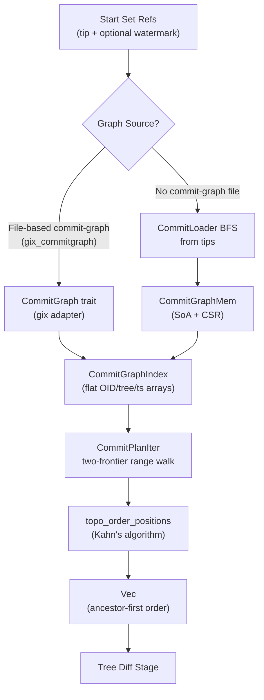

# Commit Graph Traversal

This document describes the commit walking subsystem: how the scanner
discovers which commits to process, how commit history is represented
in memory, and what safety limits prevent runaway traversal.

## Flow Diagram

## Key Types

### Commit Walking (`commit_walk.rs`)

| Type | Kind | Description | Location |
|------|------|-------------|----------|
| `CommitGraph` | trait | Commit-graph access interface: lookup, generation, parents, OIDs, timestamps. Implementations must provide deterministic parent iteration. | `commit_walk.rs` |
| `PlannedCommit` | struct | Output of the walk: a `Position` and `snapshot_root` flag indicating whether to diff against the empty tree. | `commit_walk.rs` |
| `ParentScratch` | struct | Reusable scratch buffer for parent collection. Stores up to 16 parents inline (no allocation); spills to `Vec` for octopus merges. | `commit_walk.rs` |
| `VisitedCommitBitset` | struct | 1-bit-per-commit bitset for cross-ref emission dedup. `test_and_set` returns whether the bit was newly marked. | `commit_walk.rs` |
| `CommitPlanIter` | struct | Iterator over `(watermark, tip]` commits for all refs. Uses two generation-ordered heaps and per-ref scratch. Deduplicates across refs via `VisitedCommitBitset`. | `commit_walk.rs` |
| `CommitWalkLimits` | struct | Hard caps for traversal: max graph size, heap entries, parents per commit, new-ref skip checks. 16 bytes, compile-time validated. | `commit_walk_limits.rs` |

### Commit Loading (`commit_loader.rs`)

| Type | Kind | Description | Location |
|------|------|-------------|----------|
| `LoadedCommit` | struct | Commit with OID, tree OID, parent OIDs (in object order), and committer timestamp. Produced by BFS loading. | `commit_loader.rs` |
| `CommitLoadLimits` | struct | Bounds for the loader: max commits, max object bytes, max parents, max delta depth, shallow file/root limits. | `commit_loader.rs` |
| `CommitLoadError` | enum | Fail-closed error type covering I/O, MIDX, pack, parse, delta, loose-object, and limit-violation failures. | `commit_loader.rs` |
| `ShallowBoundaryRoots` | enum | Compact shallow-root set (`Empty` / `One` / `ManySorted`) used to stop BFS at shallow boundaries. Binary-search lookup for `ManySorted`. | `commit_loader.rs` |

### In-Memory Graph (`commit_graph_mem.rs`)

| Type | Kind | Description | Location |
|------|------|-------------|----------|
| `CommitGraphMem` | struct | In-memory commit graph with SoA layout (OIDs, trees, timestamps, generations) and CSR parent encoding. Implements `CommitGraph` trait. | `commit_graph_mem.rs` |

### Graph Index (`commit_graph.rs`)

| Type | Kind | Description | Location |
|------|------|-------------|----------|
| `CommitGraphIndex` | struct | Cache-friendly index: flat arrays of commit OIDs, root tree OIDs, and timestamps copied from the commit graph. Optional per-commit identity IDs. O(1) positional lookups. | `commit_graph.rs` |

### Commit Parsing (`commit_parse.rs`)

| Type | Kind | Description | Location |
|------|------|-------------|----------|
| `ParsedCommit` | struct | Parsed commit fields: tree OID, parent OIDs, committer timestamp. | `commit_parse.rs` |
| `CommitParseLimits` | struct | Max commit bytes (default 1 MiB) and max parents (default 256). | `commit_parse.rs` |
| `CommitParseError` | enum | Parse errors: corrupt data, too large, too many parents, invalid hex, invalid OID length, invalid timestamp. | `commit_parse.rs` |

### Walk Limits (`commit_walk_limits.rs`)

| Type | Kind | Description | Location |
|------|------|-------------|----------|
| `CommitWalkLimits` | struct | Four `u32` fields (16 bytes total) with `DEFAULT` and `RESTRICTIVE` const presets. Both `validate()` (panicking) and `try_validate()` (fallible) entry points. Compile-time validated via `const _: ()`. | `commit_walk_limits.rs` |

### Error Types (`errors.rs`)

| Variant | Description | Location |
|---------|-------------|----------|
| `CommitGraphOpen` | Commit-graph file could not be opened or parsed. | `errors.rs` |
| `InvalidOidLength` | OID byte length does not match object format. | `errors.rs` |
| `CommitGraphTooLarge` | Graph exceeds `max_commits_in_graph`. | `errors.rs` |
| `TipNotFound` | Tip commit OID missing from commit-graph. | `errors.rs` |
| `HeapLimitExceeded` | Combined heap frontier size exceeds `max_heap_entries`. | `errors.rs` |
| `ParentDecodeFailed` | Corrupt parent list entry in commit-graph. | `errors.rs` |
| `TooManyParents` | Commit exceeds `max_parents_per_commit`. | `errors.rs` |
| `TopoSortCycle` | Kahn's algorithm could not drain all commits. | `errors.rs` |
| `IdentityLengthMismatch` | Identity-ID vector length does not match commit count. | `errors.rs` |

## Walking Algorithm

The range walk implements `git rev-list <tip> ^<watermark>` semantics:
it yields exactly the commits in `reachable(tip) - reachable(watermark)`.

### Two-Frontier Generation-Ordered Walk

`CommitPlanIter` (`commit_walk.rs`) maintains two max-heaps ordered by
`(generation, position)`:

1. **Interesting frontier** -- seeded with the tip commit. Expanded by
   following parent edges.
2. **Uninteresting frontier** -- seeded with the watermark commit (if valid
   ancestor of tip). Expanded similarly.

Each iteration:

1. Peek the highest-generation interesting commit (`top_i`).
2. Call `advance_uninteresting(top_i.gen)` (`commit_walk.rs`) to drain
   the uninteresting heap down to that generation, marking all encountered
   commits as `MARK_U`.
3. Pop `top_i`. If marked `MARK_U`, skip it. Otherwise, expand its parents
   into the interesting frontier.
4. Check the global `VisitedCommitBitset` to deduplicate across refs. Emit
   only if newly marked.

This produces a roughly reverse-topological order (highest generation first)
within each ref. Across refs, output follows the deterministic start-set
ordering.

### Per-Ref State Flags

`RefScratch` (`commit_walk.rs`) stores one byte per commit with three
bit flags:

| Flag | Value | Meaning |
|------|-------|---------|
| `SEEN_I` | `0x01` | Seen in the interesting (tip) walk. |
| `SEEN_U` | `0x02` | Seen in the uninteresting (watermark) walk. |
| `MARK_U` | `0x04` | Known reachable from watermark; excluded from output. |

Between refs, only the touched positions are cleared via the `touched` list
-- O(touched) instead of O(N).

### New-Ref Skip Optimization

When a ref has no watermark (new ref), the walker checks whether its tip is
an ancestor of another ref's watermark (`commit_walk.rs`). If so, the
entire history was already scanned in a prior run and the ref is skipped.
The number of ancestry checks is bounded by `max_new_ref_skip_checks`
(default 1024) to avoid O(refs^2) cost.

### Ancestry Check

`is_ancestor` (`commit_walk.rs`) performs a DFS from `descendant`
looking for `ancestor`, using generation numbers for pruning. If
`gen(ancestor) > gen(descendant)`, the answer is immediately `false`.
Otherwise, the DFS skips any commit with `gen < gen(ancestor)`.

### Topological Ordering

`topo_order_positions` (`commit_walk.rs`) applies Kahn's algorithm over
the scanned subgraph to produce ancestor-first ordering:

1. Build in-degree and adjacency using dense arrays sized to the full
   commit-graph (avoids hash maps).
2. Seed a `PosQueue` ring buffer with zero-in-degree commits.
3. Drain the queue, decrementing children's in-degree and enqueuing when
   zero.
4. If `ordered.len() != total`, return `TopoSortCycle`.

The public entry point `introduced_by_plan` (`commit_walk.rs`) combines
`CommitPlanIter` with `topo_order_positions` to produce the final
`Vec<PlannedCommit>` in ancestor-first order.

## Graph Representation

### Two Sources

The commit graph can be sourced from either:

1. **File-based commit-graph** (`gix_commitgraph`) -- when the repository
   has pre-built `.git/objects/info/commit-graph` files. Accessed through
   the `CommitGraph` trait.
2. **In-memory graph** (`CommitGraphMem`) -- built by loading commits via
   BFS when no file-based graph is available.

Both implement the `CommitGraph` trait, so the walker is agnostic to the
source.

### CommitGraphMem Layout

`CommitGraphMem` (`commit_graph_mem.rs`) uses Struct-of-Arrays (SoA) for
cache-friendly sequential access:

| Array | Layout | Size per commit |
|-------|--------|-----------------|
| `commit_oids` | Flat byte array, N * `oid_len` | 20 B (SHA-1) or 32 B (SHA-256) |
| `root_trees` | Flat byte array, N * `oid_len` | 20 B or 32 B |
| `timestamps` | `Vec<u64>` | 8 B |
| `generations` | `Vec<u32>` | 4 B |
| `parent_start` | `Vec<u32>`, N+1 entries (CSR prefix sums) | 4 B |
| `parents` | `Vec<u32>`, flattened parent positions | variable |
| `identity_ids` | Optional `Vec<CommitIdentityIds>` | 16 B (when enabled) |

**CSR parent encoding**: parent positions for commit at position `i` live at
`parents[parent_start[i]..parent_start[i+1]]`. This avoids one `Vec`
allocation per commit.

**Deterministic ordering**: commits are sorted by `(generation ASC, oid ASC)`
before position assignment. Input order does not affect positions.

### Generation Numbers

Computed via Kahn's algorithm during `CommitGraphMem::build`
(`commit_graph_mem.rs`):

- `gen(root) = 1`
- `gen(commit) = 1 + max(gen(parent))` for in-set parents
- Parents outside the loaded set are treated as generation 0 (external roots)
- Cycles: unresolved commits are force-assigned `gen = 1`; the count is
   exposed via `unresolved_commits()` (`commit_graph_mem.rs`)

### CommitGraphIndex

`CommitGraphIndex` (`commit_graph.rs`) copies OIDs, tree OIDs, and
timestamps into flat arrays so the backing graph can be dropped. All reads
are O(1) positional lookups. Optionally carries per-commit identity IDs
when identity enrichment is enabled.

## Commit Loading (BFS)

`load_commits_from_tips` (`commit_loader.rs`) is the canonical loading
entry point:

1. Seed a `VecDeque` frontier with tip OIDs.
2. Pop OID from frontier.
3. Resolve via MIDX (pack lookup) or fall back to loose-object directories.
4. Inflate and parse the commit object.
5. Collect parents; enqueue those not yet visited or queued.
6. Commits in the shallow boundary set are loaded but their parents are not
   enqueued (preserving local history while stopping at shallow cuts).
7. Repeat until frontier empty or limits exceeded.

**Determinism**: BFS order is deterministic given stable input tip order,
stable parent ordering in commit objects, and stable pack contents.

**Frontier management**: two sets (`visited`, `queued`) prevent duplicate
frontier entries in merge-heavy DAGs while preserving first-seen ordering.

**Pack access**: pack files are memory-mapped lazily on first access and
cached per pack id for the duration of the load. Delta chains are resolved
recursively, bounded by `max_delta_depth` (default 64).

**Identity enrichment**: `load_commits_with_identities`
(`commit_loader.rs`) performs the same BFS but also extracts
author/committer identity from raw commit bytes and interns them.

## Commit Parsing

`parse_commit` (`commit_parse.rs`) extracts three fields from a raw
commit object:

1. **Tree OID** -- from the `tree <hex>\n` line.
2. **Parent OIDs** -- from zero or more `parent <hex>\n` lines.
3. **Committer timestamp** -- extracted by scanning the `committer` line
   backwards for the second-to-last space-delimited field, tolerating
   spaces in names/emails.

Parsing stops after the `committer` line; `gpgsig` headers and the commit
message are not parsed. Complexity is O(header size), not O(commit size).

**Limits enforced during parsing**:

| Limit | Default | Error |
|-------|---------|-------|
| Max commit object bytes | 1 MiB | `CommitParseError::TooLarge` |
| Max parents | 256 | `CommitParseError::TooManyParents` |
| Timestamp range | 0 to year 3000 | `CommitParseError::InvalidTimestamp` |

The timestamp parser (`commit_parse.rs`) uses checked arithmetic to
detect u64 overflow, preventing wraparound attacks that could bypass range
checks.

## Limits and Safety

### CommitWalkLimits

| Field | Default | Restrictive | Purpose |
|-------|---------|-------------|---------|
| `max_commits_in_graph` | 10,000,000 | 200,000 | Bounds bitset and scratch array sizes |
| `max_heap_entries` | 2,000,000 | 50,000 | Live frontier size cap (interesting + uninteresting) |
| `max_parents_per_commit` | 128 | 32 | Guards against octopus/corrupt merges. Capped at 255 (pipeline stores `parent_idx` as `u8`). |
| `max_new_ref_skip_checks` | 1,024 | 128 | Caps ancestry checks for new-ref skip optimization |

Validation constraints (`commit_walk_limits.rs`):

- All fields must be > 0
- `max_commits_in_graph <= 100,000,000`
- `max_heap_entries <= max_commits_in_graph`
- `max_parents_per_commit <= 255`
- `max_new_ref_skip_checks <= 1,000,000`
- `DEFAULT` and `RESTRICTIVE` are validated at compile time via
   `const _: ()` assertions (`commit_walk_limits.rs`)

### CommitLoadLimits

| Field | Default | Purpose |
|-------|---------|---------|
| `max_commits` | 10,000,000 | Stop loading after this many commits |
| `max_commit_object_bytes` | 1 MiB | Decompressed commit size cap |
| `max_parents` | 256 | Per-commit parent count cap |
| `max_delta_depth` | 64 | Maximum delta chain depth |
| `max_shallow_file_bytes` | 8 MiB | Reject oversized `.git/shallow` files |
| `max_shallow_roots` | 256 | Reject excessive unique shallow roots |

### Cycle Detection

Cycles are detected at two levels:

1. **Graph construction** (`CommitGraphMem::build`): Kahn's algorithm
   exposes unresolved commits. These are force-assigned generation 1 and
   counted in `unresolved_commits`. This is a soft recovery -- the graph
   remains usable.
2. **Topological ordering** (`topo_order_positions`): if Kahn's algorithm
   fails to drain all commits in the scanned subgraph, it returns
   `CommitPlanError::TopoSortCycle`. This is a hard error.

### Memory Model

| Structure | Cost per commit | Notes |
|-----------|-----------------|-------|
| `VisitedCommitBitset` | 1 bit | Cross-ref dedup; allocated once for the full graph |
| `RefScratch` | 1 byte | Per-ref flags; cleared via touched list between refs |
| Heap frontiers | Variable | Bounded by `max_heap_entries` |
| `ParentScratch` | 0 (inline <=16) | Heap spill only for >16 parents |
| `CommitGraphMem` | ~56-72 bytes | SoA arrays + CSR edges |
| `CommitGraphIndex` | ~48-68 bytes | Flat OID/tree/timestamp copies |

## Source of Truth

| Concept | Source File |
|---------|-------------|
| `CommitGraph` trait | `commit_walk.rs` |
| Two-frontier range walk | `commit_walk.rs` |
| `advance_uninteresting` | `commit_walk.rs` |
| `is_ancestor` (DFS + generation pruning) | `commit_walk.rs` |
| `introduced_by_plan` | `commit_walk.rs` |
| `topo_order_positions` (Kahn's) | `commit_walk.rs` |
| `PlannedCommit` | `commit_walk.rs` |
| `ParentScratch` | `commit_walk.rs` |
| `VisitedCommitBitset` | `commit_walk.rs` |
| `CommitPlanIter` | `commit_walk.rs` |
| `RefScratch` flags | `commit_walk.rs` |
| BFS commit loading | `commit_loader.rs` |
| `CommitLoader` (internal) | `commit_loader.rs` |
| `LoadedCommit` | `commit_loader.rs` |
| `CommitLoadLimits` | `commit_loader.rs` |
| `ShallowBoundaryRoots` | `commit_loader.rs` |
| Shallow file loading | `commit_loader.rs` |
| Loose object loading | `commit_loader.rs` |
| Delta resolution (recursive) | `commit_loader.rs` |
| Identity enrichment | `commit_loader.rs` |
| `CommitGraphMem` (SoA + CSR) | `commit_graph_mem.rs` |
| `CommitGraphMem::build` (generation propagation) | `commit_graph_mem.rs` |
| `CommitGraphMem::build_with_identities` | `commit_graph_mem.rs` |
| `CommitGraph` impl for `CommitGraphMem` | `commit_graph_mem.rs` |
| `CommitGraphIndex` | `commit_graph.rs` |
| `parse_commit` | `commit_parse.rs` |
| `CommitParseLimits` | `commit_parse.rs` |
| `CommitParseError` | `commit_parse.rs` |
| Timestamp parsing (checked arithmetic) | `commit_parse.rs` |
| `CommitWalkLimits` | `commit_walk_limits.rs` |
| `CommitWalkLimits::DEFAULT` | `commit_walk_limits.rs` |
| `CommitWalkLimits::RESTRICTIVE` | `commit_walk_limits.rs` |
| `CommitWalkLimits::validate` | `commit_walk_limits.rs` |
| `CommitWalkLimits::try_validate` | `commit_walk_limits.rs` |
| Compile-time validation | `commit_walk_limits.rs` |
| `CommitPlanError` | `errors.rs` |

## Related Docs

- `docs/scanner-git/git-scanning.md` -- end-to-end pipeline overview
- `docs/scanner-git/git-pack-execution.md` -- pack decode stage
