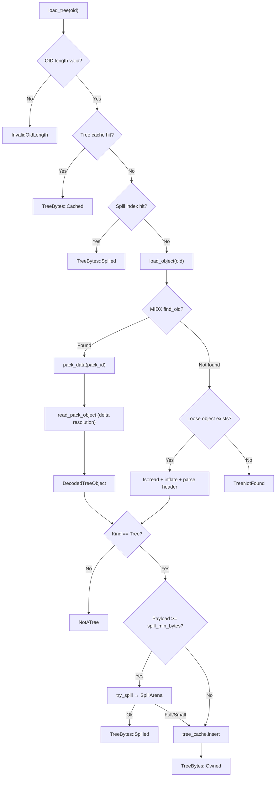

# Git Object Store

This document describes the object storage layer used by the Git scanner for
tree loading. It covers the object resolution pipeline, caching hierarchy,
spill arena, and the OID identity and indexing types.

## Overview

The object store is a pack/loose-backed tree loader that resolves Git tree
objects by OID and returns raw decompressed payloads (without the
`tree <size>\0` header). It exists to serve the tree diff walker with
minimal allocations and bounded memory usage. The resolution order is:

1. Tree cache (in-memory, set-associative, CLOCK eviction)
2. Spill index (open-addressed hash table over mmaped spill file)
3. MIDX pack lookup (O(log N) fanout-bucketed binary search + delta resolution)
4. Loose object fallback (`objects/<2-hex>/<remaining-hex>`)

Each `ObjectStore` instance is worker-local (`&mut self` API) and not shared
across threads. Multiple stores can share an immutable `ObjectStoreLayout`
to avoid repeating MIDX/pack/loose discovery per worker.

## Key Types

### Object Identity

| Type | Location | Description |
|------|----------|-------------|
| `ObjectFormat` | `object_id.rs:20` | Enum: `Sha1` (20 bytes) or `Sha256` (32 bytes). `repr(u8)`, 1 byte. |
| `OidBytes` | `object_id.rs:59` | Fixed-size `repr(C)` storage for SHA-1/SHA-256 OIDs. 33 bytes (`len: u8` + `bytes: [u8; 32]`). Zero-padded tail. Lexicographic ordering on `bytes[0..len]`. |

### Object Store

| Type | Location | Description |
|------|----------|-------------|
| `ObjectStore<'a>` | `object_store.rs:516` | Primary object loader. Borrows MIDX bytes, lazily mmaps pack files, owns tree cache, delta cache, spill arena, and decode scratch buffers. |
| `ObjectStoreLayout<'a>` | `object_store.rs:453` | Immutable repo layout (MIDX view, resolved pack paths, loose dirs). Built once, shared across per-worker stores. |
| `TreeSource` (trait) | `object_store.rs:217` | Abstraction for loading raw tree payloads by OID. Single method: `load_tree(&mut self, oid: &OidBytes) -> Result<TreeBytes, TreeDiffError>`. |
| `TreeBytes` | `object_store.rs:238` | Return type from `TreeSource::load_tree`. Variants: `Cached(TreeCacheHandle)`, `Owned(Vec<u8>)`, `Spilled(SpillSlice)`. |

### Caching

| Type | Location | Description |
|------|----------|-------------|
| `TreeCache` | `tree_cache.rs:70` | Set-associative cache for tree payloads, keyed by `OidBytes`. CLOCK eviction. Fixed-size slots in a pre-allocated arena. |
| `TreeCacheHandle` | `tree_cache.rs:87` | Pinned handle to cached tree bytes. Pin count prevents eviction while live. |
| `TreeDeltaCache` | `tree_delta_cache.rs:99` | Set-associative cache for delta base bytes, keyed by `(pack_id: u16, offset: u64)`. CLOCK eviction. |
| `TreeDeltaCacheHandle` | `tree_delta_cache.rs:119` | Pinned handle carrying base bytes, `ObjectKind`, and `chain_len`. |

### Spill Arena

| Type | Location | Description |
|------|----------|-------------|
| `SpillArena` | `spill_arena.rs:130` | Append-only mmaped file for oversized tree payloads. Dual-mapping: `MmapMut` writer + `Arc<Mmap>` reader. Single-writer. |
| `SpillSlice` | `spill_arena.rs:42` | Read handle into the spill arena. Holds `Arc<Mmap>` so bytes outlive the arena. |
| `SpillIndex` | `object_store.rs:141` | Fixed-size open-addressed hash table for spilled payload lookup. Linear probing, no deletions. Best-effort; disables when full. |
| `SpillIndexEntry` | `object_store.rs:95` | Slot storing OID key (up to 32 bytes) + offset/len into the spill file. `key_len == 0` marks empty. |

### OID Indexing

| Type | Location | Description |
|------|----------|-------------|
| `OidIndex` | `oid_index.rs:52` | Fixed-capacity open-addressed hash table mapping OID -> MIDX index. 70% load factor, power-of-two capacity. Single-byte hash tag for fast rejection. |
| `MidxView<'a>` | `midx.rs:58` | Zero-copy view over a multi-pack index. Provides `find_oid` (O(log N)) and `find_oid_sorted` (cursor-based streaming). |
| `MidxCursor` | `midx.rs:73` | Cursor for streaming sorted OID lookups over `MidxView`. Advances monotonically within fanout buckets. |

### Internal Types

| Type | Location | Description |
|------|----------|-------------|
| `TreeDecodeBufs` | `object_store.rs:313` | Reusable scratch buffers for delta resolution: `inflate_buf`, `result_buf`, `base_buf`, `Decompress` handle, and pooled delta-frame stacks. |
| `DetachedDecodeScratch` | `object_store.rs:327` | Owned scratch state detached during recursive REF-delta loads to prevent aliasing of outer decode buffers. |
| `TreeDeltaFrame` | `object_store.rs:409` | One frame of a pending delta chain: pack offset, compressed data start, expected decompressed size. |
| `DecodedTreeObject` | `object_store.rs:429` | Fully decoded pack object with `ObjectKind`, bytes, and `chain_len`. |
| `LoadedObject` | `object_store.rs:439` | Result of pack/loose lookup, adding `ObjectSource` (Pack or Loose) to decoded data. |
| `ObjectSource` | `object_store.rs:420` | Enum: `Pack` or `Loose`. Used for perf accounting. |

## Architecture

### ObjectFormat Abstraction

`ObjectFormat` (`object_id.rs:20`) determines the OID byte length for the
repository. SHA-1 uses 20-byte OIDs; SHA-256 uses 32-byte OIDs. The format
is set once at repo open and propagated through `RepoJobState` to all
components. `OidBytes` stores both formats in a single 33-byte `repr(C)`
struct, avoiding heap allocation and enabling pass-by-value.

### ObjectStoreLayout

`ObjectStoreLayout::from_repo` (`object_store.rs:465`) performs the
expensive one-time work:

1. Parse and validate the MIDX from `repo.mmaps.midx`
2. Collect pack directories (including alternates)
3. List on-disk pack files and verify MIDX completeness
4. Resolve pack paths from MIDX pack names
5. Collect loose object directories

This layout is immutable and can be shared across multiple per-worker
`ObjectStore` instances via `ObjectStore::open_with_layout`
(`object_store.rs:586`).

### ObjectStore Initialization

`ObjectStore::open` (`object_store.rs:555`) builds a store from repo state:

- Parses MIDX and resolves pack paths (via layout)
- Creates a `TreeCache` sized by `TreeDiffLimits::max_tree_cache_bytes`
- Creates a `TreeDeltaCache` sized by `TreeDiffLimits::max_tree_delta_cache_bytes`
- Creates a `SpillArena` with capacity `TreeDiffLimits::max_tree_spill_bytes`
- Computes spill index capacity from spill budget / spill threshold
- Initializes `TreeDecodeBufs` for zero-alloc delta resolution
- Pre-allocates `pack_cache` slots (one per pack file, initially `None`)

## Data Flow

### OID to Resolved Tree Bytes

### Delta Resolution (Two-Phase Iterative)

Delta chain resolution in `read_pack_object_impl` (`object_store.rs:764`)
uses an iterative approach to avoid recursion and per-hop allocations:

**Phase 1 -- Walk Forward** (`object_store.rs:789`):
Follows OFS delta base offsets without inflating payloads, pushing one
`TreeDeltaFrame` per hop onto a pooled stack. The walk terminates when:
- A non-delta root object is reached (inflate directly into scratch)
- A delta cache hit supplies the base bytes
- A REF delta requires cross-pack base resolution via
  `load_object_with_isolated_decode_scratch` (`object_store.rs:685`)

**Phase 2 -- Unwind Backward** (`object_store.rs:945`):
Iterates the frame stack in reverse. For each frame:
1. Inflate delta payload into `inflate_buf`
2. `apply_delta(base_buf, inflate_buf, result_buf, max_object_bytes)`
3. For non-final frames, `swap(base_buf, result_buf)` (ping-pong)
4. Offer intermediate result to the delta cache

The final frame leaves output in `result_buf`, which is moved to the caller.

## Memory Management

### Buffer Strategies

**TreeDecodeBufs** (`object_store.rs:313`): Persistent scratch buffers
reused across `read_pack_object` calls. The `Decompress` handle is reset
between inflations; buffers retain their capacity across calls. A delta
stack pool provides independent stacks for recursive REF-delta loads.

**Detached scratch** (`object_store.rs:374`): When a REF delta requires
cross-pack base loading, `detach_recursive_scratch` moves all decode buffers
out of `TreeDecodeBufs` into a `DetachedDecodeScratch`. The inner load
operates on fresh scratch. After resolution, `restore_recursive_scratch`
puts the original buffers back. This prevents aliasing between nested
decode operations.

**Ping-pong protocol** (`object_store.rs:304`): During unwind,
`base_buf` and `result_buf` alternate roles via `std::mem::swap`. The
result of frame N becomes the base for frame N+1 without copying.

### Cache Hierarchy

| Cache | Key | Eviction | Budget Default | Source |
|-------|-----|----------|---------------|--------|
| `TreeCache` | `OidBytes` | CLOCK | 64 MB | `tree_diff_limits.rs:57` |
| `TreeDeltaCache` | `(pack_id, offset)` | CLOCK | 128 MB | `tree_diff_limits.rs:66` |
| `SpillIndex` | `OidBytes` | None (append-only) | Derived from spill budget | `object_store.rs:141` |

Both caches are set-associative with fixed-size slots and pre-allocated
arenas. Payloads larger than a slot are silently not cached. Cache handles
pin the underlying slot, preventing CLOCK eviction while the handle is live.

### Spill Arena Lifecycle

Large tree payloads (>= `spill_min_bytes`, which equals
`max_tree_cache_bytes`) are spilled to a preallocated mmaped file rather
than kept in RAM. The spill flow in `try_spill` (`object_store.rs:1130`):

1. Check `spill_exhausted` and size threshold -- skip if undersized or arena full
2. `SpillArena::append(bytes)` -- sequential write via `MmapMut`
3. If append succeeds, attempt `SpillIndex::insert(oid, offset, len)`
4. If the index is full, set `spill_index_exhausted` -- future spills are
   still appended but not indexed (fallback to pack/loose re-reads)
5. If the arena is full (`OutOfSpace`), set `spill_exhausted` -- no more spills

The spill arena uses dual mmap mappings: a `MmapMut` writer for appends
and an `Arc<Mmap>` reader shared across all `SpillSlice` handles. Returned
`SpillSlice` values remain valid even after the arena is dropped.

### Pack File Caching

Pack files are lazily mmaped on first access and cached in `pack_cache`
(`object_store.rs:521`). Each entry stores `(BytesView, PackHeader)` so
the pack header is validated once and reused across all delta resolution
hops within the same pack.

## Constants

| Constant | Value | Location | Purpose |
|----------|-------|----------|---------|
| `MAX_ENTRY_HEADER_BYTES` | 64 | `object_store.rs:79` | Maximum bytes to parse for a pack entry header |
| `MAX_DELTA_DEPTH` | 64 | `object_store.rs:81` | Maximum delta chain depth before error |
| `LOOSE_HEADER_MAX_BYTES` | 64 | `object_store.rs:83` | Safety allowance for loose object header parsing |
| `MIN_SPILL_INDEX_ENTRIES` | 64 | `object_store.rs:85` | Minimum spill index capacity (power of two) |
| `MAX_SPILL_INDEX_ENTRIES` | 1,048,576 | `object_store.rs:87` | Maximum spill index capacity (power of two) |
| `NONE_U32` | `u32::MAX` | `oid_index.rs:21` | Sentinel for empty OID index slots |
| `LOAD_FACTOR_NUM / DEN` | 7 / 10 | `oid_index.rs:23-25` | OID index load factor (0.7) |
| `OidBytes::MAX_LEN` | 32 | `object_id.rs:66` | Maximum OID byte length (SHA-256) |
| `OidBytes::SHA1_LEN` | 20 | `object_id.rs:68` | SHA-1 OID length |
| `OidBytes::SHA256_LEN` | 32 | `object_id.rs:70` | SHA-256 OID length |

## Hashing Strategies

Two distinct OID hashing strategies exist across the codebase, each tuned
for its use case:

**SpillIndex / `repo_paths::hash_oid`** (`repo_paths.rs:194`): Reads the
first 8 OID bytes as little-endian `u64`. No mixing. Sufficient because
OIDs are cryptographic hashes with uniformly distributed bytes, and the
spill index is a simple linear-probing table.

**OidIndex / `oid_index::hash_oid`** (`oid_index.rs:159`): XORs head and
tail 8-byte words with a rotate, folds in the length, then applies a
`mix64` finalizer (Stafford variant). The single-byte tag (`hash >> 56`)
enables fast rejection without full-key comparison on misses.

## Error Semantics

| Error Variant | Trigger |
|---------------|---------|
| `TreeDiffError::TreeNotFound` | OID not in MIDX and not in any loose directory |
| `TreeDiffError::NotATree` | OID resolves but object kind is not `Tree` |
| `TreeDiffError::CorruptTree` | Loose object has malformed header (missing terminator, kind, size, or mismatch) |
| `TreeDiffError::InvalidOidLength` | OID length does not match configured `ObjectFormat` |
| `TreeDiffError::ObjectStoreError` | MIDX malformed, pack open/mmap failure, delta chain too deep, inflate failure, size overflow/cap exceeded |

## Source of Truth

| Concept | File | Line Range |
|---------|------|------------|
| Object format enum | `object_id.rs` | 20-26 |
| OID byte storage | `object_id.rs` | 59-62 |
| OID constructors and accessors | `object_id.rs` | 64-181 |
| TreeSource trait | `object_store.rs` | 217-234 |
| TreeBytes enum | `object_store.rs` | 238-294 |
| TreeDecodeBufs scratch | `object_store.rs` | 313-404 |
| TreeDeltaFrame | `object_store.rs` | 409-416 |
| ObjectStoreLayout | `object_store.rs` | 453-501 |
| ObjectStore struct | `object_store.rs` | 516-536 |
| ObjectStore::open | `object_store.rs` | 555-616 |
| load_tree (TreeSource impl) | `object_store.rs` | 1168-1215 |
| load_object_from_pack | `object_store.rs` | 699-721 |
| read_pack_object_impl (delta resolution) | `object_store.rs` | 764-1033 |
| load_object_from_loose | `object_store.rs` | 1035-1068 |
| Pack file caching | `object_store.rs` | 1077-1121 |
| Spill logic (try_spill) | `object_store.rs` | 1130-1165 |
| SpillIndex | `object_store.rs` | 141-209 |
| SpillArena | `spill_arena.rs` | 130-136 |
| SpillSlice | `spill_arena.rs` | 42-74 |
| TreeCache | `tree_cache.rs` | 70-72 |
| TreeDeltaCache | `tree_delta_cache.rs` | 99-101 |
| OidIndex | `oid_index.rs` | 52-57 |
| MidxView | `midx.rs` | 58-67 |
| MidxView::find_oid | `midx.rs` | 331-361 |
| TreeDiffLimits | `tree_diff_limits.rs` | 31-95 |
| repo_paths::hash_oid | `repo_paths.rs` | 194-199 |
| oid_index::hash_oid | `oid_index.rs` | 159-166 |

## Related Docs

- `docs/scanner-git/git-scanning.md`
- `docs/scanner-git/git-pack-execution.md`
