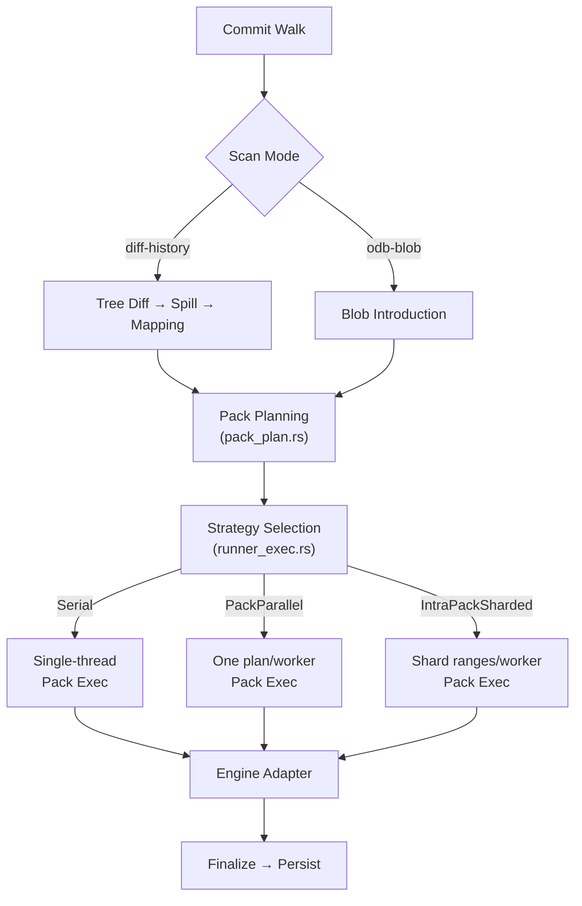
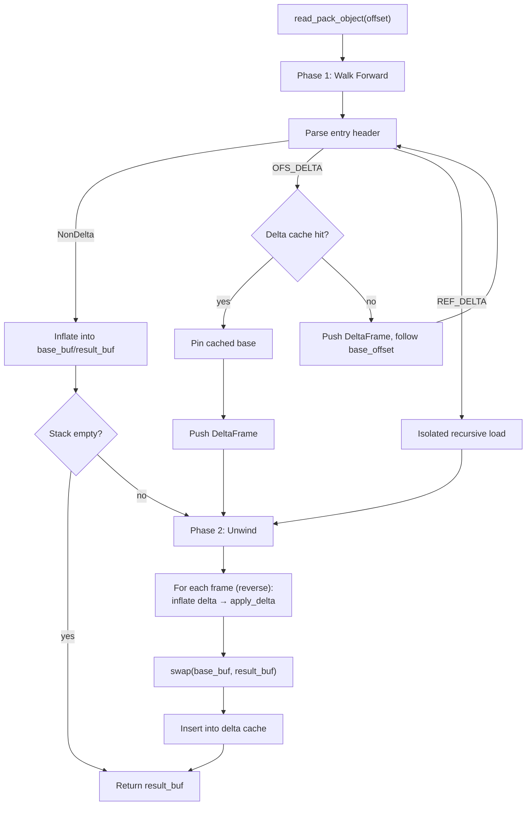
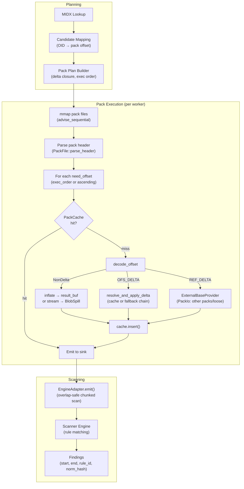

# Git Pack Execution Subsystem

This document describes the custom git packfile parsing and execution
subsystem, covering delta resolution, object decompression, blob
deduplication, and integration with the scanner engine for secret detection.

## Overview: Why Custom Pack Parsing

The scanner does not use libgit2 or gitoxide for packfile access. Custom
parsing is required for several reasons:

1. **Zero-allocation hot paths** — the executor reuses scratch buffers
   (`DecodeBufs`, `PackExecScratch`) across offsets so the per-object
   decode loop does not allocate. An optional `AllocGuard` enforces this
   in debug builds.
2. **Bounded memory** — every inflate, delta application, and cache
   insertion is capped by explicit size limits (`PackDecodeLimits`).
   Oversized objects spill to mmap-backed temp files (`BlobSpill`) rather
   than growing heap allocations.
3. **Parallel sharding** — a single large pack can be split across
   workers (`IntraPackSharded` strategy) with pre-computed candidate
   ranges and shared `PackPlanHotDeps`, which requires direct control
   over decode ordering and cache topology.
4. **Plan-driven execution** — the planner pre-resolves delta chains,
   records base offsets and external OIDs at planning time, and produces
   an `exec_order` permutation when forward delta dependencies exist. The
   executor uses this metadata to skip redundant header parsing on the
   fast path (`DeltaDepHot.has_header_meta()`).
5. **Spill-backed large objects** — blobs and delta payloads exceeding
   in-memory limits are streamed into mmap-backed spill files. The sink
   reads from the spill's `as_slice()` without holding the full object in
   resident memory.

## Architecture

Pack execution sits between pack planning and the engine adapter in the
overall git scanning pipeline:



### File Responsibilities

| File | Role |
|------|------|
| `pack_plan.rs` | Build per-pack decode plans with delta closure |
| `pack_plan_model.rs` | `PackPlan`, `DeltaDep`, `BaseLoc`, `CandidateAtOffset` data types |
| `pack_exec.rs` | Core decode loop, delta resolution, sink emission |
| `runner_exec.rs` | Scheduler integration, mmap management, strategy selection, loose scanning |
| `object_store.rs` | Tree/pack object abstraction with cache and spill |
| `blob_introducer.rs` | ODB-blob unique blob discovery walk |
| `pack_cache.rs` | Tiered set-associative CLOCK cache for decoded objects |
| `pack_inflate.rs` | Zlib inflate, entry header parsing, delta application primitives |
| `pack_decode.rs` | Bounded inflate wrappers with size caps |
| `pack_delta.rs` | Re-export of `apply_delta` with output cap enforcement |

## Git Packfile Format

A git packfile has the following binary layout:

```
┌─────────────────────────────────────────────┐
│  Header (12 bytes)                          │
│    "PACK" magic (4 bytes)                   │
│    Version (4 bytes, network order)         │
│    Object count (4 bytes, network order)    │
├─────────────────────────────────────────────┤
│  Object entries (variable length, repeated) │
│    Entry header (varint-encoded type+size)  │
│    Zlib-compressed payload                  │
├─────────────────────────────────────────────┤
│  Pack checksum (20 or 32 bytes)             │
└─────────────────────────────────────────────┘
```

### Entry Types

Each entry header encodes a 3-bit type tag and a variable-length size:

| Type | Tag | Description |
|------|-----|-------------|
| `Commit` | 1 | Commit object |
| `Tree` | 2 | Tree object |
| `Blob` | 3 | Blob object |
| `Tag` | 4 | Tag object |
| `OFS_DELTA` | 6 | Delta against an object at a negative byte offset in the same pack |
| `REF_DELTA` | 7 | Delta against an object identified by OID (may be in another pack) |

Non-delta entries contain zlib-compressed object data. Delta entries contain
a zlib-compressed delta instruction stream that reconstructs the target
object from a base object.

The entry header is parsed by `PackFile::entry_header_at()` in
`pack_inflate.rs`. The maximum header size is bounded by
`PackDecodeLimits::max_header_bytes` (default: 64 bytes).

## Key Types

### PackPlan (`pack_plan_model.rs`)

The decode plan for a single pack file, produced by `pack_plan.rs`:

| Field | Type | Purpose |
|-------|------|---------|
| `pack_id` | `u16` | Index into the pack file list |
| `oid_len` | `u8` | OID byte length (20 for SHA-1, 32 for SHA-256) |
| `max_delta_depth` | `u8` | Maximum delta chain depth (default: 64) |
| `candidates` | `Vec<PackCandidate>` | All blob candidates in this pack |
| `candidate_offsets` | `Vec<CandidateAtOffset>` | Sorted by offset, maps offsets to candidate indices |
| `need_offsets` | `Vec<u64>` | Sorted unique offsets that must be decoded (candidates + delta bases) |
| `delta_deps` | `Vec<DeltaDep>` | Delta dependency records with base location |
| `delta_dep_index` | `Vec<u32>` | Dense index: `need_offsets[i]` → `delta_deps[j]` or `NONE_U32` |
| `exec_order` | `Option<Vec<u32>>` | Permutation of `need_offsets` indices for out-of-order execution |

### PackExecScratch (`pack_exec.rs`)

Reusable scratch state for pack execution, amortizing allocation across plans:

| Field | Type | Purpose |
|-------|------|---------|
| `bufs` | `DecodeBufs` | Inflate, result, base buffers + delta frame stack |
| `delta_deps_hot` | `Vec<DeltaDepHot>` | Cache-friendly projection of delta deps (rebuilt per plan) |
| `external_base_oids` | `Vec<OidBytes>` | Interned external REF delta OIDs |
| `candidate_ranges` | `Vec<CandidateRange>` | Per-need-index candidate index ranges (out-of-order only) |

### DecodeBufs (`pack_exec.rs`)

Three-buffer rotation scheme for zero-allocation decoding:

| Buffer | Purpose |
|--------|---------|
| `inflate_buf` | Receives raw zlib-inflated delta payloads |
| `result_buf` | Holds the final decoded object bytes |
| `base_buf` | Holds base object bytes during fallback delta chain resolution |
| `delta_stack` | Collects `DeltaFrame`s during fallback chain walks |
| `de` | Owned `flate2::Decompress` instance (reset between inflations) |

### DecodeEnv (`pack_exec.rs`)

Immutable execution environment bundled into a single reference to reduce
register pressure on the hot path:

| Field | Purpose |
|-------|---------|
| `pack` | Parsed `PackFile` reference |
| `limits` | `PackDecodeLimits` (max object/delta/header bytes) |
| `spill_dir` | Directory for spill-backed temp files |
| `max_delta_depth` | Chain depth bound (from plan) |
| `need_offsets` | Sorted decode offsets |
| `delta_deps` | Hot delta dependency table |
| `external_base_oids` | Interned external OIDs |
| `delta_dep_index` | Dense index into `delta_deps` |

### ObjectStore (`object_store.rs`)

Worker-local object loader for tree traversal (`&mut self` API):

| Field | Purpose |
|-------|---------|
| `midx` | Borrowed MIDX view for pack lookup |
| `pack_paths` | `Arc<[PathBuf]>` — resolved pack file paths |
| `pack_cache` | `Vec<Option<(BytesView, PackHeader)>>` — lazily mapped packs |
| `loose_dirs` | `Arc<[PathBuf]>` — loose object directories |
| `tree_cache` | `TreeCache` — set-associative cache for tree payloads |
| `tree_delta_cache` | `TreeDeltaCache` — cache for decompressed delta bases |
| `decode_bufs` | `TreeDecodeBufs` — reusable scratch with buffer ping-pong |
| `spill` | `Option<SpillArena>` — mmap-backed large tree payload store |
| `spill_index` | `SpillIndex` — open-addressed hash table for spilled payloads |

### ObjectStoreLayout (`object_store.rs`)

Immutable shared repository layout, built once and cloned per worker:

| Field | Purpose |
|-------|---------|
| `oid_len` | OID byte length |
| `midx` | Parsed MIDX view |
| `pack_paths` | Resolved pack file paths |
| `loose_dirs` | Loose object directories |

### BlobIntroducer (`blob_introducer.rs`)

Serial blob discovery walker:

| Field | Purpose |
|-------|---------|
| `seen` | `SeenSets` — MIDX-indexed bitsets for trees, blobs, and excluded blobs |
| `loose_seen` | `LooseOidSet` — open-addressing hash set for loose blob OIDs |
| `loose_excluded` | `LooseOidSet` — separate set for excluded loose blobs |
| `stack` | `Vec<TreeFrame>` — depth-first walk stack with tree cursors |
| `path_builder` | `PathBuilder` — incremental path assembly with push/pop |
| `tree_bytes_in_flight` | In-flight memory budget tracking |
| `scan_binary` | When true, skips extension-based nonscannable filter |

### SeenSets (`blob_introducer.rs`)

Three independent bitsets for MIDX-indexed deduplication:

| Bitset | Purpose |
|--------|---------|
| `trees` | Tracks visited tree objects to skip entire subtrees |
| `blobs` | Tracks emitted blob candidates (non-excluded) |
| `blobs_excluded` | Tracks blobs matched by path-exclusion policy |

Blobs and excluded blobs are tracked separately because the same blob OID
may appear under both excluded and non-excluded paths. Sharing a single
set would suppress legitimate non-excluded paths.

### PackCache (`pack_cache.rs`)

Tiered set-associative CLOCK cache for decoded pack objects:

| Tier | Slot Size | Budget Share | Purpose |
|------|-----------|-------------|---------|
| Small | ≤ 64 KiB | ~2/3 of capacity | Majority of objects |
| Large | ≤ 2 MiB | ~1/3 of capacity | Popular delta bases |

Both tiers are 4-way set-associative. Objects > 2 MiB are not cached.
Eviction is CLOCK by default, with an opt-in `dependency_clock` variant
(env var `SCANNER_RS_PACK_CACHE_EVICTION`).

### PackExecStrategy (`runner_exec.rs`)

Execution strategy selected by `select_pack_exec_strategy`:

| Variant | Condition | Description |
|---------|-----------|-------------|
| `Serial` | `workers ≤ 1`, no plans, or total need < 512 | Single-threaded |
| `PackParallel` | `plan_count ≥ workers` | One plan per worker |
| `IntraPackSharded` | Fewer plans than workers | Large plans split into index-range shards |

## Delta Resolution

### Overview

Git delta encoding stores objects as instructions to reconstruct a target
from a base object. Two delta types exist:

- **OFS_DELTA** — base object is at a known byte offset in the same pack.
- **REF_DELTA** — base object is identified by OID (may be in another pack
  or in loose storage).

### Resolution in ObjectStore (Tree Loading)

The `ObjectStore::read_pack_object` method uses a two-phase iterative
approach (`object_store.rs`):



**Phase 1 (walk forward):** Follows OFS delta base offsets through the
chain, collecting lightweight `TreeDeltaFrame` structs per hop without
inflating payloads. Terminates on a non-delta root, a delta cache hit,
or a cross-pack REF delta.

**Phase 2 (unwind backward):** Iterates the frame stack in reverse,
inflating each delta payload and applying it against the current base.
`base_buf` and `result_buf` alternate roles via `std::mem::swap`,
eliminating per-hop `Vec` allocations. Chain depth is bounded by
`MAX_DELTA_DEPTH` (64).

### Resolution in Pack Executor

The pack executor (`pack_exec.rs`) uses a similar but independently
optimized path through `decode_offset`:

1. **Planned-dep fast path** — when `delta_dep_index` maps the offset to
   a `DeltaDepHot` with persisted header metadata, the entry header parse
   is skipped entirely. Routes to either `resolve_external_and_apply_delta`
   (external REF) or `resolve_and_apply_delta` (in-pack OFS).

2. **Fallback header parse** — parses the raw entry header from pack bytes.
   Non-delta entries are inflated directly; OFS deltas delegate to
   `resolve_and_apply_delta`; REF deltas fall through to path 3.

3. **REF delta from header** — checks whether the planner resolved the REF
   to an in-pack OFS equivalent. If so, delegates to
   `resolve_and_apply_delta`. Otherwise calls the `ExternalBaseProvider`.

Fallback delta chain resolution (`decode_base_from_pack`) uses
`walk_delta_chain_to_root` to collect `DeltaFrame`s, then
`unwind_and_build_base` to apply them. Each frame is offered to the
`PackCache` after resolution.

## Blob Introduction

The blob introducer discovers unique blobs for ODB-blob scan mode by
walking commits in topological order.

### Serial Mode (`BlobIntroducer`)

For each commit in plan order (`blob_introducer.rs`):

1. Resolve the commit's root tree OID.
2. Check the MIDX `SeenSets.trees` bitmap — skip if already seen.
3. Push a `TreeFrame` onto the depth-first stack.
4. Iterate entries via `walk_stack`:
   - **Tree entries**: mark in `SeenSets.trees`, push subtree if new.
   - **Blob entries**: classify path (`classify_path`), check
     `SeenSets.blobs` or `LooseOidSet` for dedup, emit via `CandidateSink`.
   - **Excluded blobs**: tracked in `SeenSets.blobs_excluded` /
     `LooseOidSet` separately to avoid suppressing non-excluded paths.

Tree payloads are loaded via `TreeSource` (implemented by `ObjectStore`).
Small trees use `BufferedCursor` (full payload in memory); large trees
or spilled trees use `TreeStream` for incremental parsing.

### Parallel Mode (`introduce_parallel`)

When `blob_intro_workers > 1` (`blob_introducer.rs`):

1. Pre-partition the commit plan into `~4 × worker_count` chunks.
2. Spawn workers with `std::thread::scope`. Each worker has:
   - Its own `ObjectStore` with divided cache budgets.
   - Its own `PackCandidateCollector` and `LooseOidSet`.
   - A shared `AtomicSeenSets` for lock-free tree/blob dedup.
3. Workers claim chunks via `AtomicUsize::fetch_add` (work-stealing).
4. Post-merge: concatenate candidates, rebase path arena offsets,
   deduplicate loose candidates by OID with deterministic tie-breakers,
   re-validate against global caps.

**Attribution caveat:** In parallel mode, blob attribution context
(`commit_id`, path, flags) is race-winner based and not deterministic
across worker counts. The blob *set* is identical to serial mode.

## Object Store

The `ObjectStore` provides a unified abstraction over packed and loose
objects, used primarily for tree loading during blob introduction and
tree-diff walks.

### Lookup Order

1. **Tree cache** — set-associative cache returning pinned handles.
2. **Spill index** — open-addressed hash table for spilled payloads.
3. **MIDX pack lookup** — O(log N) binary search on OID list, then
   pack offset resolution with delta chain unwinding.
4. **Loose objects** — hex-fanout directory scan across `objects/` and
   alternates.

### TreeBytes Variants

| Variant | RAM Impact | Source |
|---------|-----------|--------|
| `Cached(TreeCacheHandle)` | Full payload in RAM (pinned) | Tree cache hit |
| `Owned(Vec<u8>)` | Full payload in RAM (owned) | Pack/loose decode |
| `Spilled(SpillSlice)` | 0 (mmap-backed) | SpillArena |

The `in_flight_len()` method returns 0 for spilled payloads because they
live in the memory-mapped arena and do not count against the in-flight
byte budget.

## Caching

### Pack Cache (Pack Execution)

Sized by a layered heuristic (`runner_exec.rs`):

```
raw_estimate = total_pack_bytes / 16        (~6.25% of pack data)
per_worker_cap = 16 GiB / workers           (aggregate bound)
per_worker_min = 32 MiB                     (functional floor)
hard_ceiling = 2 GiB                        (per-worker cap)
```

The min-floor intentionally exceeds the per-worker cap when the aggregate
is divided among many workers — a worker with too little cache degrades
hit-rate more than marginally exceeding the aggregate target.

### Tree Cache (Object Store)

Set-associative cache for decompressed tree payloads. Cache hits return
`TreeCacheHandle` (pinned reference). Sized by
`TreeDiffLimits::max_tree_cache_bytes`.

### Tree Delta Cache (Object Store)

Keyed by `(pack_id, offset)`. Stores decompressed tree base payloads
to avoid repeated inflations when resolving delta chains through the
same base. Auto-sized by `auto_tree_delta_cache_bytes`
(`runner_exec.rs`):

```
estimated_trees = object_count × 15%
estimated_bytes = estimated_trees × 4 KiB × 2  (4-way associativity headroom)
result = clamp(estimated_bytes, 8 MiB, configured_max)
```

## Memory Management

### Budget Limits

| Resource | Limit | Location |
|----------|-------|----------|
| Pack cache per worker | 32 MiB – 2 GiB | `runner_exec.rs` |
| Pack cache aggregate | 16 GiB | `runner_exec.rs` |
| Max object bytes | `PackDecodeLimits::max_object_bytes` | `pack_decode.rs` |
| Max delta bytes | `PackDecodeLimits::max_delta_bytes` | `pack_decode.rs` |
| Tree bytes in flight | `TreeDiffLimits::max_tree_bytes_in_flight` | `blob_introducer.rs` |
| Tree spill arena | `TreeDiffLimits::max_tree_spill_bytes` | `object_store.rs` |
| Path length | 4096 bytes | `blob_introducer.rs` |
| Delta chain depth | 64 | `object_store.rs`, `pack_plan.rs` |
| Spill index slots | 64 – 1,048,576 (power of two) | `object_store.rs` |
| Pack mmap total bytes | `PackMmapLimits::max_total_bytes` | `runner_exec.rs` |
| Pack mmap count | `PackMmapLimits::max_open_packs` | `runner_exec.rs` |

### Spill-to-Disk Strategies

**SpillArena (Tree Payloads):**
Uses a preallocated mmap file with dual mapping — a `MmapMut` writer for
sequential appends and a read-only `Mmap` for zero-copy reads. An
`SpillIndex` (open-addressed, OID-keyed, linear probing) provides O(1)
lookups. Once the arena is full, `spill_exhausted` is set and future
spills fall back to pack/loose reads. The index is append-only and has
no deletion support.

**BlobSpill (Pack Execution):**
Per-object spill for blobs or delta payloads exceeding
`max_object_bytes`. Each oversized object gets its own mmap-backed temp
file. The `BlobSpill` handle owns the mapping; bytes are read via
`as_slice()` for the duration of the `emit()` call.

**SpillCandidateSink (Diff-History Pipeline):**
Bridges the `CandidateSink` trait to the `Spiller` for diff-history
candidate output. Translates spill I/O errors into `TreeDiffError`.

## Data Flow

End-to-end flow from packfile bytes to scanner findings:



### Step-by-Step

1. **MIDX mapping** resolves candidate blob OIDs to `(pack_id, offset)`.
2. **Pack planning** expands the delta closure, records `DeltaDep` entries,
   and optionally computes an `exec_order` permutation.
3. **Strategy selection** (`select_pack_exec_strategy`) chooses Serial,
   PackParallel, or IntraPackSharded based on worker count and plan structure.
4. **Pack mmapping** (`mmap_pack_files`) maps required packs with
   `MADV_SEQUENTIAL` / `POSIX_FADV_SEQUENTIAL` hints.
5. **Scheduler dispatch** (`execute_pack_plans_with_scheduler`) creates
   an `Executor` with per-worker `SchedulerPackScratch` (cache + decode
   scratch + lazily-initialized runtime).
6. **Per-offset decode** (`execute_offset_range_with_scratch`):
   - Probe `PackCache` for a prior decode.
   - On miss: `decode_offset` dispatches by entry type.
   - Delta resolution walks the chain, using cache for bases or
     falling back to `decode_base_from_pack`.
   - Results are inserted into cache or left in scratch/spill.
7. **Sink emission** (`PackObjectSink::emit`) passes blob bytes to the
   `EngineAdapter`, which performs overlap-safe chunked scanning.
8. **Result reassembly** (`merge_scanned_blobs`) concatenates per-worker
   findings with arena-offset rebasing.
9. **Loose scanning** (`scan_loose_candidates`) decodes loose objects
   via `PackIo` and emits blobs to the adapter.

## Scheduler Worker Architecture

Each scheduler worker thread (`SchedulerPackScratch`) holds:

| Component | Lifetime | Purpose |
|-----------|----------|---------|
| `PackCache` | Per-worker (reused across tasks) | Tiered decoded object cache |
| `PackExecScratch` | Per-worker (reused) | Decode buffers and delta tables |
| `SchedulerPackWorkerRuntime` | Lazily created, per-worker | `PackIo` + `EngineAdapter` with transmuted lifetimes |

The `SchedulerPackWorkerRuntime` uses `ManuallyDrop` and `unsafe` lifetime
widening to keep the `EngineAdapter` (borrows `Engine`) and `PackIo`
(borrows `MidxView`) alive across multiple tasks without per-task
reconstruction. Drop ordering is enforced by a custom `Drop` impl and
compile-time `offset_of!` assertions (`runner_exec.rs`).

## Sharding Heuristics

For `IntraPackSharded` strategy, shard count is the minimum of five
independent caps (`runner_exec.rs`):

| Cap | Constant | Description |
|-----|----------|-------------|
| Worker count | — | Never more shards than workers |
| `need_count / 1024` | `MIN_NEED_PER_SHARD` | Avoids oversharding tiny plans |
| `span_bytes / 4 MiB` | `MIN_SPAN_PER_SHARD` | Avoids splitting narrow byte ranges |
| Dependency pressure | `MAX_SHARDS_WITH_DEP_PRESSURE = 2` | Caps shards when >50% of offsets have forward/external deps |
| Locality pressure | `MAX_LOCALITY_CROSS_PERCENT = 55` | Reduces shards when too many deps cross shard boundaries |

Locality pressure is estimated by `estimate_locality_pressure`, which uses
execution positions and counts cross-shard offset-based dependency
crossings. Unresolved bases are weighted 2× because they force expensive
cross-pack or loose-object fallback I/O.

## Source of Truth

| Component | File |
|-----------|------|
| Pack plan data model | `crates/scanner-git/src/pack_plan_model.rs` |
| Pack plan builder | `crates/scanner-git/src/pack_plan.rs` |
| Pack executor core | `crates/scanner-git/src/pack_exec.rs` |
| Pack executor entry points | `crates/scanner-git/src/pack_exec.rs` |
| Execution strategy | `crates/scanner-git/src/runner_exec.rs` |
| Scheduler integration | `crates/scanner-git/src/runner_exec.rs` |
| Pack cache | `crates/scanner-git/src/pack_cache.rs` |
| Cache sizing | `crates/scanner-git/src/runner_exec.rs` |
| Object store | `crates/scanner-git/src/object_store.rs` |
| Object store layout | `crates/scanner-git/src/object_store.rs` |
| Tree delta resolution | `crates/scanner-git/src/object_store.rs` |
| Blob introducer (serial) | `crates/scanner-git/src/blob_introducer.rs` |
| Blob introducer (parallel) | `crates/scanner-git/src/blob_introducer.rs` |
| Seen sets | `crates/scanner-git/src/blob_introducer.rs` |
| Pack inflate primitives | `crates/scanner-git/src/pack_inflate.rs` |
| Pack decode limits | `crates/scanner-git/src/pack_decode.rs` |
| Delta application | `crates/scanner-git/src/pack_delta.rs` |
| Mmap management | `crates/scanner-git/src/runner_exec.rs` |
| Spill candidate sink | `crates/scanner-git/src/runner_exec.rs` |
| Loose scanning | `crates/scanner-git/src/runner_exec.rs` |
| Skip mapping | `crates/scanner-git/src/runner_exec.rs` |
| Result merging | `crates/scanner-git/src/runner_exec.rs` |

## Related Docs

- `docs/scanner-git/git-scanning.md` — end-to-end pipeline overview
- `docs/scanner-git/git_simulation_harness_guide.md` — simulation test guide
