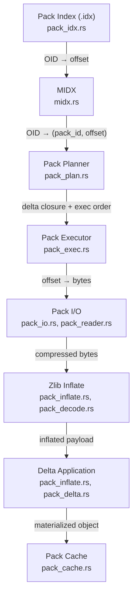
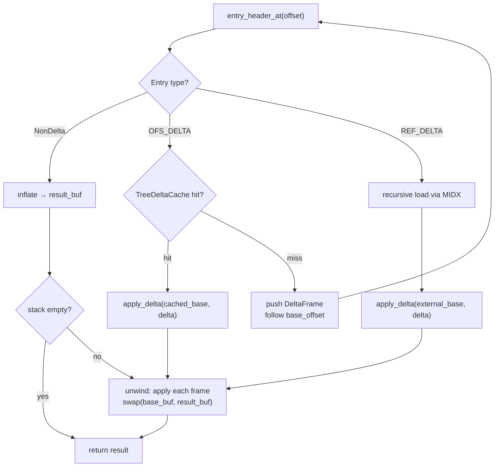
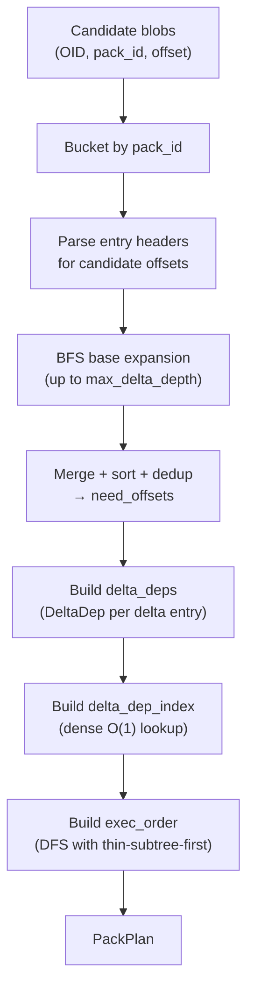

# Pack File Internals

Low-level internals of the pack file subsystem: index lookup, delta chain
resolution, zlib inflation, object caching, pack planning, and I/O
strategy. This document complements `git-pack-execution.md`, which covers
the high-level execution pipeline and strategy selection.

## Overview

The path from a pack file on disk to a materialized object in memory
involves six cooperating layers:



1. **Index lookup** resolves an OID to a `(pack_id, byte_offset)` pair via
   fanout tables and binary search.
2. **Pack planning** expands the delta closure for candidate blobs,
   building a sorted `need_offsets` array and optional DFS execution order.
3. **Pack execution** drives the decode loop, dispatching by entry type.
4. **I/O** provides mmap-backed or slice-backed byte access to pack files.
5. **Zlib inflation** decompresses pack entry payloads with hard output caps.
6. **Delta application** reconstructs target objects from base + delta
   instruction streams.
7. **Caching** stores decoded objects in a tiered set-associative CLOCK
   cache to avoid re-decoding shared delta bases.

## Key Types

### Pack Index Types (`pack_idx.rs`)

| Type | Line | Description |
|------|------|-------------|
| `IdxView<'a>` | `pack_idx.rs:132` | Zero-copy view over a pack index v2 file |
| `IdxOidIter<'a>` | `pack_idx.rs:394` | Iterator yielding `(oid_bytes, index)` pairs in sorted order |
| `IdxError` | `pack_idx.rs:41` | Pack index parsing errors (corrupt, unsupported version, size limit) |

### Pack Inflate Types (`pack_inflate.rs`)

| Type | Line | Description |
|------|------|-------------|
| `PackFile<'a>` | `pack_inflate.rs:258` | Zero-copy view over pack bytes, excluding trailing hash |
| `PackHeader` | `pack_inflate.rs:266` | Cached pack header metadata (oid_len, data_end) for repeated parsing |
| `EntryHeader` | `pack_inflate.rs:244` | Parsed entry header: uncompressed size, data_start offset, entry kind |
| `EntryKind` | `pack_inflate.rs:100` | Entry type: `NonDelta { kind }`, `OfsDelta { base_offset }`, `RefDelta { base_oid }` |
| `ObjectKind` | `pack_inflate.rs:91` | Non-delta object kind: Commit, Tree, Blob, Tag |
| `PackParseError` | `pack_inflate.rs:111` | Header/entry parsing errors |
| `InflateError` | `pack_inflate.rs:145` | Zlib decompression errors (limit exceeded, truncated, stalled, backend) |
| `DeltaError` | `pack_inflate.rs:167` | Delta application errors (truncated, size mismatch, copy out of range) |
| `PackObjectError` | `pack_inflate.rs:195` | Composite error wrapping parse, inflate, and delta errors |

### Pack Decode Types (`pack_decode.rs`)

| Type | Line | Description |
|------|------|-------------|
| `PackDecodeLimits` | `pack_decode.rs:30` | Size caps: `max_header_bytes`, `max_object_bytes`, `max_delta_bytes` |
| `PackDecodeError` | `pack_decode.rs:59` | Decode errors including `ObjectTooLarge` and `DeltaTooLarge` |

### Pack I/O Types (`pack_io.rs`)

| Type | Line | Description |
|------|------|-------------|
| `PackIo<'a>` | `pack_io.rs:173` | External base resolver with lazy mmap-backed pack cache and loose object fallback |
| `PackIoLimits` | `pack_io.rs:50` | Decode limits plus cross-pack delta depth cap |
| `PackIoError` | `pack_io.rs:72` | I/O errors (missing MIDX, pack not found, delta depth exceeded, loose object failures) |

### Pack Reader Types (`pack_reader.rs`)

| Type | Line | Description |
|------|------|-------------|
| `PackReader` (trait) | `pack_reader.rs:39` | Read-only `read_at` / `read_exact_at` interface for deterministic I/O |
| `SlicePackReader<'a>` | `pack_reader.rs:76` | In-memory pack reader over a byte slice |
| `PackReadError` | `pack_reader.rs:13` | Reader errors: out of range, short read, I/O |

### Pack Cache Types (`pack_cache.rs`)

| Type | Line | Description |
|------|------|-------------|
| `PackCache` | `pack_cache.rs:477` | Two-tier (small + large) set-associative CLOCK cache |
| `CachedObject<'a>` | `pack_cache.rs:166` | Cache hit result: object kind + borrowed bytes |
| `PackCacheEvictionStats` | `pack_cache.rs:102` | Instrumentation: insert attempts, victim selections, dependency marks |

### Pack Candidate Types (`pack_candidates.rs`)

| Type | Line | Description |
|------|------|-------------|
| `PackCandidate` | `pack_candidates.rs:25` | Blob candidate mapped to `(pack_id, offset)` with path context |
| `LooseCandidate` | `pack_candidates.rs:41` | Blob candidate not in any pack (loose object) |
| `PackCandidateSink` (trait) | `pack_candidates.rs:55` | Sink trait for packed/loose candidate output |
| `PackCandidateCollector<'midx>` | `pack_candidates.rs:72` | Collector that resolves OIDs to pack offsets via MIDX |

### Pack Plan Types (`pack_plan.rs`, `pack_plan_model.rs`)

| Type | Line | Description |
|------|------|-------------|
| `PackPlan` | `pack_plan_model.rs:193` | Complete decode plan for a single pack file |
| `DeltaDep` | `pack_plan_model.rs:45` | Delta dependency record: offset, kind, base location, data_start, delta_size |
| `DeltaKind` | `pack_plan_model.rs:25` | `Ofs` (OFS_DELTA) or `Ref` (REF_DELTA) |
| `BaseLoc` | `pack_plan_model.rs:34` | `Offset(u64)` for in-pack bases or `External { oid }` for cross-pack/unresolved |
| `CandidateAtOffset` | `pack_plan_model.rs:78` | `(offset, cand_idx)` pair for sorted candidate lookup |
| `PackPlanStats` | `pack_plan_model.rs:89` | Summary: candidate count, need count, external bases, forward deps, span |
| `PackPlanConfig` | `pack_plan.rs:50` | Planning limits: max delta depth, header bytes, worklist entries, base lookups |
| `PackPlanError` | `pack_plan.rs:76` | Planning errors: parse failure, cycle detected, worklist/lookup limit exceeded |
| `PackView<'a>` | `pack_plan.rs:181` | Header-only pack view for planning (no inflate) |
| `OidResolver` (trait) | `pack_plan.rs:161` | Resolves OIDs to `(pack_id, offset)` — implemented by `MidxView` |

## Index Lookup

Pack index files (`.idx` v2) provide O(log N) lookup from OID to pack byte
offset. The implementation in `pack_idx.rs` is zero-copy: all table slices
borrow directly from the mapped file bytes.

### Index v2 Layout

```text
+------------------+
| Magic (4B)       |  0xff 't' 'O' 'c'
| Version (4B)     |  Big-endian 2
+------------------+
| Fanout (1024B)   |  256 × u32 BE cumulative counts
+------------------+
| OID Table        |  N × oid_len bytes (lexicographically sorted)
+------------------+
| CRC Table        |  N × 4 bytes (skipped; not validated)
+------------------+
| Offset Table     |  N × 4 bytes (MSB=1 → large offset indirection)
+------------------+
| Large Offsets    |  M × 8 bytes (optional, for packs > 2 GB)
+------------------+
| Pack Checksum    |  oid_len bytes
| Idx Checksum     |  oid_len bytes
+------------------+
```

### Lookup Algorithm

1. **Fanout bucket**: The first byte of the OID selects a fanout entry.
   `fanout[first_byte]` gives the upper bound (exclusive) of the range;
   `fanout[first_byte - 1]` (or 0) gives the lower bound.
   Complexity: O(1). (`IdxView::fanout`, `pack_idx.rs:270`)

2. **Binary search**: Within the fanout bucket, binary search the OID
   table. OIDs are stored as raw bytes in lexicographic order.
   Complexity: O(log B) where B is the bucket size.

3. **Offset resolution**: The index at the match position maps to the
   offset table. Small offsets (MSB clear) are direct 32-bit values.
   Large offsets (MSB set) index into the large-offset table for a
   full 64-bit pack offset.
   (`IdxView::offset_at`, `pack_idx.rs:300`)

### MIDX Integration

Individual pack indices are merged into a multi-pack index (MIDX) that
provides a single namespace over all packs. The MIDX `find_oid` method
(`midx.rs:331`) uses the same fanout + binary search pattern. For sorted
OID streams, `find_oid_sorted` (`midx.rs:371`) maintains a monotonic
cursor that avoids restarting the binary search from the bucket boundary,
enabling merge-join style mapping.

## Delta Resolution

Git delta encoding stores objects as instruction streams that reconstruct
a target from a base. Two delta types exist, distinguished by how the
base is referenced:

| Type | Tag | Base Reference | Resolution |
|------|-----|----------------|------------|
| `OFS_DELTA` | 6 | Negative byte offset in same pack | Direct seek within pack bytes |
| `REF_DELTA` | 7 | 20/32-byte OID | MIDX lookup, may cross packs or fall to loose objects |

### Delta Instruction Format

A delta payload begins with two LEB128 varints encoding the expected base
size and result size, followed by a sequence of opcodes:

| Opcode | Bit Pattern | Description |
|--------|-------------|-------------|
| Copy | `1xxxxxxx` | Copy bytes from base: low 4 bits select offset bytes, bits 4-6 select size bytes (little-endian). Size 0 encodes 0x10000. |
| Insert | `0xxxxxxx` (nonzero) | Insert the next N bytes from the delta stream literally |
| Reserved | `00000000` | Invalid — returns `DeltaError::BadCommandZero` |

Copy parameter decoding (`decode_copy_params`, `pack_inflate.rs:876`) is
on the hot loop. It pre-computes the total parameter byte count from
`popcount(off_mask) + popcount(size_mask)`, performs one bounds check, then
decodes with tight branches using `get_unchecked`.

### Delta Application

`apply_delta` (`pack_inflate.rs:788`) writes directly into pre-reserved
`Vec` spare capacity via raw pointer arithmetic, eliminating per-chunk
bounds checks and `Vec::extend` overhead:

1. Parse header varints (base size, result size).
2. Validate base size matches actual base length.
3. Reserve `result_size` bytes in the output `Vec`.
4. Invoke `interpret_delta_body` which decodes opcodes and emits chunks
   via a closure that writes through a raw `out_ptr`.
5. After all opcodes, `set_len(written)` finalizes the output.

The output is capped by `max_out` to prevent unbounded allocation on
corrupt deltas. A streaming variant (`apply_delta_into`, `pack_inflate.rs:852`)
sends chunks to a caller-provided sink without buffering the full result.

### Delta Chain Walk

When a delta's base is itself a delta, the chain must be walked to a
non-delta root. Two resolution paths exist:

**ObjectStore path** (`object_store.rs`, for tree loading):



Phase 1 (walk forward) collects lightweight `DeltaFrame` structs without
inflating payloads. Phase 2 (unwind backward) inflates and applies each
frame in reverse, alternating `base_buf` and `result_buf` via
`std::mem::swap` to eliminate per-hop allocation. Depth is bounded by
`MAX_DELTA_DEPTH` (64).

**Pack executor path** (`pack_exec.rs`): Uses pre-computed `DeltaDepHot`
metadata from the plan to skip header parsing on the fast path. Falls back
to `walk_delta_chain_to_root` + `unwind_and_build_base` for chains not
captured by the planner.

## Zlib Inflation

All pack entry payloads are zlib-compressed. The inflate layer provides
four entry points with different allocation and lifetime strategies:

### Entry Points

| Function | File:Line | Decompressor | Output | Use Case |
|----------|-----------|--------------|--------|----------|
| `inflate_limited_with` | `pack_inflate.rs:456` | Caller-owned `Decompress` | `Vec` spare capacity, hard `max_out` cap | Pack executor hot path |
| `inflate_limited` | `pack_inflate.rs:548` | Thread-local `InflateScratch` | Same as above | Convenience for single-threaded callers |
| `inflate_exact_with` | `pack_inflate.rs:625` | Caller-owned | Exact `expected` bytes or error | Non-delta entries with known size |
| `inflate_stream` | `pack_inflate.rs:563` | Thread-local | Chunked callback, exact `expected` total | Large objects that should not be buffered |

### Buffer Management

`inflate_limited_with` writes directly into `Vec::spare_capacity_mut()`,
capped so total output never exceeds `max_out`:

1. The `Decompress` is reset (`de.reset(true)`) before each use.
2. Output `Vec` is cleared and `reserve(max_out)` pre-allocates capacity.
3. Debug builds poison spare capacity with `0xDE` to detect uninitialized reads.
4. Each loop iteration calls `decompress_uninit` into the spare slice.
5. `set_len` is advanced by the produced byte count (validated against
   `max_out` and `capacity`).
6. Terminates on `StreamEnd` (returning consumed input bytes) or error.

The thread-local `InflateScratch` (`pack_inflate.rs:38`) bundles a
`Decompress` instance and a 64 KiB scratch buffer into a single
`RefCell`, halving the TLS lookup cost. Reentrant callers must use the
`_with` variants that accept a caller-owned `Decompress`.

### Bounded Decode Wrappers

`pack_decode.rs` wraps the raw inflate functions with size enforcement:

- `entry_header_at` (`pack_decode.rs:113`) parses the entry header and
  rejects non-delta entries exceeding `max_object_bytes` and delta entries
  exceeding `max_delta_bytes` before any inflation occurs.
- `inflate_entry_payload_with` (`pack_decode.rs:176`) inflates non-delta
  entries with an exact-size contract and delta entries with a hard cap.

## Caching

### PackCache Architecture

`PackCache` (`pack_cache.rs:477`) is a two-tier, set-associative,
preallocated cache keyed by pack byte offset:

| Tier | Slot Size | Budget | Purpose |
|------|-----------|--------|---------|
| Small | ≤ 64 KiB (`DEFAULT_SMALL_SLOT_SIZE`) | ~2/3 of capacity | Majority of objects |
| Large | ≤ 2 MiB (`DEFAULT_LARGE_SLOT_SIZE`) | ~1/3 of capacity | Popular delta bases in 64 KiB–2 MiB range |

Objects exceeding 2 MiB are not cached. If total capacity is below
32 MiB (`MIN_LARGE_TIER_BYTES`), only the small tier is enabled.

### Set-Associative Structure

Both tiers use 4-way set associativity (`WAYS = 4`). The set count is
rounded down to a power of two. Set selection uses a MurmurHash3 fmix64
finalizer (`hash_offset`, `pack_cache.rs:706`) folded to 32 bits, then
masked to the set count.

```text
offset ──→ fmix64(offset) ──→ XOR-fold to u32 ──→ & (sets - 1) = set_index
```

### CLOCK Eviction

Default eviction is CLOCK (second-chance):

1. On **get hit**: set the slot's `clock` bit to 1.
2. On **insert** (set full): sweep from the persisted `clock_hand` position:
   - If slot is invalid or `clock == 0`: evict, advance hand.
   - If `clock == 1`: clear to 0 (second chance), advance hand.
   - After a full sweep with no victim: evict the hand position unconditionally.

### Dependency-Clock Eviction (Opt-In)

Enabled via `SCANNER_RS_PACK_CACHE_EVICTION=dependency_clock`. This
variant adds bounded protection for likely delta bases:

1. On **get hit**: record the hit offset as a `pending_dependency_hint`.
2. On **next insert**: if the previously-hit base is within
   `DEPENDENCY_HINT_MAX_DISTANCE` (16 MiB) of the new entry's offset,
   set the base's `dependency_guard` to `DEPENDENCY_GUARD_MAX` (2).
3. During victim selection: guarded slots are skipped (guard decremented)
   for up to `WAYS * 2` probes. After the bounded sweep, a forced
   eviction occurs.

This protects delta bases that are likely to be needed by nearby entries,
reducing re-decode costs for deep delta chains.

### Cache Lifecycle

- `new(capacity_bytes)`: Allocates both tiers upfront. No hot-path allocation.
- `get(offset)`: Probes small tier first, then large. Returns `CachedObject`
  with borrowed `&[u8]`.
- `insert(offset, kind, bytes)`: Routes to small or large tier by byte
  length. Returns `false` for oversize entries.
- `reset()`: Invalidates all entries without releasing storage (Tiger-Style
  reuse across scans).
- `ensure_capacity(bytes)`: Grows if needed; resets otherwise. Only
  allocates when a larger repo is encountered for the first time.

## Pack Planning

Pack planning (`pack_plan.rs`) pre-computes the full set of offsets that
must be decoded to satisfy a set of candidate blobs, including transitive
delta bases.

### Algorithm



1. **Bucket** (`bucket_pack_candidates_sparse`, `pack_plan.rs:515`):
   Group candidates by `pack_id`. Only touched packs allocate a bucket.

2. **Parse** (`parse_entry`, `pack_plan.rs:553`): Parse each candidate's
   entry header to determine its type. REF_DELTA entries resolve their
   base OID via the `OidResolver` (typically `MidxView`). Results are
   cached in a `HashMap<u64, ParsedEntry>`.

3. **Expand** (BFS worklist, `pack_plan.rs:380`): For each delta entry,
   enqueue its base offset. Continue up to `max_delta_depth` (default 64).
   Pack-local bases are added to `discovered_base_offsets`; cross-pack
   REF_DELTA bases are recorded as `BaseLoc::External`.

4. **Merge** (`pack_plan.rs:434`): Combine candidate offsets and
   discovered base offsets into a sorted, deduplicated `need_offsets` array.

5. **Delta deps** (`build_delta_deps`, `pack_plan.rs:613`): Emit one
   `DeltaDep` per delta entry, sorted by offset. The dense
   `delta_dep_index` (`build_delta_dep_index`, `pack_plan.rs:666`) maps
   each `need_offsets[i]` to its `delta_deps` position in O(1) via a
   forward-only merge cursor.

6. **Exec order** (`build_exec_order`, `pack_plan.rs:800`): Build a
   cache-aware DFS execution order. Thin subtrees are processed first
   (ascending descendant count) to minimize live cache entries. Returns
   `None` when natural ascending order is correct (fast path).

### Complexity

`O((N + E) log(N + E))` where N is unique candidate offsets and E is
discovered base offsets. The final sort dominates.

### Safety Limits

| Limit | Default | Error |
|-------|---------|-------|
| Max delta depth | 64 | Chain truncated |
| Max worklist entries | 1,000,000 | `WorklistLimitExceeded` |
| Max base lookups | 1,000,000 | `BaseLookupLimitExceeded` |
| Max header bytes | 64 | `PackParseError::HeaderTooLong` |

Cycles in the delta graph are detected by the DFS topological sort; if
`order.len() != n` after the DFS, `DeltaCycleDetected` is returned.

## I/O Strategy

### Pack File Access

Pack files are accessed via memory-mapped I/O. Two access patterns exist:

**Execution path** (`runner_exec.rs`): `mmap_pack_files` maps required
packs with `MADV_SEQUENTIAL` / `POSIX_FADV_SEQUENTIAL` hints. Mmap
lifecycle is managed by the scheduler; all workers share the same
mappings.

**PackIo path** (`pack_io.rs`): Used for external base resolution
(cross-pack REF_DELTA) and loose object loading. Pack files are
lazily mapped on first access and cached as `Arc<Mmap>` for the
lifetime of the `PackIo` instance.

```rust
// pack_io.rs:405–417 (simplified)
if self.pack_cache[idx].is_none() {
    let file = File::open(path)?;
    let mmap = unsafe { Mmap::map(&file)? };
    advise_sequential(&file, &mmap);
    self.pack_cache[idx] = Some(Arc::new(mmap));
}
```

Sequential access hints (`advise_sequential`, `pack_io.rs:421`):
- Linux: `posix_fadvise(fd, 0, 0, POSIX_FADV_SEQUENTIAL)`
- All Unix: `madvise(ptr, len, MADV_SEQUENTIAL)`

### PackReader Abstraction

`PackReader` (`pack_reader.rs:39`) is a trait providing `read_at` /
`read_exact_at` for deterministic I/O. This enables simulation testing
with injected short reads and corruption:

| Implementation | Source | Purpose |
|----------------|--------|---------|
| `SlicePackReader<'a>` | `pack_reader.rs:76` | In-memory bytes for tests |
| `BytesView` | `pack_reader.rs:108` | Shared-ownership byte view |

### Loose Object Access

When an OID is not found in any pack (MIDX miss), `PackIo::load_loose_object`
(`pack_io.rs:256`) falls back to the `objects/` directory:

1. Hex-encode the OID.
2. Split into `XX/YYYYYY...` directory/file path.
3. Read the file, inflate with `inflate_limited`.
4. Parse the `<kind> <size>\0<payload>` header.
5. Validate payload length against declared size and `max_object_bytes`.

## Source of Truth

| Concept | File | Key Lines |
|---------|------|-----------|
| Pack index v2 parser | `pack_idx.rs` | `IdxView::parse` (151), `find_oid` via `fanout` + binary search |
| Pack index OID iterator | `pack_idx.rs` | `IdxOidIter` (394), `iter_oids` (324) |
| Pack header/entry parsing | `pack_inflate.rs` | `PackFile::parse` (276), `entry_header_at` (320), `parse_ofs_base` (413) |
| Zlib inflate (bounded) | `pack_inflate.rs` | `inflate_limited_with` (456), `inflate_exact_with` (625), `inflate_stream` (563) |
| Thread-local inflate scratch | `pack_inflate.rs` | `InflateScratch` (38), `with_inflate_scratch` (78) |
| Delta application | `pack_inflate.rs` | `apply_delta` (788), `apply_delta_into` (852), `interpret_delta_body` (726) |
| Delta copy decoding | `pack_inflate.rs` | `decode_copy_params` (876), `delta_sizes` (687) |
| Delta re-export | `pack_delta.rs` | `apply_delta` (17), `DeltaError` (21) |
| Bounded decode wrappers | `pack_decode.rs` | `entry_header_at` (113), `inflate_entry_payload_with` (176), `inflate_entry_payload` (226) |
| Decode limits | `pack_decode.rs` | `PackDecodeLimits` (30), `PackDecodeError` (59) |
| Pack I/O (external bases) | `pack_io.rs` | `PackIo::load_object` (244), `read_pack_object` (338), `pack_data` (386) |
| Pack I/O (loose fallback) | `pack_io.rs` | `load_loose_object` (256), `parse_loose_object` (470) |
| Pack I/O limits | `pack_io.rs` | `PackIoLimits` (50), delta depth enforcement (353–371) |
| Pack I/O mmap hints | `pack_io.rs` | `advise_sequential` (421) |
| ExternalBaseProvider impl | `pack_io.rs` | `PackIo` impl (441) |
| Pack reader trait | `pack_reader.rs` | `PackReader` (39), `SlicePackReader` (76), `BytesView` impl (108) |
| Pack cache (tiered CLOCK) | `pack_cache.rs` | `PackCache::new` (490), `get` (586), `insert` (607), `reset` (628) |
| Cache tier internals | `pack_cache.rs` | `PackCacheTier` (180), `Slot` (135), `select_victim_clock` (351) |
| Dependency-clock eviction | `pack_cache.rs` | `select_victim_dependency_clock` (372), `protect_dependency_base` (429) |
| Cache hash function | `pack_cache.rs` | `hash_offset` (706) — MurmurHash3 fmix64, XOR-folded to 32 bits |
| Pack candidates | `pack_candidates.rs` | `PackCandidate` (25), `LooseCandidate` (41), `PackCandidateSink` (55) |
| Candidate collector | `pack_candidates.rs` | `PackCandidateCollector` (72), MIDX-backed OID→offset mapping |
| Pack plan model | `pack_plan_model.rs` | `PackPlan` (193), `DeltaDep` (45), `BaseLoc` (34), `DeltaKind` (25) |
| Pack plan builder | `pack_plan.rs` | `build_pack_plans` (267), `build_pack_plan_for_pack` (316) |
| Delta closure expansion | `pack_plan.rs` | BFS worklist (380), `enqueue_pack_local_base` (1003) |
| Delta dep index | `pack_plan.rs` | `build_delta_dep_index` (666) — O(n+m) forward merge cursor |
| DFS exec order | `pack_plan.rs` | `build_exec_order` (800) — CSR adjacency, descendant counts, thin-first DFS |
| Pack plan config | `pack_plan.rs` | `PackPlanConfig` (50), defaults (37–44) |

## Related Docs

- `docs/scanner-git/git-pack-execution.md` — high-level execution pipeline, strategy selection, sharding heuristics
- `docs/scanner-git/git-scanning.md` — end-to-end scanning pipeline overview
