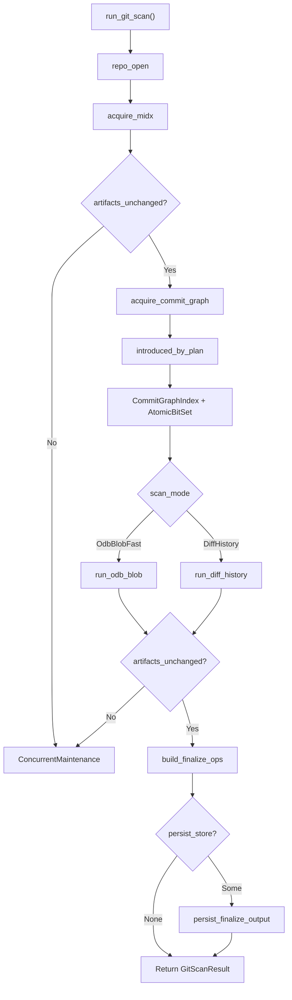

# Runner Orchestration

This document describes the scan runner subsystem: how git scanning is
orchestrated from configuration through execution, scheduling, engine
integration, and finalization.

## Overview

The runner subsystem is the top-level orchestrator for git scans. It owns the
end-to-end pipeline from repository open through finalize and optional
persistence. The subsystem is split across five source files:

| Module                   | Location                                              | Responsibility                                          |
| ------------------------ | ----------------------------------------------------- | ------------------------------------------------------- |
| `runner`                 | `crates/scanner-git/src/runner.rs`                    | Public types, configuration, and `run_git_scan` entry   |
| `runner_exec`            | `crates/scanner-git/src/runner_exec.rs`               | Shared pack execution helpers (mmap, cache, sharding)   |
| `runner_exec_scheduler`  | `crates/scanner-git/src/runner_exec_scheduler.rs`     | Scheduler-driven parallel plan/shard dispatch           |
| `engine_adapter`         | `crates/scanner-git/src/engine_adapter.rs`            | Bridge from decoded blobs to the core `Engine`          |
| `finalize`               | `crates/scanner-git/src/finalize.rs`                  | Deterministic write-op builder for persistence          |

The runner dispatches to one of two mode-specific pipelines after shared setup:

- **ODB-blob fast path** (`runner_odb_blob`) -- walks the unique blob set from
  the commit graph, then scans in pack order with streaming plan generation.
- **Diff-history** (`runner_diff_history`) -- walks commits, diffs trees,
  spills/dedupes candidates, then batch-plans and executes pack decode + scan.

Both pipelines produce a `ScanModeOutput` that the runner finalizes and
optionally persists through a two-phase atomic write.

## Execution Lifecycle

### Step-by-step

1. **Repo open** (`runner.rs`) -- resolve repo layout, start set, ref
   watermarks, and artifact lock paths via `repo_open`.
2. **MIDX acquisition** (`runner.rs`) -- build the multi-pack-index in
   memory via `acquire_midx`. An immediate artifact stability check follows.
3. **Commit-graph acquisition** (`runner.rs`) -- build the commit
   graph (optionally with identity enrichment). When `enrich_identities` is
   enabled, `acquire_commit_graph_with_identities` also produces an
   `IdentityInterner` whose dictionary is emitted before any `CommitMeta`
   events.
4. **Commit plan** (`runner.rs`) -- `introduced_by_plan` computes the
   `(watermark, tip]` topo-ordered commit list.
5. **Commit-graph index + bitset** (`runner.rs`) --
   `CommitGraphIndex` is built for OID/timestamp resolution;
   `AtomicBitSet` gates exactly-once `CommitMeta` emission across workers.
6. **Mode dispatch** (`runner.rs`) -- delegates to
   `run_odb_blob` or `run_diff_history`. Both receive the shared engine,
   seen store, commit plan, and `CommitMetaContext`.
7. **Post-execution stability check** (`runner.rs`) -- verifies pack
   artifacts have not changed during execution (detects concurrent `git gc`).
8. **Finalize** (`runner.rs`) -- `build_finalize_ops` transforms
   scan results into deterministic write operations.
9. **Persist** (`runner.rs`) -- optional two-phase atomic write
   via `persist_finalize_output`.
10. **Report assembly** (`runner.rs`) -- perf counters are
    snapshot, and the final `GitScanReport` is returned.

## Key Types

### Configuration and Results (`runner.rs`)

| Type                  | Description                                                         |
| --------------------- | ------------------------------------------------------------------- |
| `GitScanConfig`       | Full scan configuration: mode, limits, worker counts, spill dir     |
| `GitScanMode`         | Enum: `DiffHistory` or `OdbBlobFast` (default)                      |
| `GitScanResult`       | Newtype wrapper around `GitScanReport`                              |
| `GitScanReport`       | Summary report with per-stage stats, findings, and finalize output  |
| `GitScanError`        | Error taxonomy organized by pipeline stage                          |
| `ScanModeOutput`      | Common output struct produced by both mode pipelines                |
| `GitScanStageNanos`   | Per-stage nanosecond timings (populated with `git-perf` feature)    |
| `GitScanAllocStats`   | Allocation deltas for hot stages                                    |
| `PackMmapLimits`      | Pack file mmap count and byte budget                                |
| `CandidateSkipReason` | Enum of reasons a candidate blob was skipped                        |
| `SkippedCandidate`    | Blob OID paired with its skip reason                                |

### Execution Helpers (`runner_exec.rs`)

| Type                          | Description                                                        |
| ----------------------------- | ------------------------------------------------------------------ |
| `PackExecStrategy`            | Enum: `Serial`, `PackParallel`, or `IntraPackSharded`              |
| `SpillCandidateSink`          | Bridges `CandidateSink` to `Spiller::push` for diff-history mode   |
| `SchedulerPackExecOutput`     | Output from one scheduler-dispatched pack-plan task                |
| `SchedulerPackTask`           | Enum: `ExecPlan { seq }` or `ExecShard { plan_idx, shard_idx }`   |
| `SchedulerPackScratch`        | Per-worker reusable scratch (cache + decode workspace + runtime)   |
| `SchedulerPackWorkerRuntime`  | Heavy per-worker state (MIDX + PackIo + EngineAdapter) with custom Drop |
| `SchedulerPackShared`         | Immutable state shared across all scheduler worker threads         |
| `SchedulerShardMeta`          | Pre-computed sharding metadata for one pack plan                   |
| `PlanCostHint`                | Stats-free structural cost hint for strategy selection             |
| `LocalityPressure`            | Cross-shard locality pressure estimate                             |

### Engine Adapter (`engine_adapter.rs`)

| Type                    | Description                                                         |
| ----------------------- | ------------------------------------------------------------------- |
| `EngineAdapter<'a>`     | Primary blob scanner; implements `PackObjectSink`                   |
| `EngineAdapterConfig`   | Chunk window size and binary scan policy                            |
| `CommitMetaContext`      | Bundle of event sink + commit-graph + bitset for `CommitMeta`       |
| `FindingKey`            | Normalized finding identity `(start, end, rule_id, norm_hash)`      |
| `ScoredFinding`         | Finding key with confidence score                                   |
| `FindingSpan`           | Range into the shared findings arena for a single blob              |
| `ScannedBlob`           | Blob result with OID, context, and findings span                    |
| `ScannedBlobs`          | Collected scan results with shared findings arena                   |
| `GitScanCommonMetrics`  | Always-on counters: objects/chunks/bytes scanned, findings emitted  |
| `RingChunker`           | Fixed-size ring buffer for overlap-safe chunk streaming             |
| `ChunkView`             | Single chunk window with base offset and first-window flag          |

### Finalize (`finalize.rs`)

| Type               | Description                                                          |
| ------------------ | -------------------------------------------------------------------- |
| `FinalizeInput`    | Input bundle: repo_id, blobs, findings arena, refs, skip OIDs       |
| `FinalizeOutput`   | Separated data ops + watermark ops for two-phase persistence        |
| `FinalizeOutcome`  | Enum: `Complete` (watermarks safe) or `Partial` (watermarks skipped) |
| `FinalizeStats`    | Unique blobs, total findings, dedup counts                          |
| `WriteOp`          | Single key-value write operation for the persistence layer          |
| `RefEntry`         | Ref name + tip OID from the start set                               |
| `NamespaceCounts`  | Per-namespace operation counts for diagnostics                      |

### Persistence (`persist.rs`)

| Type                       | Description                                                    |
| -------------------------- | -------------------------------------------------------------- |
| `PersistenceStore` (trait) | Atomic commit interface for finalize output                    |
| `InMemoryPersistenceStore` | Test-only in-memory store for inspection                       |

## Engine Adapter

The `EngineAdapter` (`engine_adapter.rs`) bridges decoded git blob bytes
into the core detection `Engine`. It implements `PackObjectSink` so pack
execution can feed it decoded blobs directly.

### Per-blob pipeline

Each blob flows through four stages inside the adapter:

1. **Classify** (`scan_blob_into_buf`, `engine_adapter.rs`) -- content
   policy classifies the blob as text, extractable binary (`.class`, `.pyc`),
   or opaque binary. Opaque binaries are skipped. Extractable formats have
   their text extracted first.
2. **Scan** -- blob bytes are fed through overlap-safe chunk windows.
   Blobs that fit in a single chunk (`<= chunk_bytes`) take a fast path that
   skips the ring buffer memcpy entirely (`engine_adapter.rs`). Larger
   blobs stream through `RingChunker` (`engine_adapter.rs`).
3. **Stream** (`stream_findings`, `engine_adapter.rs`) -- findings are
   emitted to the structured `EventSink`. A `CommitMeta` event is emitted at
   most once per commit via `AtomicBitSet::test_and_set`.
4. **Record** (`record_findings`, `engine_adapter.rs`) -- findings are
   appended to the shared arena and the resulting `FindingSpan` is attached to
   the `ScannedBlob`.

### Chunking algorithm

The `RingChunker` (`engine_adapter.rs`) streams blob bytes into fixed
windows with configurable overlap (from `Engine::required_overlap()`). After
scanning each chunk, findings wholly within the overlap prefix are dropped
via `ScanScratch::drop_prefix_findings` to avoid cross-chunk duplication.
Findings are converted to `FindingKey` values (no raw secret bytes), then
sorted + deduped per blob for deterministic ordering.

### Exactly-once CommitMeta

When findings are non-empty and the `commit_id` falls within the commit-graph
range, `commit_meta_seen.test_and_set(commit_id)` returns `true` exactly once
across all adapter instances sharing the same `Arc<AtomicBitSet>`. This ensures
at most one `CommitMeta` event per commit even under parallel pack-exec workers.
Cross-worker stream ordering is intentionally non-deterministic.

## Scheduling

### Strategy selection

`select_pack_exec_strategy` (`runner_exec.rs`) chooses one of three
execution strategies from the worker count and per-plan structural hints:

| Strategy              | Condition                                                      | Behavior                                          |
| --------------------- | -------------------------------------------------------------- | ------------------------------------------------- |
| `Serial`              | `workers <= 1`, no plans, or total need < 512                  | Single-threaded execution                         |
| `PackParallel`        | `plan_count >= workers`                                        | One plan per worker, deterministic reassembly      |
| `IntraPackSharded`    | Fewer plans than workers                                       | Large plans split into index-range shards          |

### Shard count selection

For `IntraPackSharded`, each plan's shard count is the minimum of five
independent caps (`runner_exec.rs`):

1. **Worker count** -- never more shards than available workers.
2. **`need_count / 1024`** -- avoids oversharding tiny plans.
3. **`span_bytes / 4 MiB`** -- avoids splitting narrow byte ranges.
4. **Dependency pressure** -- if more than half the need offsets have forward
   or external deps, shard count is capped to 2.
5. **Locality pressure** (`apply_locality_shard_cap`, `runner_exec.rs`) --
   if projected shard boundaries split too many offset-based delta deps,
   fan-out is reduced iteratively until cross-shard pressure falls below 55%.

### Pack cache sizing

Pack cache is computed through a layered heuristic
(`per_worker_cache_bytes`, `runner_exec.rs`):

1. Raw estimate: `total_mapped_bytes / 16` (~6.25% of pack data).
2. Per-worker cap: `16 GiB / workers` (aggregate memory bound).
3. Per-worker floor: 32 MiB (functional minimum).
4. Per-worker ceiling: 2 GiB hard cap.

The floor can exceed the per-worker cap intentionally -- a worker with too
little cache degrades hit-rate more than marginally exceeding the aggregate
target.

### Worker auto-sizing

`auto_pack_exec_workers_for_in_pack` (`runner.rs`) selects pack-exec
workers by repository size tier:

| In-pack objects     | Multiplier | Example (12 cores) |
| ------------------- | ---------- | ------------------ |
| `< 100,000`        | 1x cores   | 12 workers         |
| `< 2,000,000`      | 3x cores   | 36 workers         |
| `>= 2,000,000`     | 6x cores   | 72 workers         |

Workers are capped at `MAX_PACK_EXEC_WORKERS` (128, `runner.rs`) to
prevent excessive per-worker memory (Decompress ~37 KiB, scratch buffers,
PackCache 32 MiB floor each).

### Scheduler dispatch

The scheduler implementation lives in `runner_exec_scheduler.rs`. It wraps
the `scanner_scheduler::Executor` work-queue:

1. `execute_pack_plans_with_scheduler` (`runner_exec_scheduler.rs`)
   selects a `PackExecStrategy` and delegates to either `execute_plan_tasks`
   or `execute_sharded_tasks`.
2. **Plan tasks** (`runner_exec_scheduler.rs`) -- one `SchedulerPackTask::ExecPlan`
   per plan, dispatched as a batch. Outputs are stored in sequence-indexed
   mutex slots for deterministic reassembly.
3. **Shard tasks** (`runner_exec_scheduler.rs`) -- `build_shard_dispatch_plan`
   pre-computes `SchedulerShardMeta` (execution plan, hot deps, candidate
   ranges, shard ranges) for each plan. Tasks are
   `SchedulerPackTask::ExecShard { plan_idx, shard_idx }`. Outputs are stored
   in flattened shard slots and merged per-plan after join.
4. **Error handling** -- on the first worker error, an `AtomicBool` abort flag
   prevents new tasks from starting. After `ex.join()`, the first error is
   returned and all successful outputs are discarded.
5. **Per-worker scratch** -- each worker thread creates a
   `SchedulerPackScratch` with a `PackCache`, `PackExecScratch`, and a
   lazily-initialized `SchedulerPackWorkerRuntime` (parsed MIDX + `PackIo` +
   `EngineAdapter`) that is reused across all tasks on that thread.

### Worker runtime safety

`SchedulerPackWorkerRuntime` (`runner_exec.rs`) caches expensive per-worker
setup: a parsed `MidxView` in a `PackIo` and an `EngineAdapter`. These hold
transmuted `'static` references that actually borrow from `Arc<Engine>` and
`BytesView` fields stored in the same struct. A custom `Drop` impl
(`runner_exec.rs`) drops borrowers (`adapter`, `external`) before their
backing storage (`_engine`, `_midx_bytes`). The struct is `#[repr(C)]` with
compile-time assertions (`runner_exec.rs`) to enforce field ordering
soundness.

## Finalization

`build_finalize_ops` (`finalize.rs`) is a pure function -- no I/O, no side
effects. It transforms scan results into stably-ordered write operations.

### Algorithm

1. Sort blobs by OID, refs by name (`finalize.rs`).
2. Group blobs by OID. For each group:
   - Select the canonical context (minimum under a strict total order:
     `commit_id`, path bytes, `parent_idx`, `change_kind`, `ctx_flags`,
     `cand_flags`).
   - Emit a `blob_ctx` (`bc\0`) write op with the encoded context.
   - Gather findings across all contexts for this OID, sort + dedupe by
     identity `(start, end, rule_id, norm_hash)`, emit `finding` (`fn\0`) ops.
   - Emit a `seen_blob` (`sb\0`) marker.
3. Assemble data ops in namespace order: `bc\0` < `fn\0` < `sb\0`.
4. If the run is complete (no skipped candidates), emit ref watermark (`rw`)
   ops. If partial, watermark ops are empty.

### Key namespaces

| Prefix | Namespace      | Description                          |
| ------ | -------------- | ------------------------------------ |
| `bc\0` | blob_ctx       | Canonical context per scanned blob   |
| `fn\0` | finding        | Individual finding records           |
| `sb\0` | seen_blob      | Scanned marker per blob OID          |
| `rw`   | ref_watermark  | Ref tip watermarks (complete only)   |

All keys use big-endian numeric fields to preserve lexicographic ordering.
Ref watermark keys are null-terminated for prefix-safe scans.

### Outcome semantics

- **`Complete`** -- all candidates scanned; watermark ops are populated and
  safe to write. Persistence advances ref tips.
- **`Partial`** -- some candidates were skipped (decode failure, budget
  exceeded, corrupt objects). Watermark ops are empty; ref tips are NOT
  advanced, ensuring the next scan re-visits unscanned content.

### Persistence

`persist_finalize_output` (`persist.rs`) forwards the `FinalizeOutput`
to a `PersistenceStore` implementation. The store must commit `data_ops` and
(when complete) `watermark_ops` atomically, so readers never observe
watermarks without corresponding data writes.

## Source of Truth

| Concept                       | File                                 |
| ----------------------------- | ------------------------------------ |
| `run_git_scan` entry point    | `runner.rs`                          |
| `GitScanConfig` definition    | `runner.rs`                          |
| `GitScanMode` enum            | `runner.rs`                          |
| `GitScanError` taxonomy       | `runner.rs`                          |
| `GitScanReport` definition    | `runner.rs`                          |
| `ScanModeOutput` definition   | `runner.rs`                          |
| Worker auto-sizing            | `runner.rs`                          |
| `PackExecStrategy` selection  | `runner_exec.rs`                     |
| Pack cache sizing             | `runner_exec.rs`                     |
| Mmap management               | `runner_exec.rs`                     |
| Loose candidate scanning      | `runner_exec.rs`                     |
| Scheduler dispatch entry      | `runner_exec_scheduler.rs`           |
| Plan task execution           | `runner_exec_scheduler.rs`           |
| Shard task execution          | `runner_exec_scheduler.rs`           |
| Shard dispatch plan builder   | `runner_exec_scheduler.rs`           |
| `EngineAdapter` definition    | `engine_adapter.rs`                  |
| Per-blob scan pipeline        | `engine_adapter.rs`                  |
| Exactly-once CommitMeta       | `engine_adapter.rs`                  |
| `RingChunker` implementation  | `engine_adapter.rs`                  |
| `build_finalize_ops`          | `finalize.rs`                        |
| `FinalizeOutput` definition   | `finalize.rs`                        |
| `FinalizeOutcome` enum        | `finalize.rs`                        |
| Key namespace constants       | `finalize.rs`                        |
| `PersistenceStore` trait      | `persist.rs`                         |
| `persist_finalize_output`     | `persist.rs`                         |
| Worker runtime safety         | `runner_exec.rs`                     |
| Scheduler task execution      | `runner_exec.rs`                     |

## Related Docs

- `docs/scanner-git/git-scanning.md` -- end-to-end pipeline overview
- `docs/scanner-git/git-pack-execution.md` -- pack decode + execution details
- `docs/scanner-engine/detection-engine.md` -- core detection engine
