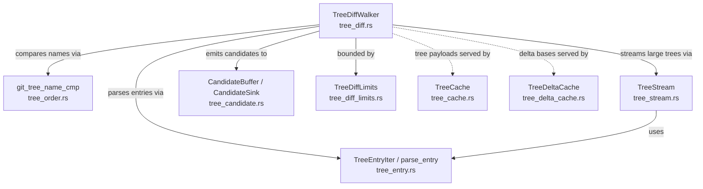
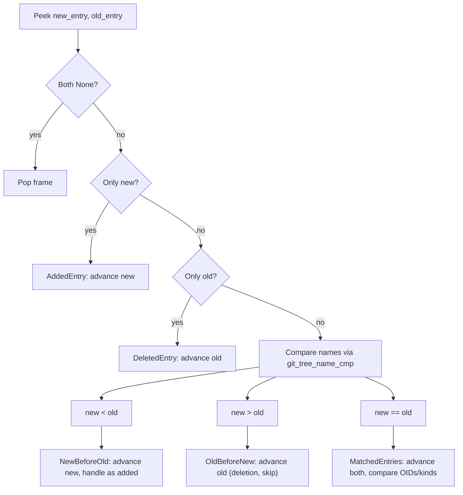

# Tree Diffing

This document describes the tree diffing subsystem in `scanner-git`: how Git
tree objects are compared to identify changed blobs for scanning.

## Overview

The tree subsystem compares two Git tree objects (typically the trees of a child
commit and its parent) to find blob entries that were added or modified. It
operates on raw decompressed tree payloads and performs OID-only comparison --
no blob contents are read during the diff phase. The walker also accepts a
cooperative abort flag so large diffs can stop without waiting for the entire
tree walk to finish.

The subsystem is composed of eight modules:



## Key Types

### Core Diffing

| Type | Location | Description |
|------|----------|-------------|
| `TreeDiffWalker` | `tree_diff.rs` | Stateful walker that diffs two trees using an explicit stack. Reusable across calls. |
| `TreeDiffStats` | `tree_diff.rs` | Cumulative counters: trees loaded, bytes loaded, peak in-flight, candidates emitted, subtrees skipped, max depth. |
| `TreeDiffLimits` | `tree_diff_limits.rs` | Hard caps for depth, in-flight bytes, candidate count, path arena, tree cache, delta cache, and spill arena. |
| `TreeDiffError` | `errors.rs` | Error enum covering corrupt trees, depth/budget/path limits, candidate buffer full, object store failures, and abort. |

### Tree Entries

| Type | Location | Description |
|------|----------|-------------|
| `EntryKind` | `tree_entry.rs` | Enum classifying tree entry type: `Tree`, `RegularFile`, `ExecutableFile`, `Symlink`, `Gitlink`, `Unknown`. |
| `TreeEntry<'a>` | `tree_entry.rs` | Zero-copy parsed entry: name, OID bytes, kind, mode. Borrows from tree buffer. |
| `TreeEntryIter<'a>` | `tree_entry.rs` | Fused iterator over entries in a raw tree payload. No per-entry allocation. |
| `ParsedTreeEntry` | `tree_entry.rs` | Internal offset-based parsed entry. Used by `BufferedCursor` and `TreeStream` for peek/advance. |
| `ParseOutcome` | `tree_entry.rs` | `Complete(ParsedTreeEntry)` or `Incomplete(ParseStage)` for streaming callers that may refill buffers. |
| `ParseStage` | `tree_entry.rs` | Which parsing stage ran out of bytes: `Mode`, `Name`, or `Oid`. |

### Ordering

| Type | Location | Description |
|------|----------|-------------|
| `git_tree_name_cmp` | `tree_order.rs` | Compares two entry names using Git's `base_name_compare()` semantics with virtual terminators. |
| `git_tree_file_name_cmp` | `tree_order.rs` | Optimized file-only comparison (both `is_dir=false`); equivalent to lexicographic byte ordering. |

### Streaming

| Type | Location | Description |
|------|----------|-------------|
| `TreeStream<R: Read>` | `tree_stream.rs` | Single-pass streaming parser with a fixed-size sliding window buffer. Parses one entry ahead. |
| `TreeBytesReader` | `tree_stream.rs` | Adapts `TreeBytes` (cached, owned, or spilled) to `std::io::Read` without copying. |

### Candidates

| Type | Location | Description |
|------|----------|-------------|
| `ChangeKind` | `tree_candidate.rs` | `Add` (new blob at path) or `Modify` (existing blob changed). |
| `CandidateSink` | `tree_candidate.rs` | Trait for receiving emitted candidates. `emit()` receives OID, path, commit context, and flags. |
| `CandidateBuffer` | `tree_candidate.rs` | In-memory sink backed by a `Vec<TreeCandidate>` and a `ByteArena` for interned paths. |
| `TreeCandidate` | `tree_candidate.rs` | OID + `CandidateContext` (commit id, parent idx, change kind, mode flags, path ref). |
| `CandidateContext` | `tree_candidate.rs` | Stable context carried through spill/merge: commit, parent, change kind, mode, classification bits, arena path ref. |
| `ResolvedCandidate<'a>` | `tree_candidate.rs` | Dereferenced form with path bytes resolved from the arena. Produced by `iter_resolved()`. |

### Caching

| Type | Location | Description |
|------|----------|-------------|
| `TreeCache` | `tree_cache.rs` | Set-associative cache for decompressed tree payloads, keyed by OID. CLOCK eviction, fixed slots. |
| `TreeCacheHandle` | `tree_cache.rs` | Pinned handle to a cached tree payload. Dropping releases the pin. |
| `TreeDeltaCache` | `tree_delta_cache.rs` | Set-associative cache for delta base bytes, keyed by `(pack_id, offset)`. CLOCK eviction. |
| `TreeDeltaCacheHandle` | `tree_delta_cache.rs` | Pinned handle carrying base bytes, resolved `ObjectKind`, and `chain_len`. |

### Object Store Integration

| Type | Location | Description |
|------|----------|-------------|
| `TreeSource` | `object_store.rs` | Trait for loading raw tree payloads by OID. Returns `TreeBytes`. |
| `TreeBytes` | `object_store.rs` | Enum: `Cached(TreeCacheHandle)`, `Owned(Vec<u8>)`, or `Spilled(SpillSlice)`. |

## Diffing Algorithm

### Merge-Walk

`TreeDiffWalker::diff_trees` (`tree_diff.rs`) performs an iterative
merge-walk of two trees using an explicit stack of `DiffFrame`s -- no
recursion. Each frame holds a pair of cursors (new tree, old tree) and a path
prefix length for truncation on pop. The caller also supplies an abort flag;
the walker samples it every 4096 processed entries so cancellation latency
stays bounded on large commits without paying a per-entry atomic cost.

The walk peeks the next entry from each cursor and dispatches on ordering:



The `compute_action` function (`tree_diff.rs`) computes the `Action` enum
variant from the peeked entries. The walker then executes the action, which may
emit a candidate, push a subtree frame, or simply advance a cursor.

### Cooperative Cancellation

`TreeDiffWalker::diff_trees` checks the abort flag in two places:

- Once before any tree bytes are loaded, which lets a pre-cancelled scan fail
  without mutating walker state.
- Every 4096 processed entries inside the main merge-walk loop, which bounds
  cancellation latency for deep or wide trees while keeping the hot path
  amortized.

When the flag is set, the walker returns `TreeDiffError::Aborted`. Callers such
as `run_diff_history` treat that as a retryable scan abort and skip finalize
work upstream.

### Entry Comparison Rules

For matched entries (same name in tree order), the walker applies a four-way
kind matrix (`handle_matched_entries`, `tree_diff.rs`):

| new kind | old kind | Action |
|----------|----------|--------|
| Tree | Tree | Recurse if OIDs differ; skip if identical (subtree pruning) |
| Tree | Non-tree | Recurse into new tree as entirely added |
| Non-tree | Tree | Emit new blob as `Add` (if blob-like) |
| Non-tree | Non-tree | Emit `Modify` if OIDs differ and new is blob-like; skip if equal |

Gitlink handling is implicit:
- **blob -> gitlink**: skipped (gitlinks are not scanned)
- **gitlink -> blob**: emitted as `Add`
- **gitlink -> gitlink**: skipped

### Kind Changes (File <-> Directory)

When an entry changes from file to directory (or vice versa), Git tree ordering
treats them as distinct entries because of different virtual terminators:

- File `"foo"` terminates with NUL (`0x00`)
- Directory `"foo"` terminates with `'/'` (`0x2F`)
- Therefore: file `"foo"` < directory `"foo"` in tree order

Result: the file deletion appears first (skipped), then the directory addition
triggers recursive descent into the new subtree.

### Subtree Pruning

When both entries are trees with identical OIDs, the subtree is skipped
entirely -- no tree load, no recursion. This is tracked by
`TreeDiffStats::subtrees_skipped` and is the primary performance optimization:
unchanged subtrees (the common case in incremental scans) cost zero I/O.

## Canonical Ordering

Git tree entries are stored in a specific sorted order that differs from plain
lexicographic comparison. The `git_tree_name_cmp` function
(`tree_order.rs`) implements Git's `base_name_compare()` semantics:

1. Compare name bytes lexicographically up to the shorter length (`memcmp`)
2. If prefixes match, compare "virtual terminators":
   - Directories use `'/'` (`0x2F`)
   - Files use NUL (`0x00`)

This creates non-obvious ordering for prefix relationships:

| Entry A | Entry B | Terminators | Result |
|---------|---------|-------------|--------|
| File `"a"` | File `"a.txt"` | `0x00` vs `'.'` (`0x2E`) | `"a"` < `"a.txt"` |
| Dir `"a"` | File `"a.txt"` | `'/'` vs `'.'` (`0x2E`) | `"a/"` > `"a.txt"` |
| Dir `"a"` | Dir `"a."` | `'/'` vs `'.'` (`0x2E`) | `"a/"` > `"a."` |

For non-directory entries, the virtual terminator is NUL, so all valid filename
bytes are greater. This means `git_tree_file_name_cmp` (`tree_order.rs`)
reduces to standard lexicographic comparison for file-only comparisons.

## Tree Entry Parsing

### Binary Format

Each entry in a raw tree object has the format:

```text
<mode> SP <name> NUL <oid>
```

- **mode**: ASCII octal digits (e.g., `"100644"`, `"40000"`)
- **SP**: single space byte (`0x20`)
- **name**: entry name bytes (non-empty, no slashes, no NUL)
- **NUL**: single NUL byte (`0x00`)
- **oid**: raw OID bytes (20 for SHA-1, 32 for SHA-256)

### Mode Classification

Modes are classified by masking with `S_IFMT` (`0o170000`) and checking the
type bits (`classify_mode`, `tree_entry.rs`):

| Type Mask | Kind | Canonical Mode(s) |
|-----------|------|--------------------|
| `0o040000` | `Tree` | `40000` |
| `0o100000` | `RegularFile` / `ExecutableFile` | `100644`, `100755` |
| `0o120000` | `Symlink` | `120000` |
| `0o160000` | `Gitlink` | `160000` |

Historical non-canonical modes (e.g., `100664`, `100600`) are handled
correctly via mask-based classification rather than exact mode matching.

### Parsing Pipeline

The `parse_entry` function (`tree_entry.rs`) uses SIMD-accelerated
`memchr` for delimiter scanning (space, NUL, slash) and returns
`ParseOutcome`:

- `Complete(ParsedTreeEntry)` -- full entry parsed with byte offsets
- `Incomplete(ParseStage)` -- ran out of bytes at `Mode`, `Name`, or `Oid`

`TreeEntryIter` (`tree_entry.rs`) wraps `parse_entry` for complete
buffers and fuses after any error to prevent garbage results from partially
parsed state.

### Strictness

The parser rejects:
- Empty names
- Names containing `'/'`
- Non-octal mode digits
- Truncated OIDs (treated as incomplete until EOF, then corruption)

Entry ordering and duplicate names are not validated during parsing; those
are handled by the tree diff merge-walk.

## Streaming

### Dual Cursor Strategy

The walker uses a `TreeCursor` enum (`tree_diff.rs`) that selects between
two parsing strategies per tree:

| Variant | Backing | Selection Criteria |
|---------|---------|-------------------|
| `Buffered(BufferedCursor)` | Single contiguous slice | Tree size < `stream_threshold` AND not spilled |
| `Stream(TreeStream)` | Fixed-size sliding window | Tree size >= `stream_threshold` OR spilled to arena |

The `stream_threshold` is derived from `TreeDiffLimits::max_tree_cache_bytes`
(`tree_diff.rs`).

### TreeStream Internals

`TreeStream` (`tree_stream.rs`) maintains a sliding window `buf[start..end]`
over a `Read` source:

1. **peek_entry**: attempts `parse_entry` on `buf[start..end]`
   - `Complete`: caches the `ParsedTreeEntry` and returns a borrowed `TreeEntry`
   - `Incomplete` (not EOF): calls `fill()` to shift unconsumed bytes to front
     and read more data, then retries
   - `Incomplete` (at EOF): returns `CorruptTree` error
   - Entry larger than buffer capacity: returns `CorruptTree` error
2. **advance**: consumes the cached entry by moving `start` forward
3. **fill**: shifts `buf[start..end]` to `buf[0..len]`, reads into `buf[len..]`

The buffer is allocated once at construction (default `TREE_STREAM_BUF_BYTES` =
16 KiB, `tree_diff.rs`) and never grows.

### In-Flight Accounting

Both cursor variants report `in_flight_len()` for budget tracking:
- `BufferedCursor`: returns the backing `TreeBytes::in_flight_len()` (full
  payload size for cached/owned; 0 for spilled)
- `TreeStream`: delegates to `TreeBytesReader::in_flight_len()` (same semantics)

## Caching

### Tree Cache

`TreeCache` (`tree_cache.rs`) stores decompressed tree payloads keyed by
OID. Built on the generic `SetAssociativeCache` framework
(`cache_common.rs`):

- **Layout**: 4 ways per set, power-of-two set count, fixed slot size
  (power-of-two, minimum 256 bytes)
- **Eviction**: CLOCK algorithm -- single reference bit per slot, swept on
  insertion when a victim is needed
- **Pinning**: `TreeCacheHandle` increments a slot's pin count on creation;
  pinned slots are never evicted. Dropping the handle releases the pin.
- **Hashing**: first 8 OID bytes interpreted as little-endian `u64` (no
  finalizer -- OIDs are already cryptographic hashes)
- **Dedup**: reinserting an existing OID refreshes the CLOCK bit without
  copying bytes
- **Disabled mode**: if capacity is too small for one full set
  (`WAYS * MIN_SLOT_SIZE`), all operations are no-ops

Default capacity: 64 MB (`TreeDiffLimits::DEFAULT.max_tree_cache_bytes`).

### Tree Delta Cache

`TreeDeltaCache` (`tree_delta_cache.rs`) stores decompressed delta base
bytes keyed by `(pack_id: u16, offset: u64)`. Same `SetAssociativeCache`
framework with CLOCK eviction.

Additional metadata per slot:
- `ObjectKind` -- resolved type of the base object
- `chain_len: u8` -- number of delta links traversed to reach this base

The handle (`TreeDeltaCacheHandle`) exposes `kind()`, `chain_len()`, and
`as_slice()` so the delta resolver avoids a second lookup after a cache hit.

Hashing uses a simple mix of `offset ^ (pack_id << 48)` with two
multiply-shift rounds (`tree_delta_cache.rs`).

Default capacity: 128 MB (`TreeDiffLimits::DEFAULT.max_tree_delta_cache_bytes`).

### TreeBytes Variants

The `TreeSource` trait returns `TreeBytes` (`object_store.rs`), which may be:

| Variant | Source | `in_flight_len()` |
|---------|--------|--------------------|
| `Cached(TreeCacheHandle)` | Tree cache hit | Full payload length |
| `Owned(Vec<u8>)` | Pack inflate or loose read | Full payload length |
| `Spilled(SpillSlice)` | Spill arena (mmap) | 0 (not counted against in-flight budget) |

## Limits and Safety Bounds

`TreeDiffLimits` (`tree_diff_limits.rs`) enforces hard caps. All limits
produce explicit errors on violation -- never silent truncation.

| Field | Type | Default | Restrictive | Purpose |
|-------|------|---------|-------------|---------|
| `max_tree_bytes_in_flight` | `u64` | 2 GB | 64 MB | Peak in-flight tree bytes across active frames |
| `max_tree_spill_bytes` | `u64` | 8 GB | 64 MB | Spill arena file size cap |
| `max_tree_cache_bytes` | `u32` | 64 MB | 8 MB | Tree payload cache capacity |
| `max_tree_delta_cache_bytes` | `u32` | 128 MB | 8 MB | Delta base cache capacity |
| `max_candidates` | `u32` | 1,048,576 | 16,384 | Maximum candidates in buffer |
| `max_path_arena_bytes` | `u32` | 64 MB | 1 MB | Path interning arena capacity |
| `max_tree_depth` | `u16` | 256 | 64 | Maximum tree recursion depth |

Validation (`tree_diff_limits.rs`) enforces both minimum bounds (must allow
functionality) and upper bounds (prevent misconfigurations), plus consistency
checks (e.g., path arena must be >= 8 bytes per candidate). Both compile-time
(`const validate()`) and runtime (`try_validate()`) validation are provided.

Additional hard limits in the walker:

| Constant | Value | Location | Purpose |
|----------|-------|----------|---------|
| `MAX_PATH_LEN` | 4096 | `tree_diff.rs` | Maximum path length in bytes (matches Linux `PATH_MAX`) |
| `TREE_STREAM_BUF_BYTES` | 16,384 | `tree_diff.rs` | Streaming parser buffer size |

### Error Recovery

On any error during `diff_trees`, the walker calls `cleanup_after_diff_call`
(`tree_diff.rs`) which drains all stack frames, releases in-flight byte
charges, and clears the path buffer. This ensures retries on the same walker
start from a clean budget state -- verified by the
`budget_error_releases_in_flight_bytes_for_retry` and
`depth_error_releases_in_flight_bytes_for_retry` tests.

## Performance Characteristics

- **O(n)** in the number of changed entries (both trees walked once)
- **Subtree pruning**: unchanged subtrees (same OID) are skipped with zero I/O
- **No blob reads**: OID-only comparison during the diff phase
- **Fixed stack allocation**: explicit `Vec<DiffFrame>` bounded by `max_depth`
- **Allocation reuse**: stack, path buffer, and name scratch are retained across
  `diff_trees` calls -- no per-call allocation
- **Streaming for large trees**: trees above the cache-slot threshold use a
  16 KiB sliding window instead of full materialization
- **SIMD-accelerated parsing**: `memchr` crate for space/NUL/slash scanning
  (NEON on aarch64, SSE2/AVX2 on x86-64)

## Source of Truth

| Concept | Source File |
|---------|------------|
| Diff walker, merge-walk algorithm | `tree_diff.rs` |
| Action dispatch and subtree push | `tree_diff.rs` |
| `compute_action` (entry comparison) | `tree_diff.rs` |
| Tree entry binary format and parsing | `tree_entry.rs` |
| `EntryKind` and mode classification | `tree_entry.rs` |
| `TreeEntryIter` (complete-buffer iteration) | `tree_entry.rs` |
| Git tree ordering (`base_name_compare`) | `tree_order.rs` |
| `TreeStream` (sliding-window parser) | `tree_stream.rs` |
| `TreeBytesReader` (Read adapter) | `tree_stream.rs` |
| `TreeDiffLimits` and validation | `tree_diff_limits.rs` |
| `ChangeKind`, `CandidateSink`, `CandidateBuffer` | `tree_candidate.rs` |
| `TreeCandidate`, `CandidateContext`, `ResolvedCandidate` | `tree_candidate.rs` |
| `TreeCache` (OID-keyed set-associative cache) | `tree_cache.rs` |
| `TreeDeltaCache` (offset-keyed set-associative cache) | `tree_delta_cache.rs` |
| `SetAssociativeCache` framework (CLOCK eviction) | `cache_common.rs` |
| `TreeSource` trait, `TreeBytes` enum | `object_store.rs` |
| `TreeDiffError` variants | `errors.rs` |

All paths are relative to `crates/scanner-git/src/`.
