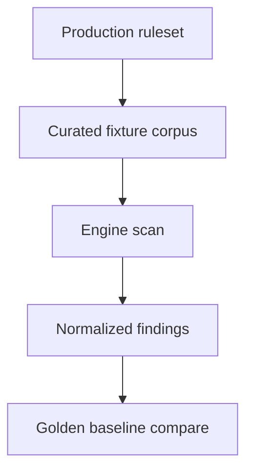

# Scanner Harness Modes (Synthetic vs Real Ruleset)

## Purpose

This document records two complementary scanner test modes:

1. Synthetic engine stress testing (`sim-harness`)
2. Real ruleset baseline snapshot testing (`real-rules-harness`)

The goal is to keep engine correctness and ruleset quality concerns separated
while making the trade-offs explicit. See `scanner_test_harness_guide.md` for
synthetic harness usage. See `detection-rules.md` and
`crates/scanner-engine-integration-tests/tests/corpus/real_rules/README.md` for real-rules context.

## Component Map

| Component                     | Location                                                                                                                                                                       | Purpose                                                                                          |
| ----------------------------- | ------------------------------------------------------------------------------------------------------------------------------------------------------------------------------ | ------------------------------------------------------------------------------------------------ |
| Synthetic scenario generator  | `crates/scanner-scheduler/src/sim_scanner/generator.rs`                                                                                                                        | Build deterministic in-memory files, rules, and expected spans from a seed                       |
| Random sim harness            | `crates/scanner-engine-integration-tests/tests/simulation/scanner_random.rs`                                                                           | Seeded stress testing of engine invariants under faults and chunking                             |
| Corpus replay harness         | `crates/scanner-engine-integration-tests/tests/simulation/scanner_corpus.rs`                                                                           | Replay minimized regression artifacts                                                            |
| Additional synthetic coverage | `crates/scanner-engine-integration-tests/tests/simulation/` scanner-focused `sim-harness` modules (see `crates/scanner-engine-integration-tests/tests/simulation/main.rs` and `docs/scanner-engine-integration-tests.md`) | Archive, discovery fallback, size or budget invariants, and mutation-pipeline coverage           |
| Real rules harness            | `crates/scanner-engine-integration-tests/tests/simulation/scanner_real_rules.rs`                                                                       | Scan curated fixtures with production rules and compare normalized findings to a golden baseline |
| Real rules fixtures           | `crates/scanner-engine-integration-tests/tests/corpus/real_rules/fixtures/`                                                                            | Curated synthetic, non-sensitive fixture corpus                                                  |
| Real rules baseline           | `crates/scanner-engine-integration-tests/tests/corpus/real_rules/expected/findings.json`                                                               | Golden findings snapshot for mode-2 regression                                                   |
| Real ruleset source           | `default_rules.yaml` (embedded via `crates/scanner-engine/src/rules/mod.rs`)                                                                                                   | Production detection rules used by `demo_rules()`                                                |
| Harness guide                 | `docs/scanner-scheduler/scanner_test_harness_guide.md`                                                                                                                         | How to run and debug synthetic scanner simulations                                               |

## Mode 1: Synthetic Engine Stress (Current)

### What it tests

The synthetic harness validates engine invariants regardless of production
rule quality. It stresses:
- Chunking and overlap handling
- Transform decoding (base64, URL percent, UTF-16, nested)
- Deduplication and drop-prefix logic
- Fault handling (partial reads, EINTR, corruption)
- Determinism and stability across schedules

### What the synthetic data is

Each seed deterministically builds:
- An in-memory filesystem with files and byte contents
- A synthetic ruleset (`SIM{rule_id}_[A-Z0-9]{N}`)
- Embedded synthetic secrets guaranteed to match those rules
- Ground-truth spans for every inserted secret

No real repo files or production rules are involved. This mode is for engine
behavior, not `default_rules.yaml` correctness.

### Oracles and invariants

The harness enforces:
- Ground truth: expected secrets are found (when files are fully observed)
- Differential: chunked scan matches a single-chunk reference scan
- Stability: results are identical across schedule seeds
- Internal invariants: no duplicate emission, no prefix overlap leakage, no hangs

### Commands

```bash
# Corpus replay
cargo test --features sim-harness --test simulation scanner_corpus

# Random stress (DEFAULT_SEED_COUNT=25)
cargo test --features sim-harness --test simulation scanner_random

# Optional scale and depth knobs
SIM_SCANNER_SEED_COUNT=100 cargo test --features sim-harness --test simulation scanner_random
SIM_SCANNER_DEEP=1 cargo test --features sim-harness --test simulation scanner_random
```

### When to use it

Use this mode for engine correctness, boundary conditions, transform behavior,
and deterministic fault and schedule coverage.

## Mode 2: Real Ruleset Baseline Snapshot (Implemented)

### What it tests

Mode 2 validates detection regressions for the production ruleset using a fixed
fixture corpus and golden snapshot comparison:
- Ruleset loaded through `demo_rules()` (built from `default_rules.yaml`)
- Corpus scanned with production transforms and tuning
- Findings normalized to `(path, rule, start, end)` and compared to baseline

### Verified constants and baseline paths

Current implementation in `crates/scanner-engine-integration-tests/tests/simulation/scanner_real_rules.rs` uses:
- `CORPUS_DIR = "tests/corpus/real_rules/fixtures"`
- `BASELINE_PATH = "tests/corpus/real_rules/expected/findings.json"`
- `LocalConfig { workers: 2, chunk_size: 64 * 1024, pool_buffers: 8, .. }`

### Commands

```bash
# Baseline comparison test
cargo test --features real-rules-harness --test simulation -- scanner_real_rules

# Baseline regeneration (ignored test)
cargo test --features real-rules-harness --test simulation -- \
    scanner_real_rules::update_baseline --ignored --nocapture
```

### Non-goals

- Do not replace synthetic engine stress tests
- Do not use production repos with live secrets in tests
- Do not conflate rule changes with engine regressions

### Harness design sketch



## Mode 3: Direct-vs-Connector Parity Gate (Phase 1)

> **Status: Not yet implemented** — This mode describes a planned test
> gate. The files referenced below do not yet exist in the codebase.

### What it tests

Mode 3 is a migration gate that validates parity between execution modes:
- CLI execution mode selector: `--execution-mode=direct|connector`
- Exact finding parity after canonical normalization
- Throughput drift thresholds (hard gate):
- median absolute delta across matrix cases <= 2%
- per-case absolute delta <= 5%

The canonical identity tuple is:
- path (JSON path field)
- rule identity (`rule`)
- span (`start`, `end`)
- git commit metadata (`oid`, `timestamp`) joined from `commit_meta`

### Reduced matrix and CI gate

The planned integration gate is expected to land as a future
`execution_mode_parity` integration test module and to run under a CI job
named `execution-mode-parity`. The intended matrix would cover:
- FS flat fixture
- FS nested fixture
- Git linear history fixture
- Git branch-and-merge fixture

Throughput sampling is expected to enforce a minimum of 5 iterations per case
(with warmup) to reduce startup jitter before threshold evaluation.

Phase-6 defaulting decisions additionally require sustained-green policy
evaluation across CI windows; see
the migration-defaulting closeout process (not yet documented) and
a sustained-green gate script (not yet implemented).

### Commands

```bash
# Planned parity gate command once the test exists
cargo test --features integration-tests --test integration execution_mode_parity_ -- --nocapture

# Optional tuning knobs for local stress/debug
EXECUTION_MODE_PARITY_ITERS=9 \
EXECUTION_MODE_PARITY_MEDIAN_MAX_PCT=2 \
EXECUTION_MODE_PARITY_PER_CASE_MAX_PCT=5 \
cargo test --features integration-tests --test integration execution_mode_parity_ -- --nocapture
```

## Mode 4: FS Enumeration Conformance Matrix (Phase 4)

> **Status: Not yet implemented** — This mode describes a planned
> conformance test. The `connector-pipeline` feature flag and
> `filesystem_enumeration_conformance_matrix_matches_connector` test
> do not yet exist.

### What it tests

Mode 4 compares direct filesystem discovery semantics against the real
`gossip_connectors::filesystem::FilesystemConnector` on the same fixture tree.
The matrix validates:

| Axis                  | Fixture row                                          | Expected                                                   |
| --------------------- | ---------------------------------------------------- | ---------------------------------------------------------- |
| Hidden files and dirs | `.hidden.txt`, `.hidden_dir/inside.txt`              | Included by both                                           |
| Gitignore handling    | `.gitignore` + `ignored.txt`                         | Included by both (gitignore not enforced)                  |
| Symlink policy        | `link_file.txt`, `link_dir`, `link_dir/included.txt` | Skipped by both (no symlink traversal)                     |
| Binary-like paths     | `blob.bin`                                           | Included by both                                           |
| Archive-like paths    | `bundle.zip`                                         | Included by both                                           |
| Non-UTF8 path bytes   | raw bytes file name                                  | Byte-identical inclusion when filesystem supports creation |
| Ordering              | full connector listing                               | Deterministic key-sorted order                             |

The planned implementation is expected to live in
`crates/scanner-scheduler/src/scheduler/parallel_scan.rs` as
`filesystem_enumeration_conformance_matrix_matches_connector`, gated behind
`connector-pipeline` because it exercises the real connector crate.

### Commands

```bash
# Planned command once the conformance test exists
cargo test --features connector-pipeline filesystem_enumeration_conformance_matrix_matches_connector
```

## Recommendation

Keep synthetic stress testing as the primary engine-correctness gate, and use
the real-rules harness plus execution-mode parity gate as separate regression
gates. The modes should not share oracles or failure criteria.
