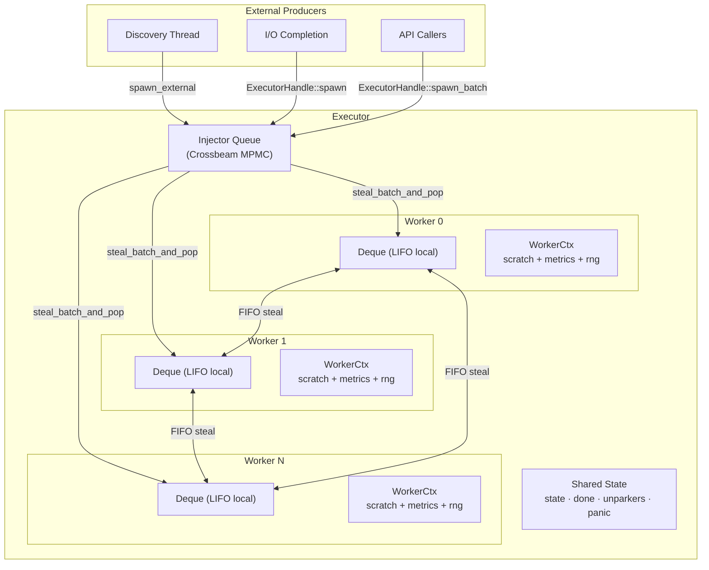
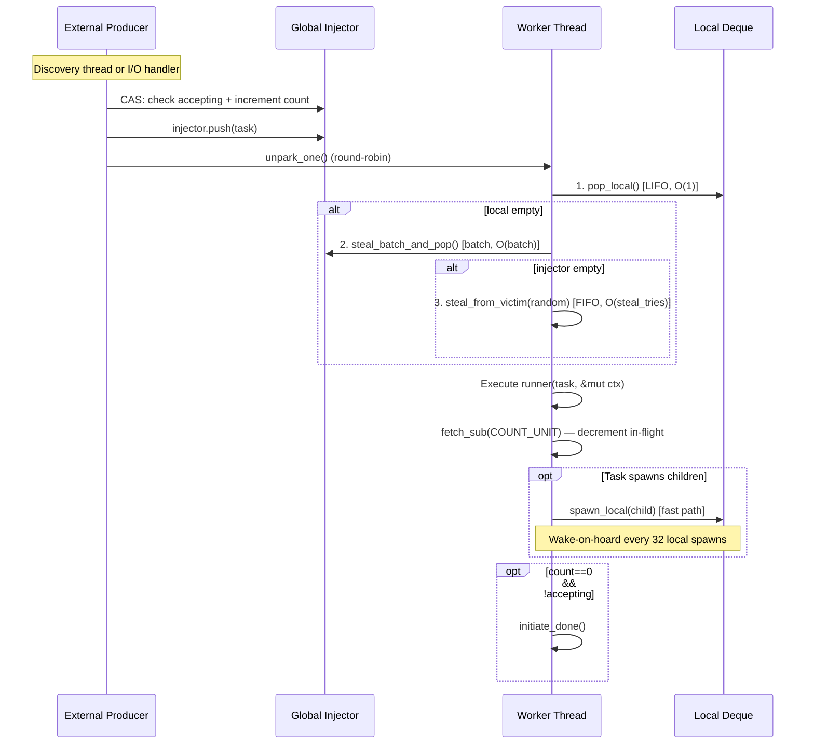
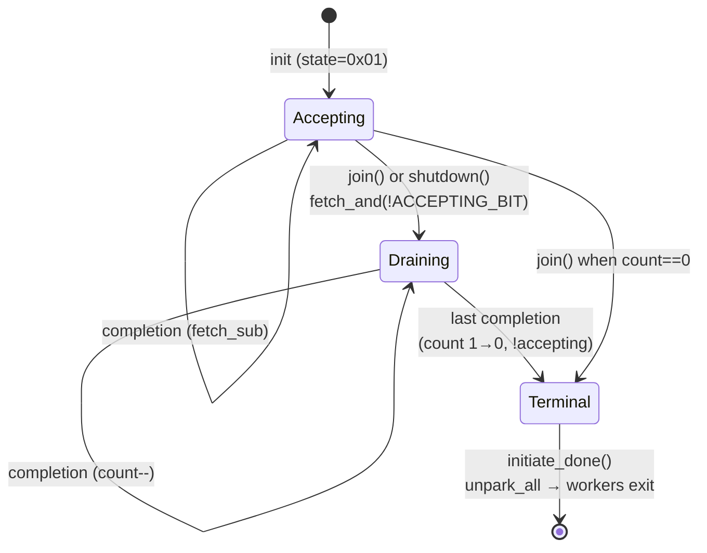
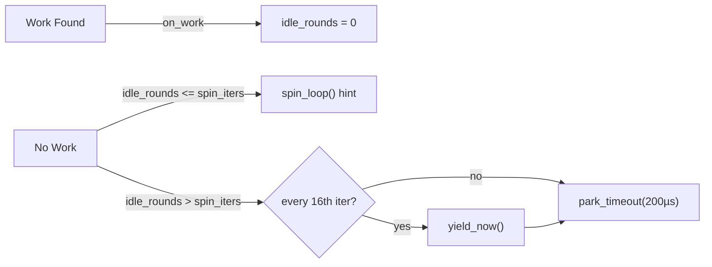

# Work-Stealing CPU Executor

## Module Purpose

The executor module implements a **work-stealing thread pool** that drives all scanning parallelism in the project. External producers (discovery threads, I/O completion handlers) enqueue tasks into a global injector queue, and N worker threads consume them using a local-first, steal-on-idle strategy.

The design splits into two files:
- **`executor.rs`** — Production types: `Executor`, `ExecutorHandle`, `WorkerCtx`, `ExecutorConfig`, threaded worker loop, and idle policy.
- **`executor_core.rs`** — Shared policy logic: combined atomic state encoding, `pop_task` algorithm, `worker_step` function, trait abstractions for idle/tracing hooks, and loom concurrency tests. This split ensures the production executor and deterministic simulation harness share identical scheduling semantics.

---

## Architecture



### Key Design Decisions

| Decision | Rationale |
|----------|-----------|
| Per-worker Chase-Lev deque | LIFO local pop maximizes cache locality; FIFO steal preserves fairness |
| Global crossbeam injector | MPMC queue for external producers; batch steal amortizes lock cost |
| Combined atomic state word | Eliminates TOCTOU race between spawn and join (see [Shutdown Protocol](#shutdown-protocol)) |
| Randomized victim selection | Avoids correlated contention when all workers go idle simultaneously |
| Parker/Unparker pattern | No lost wakeups; each unpark is either consumed or becomes a no-op |
| Tiered idle (spin → yield → park) | Trades CPU burn for latency on bursty workloads |

---

## Key Types

### `ExecutorConfig`

Configuration for the executor. All defaults are conservative.

```rust
pub struct ExecutorConfig {
    pub workers: usize,        // Number of worker threads (default: 1)
    pub seed: u64,             // RNG seed for deterministic victim selection
    pub steal_tries: u32,      // Steal attempts per idle cycle (default: 4)
    pub spin_iters: u32,       // Spin iterations before park (default: 200)
    pub park_timeout: Duration,// Park timeout after spin (default: 200µs)
    pub pin_threads: bool,     // Pin workers to cores (Linux only)
}
```

**Source**: `executor.rs:88–117`

| Knob | Workload Sensitivity |
|------|---------------------|
| `workers` | CPU count, task CPU-boundedness |
| `steal_tries` | Task fanout pattern, worker count |
| `spin_iters` | Task latency distribution |
| `park_timeout` | External spawn frequency |

---

### `Executor<T>`

The top-level executor that owns worker threads and shared state.

```rust
pub struct Executor<T> {
    shared: Arc<Shared<T>>,
    threads: Vec<JoinHandle<WorkerMetricsLocal>>,
}
```

**Source**: `executor.rs:738–746`

**Type parameter**: `T` is the task type. Should be small (≤32 bytes) and `Copy` if possible. Avoid `Box<dyn FnOnce()>` — use an enum instead.

**Lifecycle**:
1. `Executor::new(config, scratch_init, runner)` — creates and starts worker threads immediately
2. `spawn_external(task)` or `spawn_external_batch(tasks)` — enqueue work
3. `join()` — close gate, drain in-flight tasks, collect metrics, propagate panics

**Key methods**:

| Method | Purpose |
|--------|---------|
| `new(cfg, scratch_init, runner)` | Create executor; workers start and idle immediately |
| `handle()` | Get a cloneable `ExecutorHandle<T>` for external spawning |
| `spawn_external(task)` | Convenience for `handle().spawn(task)` |
| `spawn_external_batch(tasks)` | Batch injection; amortizes wakeups |
| `shutdown()` | Signal cooperative stop; rejects future spawns |
| `join(self)` | Close gate, wait for completion, return `MetricsSnapshot` |

---

### `ExecutorHandle<T>`

Thin, cloneable handle for external producers. This is the seam between I/O and CPU engines.

```rust
pub struct ExecutorHandle<T> {
    shared: Arc<Shared<T>>,
}
```

**Source**: `executor.rs:157–159`

**Thread safety**: `Clone + Send + Sync`. Multiple producers can call `spawn` concurrently.

**Key methods**:

| Method | Purpose |
|--------|---------|
| `spawn(task)` | CAS loop: atomically check accepting + increment count; push to injector; unpark one worker |
| `spawn_batch(tasks)` | All-or-nothing batch spawn; wakeups bounded to worker count |
| `is_accepting()` | Check if executor is still open |
| `shutdown()` | Close gate + signal done |

**Error handling**: `spawn` returns `Err(task)` if the executor is shutting down, giving the caller back the task.

---

### `WorkerCtx<T, S>`

Per-worker context passed to every task execution. Contains both user-facing state and internal scheduling machinery.

```rust
pub struct WorkerCtx<T, S> {
    // User-facing
    pub worker_id: usize,
    pub scratch: S,
    pub rng: XorShift64,
    pub metrics: WorkerMetricsLocal,

    // Internal
    local: Worker<T>,              // Chase-Lev deque
    parker: Parker,                // Crossbeam Parker
    shared: Arc<Shared<T>>,        // Shared state
    local_spawns_since_wake: u32,  // Wake-on-hoard counter
}
```

**Source**: `executor.rs:526–544`

**Type parameters**:
- `T`: Task type
- `S`: User-defined scratch type, initialized via `scratch_init` closure

**Key methods**:

| Method | Cost | Description |
|--------|------|-------------|
| `spawn_local(task)` | `fetch_add` + deque push | Enqueue to own deque; best cache locality |
| `spawn_global(task)` | `fetch_add` + injector push + unpark | Enqueue to global injector; higher contention |
| `handle()` | Arc clone | Get an `ExecutorHandle` for external spawning |

**Wake-on-hoard**: After `WAKE_ON_HOARD_THRESHOLD` (32) consecutive local spawns, `spawn_local` proactively wakes a sibling to prevent one worker from hoarding work while others sleep.

---

### `Shared<T>` (internal)

Shared state behind `Arc`, accessed by all workers and the executor owner.

```rust
struct Shared<T> {
    injector: Injector<T>,          // Global MPMC queue
    stealers: Vec<Stealer<T>>,      // Per-worker steal handles
    state: AtomicUsize,             // Combined (count << 1) | accepting
    done: AtomicBool,               // Monotonic stop flag
    unparkers: Vec<Unparker>,       // Per-worker wakeup handles
    next_unpark: AtomicUsize,       // Round-robin wakeup counter
    panic: Mutex<Option<Box<...>>>, // First captured panic
}
```

**Source**: `executor.rs:385–426`

**Invariants**:
- `stealers.len() == unparkers.len() == config.workers`
- `state` encodes both accepting flag and in-flight count
- `done` is monotonic: once `true`, never cleared
- `panic` captures only the first panic; subsequent panics are discarded

---

### Core Types (executor_core.rs)

#### `WorkerCtxLike<T, S>` trait

Abstraction over worker context that allows both the production `WorkerCtx` and the simulation harness to share the same `worker_step` logic.

**Source**: `executor_core.rs:154–184`

#### `WorkerStepResult<Tag>`

Outcome of a single worker step:

| Variant | Meaning |
|---------|---------|
| `RanTask { tag, source, victim }` | Executed one task; `source` is `Local`, `Injector`, or `Steal` |
| `NoWork` | No task found; idle hooks decided to continue spinning |
| `ShouldPark { timeout }` | No task found; idle hooks request parking |
| `ExitDone` | Executor is done; worker should exit |
| `ExitPanicked` | Worker caught a panic and recorded it |

**Source**: `executor_core.rs:63–75`

#### `PopSource`

Where a task was obtained from: `Local`, `Injector`, or `Steal`.

**Source**: `executor_core.rs:52–56`

#### `IdleHooks` / `IdleAction`

Trait for pluggable idle policies. The production implementation (`TieredIdle`) uses spin → yield → park. Simulation can use a no-op or deterministic equivalent.

**Source**: `executor_core.rs:132–145`

#### `TraceHooks<T>` / `NoopTrace`

Optional trace hooks for the step engine. Production uses `NoopTrace` (zero overhead). Simulation can plug in a recorder for deterministic replay.

**Source**: `executor_core.rs:107–130`

---

## Task Lifecycle



### Pop Priority Order

The `pop_task` function (`executor_core.rs:266–306`) tries sources in this order:

1. **Local deque** (LIFO) — Zero contention, best cache locality. Tasks spawned locally likely operate on data still in L1/L2.
2. **Global injector** (batch steal) — `steal_batch_and_pop` moves multiple tasks to the local deque, amortizing global queue access cost.
3. **Random victim** (FIFO steal) — Last resort. Randomized victim selection distributes steal attempts uniformly, avoiding thundering-herd on a single hot worker.

The victim selection formula ensures a worker never steals from itself:
```
victim = rng.next_usize(n - 1)
if victim >= self_id { victim += 1 }
```

---

## Combined Atomic State

The executor uses a single `AtomicUsize` to encode both the accepting flag and the in-flight task count:

```text
  63                              1   0
 ┌─────────────────────────────┬─────┐
 │      in_flight_count        │  A  │
 └─────────────────────────────┴─────┘
                                 │
                                 └── accepting bit (1=open, 0=closed)
```

**Source**: `executor_core.rs:14–16`, `executor.rs:289–354`

### Why Combined State?

A naive implementation with separate atomics for "accepting" and "count" has a TOCTOU race:

```text
// BROKEN:
if accepting.load() {       // (1) check — gate still open
    count.fetch_add(1);     // (2) increment
    // Another thread calls join() between (1) and (2)
    // → Task spawned after join "closed the gate"
}
```

The combined state eliminates this by making the check-and-increment atomic via CAS.

### State Operations

| Operation | Atomic | Effect |
|-----------|--------|--------|
| Init | `store(ACCEPTING_BIT)` | `state = 1` (accepting, count=0) |
| External spawn | CAS loop | If accepting: count++ |
| Internal spawn | `fetch_add(COUNT_UNIT)` | count++ (workers only run when open) |
| Completion | `fetch_sub(COUNT_UNIT)` | count--; if result was count=1 && !accepting: trigger done |
| Join/close | `fetch_and(!ACCEPTING_BIT)` | Clear accepting bit |

### Loom Verification

The state machine is verified under all interleavings using loom tests in `executor_core.rs:412–594`:
- `spawn_vs_join_gate_atomicity` — CAS spawn racing against gate close
- `completion_vs_join_termination` — Exactly one observer triggers termination
- `concurrent_spawns_no_lost_count` — Two concurrent spawns produce count=2
- `three_way_spawn_complete_join` — Three-way race with correct terminal state

---

## Shutdown Protocol



### `Executor::join(self)` Sequence

1. **Close gate**: `fetch_and(!ACCEPTING_BIT)` — atomically clears accepting bit, returns previous state.
2. **Check terminal**: If `in_flight(prev_state) == 0`, call `initiate_done()` immediately.
3. **Join threads**: Pop each `JoinHandle`, collect `WorkerMetricsLocal` from each worker.
4. **Merge metrics**: Aggregate into a single `MetricsSnapshot`.
5. **Propagate panic**: If any worker panicked, `resume_unwind` on the calling thread.

### `ExecutorHandle::shutdown()`

Cooperative stop for abandonment scenarios (e.g., lease loss):
1. `close_gate(&self.shared.state)` — reject future spawns
2. `self.shared.initiate_done()` — set `done=true`, unpark all workers

In-flight tasks may be dropped. This is not a graceful drain.

### Panic Isolation

- Worker task execution is wrapped in `panic::catch_unwind`.
- On panic: decrement in-flight count, record panic via `Shared::record_panic`, signal done.
- Only the first panic is captured; `join()` re-throws it after all threads have been joined.

---

## Work Stealing Algorithm

### Tiered Idle Strategy

When no work is found, workers use graduated backoff:



**Source**: `executor.rs:1036–1075`

| Phase | Condition | Action | Cost |
|-------|-----------|--------|------|
| Spin | `idle_rounds <= spin_iters` (200) | `spin_loop()` hint | CPU busy-wait |
| Yield | Every 16th iteration past spin threshold | `thread::yield_now()` | 1 syscall |
| Park | After spin threshold | `parker.park_timeout(200µs)` | Sleep until unparked or timeout |

### Wake-on-Hoard Optimization

Without this heuristic, a worker rapidly spawning local tasks accumulates thousands in its deque while siblings sleep. After `WAKE_ON_HOARD_THRESHOLD` (32) consecutive local spawns, the worker calls `unpark_one()` to wake a sibling for stealing.

**Source**: `executor_core.rs:18–48`, `executor.rs:558–571`

| Threshold | Wakeup Rate | Overhead | Tail Latency |
|-----------|-------------|----------|--------------|
| 8 | High | ~12.5% of spawns trigger syscall | Low |
| 32 (default) | Medium | ~3% of spawns trigger syscall | Medium |
| 128 | Low | ~0.8% of spawns trigger syscall | Higher |

### Round-Robin Wakeups

`unpark_one()` uses a round-robin counter (`next_unpark`) to distribute wakeup load across workers. For power-of-two worker counts, bitmask is used instead of modulo to avoid division on ARM.

**Source**: `executor.rs:430–443`

---

## Integration Points

### `local_fs_owner.rs` — Local Filesystem Scanning

The primary consumer. `scan_local_with_progress` creates an `Executor<FileTask>` where:

- **Task type**: `FileTask` (contains `FileId` and `PathBuf`)
- **Scratch type**: `LocalScratch` (engine scratch, buffer pool handle, finding buffers, archive state)
- **Runner**: `process_file::<E>` — opens the file, reads chunks, scans with the engine, emits findings

```text
scan_local_with_progress()
    │
    ├─ Executor::new(ExecutorConfig, scratch_init, process_file)
    │      └─ Workers start; each gets LocalScratch with:
    │           engine, pool, scan_scratch, pending Vec, archive state
    │
    ├─ Discovery loop (main thread):
    │      for file in source.next_file():
    │          budget.acquire(1)          ← backpressure
    │          batch.push(FileTask { file_id, path })
    │          ex.spawn_external_batch(batch)
    │
    └─ ex.join() → MetricsSnapshot
```

**Source**: `local_fs_owner.rs:1089–1202`

The `ExecutorConfig` is constructed from `LocalConfig`:
```rust
ExecutorConfig {
    workers: cfg.workers,
    seed: cfg.seed,
    pin_threads: cfg.pin_threads,
    ..ExecutorConfig::default()     // steal_tries=4, spin_iters=200, park_timeout=200µs
}
```

### `parallel_scan.rs` — High-Level Directory Scanning

Wraps `scan_local` with directory walking (gitignore, symlinks, hidden files). The `ParallelScanConfig` is converted to `LocalConfig` via `to_local_config()`, which in turn configures the executor.

```text
parallel_scan_dir(root, engine, config)
    │
    ├─ IterWalker::new(root, &config)     ← single-threaded discovery
    │
    └─ scan_local(engine, walker, config.to_local_config())
           └─ Executor<FileTask> (as above)
```

**Source**: `parallel_scan.rs:555–587`

### `worker_id.rs` — Thread-Local Worker Identification

Provides `set_current_worker_id` / `current_worker_id` TLS for per-worker fast-path routing in the buffer pool. Workers set their ID at startup; non-worker threads see `None`.

**Source**: `worker_id.rs:1–80`

### `yield_policy.rs` — Cooperative Task Yielding

Provides deterministic yield policies (`EveryN`, `NeverYield`, `AlwaysYield`, `AdaptiveYield`, `GitYieldPolicy`) for long-running tasks to voluntarily yield back to the executor. Tasks use `spawn_local` to re-enqueue themselves with updated cursor state.

**Source**: `yield_policy.rs:1–647`

---

## Constants and Tuning

| Constant | Value | Location | Purpose |
|----------|-------|----------|---------|
| `ACCEPTING_BIT` | `1` | `executor_core.rs:14` | LSB in combined state word; 1 when accepting external spawns |
| `COUNT_UNIT` | `2` | `executor_core.rs:16` | Increment unit for in-flight count (count stored in bits 1+) |
| `WAKE_ON_HOARD_THRESHOLD` | `32` | `executor_core.rs:48` | Local spawns before proactively waking a sibling |

### `ExecutorConfig` Defaults

| Parameter | Default | Source |
|-----------|---------|--------|
| `workers` | `1` | `executor.rs:134` |
| `seed` | `0x853c49e6748fea9b` | `executor.rs:135` |
| `steal_tries` | `4` | `executor.rs:136` |
| `spin_iters` | `200` | `executor.rs:137` |
| `park_timeout` | `200µs` | `executor.rs:138` |
| `pin_threads` | `true` on Linux, `false` elsewhere | `executor.rs:139` |

### Tiered Idle Constants

| Constant | Value | Source | Purpose |
|----------|-------|--------|---------|
| Yield frequency | Every 16th idle iteration past spin threshold | `executor.rs:1066` | Bitmask `& 0xF` — heuristic to avoid monopolizing core |

### `ParallelScanConfig` Defaults (caller-facing)

| Parameter | Default | Source |
|-----------|---------|--------|
| `workers` | `num_cpus::get()` | `parallel_scan.rs:316` |
| `chunk_size` | 256 KiB | `parallel_scan.rs:319` |
| `pool_buffers` | `4 × workers` | `parallel_scan.rs:320` |
| `max_in_flight_objects` | `1024` | `parallel_scan.rs:321` |
| `seed` | `0x853c49e6748fea9b` | `parallel_scan.rs:323` |

---

## Correctness Invariants

| Invariant | Mechanism | Verified By |
|-----------|-----------|-------------|
| **Work-conserving** | Once spawned, a task will execute | Combined state prevents lost spawns after gate close |
| **Termination detection** | `in_flight` counter in combined state | Loom tests in `executor_core.rs:462–594` |
| **No lost wakeups** | Parker/Unparker pattern | Crossbeam guarantee: unpark before park becomes no-op |
| **Panic isolation** | `catch_unwind` around runner | Test `panic_in_task_decrements_count` (`executor.rs:1380–1425`) |
| **No TOCTOU on shutdown** | Combined atomic state word | Loom test `spawn_vs_join_gate_atomicity` |
| **Exactly-once termination** | `prev_count == 1 && !accepting` check | Loom test `completion_vs_join_termination` |
| **Counter bounded** | `in_flight` never underflows | `assert!(prev_count > 0)` in `worker_step` (`executor_core.rs:369–371`) |

## Performance Characteristics

| Aspect | Cost |
|--------|------|
| External spawn (CAS loop) | 1–3 CAS iterations typical |
| Injector push | O(1) amortized (crossbeam MPMC) |
| Unpark | 1 condvar notify (pthread on POSIX) |
| Local pop | O(1), zero contention |
| Batch steal from injector | O(batch_size) |
| Victim steal | O(steal_tries) worst case per idle cycle |
| Termination check | O(1) via combined atomic state |

---

## Source of Truth

| Item | File | Line(s) |
|------|------|---------|
| `ExecutorConfig` | `executor.rs` | 88–143 |
| `ExecutorHandle<T>` | `executor.rs` | 157–283 |
| `Shared<T>` | `executor.rs` | 385–484 |
| `WorkerCtx<T, S>` | `executor.rs` | 526–702 |
| `Executor<T>` | `executor.rs` | 738–927 |
| `worker_loop` | `executor.rs` | 1000–1030 |
| `TieredIdle` | `executor.rs` | 1036–1075 |
| `ACCEPTING_BIT` / `COUNT_UNIT` | `executor_core.rs` | 14–16 |
| `WAKE_ON_HOARD_THRESHOLD` | `executor_core.rs` | 48 |
| `PopSource` | `executor_core.rs` | 51–56 |
| `WorkerStepResult<Tag>` | `executor_core.rs` | 63–75 |
| `ExecTraceEvent<Tag>` | `executor_core.rs` | 83–102 |
| `TraceHooks<T>` / `NoopTrace` | `executor_core.rs` | 107–130 |
| `IdleAction` / `IdleHooks` | `executor_core.rs` | 133–145 |
| `WorkerCtxLike<T, S>` | `executor_core.rs` | 154–184 |
| `in_flight()` / `is_accepting()` / `close_gate()` / `increment_count()` | `executor_core.rs` | 187–208 |
| `pop_task()` | `executor_core.rs` | 266–306 |
| `worker_step()` | `executor_core.rs` | 320–399 |
| Loom tests | `executor_core.rs` | 412–594 |
| `XorShift64` (RNG) | `rng.rs` | 41–180 |
| `CoreAssigner` / `default_pin_threads` | `affinity.rs` | 251–325 |
| `set_current_worker_id` / `current_worker_id` | `worker_id.rs` | 62–80 |
| `YieldPolicy` / `EveryN` / `NeverYield` / `AdaptiveYield` | `yield_policy.rs` | 70–483 |
| `ParallelScanConfig` | `parallel_scan.rs` | 212–312 |
| `scan_local_with_progress` (executor construction) | `local_fs_owner.rs` | 1089–1202 |
| `WorkerMetricsLocal` | `metrics.rs` | 283 |
| `MetricsSnapshot` | `metrics.rs` | 423 |

All paths are relative to `crates/scanner-scheduler/src/scheduler/`.
